# 本地 Agent 工具与服务 Agent 接口落地方案

> 目标：区分 DeepSeek Harness 在两类业务形态里的落地方式，并理解服务化 Agent 如何处理多用户隔离、并发、暂停恢复和工具权限。

这篇解决三个问题：

1. 本地 Agent 工具和服务 Agent 接口分别适合什么场景？
2. 两种形态的技术方案分别是什么？
3. 服务 Agent 面对多用户并发时，如何隔离上下文、权限和任务状态？

---

## 1. 先用一句话区分

```text
本地 Agent 工具：Agent 在某台机器上运行，主要操作本地文件、命令、项目和脚本。
服务 Agent 接口：Agent 作为后端服务运行，给多个用户、多个系统提供 API 能力。
```

两者共享的核心能力类似：

- Agent 会组织上下文。
- Agent 会调用 LLM。
- Agent 会调用 Tool。
- Agent 会记录过程。
- Agent 可以遇到人工确认后暂停。

但它们的工程重点完全不同：

| 形态 | 重点 | 典型问题 |
|------|------|----------|
| 本地 Agent 工具 | 本机权限、工作区、命令安全、工具白名单 | 能不能读这个文件？能不能跑这个命令？会不会误删本地项目？ |
| 服务 Agent 接口 | 多用户隔离、状态持久化、任务队列、权限校验、审计 | 用户 A 会不会看到用户 B 的上下文？审核任务会不会被重复处理？ |

### 1.1 常见英文词速查

后面会反复出现一些英文词。先把它们放在这里，读后文时就不用来回猜。

| 英文词 | 中文理解 | 简单说明 |
|--------|----------|----------|
| `Agent` | 智能体 / 任务处理器 | 负责理解任务、组织上下文、决定下一步 |
| `Tool` | 工具 / 可调用动作 | Agent 能执行的明确动作，例如查工单、写审计 |
| `LLM` | 大语言模型 | 负责生成、判断、分类、总结 |
| `Runner` | 执行器 | 真正推动 Agent 一步步运行的代码 |
| `Turn` | 一轮处理 | Agent 针对某个 task 的一次执行循环 |
| `session` | 会话 | 一次对话或一次业务处理的上下文边界 |
| `task` | 任务 | 一条具体要处理的业务任务 |
| `event` | 事件 | 用户输入、工具结果、审核决定等过程记录 |
| `checkpoint` | 执行现场快照 | 暂停时保存当前做到哪一步，恢复时继续用 |
| `Worker` | 后台执行器 | 后台真正执行 task 的进程或线程 |
| `Worker Pool` | 后台执行器池 | 多个 Worker 一起处理多个 task |
| `Job Queue` | 任务队列 | 存放等待执行或等待恢复的任务 |
| `MCP` | 工具接入协议 | 一种标准化暴露 Tool 的方式 |
| `API` | 接口 | 前端或系统调用后端能力的入口 |
| `SSE` | 服务端事件流 | 后端持续向前端推送消息，常用于流式输出 |
| `WebSocket` | 双向长连接 | 前后端可以持续互相发送消息 |
| `tenant_id` | 租户 ID | 区分不同企业、业务线或空间 |
| `permission_scope` | 权限范围 | 限制这次任务能访问什么、能执行什么 |
| `idempotency_key` | 幂等键 | 防止同一个写入动作重复执行 |

先看总图：

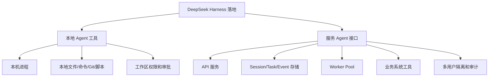

---

## 2. 本地 Agent 工具方案

本地 Agent 工具适合这些场景：

- 代码助手：读项目、改文件、跑测试、生成提交说明。
- 本地运维：读取日志、执行脚本、生成巡检报告。
- 桌面自动化：处理本地文档、表格、截图、浏览器页面。
- 内网机器助手：在一台固定服务器上处理某类任务。

它的核心形态是：

```text
一个用户
  -> 一个本地 Agent 进程
  -> 操作当前工作区或本机资源
```

### 2.1 本地架构

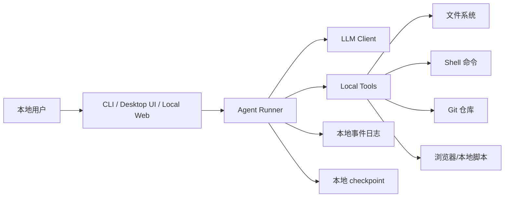

这里的 `Agent Runner` 可以理解为执行 Turn 循环的地方。

它会：

1. 读取用户输入。
2. 加载当前工作区上下文。
3. 调用模型。
4. 根据模型输出调用本地工具。
5. 把结果写回用户界面。
6. 必要时保存事件和 checkpoint。

### 2.2 本地 Turn 怎么跑

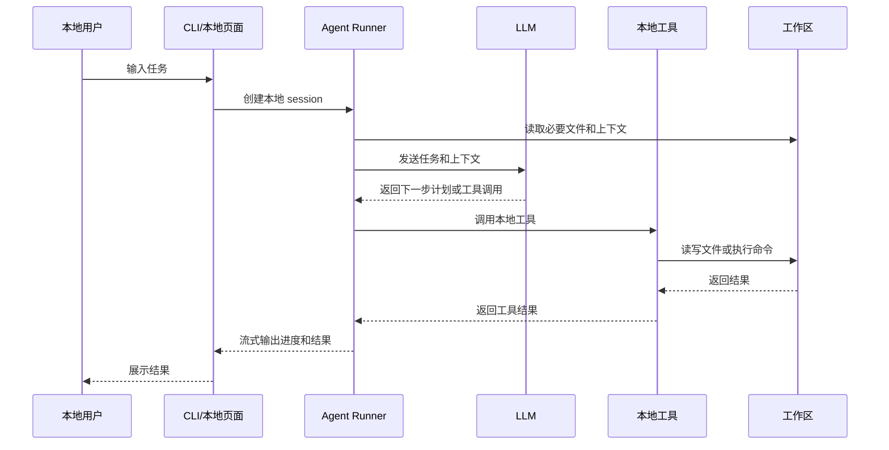

### 2.3 本地工具要怎么控制风险

本地 Agent 最大风险是“它能操作你的机器”。

所以工具设计要保守：

| 风险点 | 控制方式 |
|--------|----------|
| 误删文件 | 限制工作区，禁止默认执行破坏性命令 |
| 随意执行命令 | 命令白名单、审批、沙箱 |
| 读取敏感目录 | 只允许读取项目目录或配置目录 |
| 修改用户未授权文件 | 写入前展示 diff 或确认 |
| 网络访问不可控 | 按域名或命令前缀限制 |
| 上下文过大 | 只读取必要文件，不把整个项目塞给模型 |

### 2.4 本地状态怎么存

本地场景可以简单一些：

```text
.agent/
  sessions/
    session_001.json
  events/
    session_001.events.jsonl
  checkpoints/
    task_001.json
```

MVP 阶段甚至可以只保存：

- 当前 session
- 用户输入
- 工具调用记录
- 最终结果

但如果要支持暂停恢复，就应该保存 checkpoint。

---

## 3. 服务 Agent 接口方案

服务 Agent 接口适合这些场景：

- 客服工单分派。
- 审批流辅助。
- 合同审查。
- 企业知识库问答 + 系统操作。
- OA / CRM / ERP 自动化。
- 多用户同时访问的业务平台。

它的核心形态是：

```text
多个用户 / 多个业务系统
  -> Agent API 服务
  -> Task/Event/Checkpoint 数据库
  -> Worker Pool 执行 Agent
  -> 业务工具服务
```

### 3.1 服务端架构

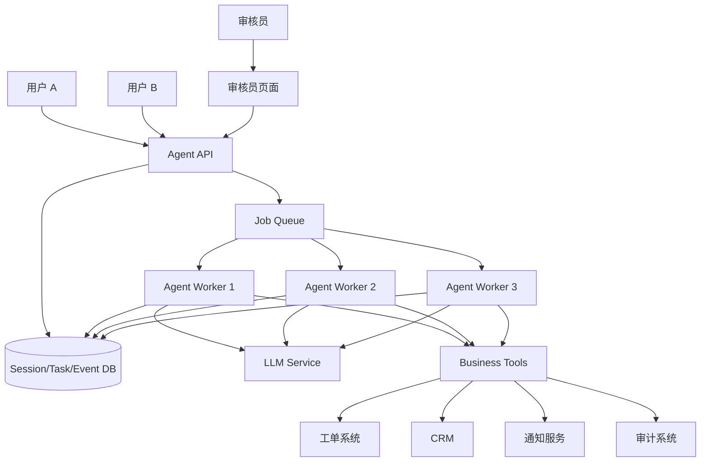

这里有几个关键点：

- `API` 负责接收请求、鉴权、创建 session/task/event。
- `DB` 保存状态，不依赖进程内存。
- `Queue` 负责异步调度。
- `Worker Pool` 并发执行多个 task。
- `Tools` 封装业务系统能力。

### 3.2 服务端请求不是一次 req/res

服务 Agent 不应该理解成：

```text
用户请求 -> Agent 一次性返回最终结果
```

应该理解成：

```text
用户请求 -> 创建 task -> 返回 task_id
Worker 异步处理 -> 不断更新状态
前端通过 SSE/WebSocket/轮询看到进度
```

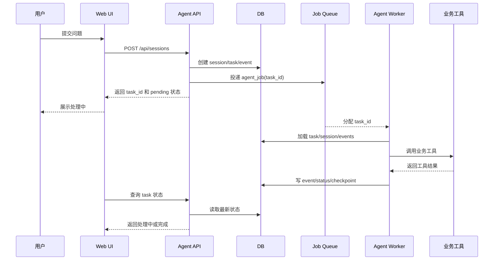

### 3.3 Business Tool 不是一定是 MCP 服务

这是最容易混淆的一点。

先记住这句：

```text
Business Tool 是能力抽象
MCP / HTTP / 本地插件 是暴露能力的方式
```

也就是说，Tool 讲的是“Agent 能做什么”，MCP 讲的是“这个能力怎么被访问”。

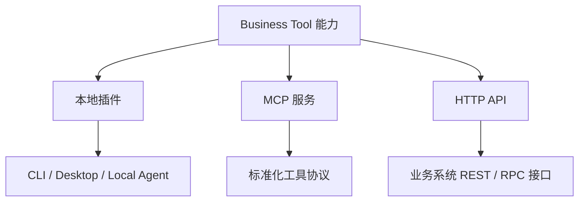

### 3.3.1 三种常见实现方式

| 方式 | 适合谁 | 特点 |
|------|--------|------|
| 本地插件 | 本地 Agent、代码助手、桌面自动化 | 直接在当前进程或本机调用，延迟低，部署简单 |
| MCP 服务 | 想让多个客户端复用同一套工具能力 | 用统一协议暴露工具，适合标准化接入 |
| HTTP API | 已经有业务系统，想快速接 Agent | 最容易接企业系统，通常最常见 |

### 3.3.2 什么时候用 MCP

MCP 更适合这几类情况：

- 工具能力想被多个 Agent 客户端复用。
- 想把工具暴露成标准协议，而不是每个客户端写一套适配器。
- 工具背后是独立服务，不想把业务逻辑绑死在某个本地插件里。

如果是下面这种情况，MCP 不是必须的：

- 只是本地 Agent 调一个本机脚本。
- 只是服务 Agent 调自己业务系统的 REST API。
- 只是想先把 MVP 跑通。

### 3.3.3 实现关系图

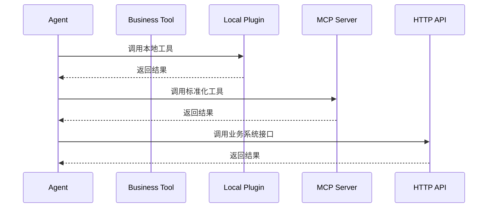

### 3.3.4 一句话判断

```text
Tool 是业务能力
MCP 是一种工具接入协议
HTTP API 是另一种工具接入方式
本地插件是最直接的工具实现方式
```

### 3.3.5 落到 dsh 时怎么理解

如果把这件事放回 DeepSeek Harness 里，可以这样对应：

| 业务概念 | dsh 里更像什么 | 说明 |
|----------|----------------|------|
| 本地 Agent 工具 | `Tool` + 本地插件 | 直接在本机进程内或本机资源上执行 |
| 服务 Agent 接口 | `Tool` + 远程适配层 | Agent 通过 API / RPC / MCP 去调用外部能力 |
| MCP 服务 | 工具暴露层之一 | 让多个客户端用统一协议调用同一套能力 |
| HTTP API | 业务系统接入层 | 最常见的企业系统对接方式 |
| Worker Pool | Agent 执行层 | 负责并发跑多个 task |
| Session/Task/Event | 会话和状态层 | 负责隔离、暂停和恢复 |

如果你只记一句：

```text
dsh 关心的是 Agent 怎么安全地调用 Tool
MCP / HTTP / 本地插件 只是 Tool 的不同实现和接入方式
```

### 3.4 聊天 Agent 前端怎么实时看到处理过程

你看到的 Kimi、千问、豆包这类聊天 Agent，前端实时看到的通常不是“完整内部推理”，而是后端不断发出来的**事件流**。

```text
模型输出 token 流
  -> 后端包装成状态事件
  -> 前端实时渲染气泡、进度条、工具面板
```

前端通常会看到这些状态：

- 正在输入
- 正在思考
- 正在调用工具
- 工具已返回
- 正在整理答案
- 需要你确认
- 已完成

前端一般看不到这些内容：

- 模型内部完整推理过程
- 敏感中间值
- 未脱敏的业务数据

#### 3.4.1 事件流长什么样

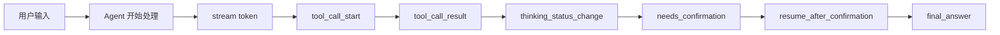

典型事件可以是：

```text
message_start
token_delta
tool_call_start
tool_call_result
status_change
needs_confirmation
resume
message_end
```

#### 3.4.2 前端怎么接

常见有三种方式：

| 方式 | 适合谁 | 特点 |
|------|--------|------|
| SSE | 聊天流式输出、单向推送 | 简单，适合“后端一直发、前端一直收” |
| WebSocket | 要双向交互的 Agent | 适合确认、暂停、修改、实时状态同步 |
| 轮询 | 低实时性任务 | 简单，但刷新不如流式自然 |

#### 3.4.3 事件到 UI 的映射

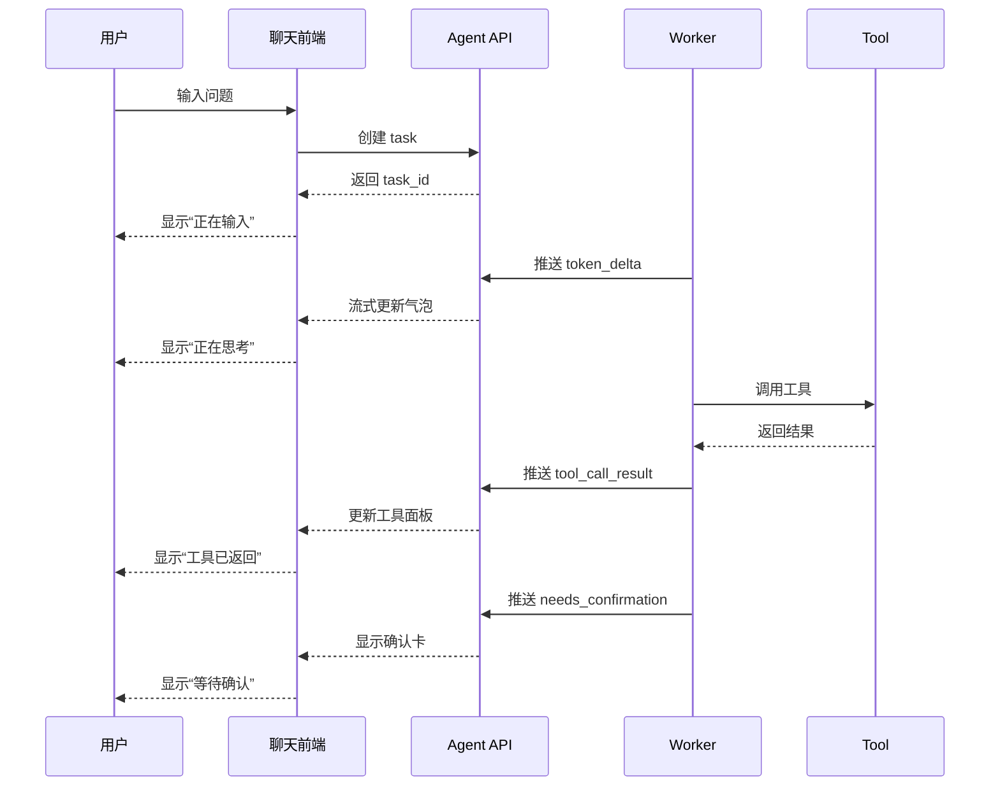

#### 3.4.4 这件事对业务 Agent 的意义

对业务 Agent 来说，这种实时展示很有用：

- 让用户知道系统不是卡住了。
- 让用户知道 Agent 正在执行哪一步。
- 让用户在需要确认时及时介入。
- 让审核员看到任务当前到了哪里。

一句话：

```text
前端实时看到的不是 Agent 脑内过程，而是后端发出来的事件流和状态变化。
```

---

## 4. 服务 Agent 怎么做用户隔离

服务 Agent 的关键问题是：

```text
同一个 Agent 服务很多用户，怎么保证用户 A 和用户 B 不串上下文？
```

答案是：共享 Agent 能力，不共享任务上下文。

```text
共享：
  - Agent 代码
  - Tool 定义
  - Prompt 模板
  - Worker 代码

隔离：
  - tenant_id
  - user_id
  - session_id
  - task_id
  - event
  - checkpoint
  - permission_scope
```

### 4.1 隔离模型

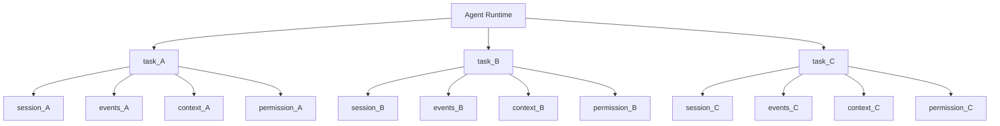

每次执行都必须按 `task_id` 重新加载上下文：

```text
load task by task_id
load session by task.session_id
check tenant_id and user_id
load events where task_id = task.id
build context
run one turn
append event
save status
```

不要把当前用户放在全局变量里。

错误示例：

```text
global_current_user = user_A
global_context = context_A

另一个请求进来：
global_current_user = user_B
global_context = context_B
```

这样并发时很容易串上下文。

### 4.2 数据表建议

MVP 可以先从这些表开始：

```text
sessions
  id
  tenant_id
  user_id
  status
  created_at

tasks
  id
  tenant_id
  session_id
  status
  checkpoint
  version
  created_at
  updated_at

events
  id
  tenant_id
  task_id
  type
  payload
  created_at

review_tasks
  id
  tenant_id
  task_id
  status
  decision_payload
  reviewer_id
  version
  reviewed_at

audit_logs
  id
  tenant_id
  task_id
  action
  actor
  payload
  created_at
```

所有查询都必须带隔离条件：

```sql
select * from tasks
where id = :task_id
  and tenant_id = :tenant_id;
```

审核任务也要校验归属：

```text
review_task.task_id
  -> task.session_id
  -> session.tenant_id
  -> reviewer.permission_scope
```

### 4.3 工具调用也要隔离

服务端工具不能只接收一个 `ticket_id`。

它应该带上权限上下文：

```json
{
  "tenant_id": "mall_a",
  "user_id": "user_001",
  "task_id": "task_001",
  "ticket_id": "ticket_123",
  "allowed_actions": ["read_ticket", "create_assignment"]
}
```

工具内部要做校验：

```text
这个 tenant 能不能访问这个 ticket？
这个 user 能不能操作这个业务？
这个 task 是否还处于可执行状态？
这个动作是否已经执行过？
```

---

## 5. 一个 Agent 怎么同时跑多个 Turn

这里最容易误解。

不是一个 Turn 循环同时处理很多用户，而是：

```text
同一个 Agent 定义
  -> runTurn(task_A)
  -> runTurn(task_B)
  -> runTurn(task_C)
```

每个 Turn 实例只处理一个 task。

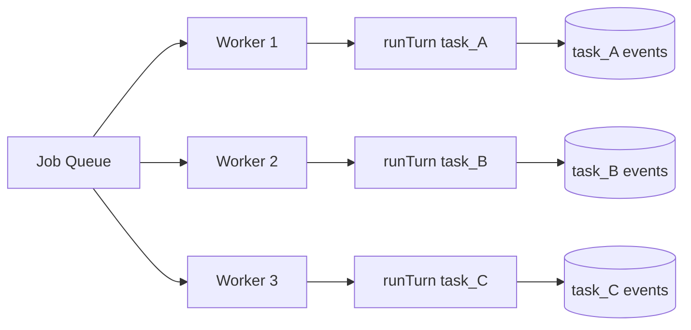

规则很简单：

```text
不同 task 可以并发
同一个 task 必须串行
```

同一个 task 不能同时被两个 Worker 执行，否则可能重复写工单、重复发通知。

常见控制方式：

- `task.version` 乐观锁
- `task.status` 原子更新
- `review_task.status` 从 `pending` 原子更新为 `processing`
- 工具写入使用 `idempotency_key`
- 写入业务系统前检查是否已经存在结果

例如：

```sql
update tasks
set status = 'running', version = version + 1
where id = :task_id
  and status in ('pending', 'resumable')
  and version = :old_version;
```

如果更新行数是 0，说明这个 task 已经被别的 Worker 抢走了。

---

## 6. 遇到审核时怎么暂停和恢复

服务 Agent 遇到审核时，不应该让 HTTP 请求一直挂着。

先把几个英文词翻译一下：

| 英文词 | 中文理解 | 在这里的作用 |
|--------|----------|--------------|
| `checkpoint` | 执行现场快照 | 保存 Agent 已经做到哪一步、下一步该从哪里继续 |
| `review_task` | 审核待办 | 给审核员页面展示的一条待处理任务 |
| `decision` | 审核决定 | 审核员点了确认、修改、升级还是驳回 |
| `resume job` | 恢复执行任务 | 审核完成后，重新投递一个任务，让 Agent 继续跑 |
| `Worker` | 后台执行器 | 真正执行 Agent Turn 的后台进程或线程 |
| `Job Queue` | 任务队列 | 存放待执行任务，让多个 Worker 可以按顺序领取 |

正确做法是：

```text
Agent 执行到人工节点
  -> 保存 checkpoint（执行现场快照）
  -> 创建 review_task（审核待办）
  -> task.status = waiting_reviewer（任务状态改为等待审核）
  -> 本轮 Runner 退出（当前执行循环停止）
  -> 审核员提交 decision（审核决定）
  -> 投递 resume job（恢复执行任务）
  -> Worker 重新加载 checkpoint 和 decision
  -> Agent 从暂停点继续执行
```

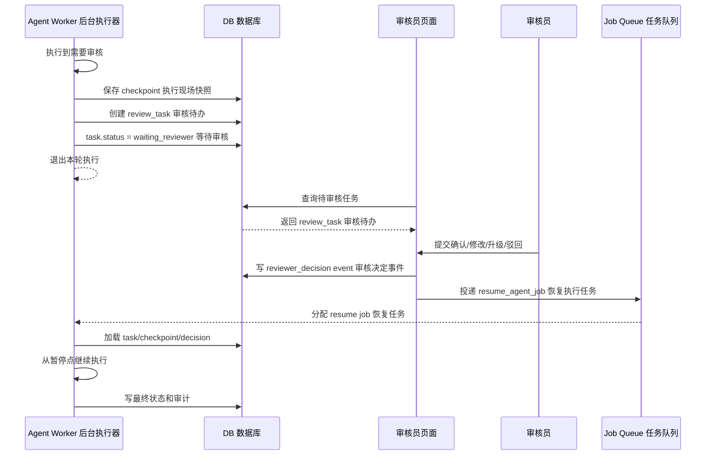

这里的关键点：

- 暂停不是线程阻塞。
- 暂停是状态持久化。
- 恢复不是接着原来的 HTTP 请求。
- 恢复是一个新的后台执行任务，也就是新的 `Worker job`。

可以把它类比成保存游戏进度：

```text
checkpoint = 存档
review_task = 等别人确认的任务卡片
decision = 别人做出的选择
resume job = 读取存档后继续玩的任务
```

### 6.1 checkpoint 怎么实现

`checkpoint` 不建议保存一大段聊天文本，也不建议保存整个进程内存。

它应该保存**恢复执行所需的最小现场**：

```text
当前任务是谁
当前执行到哪一步
已经得到哪些关键结果
下一步应该等什么事件
恢复后应该从哪个动作继续
```

一个简化的 `checkpoint` 可以长这样：

```json
{
  "task_id": "task_001",
  "session_id": "session_001",
  "current_step": "waiting_reviewer",
  "resume_from": "after_review_decision",
  "ticket_id": "ticket_123",
  "category": "refund_complaint",
  "risk_level": "high",
  "suggested_action": {
    "type": "create_assignment",
    "target_department": "after_sales",
    "priority": "high"
  },
  "required_event": "reviewer_decision",
  "created_at": "2026-08-18T10:00:00+08:00"
}
```

字段可以这样理解：

| 字段 | 中文理解 | 为什么要存 |
|------|----------|------------|
| `task_id` | 当前任务 ID | 恢复时知道继续哪个任务 |
| `session_id` | 当前会话 ID | 恢复时重新加载上下文 |
| `current_step` | 当前步骤 | 知道任务停在哪里 |
| `resume_from` | 从哪里恢复 | 审核结束后跳回哪个执行点 |
| `ticket_id` | 工单 ID | 后续工具调用需要它 |
| `category` | 已识别分类 | 不用重新让模型分类 |
| `risk_level` | 风险等级 | 恢复后知道为什么走审核 |
| `suggested_action` | 建议动作 | 审核员确认的就是这件事 |
| `required_event` | 等待的事件 | 这里等的是审核决定 |
| `created_at` | 保存时间 | 方便排查和超时处理 |

实现流程可以画成这样：

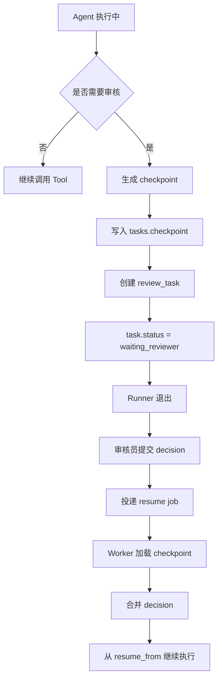

### 6.2 checkpoint 存在哪里

MVP 阶段可以直接存在 `tasks.checkpoint` 字段里：

```text
tasks
  id
  status
  checkpoint
  version
```

如果 checkpoint 变大，或者需要保存多次历史快照，可以拆成独立表：

```text
task_checkpoints
  id
  task_id
  step
  payload
  created_at
```

第一版推荐：

```text
简单任务 -> 存 tasks.checkpoint
复杂工作流 -> 单独 task_checkpoints 表
```

### 6.3 checkpoint 不应该存什么

不要把这些东西直接塞进 checkpoint：

- 完整模型内部推理过程。
- 大段无关聊天历史。
- 未脱敏的敏感数据。
- 临时连接对象、HTTP 请求对象、数据库连接。
- 可以通过 `task_id` 重新查到的重复数据。

更好的做法是：

```text
event 保存过程
checkpoint 保存恢复点
audit_log 保存可追溯结论
```

三者不要混在一起。

---

## 7. 两种方案怎么选

| 问题 | 选本地 Agent 工具 | 选服务 Agent 接口 |
|------|-------------------|-------------------|
| 是否多用户 | 通常单用户或少量固定用户 | 多用户、多角色、多业务线 |
| 是否需要 Web/App 入口 | 不一定 | 通常需要 |
| 是否要审核流 | 可以有，但较简单 | 常见，需要任务和状态表 |
| 是否要操作本地文件 | 是 | 通常不是 |
| 是否要访问企业系统 | 可以，但多为本机脚本 | 是，通常通过业务工具服务 |
| 是否需要多租户隔离 | 一般不需要 | 必须考虑 |
| 是否需要审计 | 简单日志即可 | 必须系统化 |
| 是否需要水平扩展 | 一般不需要 | 需要 Worker Pool 和队列 |

粗略判断：

```text
个人使用、代码助手、本地文件处理 -> 本地 Agent 工具
客服、审批、工单、企业应用、多用户平台 -> 服务 Agent 接口
```

---

## 8. 落地建议

第一阶段不要一开始就做“大平台”。

可以按这个顺序推进：

```text
1. 先做本地 Agent 工具
   -> 验证工具设计、Prompt、业务流程是否可行

2. 再做单用户服务 Agent
   -> 接 API、存 session/task/event

3. 再做多用户隔离
   -> tenant_id、user_id、permission_scope、审计

4. 再做审核和暂停恢复
   -> review_task、checkpoint、resume job

5. 最后做生产能力
   -> 队列、锁、幂等、监控、灰度、回退
```

这样学习和落地都会更稳。
