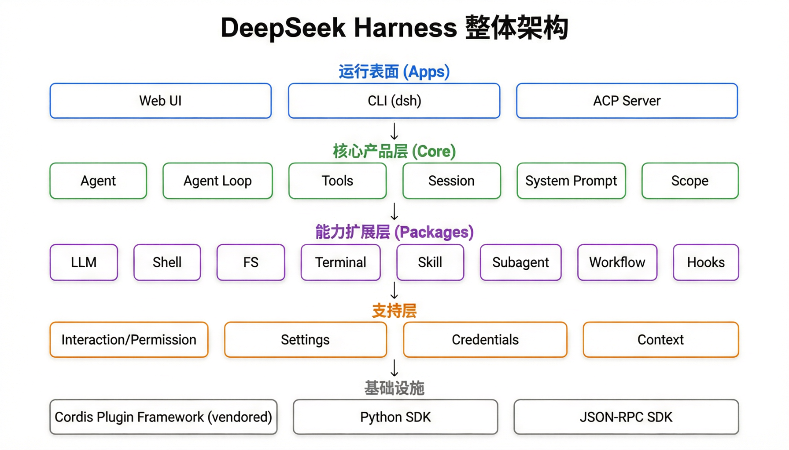
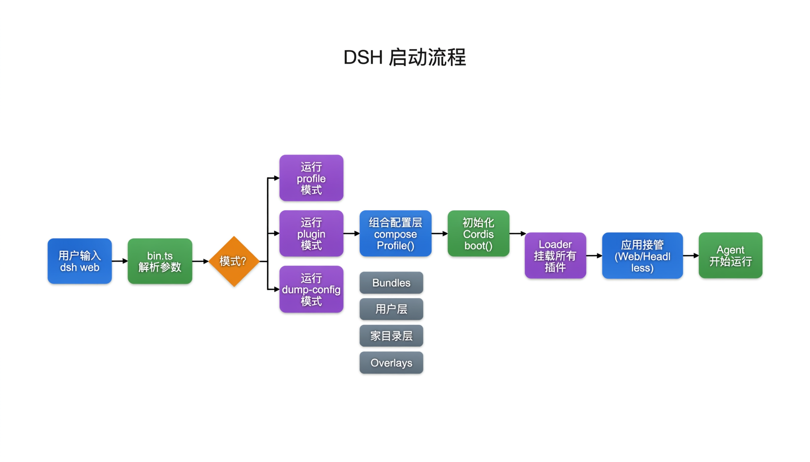
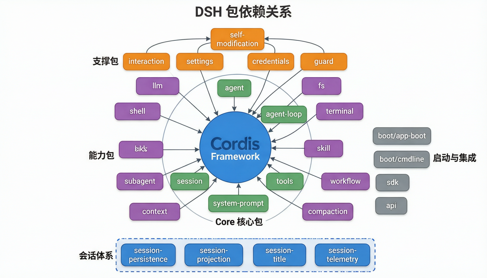

# DeepSeek Harness 架构文档

> 源码路径：`/Users/zhangruitao/iss-project/github/deepseek-harness`
> 版本：`0.1.0-rc.5`（开发者预览阶段）
> 技术栈：TypeScript / Node.js 22+ / pnpm / Cordis 插件框架

---

## 30 秒看懂这个项目

```text
DeepSeek Harness (dsh) = 一个"管理 AI 助手"的框架

类比：你开了一家餐厅
  - 模型 (DeepSeek) = 厨师，只管做菜（思考）
  - Harness (dsh)   = 餐厅经理，负责一切运营：
      接订单、安排座位、管理工具箱、
      控制权限、记住常客偏好、协调多个服务员…

dsh 的核心特点：餐厅里"所有东西都是可插拔的模块"
  换厨师？换个插件就行
  加新菜？加个工具插件就行
  换收银系统？换个插件就行
```

---

## 一、项目概览

DeepSeek Harness（简称 `dsh`）是 [DeepSeek AI](https://deepseek.com) 开源的 Agent 运行框架。

一句话概括：**模型负责思考，dsh 负责让思考变成行动。**

dsh 用了一个叫 **Cordis** 的插件框架来管理所有功能。每个功能（调 LLM、执行命令、读写文件、权限控制……）都是一个独立的插件，可以随时替换或新增。

### 快速体验

```bash
# 一行命令启动
npx @deepseek-ai/dsh web    # 打开浏览器，访问 http://127.0.0.1:3080

# 从源码运行
git clone https://github.com/deepseek-ai/deepseek-harness.git
cd deepseek-harness
pnpm install && pnpm run build
pnpm dsh web
```

---

## 二、整体架构：五层楼



把 dsh 想象成一栋**五层楼**，每层有不同职责：

### 第 5 层（顶层）：门面 — 用户看到的入口

```text
类比：餐厅的大门和前台

有三个入口可以进入这个系统：
  • Web UI    — 浏览器界面，像网页版聊天
  • CLI       — 命令行界面，程序员用的
  • ACP Server — 给其他程序调用的接口
```

### 第 4 层：大脑 — Agent 怎么运转

```text
类比：餐厅经理的工作流程

  • agent        — "一个服务员"，有自己的 ID 和状态
  • agent-loop   — "服务员的循环"：接单→思考→行动→回复→继续
  • tools        — "工具箱"：服务员可以调用哪些工具
  • session      — "这次服务的记录"：从开始到结束的完整对话
  • system-prompt — "服务指南"：告诉 AI 应该怎么表现
  • scope        — "服务范围"：这个服务员能管哪些事
```

### 第 3 层：能力 — Agent 能做什么

```text
类比：餐厅里的各种设备

  • llm       — 连接大脑（DeepSeek 模型）
  • shell     — 能执行命令行（bash / PowerShell）
  • fs        — 能读写文件
  • terminal  — 持久终端（保持命令执行状态）
  • skill     — 技能系统（可复用的高级操作）
  • subagent  — 子代理（派小弟去干活）
  • workflow  — 工作流（按步骤执行复杂任务）
  • hooks     — 钩子（在特定时机自动触发的动作）
  • context   — 上下文信息（当前时间、目录等）
  • compaction — 上下文压缩（信息太多时精简）
```

### 第 2 层：管理 — 保证运行正常

```text
类比：餐厅的管理制度

  • interaction — 权限审批（危险操作需要用户确认）
  • settings   — 用户偏好设置
  • credentials — 密钥和凭证管理
  • guard      — 安全守护（防止死循环、超时控制）
  • identity   — 匿名身份
```

### 第 1 层（地基）：基础设施

```text
类比：餐厅的水电煤气

  • Cordis      — 插件框架（所有插件的"操作系统"）
  • Python SDK  — 让 Python 程序也能调用 dsh
  • JSON-RPC SDK — 程序间通信的协议
```

---

## 三、目录结构：文件在哪里

```text
deepseek-harness/
├── apps/                        # 第 5 层：用户入口
│   ├── cli/                    #   命令行程序
│   │   └── src/
│   │       ├── bin.ts              # 主入口（"大门"）
│   │       ├── profile-boot.ts     # 启动流程（"开业准备"）
│   │       └── plugin.ts           # 插件管理（"进货管理"）
│   └── web/                    #   网页界面
│
├── packages/                    # 第 4-2 层：所有功能模块
│   ├── core/                  #   核心（大脑层）
│   │   ├── agent/            #     Agent 服务
│   │   ├── agent-loop/       #     Agent 循环
│   │   ├── tools/            #     工具系统
│   │   └── session/          #     会话管理
│   │
│   ├── llm/                   #   LLM 能力
│   ├── shell/                 #   Shell 命令
│   ├── fs/                    #   文件系统
│   ├── subagent/              #   子代理
│   ├── skill/                 #   技能
│   ├── workflow/              #   工作流
│   ├── hooks/                 #   钩子
│   ├── interaction/           #   权限交互
│   ├── session/               #   会话持久化
│   ├── settings/              #   设置
│   └── ...                    #   更多模块
│
├── python/                    # Python SDK
├── vendor/                    # 第三方框架（Cordis 等）
└── docs/                      # 文档
```

---

## 四、启动流程：餐厅怎么开业



用户输入 `dsh web` 后，系统经历了 8 个步骤才准备好：

```text
类比：餐厅早上开业的流程

步骤 1：顾客来了（用户输入 dsh web）
    ↓
步骤 2：前台接待（bin.ts 解析命令参数）
    ↓
步骤 3：决定模式（今天开堂食？外卖？包间？）
    ├── "profile"    → 正常启动（堂食）
    ├── "plugin"     → 管理插件（调整菜单）
    └── "dump-config" → 查看配置（看今天的菜单）
    ↓
步骤 4：拼菜单（composeProfile 组合配置层）
    配置从底到顶叠加：
      ① Bundle 层     — 默认配置（标准菜单）
      ② 用户层        — 用户自定义（你的口味偏好）
      ③ 家目录层      — 全局偏好（你在家都加辣）
      ④ --patch 覆盖  — 临时调整（今天不加辣）
    ↓
步骤 5：开店（boot 初始化 Cordis 框架）
    ↓
步骤 6：员工上岗（Loader 挂载所有插件）
    每个插件在独立的 Fiber（工位）里启动
    ↓
步骤 7：开门营业（Web UI 或 Headless 应用接管）
    ↓
步骤 8：第一位客人（Agent 开始运行，等待用户输入）
```

### 启动流程图（简化版）

```text
dsh web
  → bin.ts 解析参数
    → profile-boot.ts 加载配置
      → 叠加 4 层配置
        → Cordis 框架启动
          → Loader 挂载插件
            → 应用接管
              → Agent 循环开始
```

---

## 五、核心概念：三个最重要的东西

### 5.1 Agent — "一个正在工作的 AI 助手"

```text
类比：一个正在服务的服务员

Agent 有：
  • 一个 ID（工号）
  • 一个会话（这桌客人）
  • 一个循环（接单→思考→行动→回复）
  • 一套工具（可以用的设备）

Agent 的一生：
  创建 → setup（准备） → 发布（上岗） → 循环工作 → dispose（下班）
```

创建 Agent 有两种方式：
- `create()` — 创建新的（新来一桌客人）
- `resume()` — 恢复旧的（老客人回来了，继续上次的对话）

### 5.2 Agent 循环 — "AI 的工作节奏"

```text
类比：服务员的工作循环

while (还没完成任务) {
  1. 看看客人说了什么（读用户消息）
  2. 想想该怎么做（发给 LLM 思考）
  3. 拿到回复
  4. 如果需要做菜：
     → 调用工具执行（bash / 读文件 / 搜索...）
     → 把结果告诉 LLM
     → 继续循环
  5. 如果直接回复客人：
     → 输出文本
     → 结束
}
```

### 5.3 工具 — "AI 能用的设备"

```text
类比：服务员可以使用的设备

工具箱里有：
  🔨 bash       — 执行命令行
  📁 read_file  — 读文件
  ✏️  write_file — 写文件
  🔍 search     — 搜索文件
  🌐 web_search — 搜索网页
  🤖 subagent   — 派子代理干活
  📋 todo       — 管理待办事项
  ⚙️  workflow   — 执行工作流
  ... 还有十几个
```

每个工具都是一个独立插件，通过 **ToolRegistry**（工具注册表）统一管理。

---

## 六、能力接缝：最核心的设计模式


这是 dsh 最重要的设计理念。理解它就理解了整个项目为什么这样组织。

### 用"插座"来理解

```text
类比：家里的电源系统

  Service Definition = 插座面板（定义了"两孔还是三孔"）
  Service Provider   = 发电厂（真正供电的人）
  Consumer           = 台灯（用电的设备）

关键规则：
  台灯只需要知道"插在哪个插座"，不关心电是火力发电还是太阳能发的
  发电厂只需要知道"往哪个插座送电"，不关心上面插了什么
  插座面板只是一个标准接口，两边都依赖它
```

### 真实例子：Shell 命令能力

```text
Service Definition: dsh-shell
  → 定义了 "执行命令" 这个能力的接口

Service Provider:
  → dsh-terminal-bash  — Linux/macOS 上用 bash
  → dsh-pwsh-local     — Windows 上用 PowerShell

Consumer:
  → dsh-tool-bash      — 给 Agent 注册 "bash" 工具

好处：换电脑操作系统？只要换 Provider 插件，Consumer 一行代码都不用改。
```

### 为什么要这么设计？

```text
❌ 没有接缝：工具直接调用 bash 命令 → 只能在 Linux 上用
✅ 有接缝：工具调用 Shell 接口 → 运行时选择 bash 还是 PowerShell
```

---

## 七、包的关系：谁依赖谁



dsh 有 **60 多个子包**（`@deepseek-ai/dsh-*`），按职责分为四圈：

### 核心圈（5 个包）— 不能缺的

```text
这 5 个包是 Agent 运转的"脊柱"，少了任何一个都跑不起来：

agent         → Agent 是什么
agent-loop    → Agent 怎么工作
tools         → 工具怎么注册
session       → 会话怎么管理
system-prompt → 系统提示词怎么组装
```

### 能力圈（10 个包）— 按需加载

```text
每个包给 Agent 加一种能力，可以单独替换：

llm-deepseek   → 用 DeepSeek 做 LLM
llm-retry      → LLM 调用失败时自动重试
shell/bash     → 执行 bash 命令
fs-local       → 本地文件操作
skill          → 技能系统
subagent       → 子代理
workflow       → 工作流
compaction     → 上下文压缩
hooks          → 钩子系统
context        → 上下文信息注入
```

### 工具圈（15+ 个包）— 每个工具一个包

```text
每个工具是独立的插件包：

dsh-tool-bash, dsh-tool-fs, dsh-tool-web,
dsh-tool-subagent, dsh-tool-skill, dsh-tool-workflow,
dsh-tool-todo, dsh-tool-goal, dsh-tool-ask-user ...
```

### 支撑圈 — 管理和治理

```text
保障系统正常运行的基础设施：

interaction    → 权限和交互
settings       → 用户设置
credentials    → 密钥管理
guard          → 安全守护
boot/app-boot  → 启动胶水
sdk            → JSON-RPC 通信
```

---

## 八、会话：对话怎么保存

```text
类比：餐厅里的点菜单

一次会话 = 一次完整的服务过程
  • 客人说了什么（用户消息）
  • 服务员做了什么（AI 回复 + 工具调用）
  • 结果是什么（最终输出）

会话的保存方式：
  ├── JSONL 后端  — 追加写入文件，速度快（像流水账）
  └── SQLite 后端 — 结构化存储，查询方便（像数据库）
```

会话体系有 4 个子包：
- **persistence** — 数据存到哪
- **projection** — 快速查询接口
- **title** — 自动生成会话标题
- **telemetry** — 监控和追踪

---

## 九、错误处理：出了问题怎么办

```text
类比：餐厅里的应急预案

1. 大声报错 — 配置错了直接告诉你，不会偷偷用默认值
   "fail loud"：宁可一上来就报错，也不让你跑了半天才发现不对

2. 自动重试 — LLM 调用偶尔超时，自动多试几次（指数退避）
   第 1 次等 1 秒，第 2 次等 2 秒，第 3 次等 4 秒...

3. 随时可取消 — 每个操作都绑了 AbortSignal
   用户按 Ctrl+C，所有操作立刻停下来

4. 超时保护 — 工具执行有超时限制
   命令跑了 30 秒还没完？自动杀掉

5. 回滚机制 — Agent 创建失败，自动清理已分配的资源
```

---

## 十、日志：什么都记下来

```text
核心原则：模型看到的一切，都能从日志中还原

类比：餐厅里的监控录像
  • 客人说了什么 → 记录
  • AI 想了什么 → 记录
  • 调用了什么工具 → 记录
  • 工具返回了什么 → 记录

如果出了问题，重看"录像"就能找到原因。
```

日志类型：
- **Session Log** — 完整的会话记录
- **SessionEvent** — 结构化事件（创建、消息、工具调用…）
- **OpenTelemetry** — 分布式追踪（可选）

---

## 十一、Python SDK：Python 怎么用

```text
类比：你有一个 Python 程序，想"遥控" dsh

原理：Python 程序通过 JSON-RPC 协议（一种标准通信格式）
      和 dsh 进程对话，就像两个程序用对讲机通话。

Python 说 → "帮我创建一个会话"
dsh 回   → "好的，会话 ID 是 xxx"
Python 说 → "在这个会话里问：帮我写个排序函数"
dsh 回   → "Agent 正在工作...（持续推送进度）"
dsh 回   → "完成了，结果是..."
```

```python
from deepseek_harness import HarnessClient

# 启动 dsh 进程
client = HarnessClient()
client.start()

# 初始化
result = client.initialize(
    cwd="/你的项目路径",
    provider="deepseek",
    model="deepseek-chat"
)

# 发送消息
message_id = client.session_prompt(
    result.session_id,
    [{"type": "text", "text": "帮我写个排序函数"}]
)

# 关闭
client.close()
```

---

## 快速索引

| 想看什么 | 去哪里 |
|----------|--------|
| 项目长什么样 | [二、整体架构](#二整体架构五层楼) |
| 怎么启动的 | [四、启动流程](#四启动流程餐厅怎么开业) |
| Agent 怎么工作 | [五、核心概念](#五核心概念三个最重要的东西) |
| 为什么这样设计 | [六、能力接缝](#六能力接缝最核心的设计模式) |
| 有哪些包 | [七、包的关系](#七包的关系谁依赖谁) |
| 对话怎么保存 | [八、会话](#八会话对话怎么保存) |
| 出错怎么办 | [九、错误处理](#九错误处理出了问题怎么办) |
| Python 怎么用 | [十一、Python SDK](#十一python-sdkpython-怎么用) |
