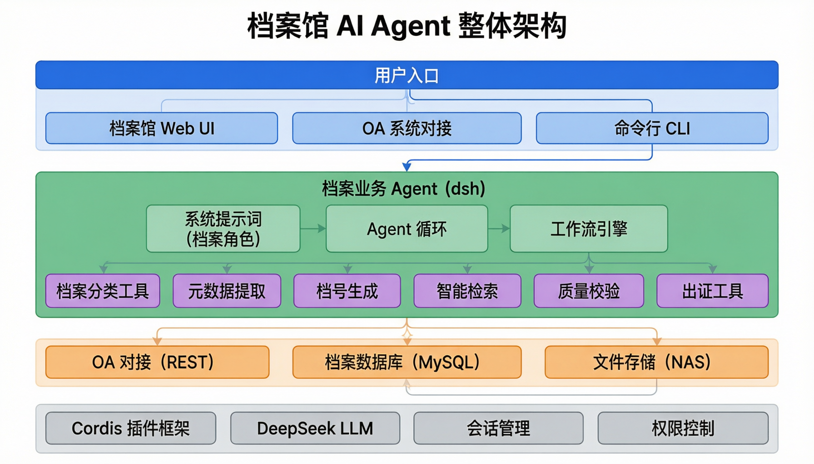
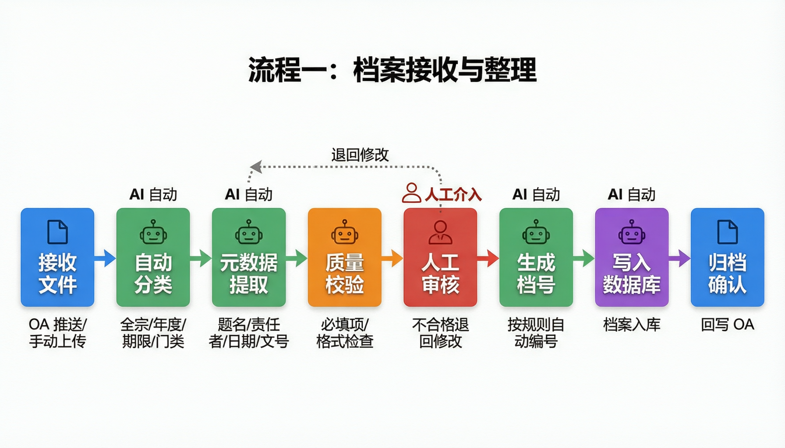
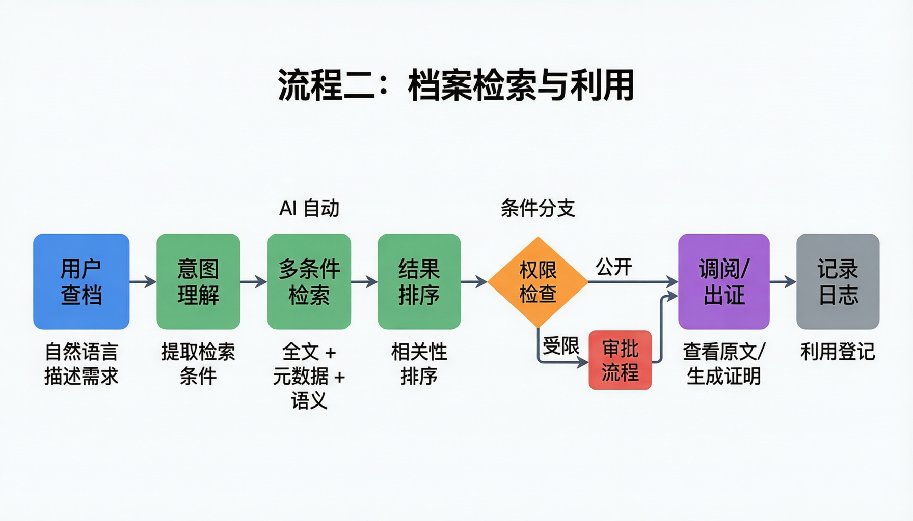
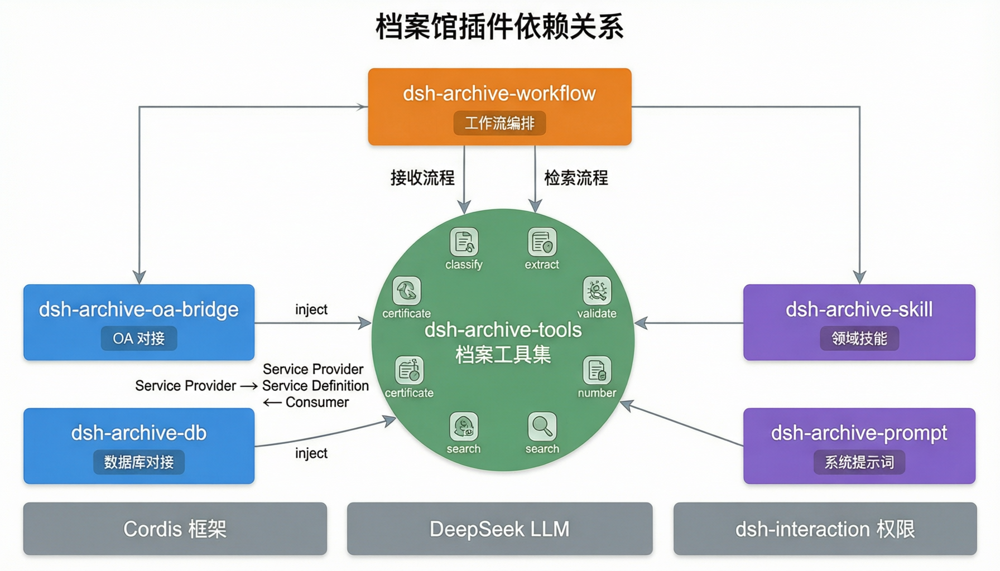

# 档案馆业务流程编排 — 基于 dsh 的落地方案

> 基于 DeepSeek Harness (dsh) 插件化架构，为档案馆场景设计业务流程编排方案
> 核心场景：档案接收与整理 + 档案检索与利用
> 集成需求：对接 OA 系统 + 现有档案数据库

---

## 30 秒看懂这个方案

```text
类比：给档案馆配一个 "AI 档案员"

这个 AI 档案员能做到：
  ✅ 收到公文后，自动分类、编目、编号、入库
  ✅ 有人来查档时，智能理解需求、检索、审批、出证
  ✅ 不确定的事情，提请人工确认（不会乱来）
  ✅ 所有操作都有日志（可追溯、可审计）

怎么实现？
  不改 dsh 核心代码
  而是写一组 "档案领域专用插件"
  让通用 Agent 变成 "档案业务 Agent"
```

这个方案建议按“先最小闭环，再生产化”的思路理解：

| 阶段 | 重点问题 | 不急着做的事 |
|------|----------|--------------|
| MVP | 能不能完成一份档案的分类、编目、入库 | 全量 OA 对接、复杂权限、批量性能 |
| 流程化 | 能不能把接收、审核、入库、回写串成稳定流程 | 多库同步、跨部门复杂审批 |
| 检索利用 | 能不能把自然语言需求转成可审计的查档过程 | 一开始就做全量知识图谱 |
| 生产化 | 能不能稳定运行、可追溯、可回滚、可运维 | 盲目扩大自动化范围 |

档案业务不能只追求“自动完成”。更重要的是：AI 每一步为什么这么判断、什么时候必须交给人、出了问题能不能追溯。

---

## 一、整体架构



整个系统分为四层：

| 层级 | 什么 | 类比 |
|------|------|------|
| **用户入口** | Web UI / OA 对接 / CLI | 档案服务窗口 |
| **档案 Agent** | dsh + 档案插件 | AI 档案员的大脑 |
| **业务插件** | 分类/编目/检索/出证等工具 | 档案员的专业技能 |
| **系统集成** | OA 系统 / 档案数据库 / 文件存储 | 档案员要对接的外部系统 |

### 核心思路

```text
dsh 是"底座"（通用的 Agent 运行环境）
档案插件是"业务层"（档案馆专用的能力）

底座负责：Agent 循环、会话管理、权限控制、日志记录
业务层负责：档案分类、元数据提取、档号生成、检索、出证

两层互不干扰，底座升级不影响业务，业务扩展不改底座。
```

---

## 二、两条核心业务流程

### 流程一：档案接收与整理



这是档案馆最日常的工作。一份文件从"进来"到"归档"，经过 8 个步骤：

```text
步骤 1：接收文件
  来源：OA 系统自动推送 / 人工上传
  谁做：系统自动 或 人工操作

步骤 2：自动分类（AI 做）
  做什么：判断这份文件属于哪个全宗、哪个年度、什么保管期限、什么门类
  怎么判断：LLM 读取文件内容 + 标题，结合"分类规则技能"给出建议
  类比：档案员看了一眼文件，就知道该放哪个柜子

步骤 3：元数据提取（AI 做）
  做什么：从文件内容中提取结构化信息
  提取什么：题名、责任者（谁写的）、日期、文号、关键词
  类比：档案员在档案盒上贴标签

步骤 4：质量校验（AI 做）
  做什么：检查必填项有没有缺、格式对不对
  例子：文号格式应该是"XX〔2024〕X号"，缺了就报错

步骤 5：人工审核（人做）
  什么时候需要：AI 不确定的时候（置信度低 / 校验不通过）
  做什么：人工确认分类是否正确、元数据是否完整
  不通过：退回步骤 3，AI 重新提取

步骤 6：生成档号（AI 做）
  做什么：按规则生成唯一档号
  规则：全宗号-目录号-年度-保管期限-件号
  类比：给档案贴一个唯一的"身份证号"

步骤 7：写入数据库（AI 做）
  做什么：把档案信息存入档案管理系统
  同时：原文挂接到对应记录

步骤 8：归档确认（AI 做）
  做什么：通知 OA 系统"这份文件已归档"
  同时：生成归档回执
```

### 流程二：档案检索与利用



有人来查档案时的流程：

```text
步骤 1：用户提需求
  方式：自然语言描述
  例子："我要找 2020 年关于疫情防控的所有红头文件"

步骤 2：意图理解（AI 做）
  做什么：从自然语言中提取检索条件
  提取出：时间=2020年、主题=疫情防控、文种=正式发文

步骤 3：多条件检索（AI 做）
  怎么做：同时走三条路
    ① 元数据检索：WHERE year=2020 AND topic='疫情防控'
    ② 全文检索：搜索正文包含"疫情防控"的文件
    ③ 语义检索：用向量相似度找"意思相近"的文件

步骤 4：结果排序（AI 做）
  做什么：把三条路的结果合并，按相关性排序

步骤 5：权限检查（条件分支）
  公开档案 → 直接到步骤 6
  受限档案 → 走审批流程（领导审批后才能看）

步骤 6：调阅 / 出证
  调阅：展示原文给用户看
  出证：生成档案证明文件（带章的 PDF）

步骤 7：记录日志
  做什么：记录"谁、什么时候、查了什么、看了哪些档案"
  为什么：审计需要，法律规定
```

### 人工介入点

档案场景不适合完全自动化，建议明确这些人工确认点：

| 环节 | 触发条件 | 人工要确认什么 |
|------|----------|----------------|
| 自动分类后 | 置信度低、规则冲突、缺少关键字段 | 全宗、年度、保管期限、门类是否正确 |
| 元数据提取后 | 必填项缺失、格式不符合规范 | 题名、责任者、日期、文号是否准确 |
| 生成档号前 | 同类档号冲突、历史规则不一致 | 档号规则和流水号是否可用 |
| 受限档案调阅前 | 涉密、内部、个人隐私或权限不足 | 是否允许调阅、是否需要脱敏 |
| 出证前 | 证明用途敏感、内容跨部门 | 出证内容、盖章流程和留痕是否合规 |

把这些节点固定下来，Agent 的职责就更清楚：能自动处理确定性部分，不能替代制度审批。

---

## 三、插件设计：需要开发什么



一共需要 **6 个自定义插件包**，每个都有明确的职责：

### 插件清单

| 插件名 | 职责 | 类比 |
|--------|------|------|
| `dsh-archive-tools` | 档案业务工具集 | 档案员的工具箱 |
| `dsh-archive-oa-bridge` | 对接 OA 系统 | 和 OA 系统的"翻译官" |
| `dsh-archive-db` | 对接档案数据库 | 和数据库的"桥梁" |
| `dsh-archive-workflow` | 定义业务流程 | 工作流程手册 |
| `dsh-archive-skill` | 档案领域知识 | 档案员的专业知识 |
| `dsh-archive-prompt` | 系统提示词 | 档案员的行为准则 |

### 插件 1：dsh-archive-tools（工具箱）

这是最核心的插件，提供 6 个工具给 Agent 调用：

| 工具 | 干什么 | 输入 | 输出 |
|------|--------|------|------|
| `classify_archive` | 档案分类 | 文件内容/标题 | 全宗号、年度、保管期限、门类 |
| `extract_metadata` | 提取元数据 | 文件内容 | 题名、责任者、日期、文号 |
| `validate_archive` | 质量校验 | 元数据 JSON | 通过/不通过 + 原因 |
| `generate_archive_no` | 生成档号 | 分类信息 | 档号字符串 |
| `search_archives` | 智能检索 | 自然语言 | 检索结果列表 |
| `generate_certificate` | 出证 | 档案信息 + 用途 | 证明文件 |

### 插件 2：dsh-archive-oa-bridge（OA 对接）

用**能力接缝**模式设计（参见 [plugin-system.md](plugin-system.md#八能力接缝最核心的设计)）：

```text
接口定义（Definition）：
  receiveDocument(id)     — 接收 OA 推送的公文
  sendConfirmation(id)    — 回写归档确认
  getApprovalStatus(id)   — 查询审批状态

实现（Provider）：
  通过 REST API 调用 OA 系统
  处理鉴权（token / 证书）
  做字段映射（OA 的字段名 -> 档案系统的字段名）

使用方（Consumer）：
  dsh-archive-tools 通过 inject 使用这个服务
  不关心 OA 是泛微、致远还是蓝凌
```

### 插件 3：dsh-archive-db（数据库对接）

```text
接口定义（Definition）：
  insertArchive(record)       — 写入档案记录
  queryArchives(criteria)     — 条件检索
  fullTextSearch(keyword)     — 全文检索
  updateStatus(id, status)    — 更新状态

实现（Provider）：
  直连已有的档案数据库（MySQL / PostgreSQL / 达梦）
  映射表结构（Agent 的数据格式 <-> 已有表结构）
  关键：不改现有数据库！Provider 做"翻译"
```

### 插件 4：dsh-archive-workflow（工作流定义）

用 dsh-workflow 把步骤串起来：

```text
接收整理流程：
  接收 → 分类 → 提取 → 校验 → [人工审核] → 编号 → 入库 → 确认

检索利用流程：
  理解意图 → 检索 → 排序 → [权限检查/审批] → 调阅 → 记录
```

### 插件 5：dsh-archive-skill（领域知识）

把档案专业知识封装成 Agent 可以查阅的"技能"：

| 技能 | 包含什么 |
|------|----------|
| 档案分类规则 | 全宗划分、保管期限表、门类分类标准 |
| 档号编制规则 | 全宗号-目录号-年度-保管期限-件号 的编制规范 |
| 检索策略 | 同义词扩展（"红头文件"="正式发文"）、模糊匹配策略 |

### 插件 6：dsh-archive-prompt（行为准则）

```text
你是一个档案管理助手。你的行为准则是：
1. 严格按照《档案分类规则》进行分类，不随意分类
2. 元数据提取必须完整准确，缺项必须标注
3. 涉及涉密档案时，必须走审批流程，不能跳过
4. 分类不确定时（置信度 < 80%），提请人工确认
5. 所有操作必须记录日志，方便追溯
```

---

## 四、系统集成方案

### 4.1 对接 OA 系统

```text
两个方向的通信：

OA → 档案 Agent：
  方式 1：OA 主动推送（Webhook）
    OA 发文办结后，自动通知档案系统
  方式 2：档案 Agent 定时轮询
    每隔 5 分钟检查一次 OA 有没有新文件

档案 Agent → OA：
  方式：REST API 调用
  场景：回写归档确认、查询审批状态
```

### 4.2 对接档案数据库

```text
关键原则：不改现有数据库结构

做法：
  Provider 层做"翻译"
  Agent 用标准格式 → Provider 翻译成已有表结构 → 写入数据库
  数据库返回数据 → Provider 翻译成标准格式 → 交给 Agent

好处：
  已有系统不用改
  换数据库？只换 Provider，工具层不动
```

建议统一一份 Agent 内部使用的“档案标准对象”，不要让每个工具直接理解 OA 字段或数据库字段：

| 标准字段 | 来源 | 用途 |
|----------|------|------|
| `archive_id` | 数据库生成或迁移映射 | 系统内唯一标识 |
| `archive_no` | 规则生成 | 档号展示、归档定位 |
| `title` | OA 标题 / 文件正文提取 | 检索、出证、人工审核 |
| `fonds_no` | 分类规则 | 全宗管理 |
| `retention_period` | 分类规则 / 人工确认 | 保管期限和销毁规则 |
| `security_level` | OA 字段 / 内容识别 / 人工确认 | 权限控制和审批 |
| `source_system` | OA / 人工上传 / 历史导入 | 溯源和排错 |
| `source_doc_id` | OA 文档 ID 或外部系统 ID | 回写确认、跨系统关联 |

OA Provider 和 DB Provider 负责把各自系统字段翻译成这个标准对象。这样工具、Skill 和 Workflow 都围绕同一种数据结构协作。

### 4.3 部署方式

```text
两种部署模式并存：

模式 1：dsh web（有人值守）
  档案馆工作人员通过 Web UI 操作
  用于：查档利用、人工审核、查看报表

模式 2：dsh --profile headless "处理待归档文件"（无人值守的一次性任务）
  后台自动处理 OA 推送的文件
  用于：自动接收、分类、编目、入库
  注意：headless profile 不打开 Web 端口，执行完一个任务后输出结果并退出
```

---

## 五、落地路径：四个阶段

### 第一阶段：跑通最小闭环（2-3 周）

```text
目标：让 Agent 能处理一条简单的档案

做什么：
  ① 开发 classify_archive + extract_metadata + generate_archive_no 三个工具
  ② 开发数据库 Provider（先用 SQLite 本地测试）
  ③ 配置系统提示词
  ④ 手动喂一份文件，验证 Agent 能正确分类和编目

交付：一个能自动分类 + 编目的 demo
验收：给 10 份不同类型的文件，分类准确率 > 80%
```

### 第二阶段：流程编排 + OA 对接（3-4 周）

```text
目标：从 OA 到入库的全流程自动化

做什么：
  ① 开发 OA 对接插件（REST API）
  ② 用 dsh-workflow 定义接收整理流程
  ③ 加入人工审核节点（dsh-interaction）
  ④ 开发质量校验工具
  ⑤ 对接真实档案数据库

交付：OA 推送 → 自动分类编目 → 人工确认 → 入库 的完整流程
验收：OA 推 20 份公文，15 份以上能自动完成，5 份以内人工确认
```

### 第三阶段：检索利用（3-4 周）

```text
目标：支持自然语言查档

做什么：
  ① 开发智能检索工具（多条件 + 语义）
  ② 封装检索策略技能
  ③ 用 dsh-workflow 定义检索利用流程
  ④ 加入涉密审批节点
  ⑤ 开发出证工具

交付：用户说"找 2020 年疫情文件" → 智能检索 → 审批 → 调阅
验收：10 个查档需求，8 个以上能精准找到
```

### 第四阶段：生产化（2-3 周）

```text
目标：可以上线使用

做什么：
  ① 权限体系（按角色控制权限）
  ② 日志审计（所有操作可追溯）
  ③ 性能优化（批量处理、缓存）
  ④ 异常处理（OA 超时、数据库断开）
  ⑤ 部署文档和运维手册

交付：可上线的生产系统
```

### 总时间线

```text
第 1-3 周    第一阶段：最小闭环 demo
第 4-7 周    第二阶段：OA 对接 + 完整流程
第 8-11 周   第三阶段：检索利用
第 12-14 周  第四阶段：生产化

总计：约 3.5 个月
```

---

## 六、技术选型

| 维度 | 选什么 | 为什么 |
|------|--------|--------|
| LLM 模型 | DeepSeek-Chat | 中文理解好、成本低、dsh 原生支持 |
| 数据库 | 直连已有库 | 避免中间层，性能好，不改已有系统 |
| OA 对接 | REST API + Webhook | 标准协议，兼容泛微/致远/蓝凌等 |
| 工作流 | dsh-workflow（内置） | 不引入额外依赖 |
| 审批 | dsh-interaction | 原生支持人机协作 |
| 部署 | web + headless 并存 | 有人值守和自动处理两种模式 |

---

## 七、风险和应对

| 风险 | 怎么办 |
|------|--------|
| **分类不准** | Skill 注入分类规则 + 置信度低于 80% 人工确认 |
| **OA 接口不稳定** | 重试机制 + 消息队列缓冲（不怕临时断开） |
| **数据量大** | 分批处理 + 索引优化 + headless 模式异步执行 |
| **涉密安全** | 强制审批 + 全链路操作日志 + 权限分级 |
| **dsh 版本迭代** | 自定义插件放独立仓库，不 fork dsh，升级不影响业务 |

建议每次 Agent 行动至少记录这些审计字段：

| 字段 | 说明 |
|------|------|
| `operator_id` | 发起人或系统账号 |
| `session_id` | 本次 Agent 会话 |
| `workflow_id` | 所属业务流程 |
| `archive_id` | 涉及的档案记录 |
| `tool_name` | 调用的工具 |
| `input_hash` | 输入摘要，避免日志保存敏感全文 |
| `decision` | 自动通过、需要人工、拒绝、失败 |
| `reason` | 判断依据或失败原因 |
| `approver_id` | 人工审批人，自动步骤可为空 |
| `created_at` | 操作发生时间 |

---

## 快速索引

| 想看什么 | 去哪里 |
|----------|--------|
| 整体怎么搭 | [一、整体架构](#一整体架构) |
| 接收流程 | [流程一：档案接收与整理](#流程一档案接收与整理) |
| 检索流程 | [流程二：档案检索与利用](#流程二档案检索与利用) |
| 要开发什么 | [三、插件设计](#三插件设计需要开发什么) |
| 怎么对接现有系统 | [四、系统集成](#四系统集成方案) |
| 分几步做 | [五、落地路径](#五落地路径四个阶段) |
| 技术选型 | [六、技术选型](#六技术选型) |
| 有什么风险 | [七、风险和应对](#七风险和应对) |
