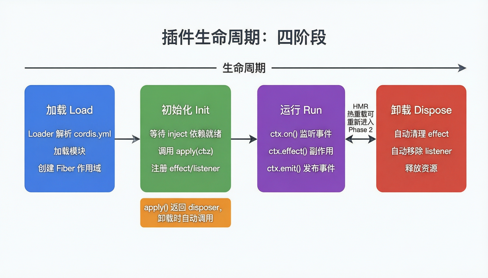
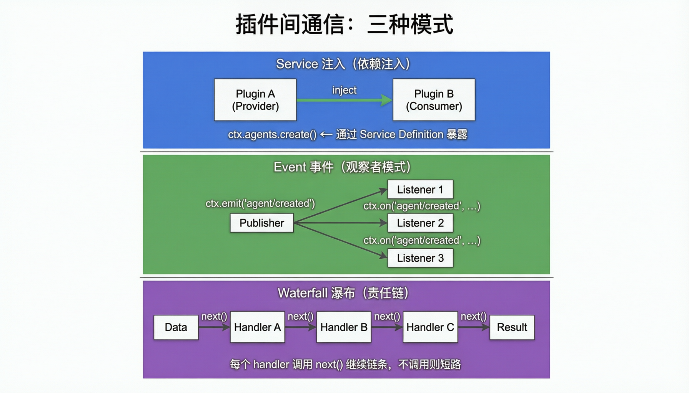
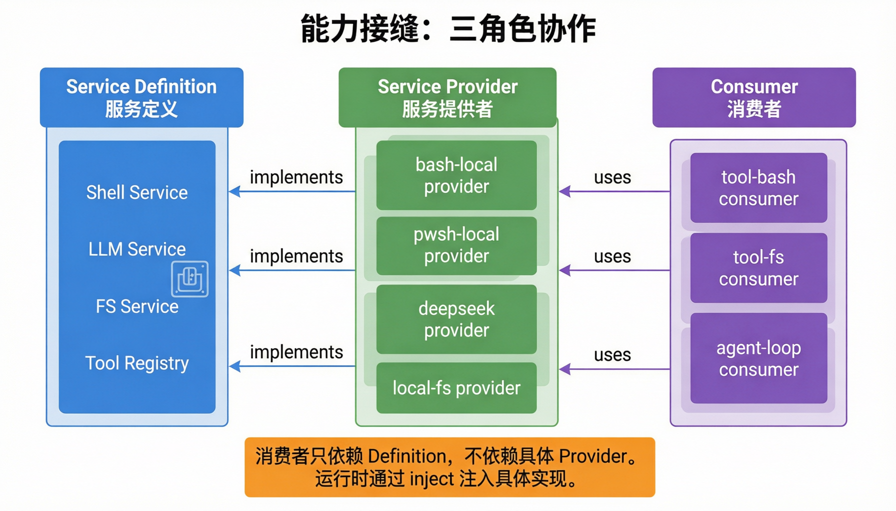

# DeepSeek Harness 插件系统详解

> 源码路径：`/Users/zhangruitao/iss-project/github/deepseek-harness`
> 插件框架：Cordis（vendored 在 `vendor/cordis/`）
> 设计哲学：**一切皆插件（Everything is a Plugin）**

---

## 30 秒看懂插件系统

```text
类比：乐高积木

传统的 Agent 框架 = 一辆焊死的汽车
  想换轮胎？得拆整车
  想加个灯？得改电路

dsh 的插件系统 = 一套乐高积木
  想换轮胎？拔下来换个新的
  想加个灯？插上去就行
  不想要某个功能？拔掉就好

dsh 里所有功能都是"积木块"（插件）：
  • LLM 调用是一个插件
  • 执行命令是一个插件
  • 读写文件是一个插件
  • 权限控制是一个插件
  • 甚至连"系统提示词"也是插件组装的
```

阅读本章时先区分三层：

| 层次 | 回答的问题 | 例子 |
|------|------------|------|
| 插件机制 | 一个功能如何被加载、运行、卸载 | Context、Fiber、Effect、配置热重载 |
| 能力接口 | 多个实现如何遵守同一套接口 | Shell Definition + bash/pwsh Provider |
| Agent 工具 | 最终暴露给模型调用的动作是什么 | `bash`、`read`、`workflow` |

很多困惑来自把这三层混在一起。比如 `dsh-tool-bash` 不是 Shell 能力本身，它更像是把 Shell 能力包装成 Agent 可以调用的 `bash` 工具。

---

## 一、为什么需要插件系统

### 没有插件系统的痛苦

```text
想象你在做一个 Agent 框架，所有功能都写在一个文件里：

第 1 天：写好了，能调 LLM、能执行命令 ✅
第 30 天：想加个文件读写功能 → 改核心代码 → 改出 bug 😰
第 60 天：想换成另一个 LLM → 改核心代码 → 到处报错 😰
第 90 天：想做权限控制 → 改核心代码 → 原来的功能坏了 😰
```

### 有了插件系统的快乐

```text
每个功能是独立的积木：

第 1 天：搭好基础积木 ✅
第 30 天：插上文件读写积木 → 原来的不动 ✅
第 60 天：换掉 LLM 积木 → 其他积木不受影响 ✅
第 90 天：插上权限控制积木 → 一切正常 ✅
```

---

## 二、四个核心概念

dsh 用的插件框架叫 **Cordis**。你只需要记住四个概念：

### 概念 1：Context — "插件的世界"

```text
类比：每个员工有一张工卡，刷工卡能进入公司的各种系统

Context (ctx) = 插件的"工卡"

通过 ctx，插件可以：
  • ctx.effect()  — 做点事情（注册工具、提供服务）
  • ctx.on()      — 监听消息（有人创建 Agent 时通知我）
  • ctx.emit()    — 发送消息（告诉大家我做了什么）
  • ctx.tools     — 访问工具箱
  • ctx.agents    — 访问 Agent 注册表
```

### 概念 2：Fiber — "插件的工位"

```text
类比：每个员工有自己的工位，互不干扰

Fiber = 插件的独立运行空间

每个插件在自己的 Fiber 里：
  • 有自己的状态（在忙还是在休息）
  • 出错了不影响别人的 Fiber
  • 可以随时"下班"（卸载），不影响其他人

Fiber 的一生：
  等待上岗 → 准备中 → 工作中 → 准备下班 → 已下班
  PENDING    LOADING   ACTIVE   UNLOADING   DISPOSED
```

### 概念 3：Service — "插件提供的服务"

```text
类比：公司的内部服务台

  HR 部门提供"招聘服务" → 其他部门通过 HR 的窗口使用这个服务
  IT 部门提供"修电脑服务" → 其他部门通过 IT 的窗口使用

Service = 一个插件对外提供的"服务窗口"

其他插件不需要知道服务是怎么实现的，
只需要知道"有什么服务可以用"。
```

### 概念 4：Effect — "插件做的事"

```text
类比：员工入职时办的事、离职时的交接

Effect = 插件"上班时做的事"

关键规则：你做了什么事，就要准备好怎么"撤销"它

ctx.effect(() => {
  // 上班时：注册一个工具
  const tool = registerTool(...)

  // 下班时：取消注册（自动调用）
  return () => tool.unregister()
})
```

**记住这四个字就够了**：Context（工卡）、Fiber（工位）、Service（服务台）、Effect（上班/交接）。

---

## 三、插件的一生：四个阶段



```text
类比：员工的一天

阶段 1：加载（Load） — "拿到工卡进入公司"
  • 系统从配置文件读取要加载哪些插件
  • 给每个插件分配一个 Fiber（工位）
  • 检查这个插件需要什么其他插件（依赖关系）

阶段 2：初始化（Init） — "坐到位子上准备工作"
  • 等所有需要的其他插件都准备好了
  • 调用 apply(ctx)，插件开始"上班"
  • 注册自己的工具和监听器

阶段 3：运行（Run） — "正常工作中"
  • 监听事件（有人调用我的工具吗？）
  • 执行操作（收到请求就干活）
  • 发布事件（我做了什么，告诉别人）

阶段 4：卸载（Dispose） — "下班交接"
  • 自动撤销所有注册
  • 自动移除所有监听器
  • 清理资源

重点：卸载是自动的！
只要插件通过 ctx.effect() 注册的东西，系统会自动帮你撤销。
你不用手动管理"下班交接"。
```

---

## 四、插件之间怎么通信



三种方式，按使用频率排序：

### 方式 1：Service 注入 — "找服务台"（最常用）

```text
类比：你想打印文件，不需要知道打印机是 HP 还是 Canon
      你只需要找到"打印服务"，用它就行

做法：
  A 插件（Provider）注册一个服务："我能执行 Shell 命令"
  B 插件（Consumer）声明："我需要 Shell 服务"
  Cordis 框架自动把 A 的服务注入给 B

好处：
  B 不知道也不关心 A 具体是怎么实现的
  明天换一个 Provider？B 完全不用改
```

### 方式 2：Event 事件 — "广播通知"

```text
类比：公司群里发一条消息
      "张三入职了！" → 所有人都能看到，感兴趣的可以回复

做法：
  某插件发布事件：ctx.emit('agent/created', agentInfo)
  其他插件监听：ctx.on('agent/created', (info) => { ... })

好处：
  发布者和监听者互不知道对方的存在
  想监听就监听，不想听就不听
```

### 方式 3：Waterfall 瀑布 — "接力传递"（最灵活）

```text
类比：文件审批流程
      员工 A 签字 → 传给 B → B 可以修改 → 传给 C → C 签字 → 完成
      如果 B 不签字（不调用 next），流程就停在这里

做法：
  数据从 A 传到 B，B 可以修改数据再传给 C
  每个环节可以选择继续（调用 next）或拦截（不调用 next）

用处：
  系统提示词组装（多个插件往提示词里加内容）
  消息预处理（多个插件依次处理同一条消息）
```

### 什么时候用哪种？

| 场景 | 用什么 |
|------|--------|
| 我需要某个能力（执行命令、读文件） | Service 注入 |
| 我想通知别人某件事发生了 | Event 事件 |
| 我想让多个插件依次处理同一份数据 | Waterfall 瀑布 |

---

## 五、配置系统：怎么告诉系统要加载什么

### 5.1 配置文件长什么样

```text
类比：餐厅的菜单配置

用一个 YAML 文件（cordis.yml）告诉系统要加载哪些插件：

- name: '@deepseek-ai/dsh-llm-deepseek'   # 用 DeepSeek 做 LLM
  config:
    model: deepseek-chat

- name: '@deepseek-ai/dsh-tool-bash'       # 能用 bash 命令
  config:
    timeout: 30000                         # 超时 30 秒

- name: '@deepseek-ai/dsh-tool-fs'         # 能读写文件

- name: '@deepseek-ai/dsh-compaction-basic' # 上下文太长时自动压缩
```

### 5.2 配置是怎么叠加的

```text
类比：点菜的时候，你可以一层层加需求

实际源码里的 profile 启动会把几类 patch 按顺序叠加：

第 1 层：Bundle patch（标准套餐）
第 2 层：Profile patch（这个 profile 自己的 cordis.patch.yml）
第 3 层：Home patch（$DSH_HOME/cordis.patch.yml，全局偏好）
第 4 层：--patch overlay（本次命令临时加菜）
第 5 层：运行时生成的 patch（例如 telemetry 开关）

上面的层会覆盖下面的层。
```

### 5.3 配置错了会怎样

```text
dsh 的原则：配置错了，立刻告诉你，不偷偷用默认值

类比：你点了一道菜单上没有的菜
  ❌ 坏的做法：随便给你上一道（你以为是你点的）
  ✅ dsh 的做法：服务员告诉你"没有这道菜"，让你重新点

好处：你不会因为一个拼写错误，跑了半天才发现不对。
```

### 5.4 热重载：改配置不用重启

```text
类比：餐厅营业中临时加了一道菜
      不需要关门重新开业，直接加到菜单上

修改 cordis.patch.yml 后，系统会自动：
  1. 检测到文件变化
  2. 重新组合配置
  3. 卸载旧插件
  4. 挂载新插件

全程不停机。
```

---

## 六、管理插件：dsh plugin 命令

```text
类比：管理餐厅的供应商

# 添加新供应商
dsh plugin --profile web add @deepseek-ai/dsh-tool-my-custom

# 移除供应商
dsh plugin --profile web remove @deepseek-ai/dsh-tool-my-custom

# 看看现在有哪些供应商
dsh plugin --profile web list

# 更新所有供应商到最新版
dsh plugin --profile web update
```

怎么判断一个 npm 包是不是 dsh 插件？

```text
先看 package.json 里有没有 dsh 扩展元数据。
如果是 profile bundle，通常会声明 dsh.bundle.patch：

{
  "name": "my-plugin",
  "dsh": {
    "bundle": { "patch": "./cordis.patch.yml" }
  }
}
```

注意：`dsh` 字段不只服务于一种扩展。源码里还可以看到 `dsh.client.inject` 这类客户端注入元数据。因此更准确的说法是：`dsh` 字段说明这个包能被 dsh 的某类装配机制识别，具体看里面是 `bundle`、`client` 还是其他键。

---

## 七、有哪些现成的插件可以用

### 工具箱（Agent 能调用的工具）

| 插件 | 工具名 | 干什么用的 |
|------|--------|-----------|
| dsh-tool-bash | `bash` | 执行 bash 命令 |
| dsh-tool-pwsh | `pwsh` | 执行 PowerShell 命令 |
| dsh-tool-fs | `read` / `read_image` / `write` / `edit` | 读写和修改文件 |
| dsh-tool-fs-search | `glob` / `grep` | 搜索文件路径和内容 |
| dsh-tool-str-replace-editor | `str_replace_editor` | 精确替换文件中的文字 |
| dsh-tool-web | `web_search` / `web_fetch` | 搜索网页 / 抓取网页 |
| dsh-tool-subagent | `subagent` | 派子代理去做独立任务 |
| dsh-tool-skill | `skill` | 调用预定义的技能 |
| dsh-tool-workflow | `workflow` | 执行工作流 |
| dsh-tool-todo | `todo_write` | 管理待办事项 |
| dsh-tool-goal | `get_goal` / `create_goal` / `update_goal` | 设定和管理目标 |
| dsh-tool-ask-user | `ask_user_question` | 向用户提问 |
| dsh-tool-jobs | `job_output` / `job_list` / `job_kill` | 管理后台任务 |
| dsh-tool-cordis | `cordis_inspect` / `cordis_define` / `cordis_run` / `cordis_stop` / `cordis_undefine` | 检查和临时修改当前运行时插件 |

### 能力插件（给 Agent 加能力）

| 插件 | 能力 |
|------|------|
| dsh-llm-deepseek | 连接 DeepSeek 模型 |
| dsh-compaction-basic | 上下文太长时自动压缩 |
| dsh-terminal-bash | bash 终端（Linux/macOS） |
| dsh-pwsh-local | PowerShell 终端（Windows） |
| dsh-fs-local | 本地文件系统 |
| dsh-skill-filesystem | 基于文件系统的技能 |
| dsh-hooks-claude-code | 兼容 Claude Code 的钩子 |
| dsh-workflow-worker-thread | 在独立线程里跑工作流 |

### 管理插件（保障系统运行）

| 插件 | 干什么 |
|------|--------|
| dsh-interaction | 危险操作需要用户确认 |
| dsh-settings | 保存用户偏好 |
| dsh-credentials | 管理 API 密钥 |
| dsh-guard | 防止死循环、控制超时 |
| dsh-plan-mode | "只想不做"模式（Agent 只规划不执行） |
| dsh-persona | Agent 的人格和角色 |
| dsh-token-meter | 记录用了多少 Token |

---

## 八、能力接缝：最核心的设计



如果只记住一件事，就记住这个：

```text
每个能力 = 三个角色配合

1. Service Definition = 接口定义（"我能做什么"）
2. Service Provider   = 具体实现（"我怎么做"）
3. Consumer           = 使用方   （"我需要这个能力"）

类比：电源系统
  插座面板 = Definition（定义了"两孔还是三孔"）
  发电厂   = Provider（真正供电的）
  台灯     = Consumer（用电的）

台灯只需要知道插在哪个插座，不关心电是怎么发的。
```

### 为什么要分三个角色

```text
好处：可以自由组合

例子："执行命令"这个能力

  Definition: 定义了 run(command) 接口

  Provider 可以换：
    ├── bash  (Linux/macOS)
    ├── pwsh  (Windows)
    └── e2b   (云端沙箱)

  Consumer 不用改：
    └── tool-bash 注册一个 "bash" 工具

换操作系统？换 Provider 就行，Consumer 一行代码都不用动。
```

---

## 九、和其他框架的插件系统比一比

### vs VS Code 插件

```text
相似点：都是插件化架构
不同点：
  VS Code 插件 → 主要扩展编辑器的功能（加语言支持、加主题）
  dsh 插件    → 构建整个 Agent 运行环境（LLM、工具、权限全是插件）

  VS Code 改配置要重启
  dsh 改配置可以热重载
```

### vs Express 中间件

```text
相似点：都是一层层处理请求
不同点：
  Express 中间件 → 只处理 HTTP 请求（一条直线）
  dsh 插件      → 管理一切（工具、LLM、会话、权限…）

  Express 中间件只能"传递或拦截"
  dsh 插件可以"注入服务、监听事件、接力处理"
```

### 一句话总结

```text
dsh 的插件系统比 VS Code 更全面（不只是扩展功能，而是构建整个系统）
比 Express 更灵活（不只是中间件链，还有服务注入和事件系统）
```

---

## 十、想写一个自己的插件

### 最简单的插件

```text
就三步：
1. 定义名字
2. 写一个 apply 函数
3. 在里面用 ctx 做事
```

```typescript
// my-plugin.ts
export const name = 'my-plugin'

export function apply(ctx) {
  // 插件启动时做的事
  ctx.effect(() => {
    console.log('我的插件启动了！')

    // 返回清理函数（插件关闭时自动调用）
    return () => {
      console.log('我的插件关闭了！')
    }
  })

  // 监听 Agent 创建事件
  ctx.on('agent/created', (agent) => {
    console.log(`Agent ${agent.id} 上岗了`)
  })
}
```

### 注册一个自定义工具

```typescript
export function apply(ctx) {
  ctx.effect(() => {
    // 注册一个叫 "greet" 的工具
    return ctx.tools.register({
      name: 'greet',
      description: '跟人打招呼',

      // 定义输入参数
      inputSchema: {
        type: 'object',
        properties: {
          name: { type: 'string', description: '对方的名字' }
        },
        required: ['name']
      },

      // 执行逻辑
      handler: async (input) => {
        return `你好, ${input.name}!`
      },
    })
  })
}
```

---

## 关键约定速查表

| 约定 | 大白话解释 |
|------|-----------|
| 注册即 effect | 做任何事都要通过 `ctx.effect()`，这样卸载时系统知道怎么帮你撤销 |
| 注册返回 disposer | 注册东西会返回一个"撤销按钮"，系统会在卸载时自动按下 |
| Waterfall 必须 next() | 接力赛里你跑完了要把棒传给下一个人，不然比赛就停了 |
| 配置错了大声报 | 不偷偷用默认值，错了就告诉你 |
| 不硬编码参数 | 可以调整的东西放配置里，不写死在代码里 |
| 模型看到的必须记录 | AI 看到的每一句话都要记到日志里，方便追溯 |
| 插件不改核心循环 | 新功能通过插件加，不动 agent-loop 的代码 |
| 能力三角色完整 | Definition + Provider + Consumer 缺一不可 |

---

## 快速索引

| 想看什么 | 去哪里 |
|----------|--------|
| 为什么要插件 | [一、为什么需要插件系统](#一为什么需要插件系统) |
| 四个核心概念 | [二、四个核心概念](#二四个核心概念) |
| 插件的一生 | [三、插件的一生](#三插件的一生四个阶段) |
| 插件怎么交流 | [四、通信方式](#四插件之间怎么通信) |
| 怎么配置 | [五、配置系统](#五配置系统怎么告诉系统要加载什么) |
| 现成的插件 | [七、现成插件清单](#七有哪些现成的插件可以用) |
| 最核心的设计 | [八、能力接缝](#八能力接缝最核心的设计) |
| 自己写插件 | [十、写自己的插件](#十想写一个自己的插件) |
