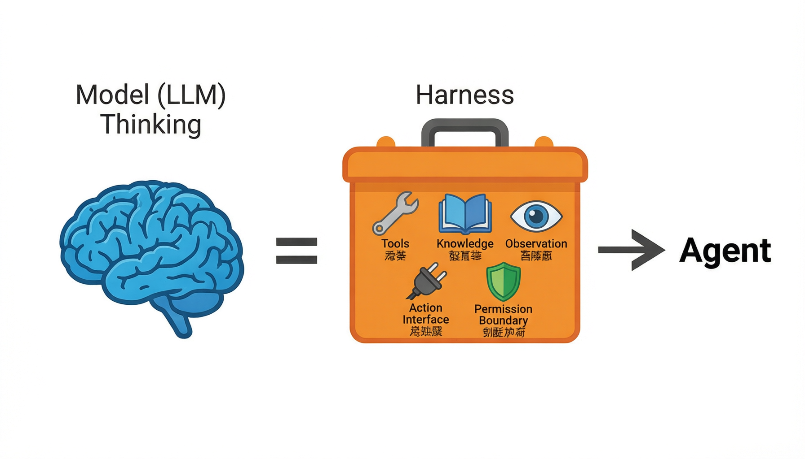
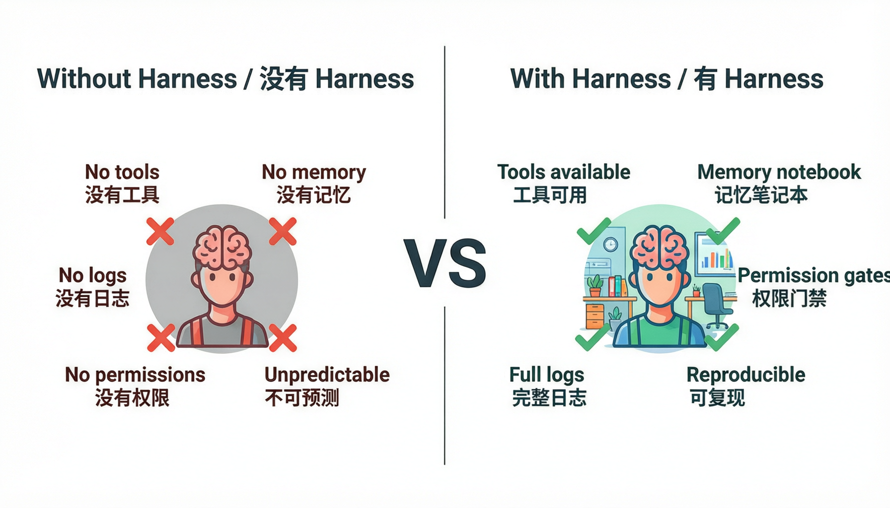
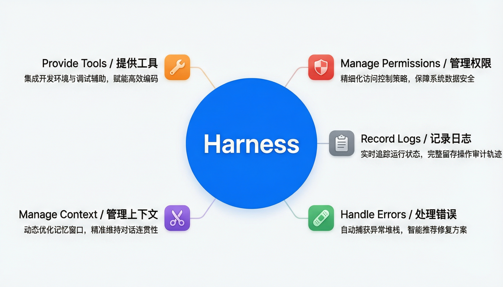

# 第 1 章：什么是 Harness

> **一句话概括**：Agent = Model（大脑）+ Harness（工作环境）。模型负责想，Harness 负责让想法变成行动。



---

## 通俗理解

想象你招了一个很聪明的实习生。他有脑子（LLM），能理解你的指令，也能思考方案。

但如果你只给他一个脑袋，不给他**办公桌、电脑、电话、文件柜**——他什么也做不了。

**Harness 就是这套办公环境**：

| 办公环境 | Harness 中的对应 |
|---------|-----------------|
| 办公桌上的电脑 | **工具**（执行命令、读写文件） |
| 文件柜里的参考资料 | **知识**（系统提示词、文档） |
| 工牌和门禁卡 | **权限**（哪些事能做、哪些不能） |
| 工作日志 | **追踪**（记录每一步做了什么） |
| 你的反馈 | **循环**（根据结果调整下一步） |

有了这套环境，不管换了哪个实习生、做了多少次任务，你都能稳定地**观察、评估、复现**他的工作。

---

## 核心概念

### Agent（智能体）

一个能感知环境、做出决策、并采取行动的自主系统。

```
Agent = Model + Harness
         ↑         ↑
       大脑      工作环境
```

### Model（模型）

Agent 的"大脑"，负责理解输入、推理决策、生成回复。通常是 LLM（大语言模型），如 DeepSeek、GPT 等。

### Harness（运行框架）

Agent 的"工作环境"，负责：
- **提供工具**：让 Agent 能执行命令、读写文件、调用 API
- **管理权限**：控制 Agent 能做什么、不能做什么
- **记录过程**：保存每次运行的完整日志
- **处理错误**：出错了重试、降级、告警
- **管理上下文**：对话太长了要压缩、归档

### 关键洞察

> **智能（Agency）来自模型训练，不来自外部代码编排。**
>
> 代码（Harness）不替模型思考，而是让模型的思考**能落地执行**。

---

## 没有 Harness 会怎样？

直接把用户输入丢给模型，拿到回复就完事：

```python
# 没有 Harness 的"裸"调用
reply = llm.generate(user_input)
print(reply)
```

问题：
1. **不可控**：模型想做什么就做什么，没有边界
2. **不可观测**：不知道中间发生了什么
3. **不可复现**：同样的输入，每次结果可能不同
4. **不会用工具**：只能"说"，不能"做"
5. **没有记忆**：每次对话都从零开始

Harness 逐一解决这些问题。

### 有 Harness vs 没有 Harness



---

## Harness 的五大职责



| 职责 | 做什么 | 对应章节 |
|------|--------|---------|
| 提供工具 | 执行命令、读写文件、调用 API | ch03 |
| 管理权限 | 白名单放行、黑名单拒绝、不确定就问 | ch04 |
| 记录日志 | 保存每次运行的完整过程 | ch08 |
| 处理错误 | 重试、降级、告警 | ch07 |
| 管理上下文 | 对话太长时压缩、归档、总结 | ch08 |

---

## 本教程的路线图

接下来的 9 章，我们会一步步搭建一个完整的 Harness：

```
ch02  让 Agent 跑起来（最小循环）
ch03  给 Agent 配工具（工具调用）
ch04  给 Agent 设边界（权限系统）
ch05  让 Agent 有记忆（记忆系统）
ch06  让 Agent 能分身（子代理）
ch07  让 Agent 不怕错（错误处理）
ch08  让 Agent 管上下文（上下文管理）
ch09  把所有零件装起来（完整组装）
ch10  看看还能往哪走（后续方向）
```

每章只加一个新机制，前面的代码不会被推翻——只是在上面"加零件"。

---

## 小结与下一章

本章没有写任何代码，但你已经知道了最重要的公式：

```
Agent = Model + Harness
```

模型是司机，Harness 是车。这个教程教你**造车**。

下一章，我们做第一个零件——让 Agent 跑起来的最小循环。

---

## 检查点

- [ ] 能用"实习生 + 办公环境"的类比向别人解释 Harness
- [ ] 能说出 Harness 的 5 个职责（工具、权限、追踪、错误处理、上下文管理）
- [ ] 能解释为什么"智能来自模型，不来自代码"
- [ ] 知道本教程的 10 章路线图
