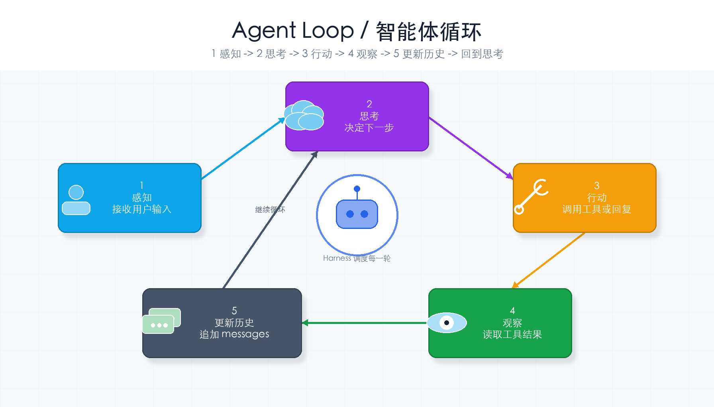
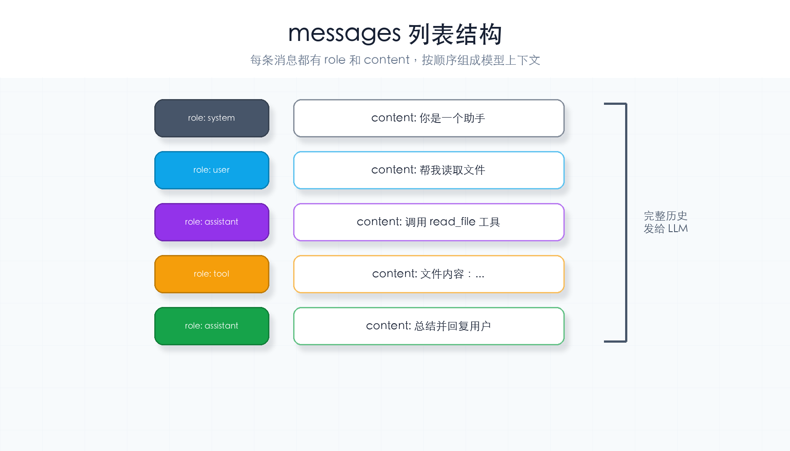
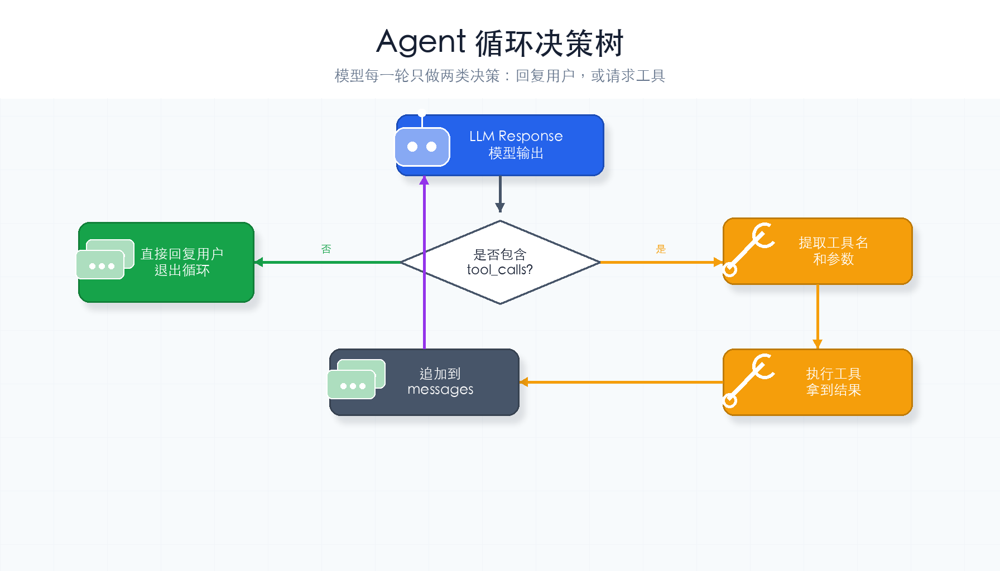

# 第 2 章：Agent 循环

> **一句话概括**：Agent 就是一个 `while True` 循环——说完了等你回复，有活就继续干，没活就下班。



---

## 本章你会学到什么

- Agent 为什么需要循环，而不是只调用一次模型
- `messages` 为什么要保存完整对话历史
- LLM 什么时候直接回复，什么时候要求调用工具
- 一个最小 Agent 程序的入口长什么样

本章的代码还不会真正执行工具。它先把循环框架搭好，下一章再把工具补进去。

---

## 通俗理解

想象两个人用对讲机聊天：

```
你：帮我查一下明天的天气（说话）
对方：好的，我去查（思考 + 行动）
对方：明天晴，25 度（回复）
你：好的，谢谢（对话结束）
```

**Agent 循环**就是这个过程的自动化版本：

1. **你说**（用户输入）
2. **Agent 想**（LLM 分析该做什么）
3. **Agent 做**（调用工具，或者回复你）
4. **如果还要做事** → 回到第 2 步
5. **如果做完了** → 把最终回复给你

关键是第 4 步：Agent 不是只做一轮，而是**持续循环**，直到它认为任务完成了。

---

## 先记住这 3 件事

1. **循环的每一轮都问一次 LLM**：下一步是回复用户，还是调用工具？
2. **messages 是 Agent 的短期记忆**：没有它，LLM 不知道上一轮发生了什么。
3. **退出条件是“不再调用工具”**：LLM 直接给最终回答时，循环结束。

可以把 `while True` 理解成“工作台一直开着”。只要 LLM 还说“我需要做一步”，Harness 就继续配合。

---

## 核心概念

### Agent Loop（智能体循环）

Agent 的核心运行模式：反复调用 LLM，直到 LLM 不再请求工具调用。

```
while True:
    调用 LLM
    如果 LLM 要调用工具 → 执行工具，继续循环
    如果 LLM 直接回复   → 返回回复，退出循环
```

### messages（对话历史）

一个列表，保存了所有来回的消息。每次调用 LLM 时，把完整的消息列表传过去，让 LLM 知道之前发生了什么。



每条消息都有 `role`（角色）和 `content`（内容）。整个列表每次都会完整发给 LLM。

---

## 本章新增机制

相比普通聊天调用，本章只新增一个核心结构：

```python
while True:
    response = call_llm(messages)
    if 没有工具调用:
        return 最终回复
    执行工具并把结果加入 messages
```

现在还没有真实工具，所以“执行工具”只是预留位置。这个预留位置很重要：后面所有章节都是往这里加能力。

---

## 完整代码

```python
import os, json
from openai import OpenAI   # DeepSeek 兼容 OpenAI SDK，所以用 openai 包
from dotenv import load_dotenv

# 从 .env 文件加载环境变量
load_dotenv()

# ---- DeepSeek API 客户端初始化 ----
# DeepSeek 兼容 OpenAI 协议，只需把 base_url 指向 DeepSeek 的服务地址
deepseek_client = OpenAI(
    api_key=os.getenv("DEEPSEEK_API_KEY"),   # 从环境变量读取 API Key
    base_url="https://api.deepseek.com",      # DeepSeek API 地址
)
MODEL = os.getenv("MODEL_ID", "deepseek-chat")  # 默认模型：DeepSeek-V3

# ---- 系统提示词：定义 Agent 的角色 ----
SYSTEM = "你是一个编程助手，可以帮用户执行命令和读取文件。"


def agent_loop(messages: list):
    """
    核心循环：LLM 调用工具就继续，不调用就退出。

    参数:
        messages: 对话历史列表，会被原地修改（追加新消息）
    """
    while True:
        # 第一步：把对话历史发给 DeepSeek API
        response = deepseek_client.chat.completions.create(
            model=MODEL,
            messages=[{"role": "system", "content": SYSTEM}] + messages,
            # 本章还没有工具，所以不传 tools 参数
        )

        # 第二步：取出 LLM 的回复
        msg = response.choices[0].message

        # 第三步：检查 LLM 是否要调用工具
        # （本章没有工具，所以这个分支暂时不会走到）
        if not msg.tool_calls:
            # 没有工具调用 → 任务完成，输出回复
            print(f"\nAgent: {msg.content}")
            return

        # 第四步：有工具调用 → 执行工具，把结果追加到消息列表
        # （代码框架先放这里，下一章再实现具体的工具执行）
        messages.append(msg)
        for tool_call in msg.tool_calls:
            output = f"工具 {tool_call.function.name} 的结果（下章实现）"
            messages.append({
                "role": "tool",
                "tool_call_id": tool_call.id,
                "content": output,
            })
        # 第五步：回到循环顶部，带着工具结果再次调用 LLM


if __name__ == "__main__":
    # 获取用户输入
    query = input("你: ").strip()
    # 初始化对话历史：只有用户的第一条消息
    messages = [{"role": "user", "content": query}]
    # 启动 Agent 循环
    agent_loop(messages)
```

---

## 运行它

把上面的代码复制到 `ch02-agent-loop.py` 文件中，然后：

```bash
cd harness-visual-tutorial
python ch02-agent-loop.py
```

试试输入：
- "你好" → Agent 会直接回复（没有工具调用）
- "帮我看看当前目录下有什么文件" → Agent 会想调用工具，但本章还没实现（下章补上）

### 运行后应该看到什么？

如果输入 `"你好"`，你应该看到类似：

```text
你: 你好

Agent: 你好！有什么我可以帮你的吗？
```

如果输入 `"帮我看看当前目录下有什么文件"`，模型可能会说它需要查看目录，也可能直接解释它现在不能执行工具。只要程序没有报错，就说明本章目标达成。

---

## 逐行解读

| 代码 | 作用 |
|------|------|
| `while True` | 核心循环：Agent 不停转，直到任务完成 |
| `deepseek_client.chat.completions.create()` | 把消息发给 LLM，获取回复 |
| `msg.tool_calls` | 检查 LLM 是否要调用工具（本章暂无工具） |
| `messages.append(msg)` | 把 LLM 的回复追加到对话历史 |
| `messages.append({"role": "tool", ...})` | 把工具执行结果追加到对话历史 |

### 为什么每轮都要传完整 messages？

LLM API 本身是“无状态”的。你每调用一次，它都只知道这次请求里带了什么。

所以 Harness 必须每次都把历史消息一起传过去：

```python
messages=[{"role": "system", "content": SYSTEM}] + messages
```

这行代码的意思是：

1. 先放系统规则，告诉模型它扮演什么角色
2. 再放用户和工具的历史消息
3. 让模型基于完整上下文决定下一步

---

## 循环决策流程图



---

## 动手试一试

1. **修改系统提示词**：把 `SYSTEM` 改成 "你是一个幽默的旅行助手"，观察回复风格变化
2. **多轮对话**：在 `agent_loop` 结束后再次调用它（把之前的 `messages` 传进去），实现多轮对话

---

## 常见卡点

| 现象 | 检查 |
|------|------|
| `ModuleNotFoundError: openai` | 先运行 `pip install openai python-dotenv` |
| `DEEPSEEK_API_KEY` 为空 | 检查 `.env` 文件是否在运行目录或项目根目录 |
| 程序一直等着不动 | 它可能正在等待 API 返回；先确认网络和 API Key |
| 输入查目录但没有执行 | 正常。本章还没传真实 `tools`，下一章才会执行 |

---

## 小结与下一章

本章你做了一个最小的 Agent 循环：`while True` + 调用 LLM + 检查工具调用。

现在 Agent 能"说话"了，但还不会"做事"。下一章我们给它配一个**工具箱**——让它能执行命令、读取文件。

---

## 检查点

- [ ] 能解释 `while True` 为什么不能去掉
- [ ] 能说出 `messages` 列表的作用
- [ ] 能区分"LLM 调用工具"和"LLM 直接回复"两种情况
- [ ] 代码能跑起来，输入"你好"能得到回复
