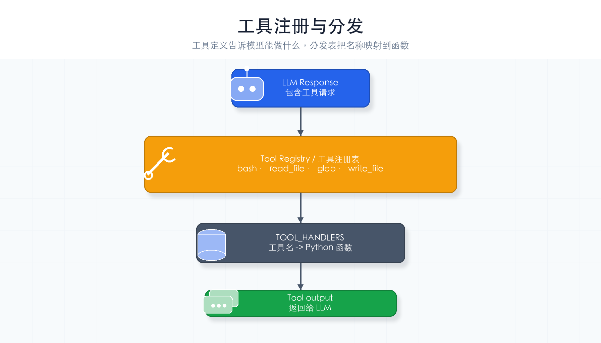
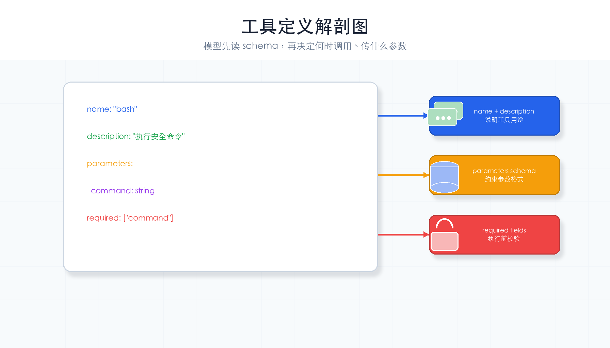
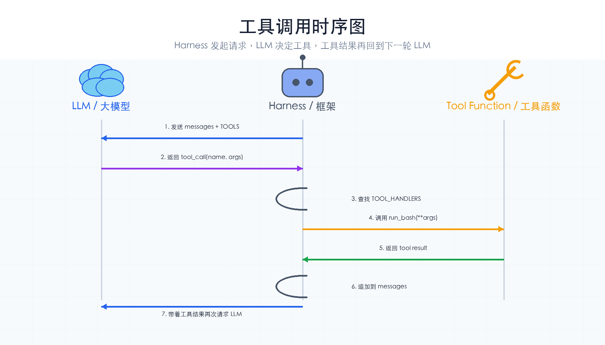

# 第 3 章：工具调用

> **一句话概括**：给 Agent 配工具箱——LLM 说要用哪个工具，Harness 就去执行，然后把结果告诉 LLM。



---

## 本章你会学到什么

- 怎样把 Python 函数包装成 LLM 可调用的工具
- `TOOLS` 列表为什么要写名称、描述和参数
- `TOOL_HANDLERS` 为什么是工具系统的分发表
- 一次工具调用从 LLM 请求到结果返回的完整过程

本章开始，Agent 不只是“回答”，还可以“行动”。

---

## 通俗理解

上一章 Agent 只能"说话"。现在给它配一个**工具箱**：

```
工具箱（Tool Registry）
├── bash       → 执行 Shell 命令
├── read_file  → 读取文件内容
```

使用流程就像你去工具箱里拿工具：

1. **LLM 说**："我需要用 `bash` 工具，执行 `ls -la` 命令"
2. **Harness 做**：从工具箱里找到 `bash`，执行命令，拿到结果
3. **Harness 说**："执行结果是：共 5 个文件..."
4. **LLM 想**：好，我知道了，继续下一步...

关键点：**LLM 自己决定用什么工具**。代码不替它选择，只负责执行。

---

## 先记住这 4 步

工具系统可以拆成 4 步：

1. **定义工具**：告诉 LLM 有哪些工具、每个工具要什么参数。
2. **实现工具**：用 Python 写真实执行逻辑。
3. **注册工具**：把工具名映射到 Python 函数。
4. **执行工具**：LLM 请求工具时，Harness 找到函数并调用。

后面你添加任何新工具，都按这 4 步来。

---

## 核心概念

### Tool（工具）

Agent 可以调用的外部能力。每个工具有：
- **名称**：`bash`、`read_file`
- **描述**：告诉 LLM 这个工具能做什么
- **参数**：LLM 需要传什么参数（JSON Schema）

### Tool Registry（工具注册表）

所有工具的"收纳盒"。按名字注册，按名字查找，按名字执行。

### Tool Dispatch（工具分发）

LLM 说"我要用 bash"→ 注册表找到 bash 的函数 → 执行 → 返回结果。

---

## 本章新增机制

和第 2 章相比，本章主要新增 3 个位置：

```python
TOOLS = [...]                 # 给 LLM 看的工具说明
TOOL_HANDLERS = {...}         # 给 Harness 用的函数映射
tools=TOOLS                   # 调用 LLM 时把工具说明传进去
```

注意：`TOOLS` 不是直接执行工具的代码。它只是“菜单”。真正执行的是 `TOOL_HANDLERS` 里的 Python 函数。

---

## 完整代码

```python
import os, json, subprocess
from pathlib import Path
from openai import OpenAI   # DeepSeek 兼容 OpenAI SDK，所以用 openai 包
from dotenv import load_dotenv

# 从 .env 文件加载环境变量
load_dotenv()

# ---- DeepSeek API 客户端初始化 ----
deepseek_client = OpenAI(
    api_key=os.getenv("DEEPSEEK_API_KEY"),   # 从环境变量读取 API Key
    base_url="https://api.deepseek.com",      # DeepSeek API 地址
)
MODEL = os.getenv("MODEL_ID", "deepseek-chat")  # 默认模型：DeepSeek-V3
WORKDIR = Path(".").resolve()                    # 工作目录的绝对路径

# ---- 系统提示词 ----
SYSTEM = f"你是一个编程助手，工作目录是 {WORKDIR}。你可以执行命令和读取文件。"


# ==========================================
# 第一步：定义工具列表（告诉 LLM 有哪些工具可用）
# ==========================================
# 每个工具包含：名称、描述、参数 Schema
# LLM 根据这些信息决定何时调用、传什么参数
TOOLS = [
    {
        "type": "function",
        "function": {
            "name": "bash",                           # 工具名称
            "description": "在 Shell 中执行命令",      # 描述（LLM 看的）
            "parameters": {
                "type": "object",
                "properties": {
                    "command": {                      # 参数定义
                        "type": "string",
                        "description": "要执行的 Shell 命令",
                    }
                },
                "required": ["command"],               # 必填参数
            },
        },
    },
    {
        "type": "function",
        "function": {
            "name": "read_file",
            "description": "读取指定文件的内容",
            "parameters": {
                "type": "object",
                "properties": {
                    "path": {
                        "type": "string",
                        "description": "文件路径（相对于工作目录）",
                    }
                },
                "required": ["path"],
            },
        },
    },
]
```

### 工具定义长什么样？

每个工具定义由三部分组成：**名称+描述**（告诉 LLM 能做什么）、**参数 Schema**（告诉 LLM 传什么参数）、**必填字段**（校验用）。



```python
# ==========================================
# 第二步：实现工具函数（每个工具对应一个 Python 函数）
# ==========================================
def run_bash(command: str) -> str:
    """执行 Shell 命令，返回标准输出。"""
    result = subprocess.run(
        command,
        shell=True,
        capture_output=True,   # 捕获 stdout 和 stderr
        text=True,             # 返回字符串而非 bytes
        timeout=30,            # 超时 30 秒，防止卡死
    )
    return result.stdout or "(无输出)"


def run_read_file(path: str) -> str:
    """读取文件内容。"""
    file_path = WORKDIR / path
    if not file_path.exists():
        return f"错误：文件 {path} 不存在"
    return file_path.read_text(encoding="utf-8")


# ==========================================
# 第三步：工具分发表（工具名 -> 处理函数的映射）
# ==========================================
# 这是工具系统的核心：按名字查找对应的处理函数
TOOL_HANDLERS = {
    "bash": run_bash,
    "read_file": run_read_file,
}


# ==========================================
# 第四步：Agent 循环（整合工具调用）
# ==========================================
def agent_loop(messages: list):
    """
    核心循环：LLM 调用工具就继续，不调用就退出。
    相比 ch02，新增了 tools 参数和工具执行逻辑。
    """
    while True:
        # 调用 DeepSeek API（传入工具列表！这是和 ch02 的唯一区别）
        response = deepseek_client.chat.completions.create(
            model=MODEL,
            messages=[{"role": "system", "content": SYSTEM}] + messages,
            tools=TOOLS,              # ★ 新增：告诉 LLM 有哪些工具可用
        )

        msg = response.choices[0].message

        # 没有工具调用 → 任务完成
        if not msg.tool_calls:
            print(f"\nAgent: {msg.content}")
            return

        # 有工具调用 → 逐个执行
        messages.append(msg)  # 先把 LLM 的回复（含调用请求）加入历史
        for tool_call in msg.tool_calls:
            # 解析 LLM 传来的参数（JSON 字符串 → Python 字典）
            args = json.loads(tool_call.function.arguments)
            # 从分发表中找到对应的处理函数，执行它
            handler = TOOL_HANDLERS[tool_call.function.name]
            output = handler(**args)
            # 把工具执行结果追加到对话历史
            messages.append({
                "role": "tool",                   # 角色标记为 "tool"
                "tool_call_id": tool_call.id,     # 与调用请求配对
                "content": output,                # 工具返回的结果
            })
        # 回到循环顶部，带着工具结果再次调用 LLM


if __name__ == "__main__":
    query = input("你: ").strip()
    messages = [{"role": "user", "content": query}]
    agent_loop(messages)
```

---

## 运行它

把上面的代码复制到 `ch03-tool-use.py` 文件中，然后：

```bash
cd harness-visual-tutorial
python ch03-tool-use.py
```

试试输入：
- "帮我看看当前目录下有什么文件" → Agent 会调用 `bash` 工具执行 `ls`
- "读取 ch01-what-is-harness.md 的前 10 行" → Agent 会调用 `read_file`

---

## 工具调用三步流程

```
LLM 的请求                    Harness 做的事                     结果
─────────                   ──────────────                    ────
"我要用 bash"        →     从 TOOL_HANDLERS 找到 run_bash  →   执行命令
"参数是 ls -la"      →     传参调用 run_bash("ls -la")     →   拿到输出
（无需操作）          →     把结果追加到 messages           →   LLM 看到结果
```

### 完整调用时序

下面这张图展示了 LLM、Harness、工具函数三者之间的完整交互时序：



### 一个最小例子

用户输入：

```text
帮我看看当前目录下有什么文件
```

LLM 可能返回一个工具调用请求：

```json
{
  "name": "bash",
  "arguments": "{\"command\":\"ls\"}"
}
```

Harness 做 3 件事：

1. 用 `json.loads()` 把参数字符串变成字典：`{"command": "ls"}`
2. 用 `TOOL_HANDLERS["bash"]` 找到 `run_bash`
3. 执行 `run_bash(command="ls")`，再把输出作为 `tool` 消息追加回 `messages`

LLM 下一轮看到工具结果后，才会整理成自然语言回复给用户。

---

## 动手试一试

1. **加一个工具**：添加 `glob` 工具（按模式搜索文件），在 TOOLS 列表和 TOOL_HANDLERS 中分别注册
2. **观察工具调用**：在 `for tool_call in msg.tool_calls` 循环中加一行 `print(f"调用工具: {tool_call.function.name}({args})")`，看看 LLM 每次做了什么

---

## 常见卡点

| 现象 | 原因与处理 |
|------|------------|
| LLM 不调用工具 | 工具描述可能不够清楚，或问题不需要工具。试试“请用 bash 执行 ls”。 |
| `json.loads` 报错 | 模型返回的参数不是合法 JSON。真实系统要加错误处理，第 7 章会讲。 |
| `KeyError: xxx` | LLM 请求了未注册工具。检查 `TOOLS` 和 `TOOL_HANDLERS` 名称是否一致。 |
| 命令没有输出 | 很多命令成功时本来就无输出，本章用 `(无输出)` 兜底。 |

---

## 小结与下一章

本章你给 Agent 配了工具箱：定义了工具列表（TOOLS）、实现了工具函数、建立了分发表（TOOL_HANDLERS）。

核心模式只有三步：**定义 → 实现 → 分发**。以后加新工具，只需要在这三步中各加一行。

但现在的 Agent 什么命令都敢执行——包括 `rm -rf /`。下一章我们给它设**边界**：权限系统。

---

## 检查点

- [ ] 能说出工具系统的三步：定义、实现、分发
- [ ] 理解 `tools=TOOLS` 参数的作用
- [ ] 理解 `TOOL_HANDLERS` 字典的作用
- [ ] 代码能跑起来，输入"ls"能执行命令并返回结果
