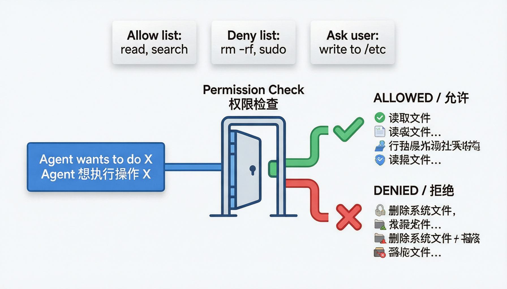
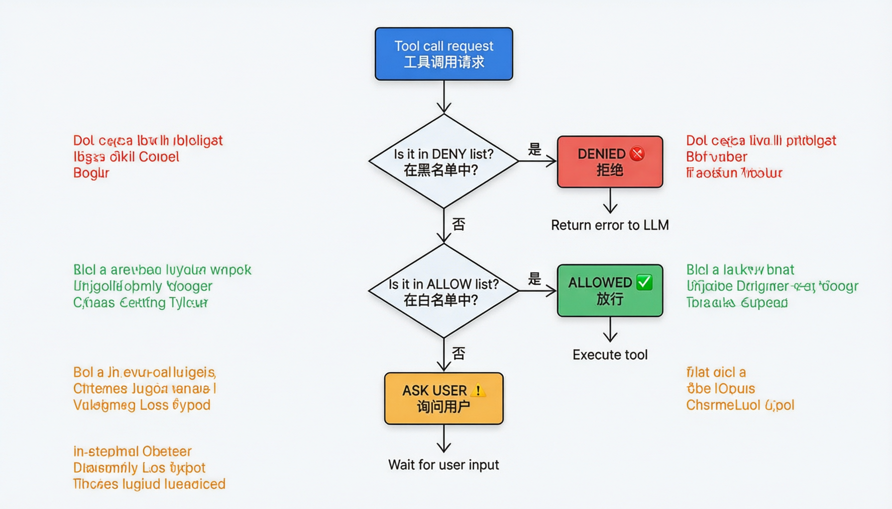
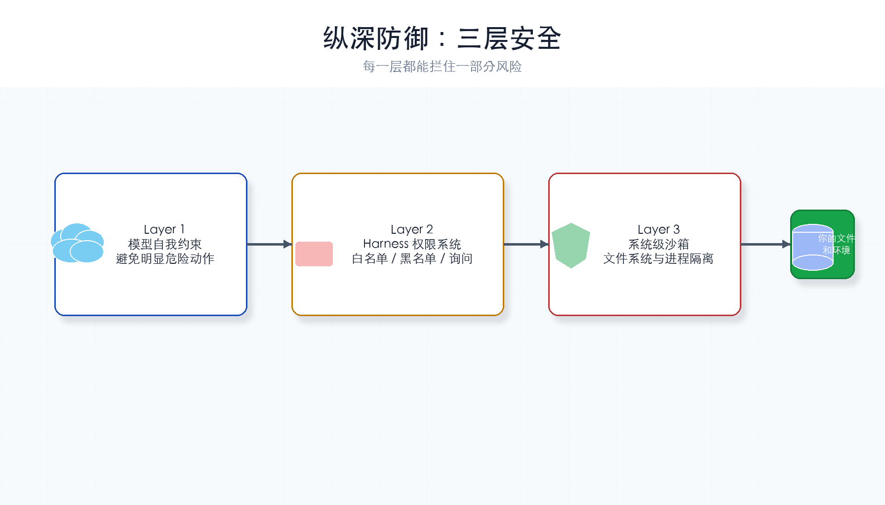

# 第 4 章：权限系统

> **一句话概括**：给 Agent 设门禁——有些操作直接放行，有些直接拒绝，有些要先问你。



---

## 本章你会学到什么

- 为什么工具调用必须先过权限检查
- `allow` / `deny` / `ask` 三种结果分别适合什么情况
- 白名单和黑名单在代码里怎么落地
- 沙箱和权限系统有什么区别，为什么二者要一起用
- 为什么教学版权限系统不能直接当生产安全系统

第 3 章让 Agent 能做事。本章的目标是：让它**不要什么都做**。

---

## 通俗理解

你的 Agent 现在能执行任何命令了——包括 `rm -rf /`。这就像一个实习生拿着公司所有门禁卡的万能钥匙。

权限系统就是**门禁**：

| 操作类型 | 权限级别 | 类比 |
|---------|---------|------|
| 读文件、`ls`、`cat` | 自动放行 | 实习生可以自由进出的区域 |
| 写文件、执行脚本 | 需要确认 | 需要刷卡 + 密码的房间 |
| `rm -rf`、`sudo`、网络请求 | 自动拒绝 | 绝对不能进的机房 |

---

## 先记住这 3 件事

1. **权限检查发生在工具执行前**：先判断，再执行。
2. **拒绝也要告诉 LLM**：让模型知道这条路走不通，可以换方案。
3. **不确定就问用户**：不要让 Harness 自己猜高风险操作。

权限系统不是为了让 Agent 什么都不能做，而是为了让它在清楚边界内做事。

---

## 核心概念

### Permission Check（权限检查）

在执行工具**之前**，先检查这个操作是否被允许。三种结果：

- **ALLOW**：安全操作，直接执行
- **DENY**：危险操作，拒绝并告诉 LLM
- **ASK**：不确定，先问用户

### Allow/Deny List（白名单/黑名单）

- 白名单：已知安全的操作模式
- 黑名单：已知危险的操作模式
- 不在名单中的：走 ASK 流程

### Sandbox（沙箱）

沙箱是一个**受限制的运行环境**。即使某个命令真的开始执行了，它也只能在沙箱允许的范围内活动。

可以把权限系统和沙箱理解成两道门：

| 机制 | 发生位置 | 解决什么问题 |
|------|----------|--------------|
| 权限检查 | 工具执行前 | 判断“这件事该不该做” |
| 沙箱 | 工具执行时 | 限制“这件事最多能影响哪里” |

举个例子：Agent 想执行 `cat README.md`。权限系统判断这是读文件操作，可以放行；沙箱再限制它只能读工作目录允许访问的文件，不能随便读系统敏感路径。

再比如：Agent 想执行一个会写文件的脚本。权限系统可能先要求用户确认；即使用户确认了，沙箱仍然可以把写入范围限制在项目目录里，避免影响整个电脑。

所以沙箱不是权限系统的替代品。权限系统负责**决策**，沙箱负责**隔离影响范围**。

---

## 本章新增机制

本章只新增一个关键函数：

```python
permission = check_permission(tool_call.function.name, args)
```

执行工具前，先拿工具名和参数做判断：

| 返回值 | Harness 行为 | 例子 |
|--------|--------------|------|
| `allow` | 直接执行 | `ls`、`cat README.md` |
| `deny` | 不执行，把拒绝信息发回 LLM | `rm -rf /`、`sudo ...` |
| `ask` | 暂停并询问用户 | `python script.py`、未知命令 |

这一步放错位置就没有意义。如果工具已经执行完了，再检查权限就太晚了。

---

## 完整代码

```python
import os, json, subprocess
from pathlib import Path
from openai import OpenAI   # DeepSeek 兼容 OpenAI SDK，所以用 openai 包
from dotenv import load_dotenv

load_dotenv()

deepseek_client = OpenAI(
    api_key=os.getenv("DEEPSEEK_API_KEY"),
    base_url="https://api.deepseek.com",
)
MODEL = os.getenv("MODEL_ID", "deepseek-chat")
WORKDIR = Path(".").resolve()

SYSTEM = f"你是一个编程助手，工作目录是 {WORKDIR}。你可以执行命令和读取文件。"

# ---- 工具定义（同 ch03）----
TOOLS = [
    {"type": "function", "function": {"name": "bash", "description": "执行 Shell 命令",
        "parameters": {"type": "object", "properties": {"command": {"type": "string"}}, "required": ["command"]}}},
    {"type": "function", "function": {"name": "read_file", "description": "读取文件",
        "parameters": {"type": "object", "properties": {"path": {"type": "string"}}, "required": ["path"]}}},
]

# ---- 工具实现（同 ch03）----
def run_bash(command: str) -> str:
    result = subprocess.run(command, shell=True, capture_output=True, text=True, timeout=30)
    return result.stdout or "(无输出)"

def run_read_file(path: str) -> str:
    file_path = WORKDIR / path
    if not file_path.exists():
        return f"错误：文件 {path} 不存在"
    return file_path.read_text(encoding="utf-8")

TOOL_HANDLERS = {"bash": run_bash, "read_file": run_read_file}


# ==========================================
# ★ 本章新增：权限系统
# ==========================================

# 危险命令模式（黑名单）：匹配到就拒绝
DENY_PATTERNS = [
    "rm -rf",       # 递归删除
    "sudo",         # 提权
    "chmod 777",    # 开放所有权限
    "curl.*|.*sh",  # 下载并执行脚本
    "mkfs",         # 格式化磁盘
    ":(){:|:&};:", # fork 炸弹
]

# 安全命令模式（白名单）：匹配到就放行
ALLOW_PATTERNS = [
    "ls",           # 列出文件
    "cat",          # 查看文件
    "head",         # 查看文件开头
    "tail",         # 查看文件末尾
    "wc",           # 统计字数/行数
    "find",         # 查找文件
    "grep",         # 搜索内容
    "echo",         # 输出文本
    "date",         # 查看日期
    "pwd",          # 当前目录
]


def check_permission(tool_name: str, args: dict) -> str:
    """
    检查操作是否被允许。

    返回:
        "allow" - 允许执行
        "deny"  - 拒绝执行
        "ask"   - 需要用户确认
    """
    if tool_name == "read_file":
        return "allow"  # 读文件总是安全的

    if tool_name == "bash":
        command = args.get("command", "")

        # 检查黑名单：包含危险模式就拒绝
        for pattern in DENY_PATTERNS:
            if pattern in command:
                return "deny"

        # 检查白名单：只包含安全命令就放行
        first_word = command.split()[0] if command.split() else ""
        if first_word in ALLOW_PATTERNS:
            return "allow"

        # 既不在白名单也不在黑名单：需要确认
        return "ask"

    return "ask"  # 未知工具默认需要确认


# ==========================================
# Agent 循环（整合权限检查）
# ==========================================
def agent_loop(messages: list):
    while True:
        response = deepseek_client.chat.completions.create(
            model=MODEL,
            messages=[{"role": "system", "content": SYSTEM}] + messages,
            tools=TOOLS,
        )
        msg = response.choices[0].message

        if not msg.tool_calls:
            print(f"\nAgent: {msg.content}")
            return

        messages.append(msg)
        for tool_call in msg.tool_calls:
            args = json.loads(tool_call.function.arguments)

            # ★ 新增：执行前先检查权限
            permission = check_permission(tool_call.function.name, args)

            if permission == "deny":
                # 拒绝：告诉 LLM 这个操作不被允许
                output = f"[权限拒绝] 操作 '{args.get('command', '')}' 包含危险命令，已被阻止"
                print(f"  ⛔ 拒绝: {output}")

            elif permission == "ask":
                # 需要确认：问用户
                cmd = args.get("command", "")
                user_ok = input(f"  ⚠️  是否允许执行 '{cmd}'？(y/n): ").strip().lower()
                if user_ok == "y":
                    output = TOOL_HANDLERS[tool_call.function.name](**args)
                else:
                    output = "[用户拒绝] 操作被用户取消"

            else:
                # 放行：直接执行
                output = TOOL_HANDLERS[tool_call.function.name](**args)
                print(f"  ✅ 执行: {tool_call.function.name}({args})")

            messages.append({
                "role": "tool",
                "tool_call_id": tool_call.id,
                "content": output,
            })


if __name__ == "__main__":
    query = input("你: ").strip()
    messages = [{"role": "user", "content": query}]
    agent_loop(messages)
```

---

## 权限检查流程图

每次工具调用都会经过权限检查，下面是完整的决策流程：



### 纵深防御：三层安全

权限系统不是唯一的安全层。完整的防护是**多层叠加**的：



| 层级 | 防护机制 | 作用 |
|------|---------|------|
| 第 1 层 | LLM 自身约束 | 模型训练时学到的安全行为 |
| 第 2 层 | Harness 权限系统 | 代码级的 allow/deny 检查（本章） |
| 第 3 层 | 操作系统权限 | 文件权限、沙箱隔离等系统级保护 |

### 沙箱通常限制什么？

不同 Harness 的沙箱能力不完全一样，但常见限制包括：

| 限制项 | 作用 |
|--------|------|
| 文件系统范围 | 只能读写指定目录，避免误碰系统文件或其他项目 |
| 写入权限 | 只允许写工作区，其他目录只读或禁止访问 |
| 网络访问 | 禁止或审批外部网络请求，避免泄露信息或下载未知脚本 |
| 进程能力 | 限制后台进程、系统服务、提权命令等高风险行为 |
| 执行超时 | 防止命令卡死、无限循环或长时间占用资源 |

沙箱的价值在于：**即使权限规则漏掉了某个危险情况，系统级边界仍然能兜底**。

但也要注意，沙箱不是“绝对安全”。如果沙箱配置太宽，Agent 仍然可能造成破坏；如果配置太窄，Agent 又会做不了正常工作。生产系统通常会按任务类型选择不同沙箱：读代码用只读沙箱，改文件用工作区写入沙箱，跑测试再单独开放必要的临时目录。

---

## 教学版和生产版的区别

本章用字符串匹配来演示权限思想，简单直观，但不够严谨。

生产系统通常还会做这些事：

- 用结构化命令解析，而不是只用 `pattern in command`
- 限制工作目录，禁止访问目录外文件
- 使用沙箱或容器运行命令
- 记录每次权限判断，方便审计
- 对网络、文件写入、进程启动分别设置规则

所以本章重点不是“这份黑名单有多完整”，而是理解权限门禁应该放在工具执行之前。

---

## 运行它

把上面的代码复制到 `ch04-permission.py` 文件中，然后：

```bash
cd harness-visual-tutorial
python ch04-permission.py
```

试试输入：
- "帮我列出当前目录的文件" → `ls` 在白名单，自动放行
- "删除所有 .log 文件" → 不在白名单，会问你是否允许
- "执行 rm -rf /" → 在黑名单，自动拒绝

### 运行后应该看到什么？

当命令被放行时，终端会出现类似：

```text
✅ 执行: bash({'command': 'ls'})
```

当命令需要确认时，你会看到 `(y/n)` 输入提示。输入 `n` 后，工具不会执行，LLM 会收到“用户拒绝”的结果。

---

## 动手试一试

1. **扩展黑名单**：添加 `pip uninstall` 到 DENY_PATTERNS
2. **观察权限日志**：注意终端输出的 ✅ / ⚠️ / ⛔ 标记，理解三种权限级别

---

## 常见卡点

| 现象 | 检查 |
|------|------|
| 危险命令没有被拒绝 | 检查字符串是否真的包含 `DENY_PATTERNS` 里的片段 |
| 安全命令被要求确认 | 检查命令第一个单词是否在 `ALLOW_PATTERNS` |
| 用户输入 `Y` 但没执行 | 代码用了 `.lower()`，`Y` 应该可以；检查是否输入了空格或其他字符 |
| `read_file` 总是放行 | 这是教学简化。生产系统仍要检查路径是否越界 |

---

## 小结与下一章

本章你给 Agent 加了门禁：黑名单拒绝危险操作，白名单放行安全操作，不确定的先问用户。

Agent 现在能安全地工作了。但它每次启动都"失忆"——不记得上次你告诉过它什么。下一章我们给它一本**笔记本**：记忆系统。

---

## 检查点

- [ ] 能解释三种权限级别：allow / deny / ask
- [ ] 理解权限检查发生在工具执行**之前**
- [ ] 代码能跑起来，安全命令自动放行，危险命令被拒绝
