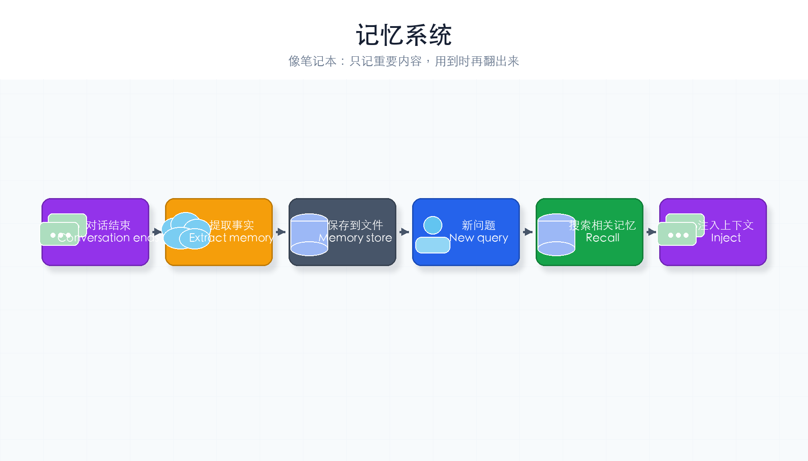
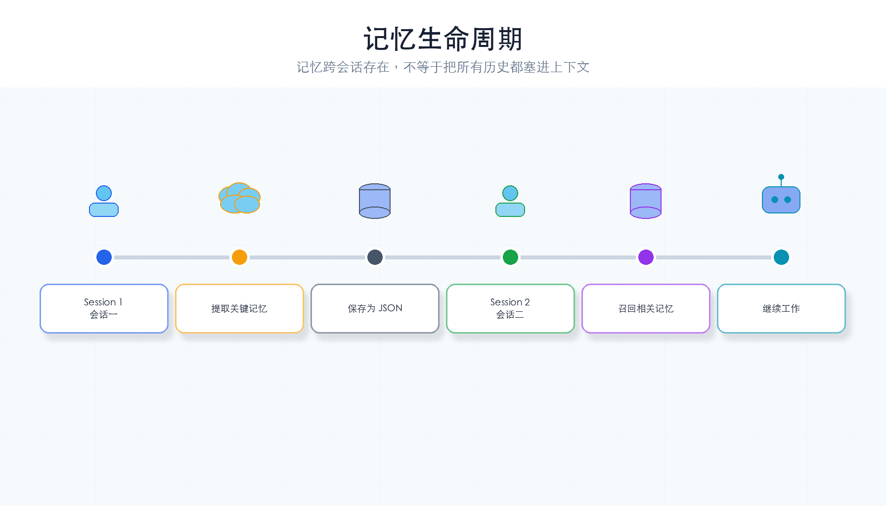
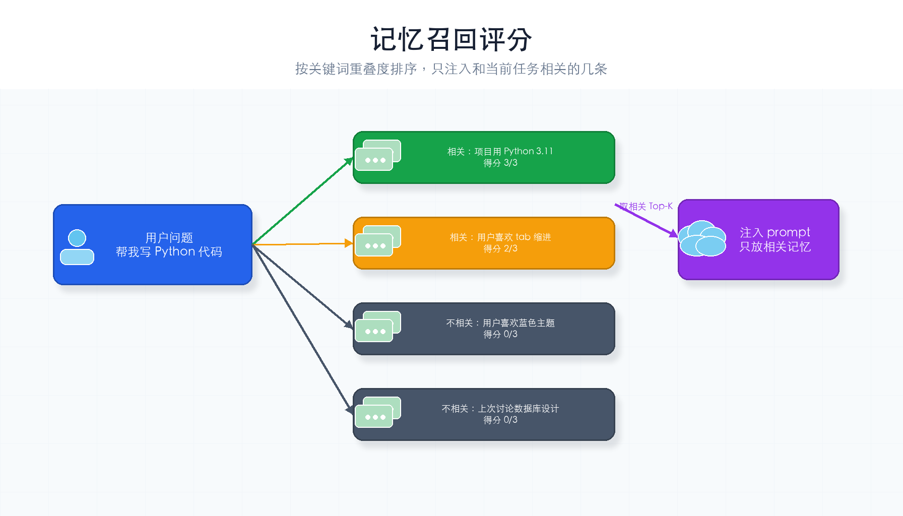

# 第 5 章：记忆系统

> **一句话概括**：给 Agent 一本笔记本——会话结束时记下重要的事，下次启动时翻开看看有没有相关内容。



---

## 本章你会学到什么

- 为什么 LLM API 本身没有跨会话记忆
- 记忆系统为什么要分成“写入”和“召回”
- `.agent_memory.json` 里保存什么
- 怎样把相关记忆注入系统提示词

第 2 章的 `messages` 是短期记忆，只活在一次运行里。本章的记忆会写入文件，下次运行还能用。

---

## 通俗理解

现在的 Agent 每次启动都从零开始，不记得你上次说过什么。就像一个每天换的新实习生——你得反复告诉他同样的事情。

记忆系统就是一本**笔记本**：

| 笔记本操作 | 记忆系统对应 |
|-----------|------------|
| 写下重要信息 | **写入**（会话结束时自动提取） |
| 翻开找相关内容 | **召回**（每次调用前搜索） |
| 撕掉过时内容 | **删除**（手动清理旧记忆） |

关键原则：**只记重要的，不记流水账**。你不会把"今天中午吃了什么"写进笔记本，但会记下"老板喜欢简洁的报告风格"。

---

## 先记住这 3 件事

1. **写入发生在会话结束时**：从刚才的对话里提取值得长期保存的信息。
2. **召回发生在调用 LLM 前**：先找相关记忆，再放进系统提示词。
3. **不是所有记忆都塞进去**：只放当前任务相关的几条，避免干扰模型。

记忆系统的价值不是“存得越多越好”，而是“用的时候能找到对的”。

---

## 核心概念

### Memory Store（记忆存储）

一个 JSON 文件，保存所有记忆条目。每条记忆包含：
- **key**：记忆的关键词/标签
- **content**：记忆的具体内容
- **created_at**：创建时间

### Write（写入）

会话结束时，让 LLM 从对话中提取"值得记住的信息"，保存到记忆文件。

### Recall（召回）

每次 Agent 循环开始前，搜索与当前用户请求相关的记忆，注入到系统提示词中。

### 为什么需要召回？

**根本原因：LLM 没有记忆。**

每次调用 LLM，它都是从零开始——不记得你上次说过什么，不记得你的偏好，不记得项目的背景。

那为什么不把所有记忆都塞给它？因为：

| 方案 | 问题 |
|------|------|
| 不注入记忆 | LLM 像个失忆的人，反复问同样的问题 |
| 注入全部记忆 | 记忆太多，浪费 token，LLM 反而被无关信息干扰 |
| **只注入相关记忆** | **刚好够用，不浪费，不干扰** ← 召回做的事 |

**召回 = 从所有记忆中，挑出和当前任务相关的几条，喂给 LLM。**

举个例子：

```
你存了 50 条记忆，但用户问的是"帮我写 Python 代码"
  ↓
召回搜索 → 找到相关记忆：
  ✅ "用户喜欢 tab 缩进"
  ✅ "项目用 Python 3.11"
  ❌ "用户喜欢蓝色主题"（不相关，不注入）
  ❌ "上次讨论了数据库设计"（不相关，不注入）
  ↓
只把 2 条相关记忆注入提示词 → LLM 知道该用 tab 缩进和 Python 3.11
```

**一句话总结**：写入是"记下来"，召回是"翻到对的那一页"。没有召回，笔记本就白写了。

### 记忆的生命周期

记忆跨越会话存活——写入一次，多次召回：



### 召回是怎么工作的？

召回时，系统会计算每条记忆与当前请求的**相关性得分**，只取最相关的几条：



---

## 本章新增机制

记忆系统由 5 个函数组成：

| 函数 | 作用 |
|------|------|
| `load_memories()` | 从 `.agent_memory.json` 读取记忆列表 |
| `save_memories()` | 把记忆列表写回文件 |
| `add_memory()` | 新增一条记忆 |
| `recall_memories()` | 根据用户请求找相关记忆 |
| `extract_memories()` | 会话结束时让 LLM 提取可保存的信息 |

它们的执行顺序是：

```text
用户输入
  ↓
recall_memories(query)
  ↓
把相关记忆拼进 system prompt
  ↓
Agent 正常循环
  ↓
extract_memories(messages)
  ↓
保存到 .agent_memory.json
```

---

## 完整代码

```python
import os, json, subprocess
from pathlib import Path
from datetime import datetime
from openai import OpenAI   # DeepSeek 兼容 OpenAI SDK，所以用 openai 包
from dotenv import load_dotenv

load_dotenv()

deepseek_client = OpenAI(
    api_key=os.getenv("DEEPSEEK_API_KEY"),
    base_url="https://api.deepseek.com",
)
MODEL = os.getenv("MODEL_ID", "deepseek-chat")
WORKDIR = Path(".").resolve()

# ★ 本章新增：记忆文件路径
MEMORY_FILE = WORKDIR / ".agent_memory.json"

SYSTEM = f"你是一个编程助手，工作目录是 {WORKDIR}。你可以执行命令、读取文件，并拥有跨会话记忆。"

# ---- 工具定义（同 ch03/ch04，省略重复部分）----
TOOLS = [
    {"type": "function", "function": {"name": "bash", "description": "执行 Shell 命令",
        "parameters": {"type": "object", "properties": {"command": {"type": "string"}}, "required": ["command"]}}},
    {"type": "function", "function": {"name": "read_file", "description": "读取文件",
        "parameters": {"type": "object", "properties": {"path": {"type": "string"}}, "required": ["path"]}}},
]

def run_bash(command: str) -> str:
    result = subprocess.run(command, shell=True, capture_output=True, text=True, timeout=30)
    return result.stdout or "(无输出)"

def run_read_file(path: str) -> str:
    file_path = WORKDIR / path
    if not file_path.exists():
        return f"错误：文件 {path} 不存在"
    return file_path.read_text(encoding="utf-8")

TOOL_HANDLERS = {"bash": run_bash, "read_file": run_read_file}


# ==========================================
# ★ 本章新增：记忆系统
# ==========================================

def load_memories() -> list[dict]:
    """从文件加载所有记忆。"""
    if MEMORY_FILE.exists():
        return json.loads(MEMORY_FILE.read_text(encoding="utf-8"))
    return []


def save_memories(memories: list[dict]):
    """保存所有记忆到文件。"""
    MEMORY_FILE.write_text(
        json.dumps(memories, ensure_ascii=False, indent=2),
        encoding="utf-8",
    )


def add_memory(key: str, content: str):
    """添加一条新记忆。"""
    memories = load_memories()
    memories.append({
        "key": key,
        "content": content,
        "created_at": datetime.now().isoformat(),
    })
    save_memories(memories)


def recall_memories(query: str, max_items: int = 5) -> str:
    """
    搜索与用户请求相关的记忆。
    简单实现：关键词匹配。生产环境可以用向量搜索。
    """
    memories = load_memories()
    if not memories:
        return ""

    # 简单的相关性评分：关键词出现在记忆中的数量
    scored = []
    query_words = set(query.lower().split())
    for mem in memories:
        mem_text = (mem["key"] + " " + mem["content"]).lower()
        score = sum(1 for word in query_words if word in mem_text)
        if score > 0:
            scored.append((score, mem))

    # 按相关性排序，取前 max_items 条
    scored.sort(key=lambda x: x[0], reverse=True)
    relevant = [mem["content"] for _, mem in scored[:max_items]]

    if relevant:
        return "相关记忆:\n" + "\n".join(f"- {r}" for r in relevant)
    return ""


def extract_memories(messages: list):
    """
    会话结束时，让 LLM 从对话中提取值得记住的信息。
    """
    recent = messages[-6:]  # 只看最近几条对话
    response = deepseek_client.chat.completions.create(
        model=MODEL,
        messages=[{
            "role": "user",
            "content": (
                "从以下对话中提取值得长期记住的信息（用户偏好、重要决定、项目事实等）。\n"
                "返回 JSON 数组，每项有 key（关键词）和 content（内容）。\n"
                "如果没有值得记住的，返回空数组 []。\n\n"
                f"对话:\n{json.dumps(recent, ensure_ascii=False)}"
            ),
        }],
        max_tokens=500,
    )
    try:
        items = json.loads(response.choices[0].message.content)
        for item in items or []:
            add_memory(item["key"], item["content"])
            print(f"  📝 记住: {item['key']}")
    except (json.JSONDecodeError, KeyError):
        pass  # 解析失败就跳过


# ==========================================
# Agent 循环（整合记忆）
# ==========================================
def agent_loop(messages: list, user_query: str):
    while True:
        # ★ 新增：每次调用前召回相关记忆
        recalled = recall_memories(user_query)
        system = SYSTEM
        if recalled:
            system += f"\n\n{recalled}"  # 将记忆注入系统提示词

        response = deepseek_client.chat.completions.create(
            model=MODEL,
            messages=[{"role": "system", "content": system}] + messages,
            tools=TOOLS,
        )
        msg = response.choices[0].message

        if not msg.tool_calls:
            print(f"\nAgent: {msg.content}")
            # ★ 新增：会话结束时自动提取记忆
            extract_memories(messages)
            return

        messages.append(msg)
        for tool_call in msg.tool_calls:
            args = json.loads(tool_call.function.arguments)
            output = TOOL_HANDLERS[tool_call.function.name](**args)
            messages.append({
                "role": "tool",
                "tool_call_id": tool_call.id,
                "content": output,
            })


if __name__ == "__main__":
    query = input("你: ").strip()
    messages = [{"role": "user", "content": query}]
    agent_loop(messages, query)
```

---

## 运行它

把上面的代码复制到 `ch05-memory.py` 文件中，然后：

```bash
cd harness-visual-tutorial
python ch05-memory.py
```

试试这个流程：
1. 第一次运行："我喜欢用 tab 缩进，记住这个偏好"
2. 退出程序
3. 第二次运行："我上次说的缩进偏好是什么？" → Agent 应该能回忆起来

### `.agent_memory.json` 长什么样？

运行后，目录里可能出现：

```json
[
  {
    "key": "缩进偏好",
    "content": "用户喜欢用 tab 缩进。",
    "created_at": "2026-08-12T10:30:00"
  }
]
```

字段含义：

| 字段 | 含义 |
|------|------|
| `key` | 用来搜索的简短标签 |
| `content` | 真正注入给 LLM 的记忆内容 |
| `created_at` | 记录创建时间，方便以后清理旧记忆 |

---

## 动手试一试

1. **查看记忆文件**：运行后检查 `.agent_memory.json`，看看 LLM 提取了什么
2. **手动添加记忆**：直接编辑 JSON 文件，添加一条 `{"key": "测试", "content": "这是一条手动添加的记忆"}`，验证能被召回

---

## 常见卡点

| 现象 | 检查 |
|------|------|
| 第二次运行没有回忆起来 | 第一次结束时是否真的写入了 `.agent_memory.json` |
| 记忆文件为空 | LLM 可能判断没有值得保存的信息，试着明确说“请记住...” |
| JSON 解析失败但没报错 | `extract_memories` 里捕获异常并跳过了，教学版为了不中断主流程 |
| 召回了不相关记忆 | 本章用关键词匹配，比较粗糙；生产系统可用向量搜索 |

---

## 小结与下一章

本章你给 Agent 加了笔记本：会话结束时自动提取记忆，下次启动时自动召回相关内容。

现在 Agent 能记住跨会话的信息了。但复杂任务一个人做太慢——下一章我们让它能**派助手**：子代理。

---

## 检查点

- [ ] 能解释记忆系统的三个操作：写入、召回、删除
- [ ] 理解记忆注入的方式（注入系统提示词）
- [ ] 代码能跑起来，第二次运行时能回忆上次的信息
