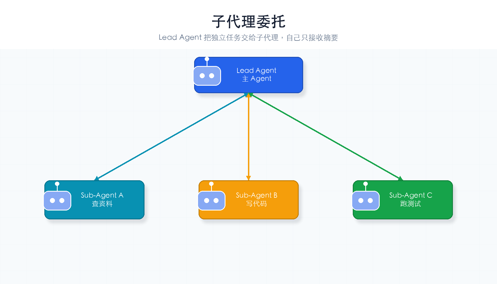
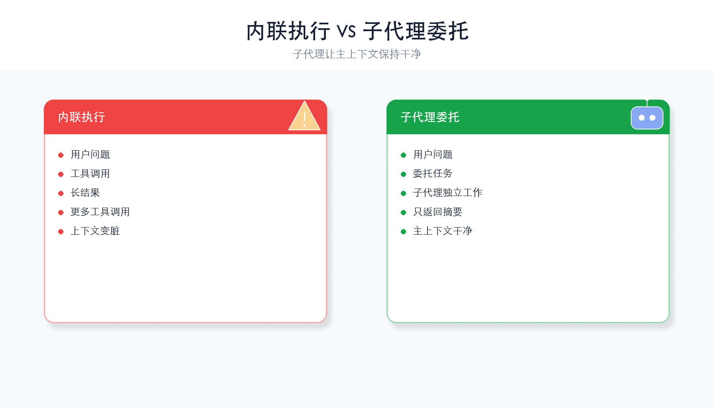
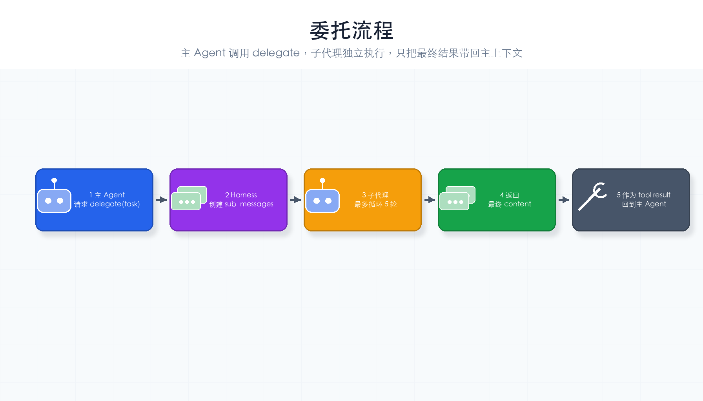

# 第 6 章：子代理

> **一句话概括**：复杂任务一个人做太慢？派一个"小助手"去做子任务，只把结论带回来。



---

## 本章你会学到什么

- 子代理和普通工具调用有什么区别
- 为什么子代理要有独立上下文
- 主 Agent 和子代理之间传递哪些信息
- 什么时候适合派子代理，什么时候不适合

第 3 章的工具通常做一个明确动作。子代理做的是一个“小任务”，它内部也可以思考和调用工具。

---

## 通俗理解

你是项目经理（主 Agent），手头一个大任务需要拆给三个人做：

```
你（Lead Agent）
 ├── 派小 A 去调研竞品      → 只带回调研报告
 ├── 派小 B 去写代码        → 只带回代码文件
 └── 派小 C 去跑测试        → 只带回测试结果
```

每个小助手（子代理）有自己的**独立上下文**——他们不需要知道你和其他人的对话细节，只需要拿到任务描述，做完后把结果交回来。

关键好处：
1. **并行**：三个子任务可以同时做（本章简化为串行）
2. **隔离**：子代理的对话不会污染主对话
3. **专注**：子代理只看到和自己任务相关的信息

---

## 先记住这 3 件事

1. **子代理也是一个 Agent Loop**：只是它的任务更小、上下文独立。
2. **主 Agent 只拿结果**：子代理过程里的大量中间消息不会塞回主对话。
3. **委托要有边界**：任务越清楚，子代理越容易返回可用结果。

如果任务只有一步，例如“读取 README”，直接用工具就够了。子代理适合“先查、再判断、最后总结”的小闭环。

---

## 核心概念

### Subagent（子代理）

一个独立的 Agent 实例，被主 Agent 委托执行子任务。它有：
- 独立的对话历史
- 独立的工具列表
- 只返回最终结果给主 Agent

### Delegation（委托）

主 Agent 把子任务的描述发给子代理，等待结果返回后，继续自己的工作。

### 为什么要用子代理？

对比内联执行和子代理委托的区别：



### 委托的完整流程

子代理从创建到返回结果，经历以下步骤：



---

## 本章新增机制

本章新增一个工具：

```python
delegate(task: str) -> str
```

它看起来是工具，但内部会启动一个小型 Agent：

```text
主 Agent 请求 delegate
  ↓
Harness 创建 sub_messages
  ↓
子代理最多循环 5 轮
  ↓
子代理返回最终文本
  ↓
主 Agent 把这段文本当作工具结果继续处理
```

主 Agent 传给子代理的是 `task`，子代理返回给主 Agent 的是最终 `content`。中间调用过哪些工具、读过哪些文件，默认不会全部返回。

---

## 完整代码

```python
import os, json, subprocess
from pathlib import Path
from openai import OpenAI   # DeepSeek 兼容 OpenAI SDK，所以用 openai 包
from dotenv import load_dotenv

load_dotenv()

deepseek_client = OpenAI(
    api_key=os.getenv("DEEPSEEK_API_KEY"),
    base_url="https://api.deepseek.com",
)
MODEL = os.getenv("MODEL_ID", "deepseek-chat")
WORKDIR = Path(".").resolve()

SYSTEM = f"你是一个编程助手，工作目录是 {WORKDIR}。你可以执行命令、读取文件，还可以派遣子代理处理子任务。"

# ---- 工具定义 ----
TOOLS = [
    {"type": "function", "function": {"name": "bash", "description": "执行 Shell 命令",
        "parameters": {"type": "object", "properties": {"command": {"type": "string"}}, "required": ["command"]}}},
    {"type": "function", "function": {"name": "read_file", "description": "读取文件",
        "parameters": {"type": "object", "properties": {"path": {"type": "string"}}, "required": ["path"]}}},
    # ★ 本章新增：派遣子代理的工具
    {"type": "function", "function": {"name": "delegate", "description": "派遣子代理处理一个独立的子任务",
        "parameters": {"type": "object", "properties": {
            "task": {"type": "string", "description": "子任务的详细描述"},
        }, "required": ["task"]}},
]

def run_bash(command: str) -> str:
    result = subprocess.run(command, shell=True, capture_output=True, text=True, timeout=30)
    return result.stdout or "(无输出)"

def run_read_file(path: str) -> str:
    file_path = WORKDIR / path
    if not file_path.exists():
        return f"错误：文件 {path} 不存在"
    return file_path.read_text(encoding="utf-8")


# ==========================================
# ★ 本章新增：子代理
# ==========================================
def run_delegate(task: str) -> str:
    """
    派遣子代理执行子任务。
    子代理有独立的对话历史，完成后只返回最终结果。
    """
    print(f"  🤖 派遣子代理: {task[:50]}...")

    # 子代理的消息列表（独立于主 Agent）
    sub_messages = [{"role": "user", "content": task}]
    sub_system = f"你是子代理，负责完成以下任务并返回简洁的结果。工作目录: {WORKDIR}"
    sub_tools = [
        {"type": "function", "function": {"name": "bash", "description": "执行命令",
            "parameters": {"type": "object", "properties": {"command": {"type": "string"}}, "required": ["command"]}}},
        {"type": "function", "function": {"name": "read_file", "description": "读取文件",
            "parameters": {"type": "object", "properties": {"path": {"type": "string"}}, "required": ["path"]}}},
    ]
    sub_handlers = {"bash": run_bash, "read_file": run_read_file}

    # 子代理的循环（和主 Agent 一样，但最多 5 轮防止失控）
    for _ in range(5):
        resp = deepseek_client.chat.completions.create(
            model=MODEL,
            messages=[{"role": "system", "content": sub_system}] + sub_messages,
            tools=sub_tools,
        )
        msg = resp.choices[0].message

        if not msg.tool_calls:
            # 子代理完成任务，返回结果给主 Agent
            print(f"  🤖 子代理完成")
            return msg.content

        sub_messages.append(msg)
        for tc in msg.tool_calls:
            args = json.loads(tc.function.arguments)
            output = sub_handlers[tc.function.name](**args)
            sub_messages.append({
                "role": "tool", "tool_call_id": tc.id, "content": output,
            })

    return "子代理超时（超过 5 轮未完成）"


TOOL_HANDLERS = {"bash": run_bash, "read_file": run_read_file, "delegate": run_delegate}


# ==========================================
# Agent 循环（整合子代理）
# ==========================================
def agent_loop(messages: list):
    while True:
        response = deepseek_client.chat.completions.create(
            model=MODEL,
            messages=[{"role": "system", "content": SYSTEM}] + messages,
            tools=TOOLS,
        )
        msg = response.choices[0].message

        if not msg.tool_calls:
            print(f"\nAgent: {msg.content}")
            return

        messages.append(msg)
        for tool_call in msg.tool_calls:
            args = json.loads(tool_call.function.arguments)
            output = TOOL_HANDLERS[tool_call.function.name](**args)
            messages.append({
                "role": "tool",
                "tool_call_id": tool_call.id,
                "content": output,
            })


if __name__ == "__main__":
    query = input("你: ").strip()
    messages = [{"role": "user", "content": query}]
    agent_loop(messages)
```

---

## 运行它

把上面的代码复制到 `ch06-subagent.py` 文件中，然后：

```bash
cd harness-visual-tutorial
python ch06-subagent.py
```

试试输入：
- "分析一下当前目录的项目结构，并给出改进建议" → 主 Agent 可能派遣子代理去分析，自己写总结

### 运行后应该看到什么？

如果 LLM 决定委托，你会看到类似日志：

```text
🤖 派遣子代理: 分析当前目录的项目结构...
🤖 子代理完成
```

如果没有看到这两行，也不一定是错误。LLM 可能判断任务简单，直接用 `bash` 或 `read_file` 完成了。

---

## 动手试一试

1. **观察子代理日志**：注意终端的 `🤖 派遣子代理` 和 `🤖 子代理完成` 输出
2. **限制子代理工具**：修改 `sub_tools`，只给子代理 `read_file`（不给 `bash`），看看效果

---

## 什么时候不要用子代理？

| 情况 | 更简单的做法 |
|------|--------------|
| 只需要执行一个命令 | 直接调用 `bash` |
| 只需要读取一个文件 | 直接调用 `read_file` |
| 任务需要主对话全部细节 | 留在主 Agent 中处理 |
| 子任务边界说不清 | 先让主 Agent 拆任务，再委托 |

---

## 常见卡点

| 现象 | 检查 |
|------|------|
| 子代理循环超时 | 子任务太大或描述不清，缩小 `task` 范围 |
| 子代理不能用某个工具 | 检查 `sub_tools` 和 `sub_handlers` 是否注册 |
| 主 Agent 不派子代理 | 工具描述可能不够明确，或模型认为不需要委托 |
| 子代理结果太长 | 在 `sub_system` 里强调“返回简洁结果” |

---

## 小结与下一章

本章你给 Agent 加了"派助手"的能力：主 Agent 可以派遣子代理处理子任务，子代理有独立上下文，只把结论带回来。

Agent 越来越强大了，但它遇到错误就会崩溃。下一章我们让它**不怕错**：错误处理。

---

## 检查点

- [ ] 能解释子代理为什么需要独立的对话历史
- [ ] 理解 `delegate` 工具的实现原理（嵌套的 agent loop）
- [ ] 代码能跑起来，复杂任务能触发子代理委托
