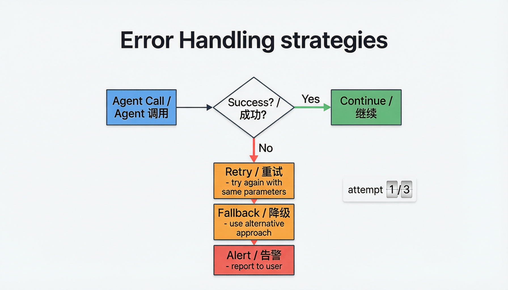
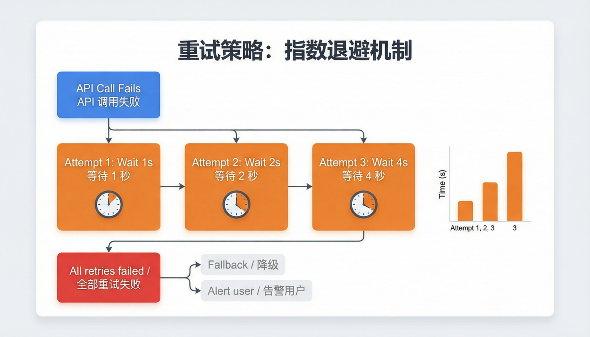
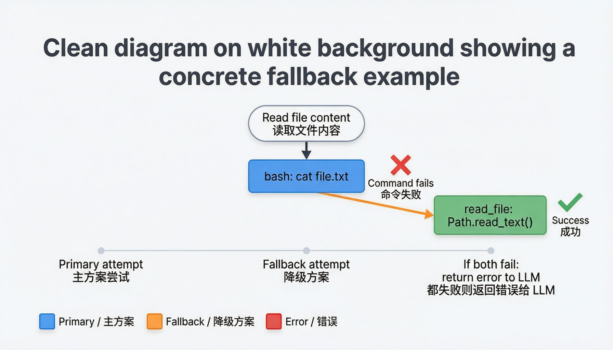

# 第 7 章：错误处理

> **一句话概括**：出错了不崩溃——先重试，重试不行就换方案，再不行就告诉用户。



---

## 通俗理解

你打电话给快递公司，电话占线了：

1. **重试**：过 5 秒再打一次
2. **降级**：改发短信
3. **告警**：告诉老板"快递打不通，需要您出面"

Agent 的错误处理就是这三步：**重试 → 降级 → 告警**。

---

## 核心概念

### Retry（重试）

API 调用可能因为网络波动暂时失败。等几秒再试一次，通常就好了。

### Fallback（降级）

工具执行失败了？换一个替代方案。比如 `bash` 执行 `cat file.txt` 失败了，改用 `read_file` 工具。

### Alert（告警）

实在解决不了，告诉用户发生了什么，让用户决定怎么办。

### 重试策略：指数退避

每次重试等待的时间递增（1s → 2s → 4s），避免频繁重试压垮服务：



### 降级示例

当主方案失败时，自动切换到替代方案：



---

## 完整代码

```python
import os, json, subprocess, time
from pathlib import Path
from openai import OpenAI   # DeepSeek 兼容 OpenAI SDK，所以用 openai 包
from dotenv import load_dotenv

load_dotenv()

deepseek_client = OpenAI(
    api_key=os.getenv("DEEPSEEK_API_KEY"),
    base_url="https://api.deepseek.com",
)
MODEL = os.getenv("MODEL_ID", "deepseek-chat")
WORKDIR = Path(".").resolve()

SYSTEM = f"你是一个编程助手，工作目录是 {WORKDIR}。"

TOOLS = [
    {"type": "function", "function": {"name": "bash", "description": "执行 Shell 命令",
        "parameters": {"type": "object", "properties": {"command": {"type": "string"}}, "required": ["command"]}}},
    {"type": "function", "function": {"name": "read_file", "description": "读取文件",
        "parameters": {"type": "object", "properties": {"path": {"type": "string"}}, "required": ["path"]}}},
]


# ==========================================
# ★ 本章新增：带错误处理的工具执行
# ==========================================

# 最大重试次数
MAX_RETRIES = 3
# 重试间隔（秒）：每次等待更久
RETRY_DELAYS = [1, 2, 4]


def safe_call_llm(messages: list, tools=None) -> dict:
    """
    安全地调用 LLM API：带重试机制。

    失败时等一段时间再试，最多重试 MAX_RETRIES 次。
    """
    for attempt in range(MAX_RETRIES):
        try:
            response = deepseek_client.chat.completions.create(
                model=MODEL,
                messages=messages,
                tools=tools,
            )
            return response.choices[0].message

        except Exception as e:
            delay = RETRY_DELAYS[attempt] if attempt < len(RETRY_DELAYS) else 4
            print(f"  ⚠️  API 调用失败（第 {attempt + 1} 次）: {e}")
            print(f"     {delay} 秒后重试...")
            time.sleep(delay)

    # 所有重试都失败了 → 告警
    print("  ❌ API 调用在多次重试后仍然失败")
    return None


def safe_execute_tool(tool_name: str, args: dict) -> str:
    """
    安全地执行工具：带错误处理和降级。

    三步：重试 → 降级 → 告警
    """
    # ---- 第一步：重试 ----
    for attempt in range(MAX_RETRIES):
        try:
            if tool_name == "bash":
                result = subprocess.run(
                    args["command"], shell=True,
                    capture_output=True, text=True, timeout=30,
                )
                # 命令返回非零退出码 → 可能是错误
                if result.returncode != 0:
                    stderr = result.stderr.strip()
                    if stderr:
                        print(f"  ⚠️  命令返回错误: {stderr[:100]}")
                return result.stdout or "(无输出)"

            elif tool_name == "read_file":
                file_path = WORKDIR / args["path"]
                if not file_path.exists():
                    return f"错误：文件 {args['path']} 不存在"
                return file_path.read_text(encoding="utf-8")

            else:
                return f"错误：未知工具 {tool_name}"

        except subprocess.TimeoutExpired:
            print(f"  ⚠️  命令超时（第 {attempt + 1} 次）")
            if attempt < MAX_RETRIES - 1:
                time.sleep(RETRY_DELAYS[attempt])
                continue

        except Exception as e:
            print(f"  ⚠️  工具执行异常: {e}")
            break

    # ---- 第二步：降级 ----
    # 尝试替代方案
    if tool_name == "bash":
        command = args.get("command", "")
        # 如果是 cat 命令失败了，尝试用 read_file 替代
        if command.startswith("cat "):
            fallback_path = command[4:].strip()
            print(f"  🔄 降级: 尝试用 read_file 读取 {fallback_path}")
            try:
                file_path = WORKDIR / fallback_path
                if file_path.exists():
                    return file_path.read_text(encoding="utf-8")
            except Exception:
                pass

    # ---- 第三步：告警 ----
    error_msg = f"[工具执行失败] {tool_name}({json.dumps(args, ensure_ascii=False)}) 在重试后仍然失败"
    print(f"  ❌ {error_msg}")
    return error_msg


# ==========================================
# Agent 循环（整合错误处理）
# ==========================================
def agent_loop(messages: list):
    while True:
        # ★ 用 safe_call_llm 替代直接调用 API
        msg = safe_call_llm(
            [{"role": "system", "content": SYSTEM}] + messages,
            tools=TOOLS,
        )

        # API 完全不可用 → 退出循环
        if msg is None:
            print("\nAgent: 抱歉，API 暂时不可用，请稍后再试。")
            return

        if not msg.tool_calls:
            print(f"\nAgent: {msg.content}")
            return

        messages.append(msg)
        for tool_call in msg.tool_calls:
            args = json.loads(tool_call.function.arguments)
            # ★ 用 safe_execute_tool 替代直接执行
            output = safe_execute_tool(tool_call.function.name, args)
            messages.append({
                "role": "tool",
                "tool_call_id": tool_call.id,
                "content": output,
            })


if __name__ == "__main__":
    query = input("你: ").strip()
    messages = [{"role": "user", "content": query}]
    agent_loop(messages)
```

---

## 运行它

把上面的代码复制到 `ch07-error-handling.py` 文件中，然后：

```bash
cd harness-visual-tutorial
python ch07-error-handling.py
```

测试错误场景：
- "读取一个不存在的文件 nonexistent.txt" → 工具返回错误信息（不崩溃）
- "执行 cat README.md" → 正常执行；如果 cat 失败会自动降级到 read_file

---

## 错误处理三步走

```
出错
 │
 ├── 1. 重试（最多 3 次，间隔递增）
 │      └── 成功？→ 继续
 │
 ├── 2. 降级（换替代方案）
 │      └── 成功？→ 继续
 │
 └── 3. 告警（告诉 LLM 失败了，让它决定下一步）
```

---

## 动手试一试

1. **模拟超时**：把 timeout 改成 1 秒，执行 `sleep 5` 命令，观察超时重试行为
2. **添加更多降级规则**：当 `head` 命令失败时，降级到 `read_file`

---

## 小结与下一章

本章你给 Agent 加了三层防护：重试（临时故障）、降级（换方案）、告警（兜底）。

Agent 现在不容易崩溃了。但对话太长时，消息列表会越来越大。下一章我们教它**整理桌面**：上下文管理。

---

## 检查点

- [ ] 能说出错误处理三步走：重试、降级、告警
- [ ] 理解 `safe_call_llm` 和 `safe_execute_tool` 的区别
- [ ] 代码能跑起来，错误场景不会导致程序崩溃
