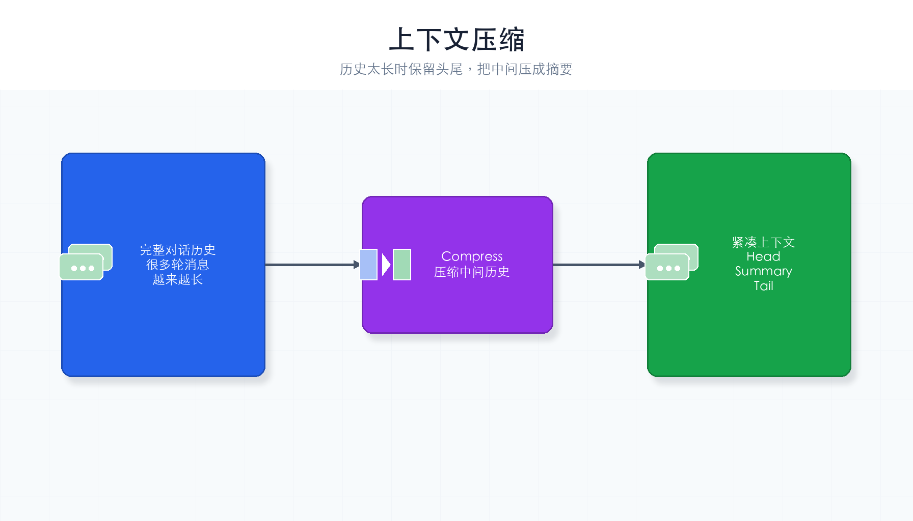
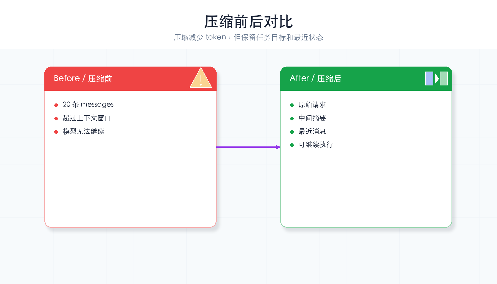
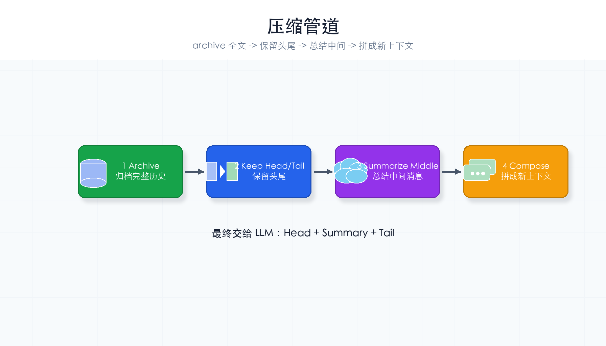

# 第 8 章：上下文管理

> **一句话概括**：对话太长了？裁剪中间、归档全文、总结精华——像整理桌面一样保持上下文清爽。



---

## 本章你会学到什么

- 为什么 `messages` 不能无限增长
- 上下文压缩为什么要保留开头和结尾
- 归档、裁剪、总结分别解决什么问题
- 压缩后的内容怎样继续交给 LLM 使用

第 5 章讲“长期记忆”，本章讲“当前对话太长怎么办”。两者不是一回事。

---

## 通俗理解

你的办公桌很小，但文件越堆越多。三种整理方式：

| 操作 | 上下文管理对应 |
|------|-------------|
| 把中间的文件收到抽屉里 | **裁剪**（保留首尾，丢掉中间） |
| 把所有文件存档到柜子 | **归档**（保存到磁盘） |
| 写一份精华摘要 | **总结**（让 LLM 压缩内容） |

目标：让 Agent 每次看到的上下文既**够用**又**不臃肿**。

---

## 先记住这 3 件事

1. **上下文窗口有限**：消息太多会变慢、变贵，甚至超过模型限制。
2. **最近消息最重要**：Agent 下一步通常依赖最新工具结果和用户要求。
3. **归档不等于注入**：保存到磁盘的全文不会自动被 LLM 看见。

压缩的目标不是丢信息，而是把“当前必须知道的信息”留下来。

---

## 核心概念

### Context Window（上下文窗口）

LLM 一次能处理的最大 token 数。超过这个长度就会报错或丢失信息。

### Compaction（压缩）

当消息列表太长时，通过三种操作减小体积：
1. **Snip**：保留开头和结尾，中间只保留摘要
2. **Archive**：把完整对话保存到磁盘
3. **Summarize**：让 LLM 把中间部分浓缩成一段话

### 压缩前后对比

压缩前 20 条消息 → 压缩后只剩 5 条精华：



### 压缩管道

三个步骤依次执行，最终拼成压缩后的上下文：



---

## 本章新增机制

本章新增 4 个关键配置和函数：

| 名称 | 作用 |
|------|------|
| `COMPACT_THRESHOLD` | 超过多少条消息触发压缩 |
| `KEEP_HEAD` | 保留最前面的几条消息，通常是原始任务 |
| `KEEP_TAIL` | 保留最后几条消息，通常是最新进展 |
| `compact_context()` | 执行归档、裁剪、总结、拼接 |

执行顺序是：

```text
messages 太长
  ↓
archive_messages(messages) 保存全文
  ↓
head = messages[:KEEP_HEAD]
tail = messages[-KEEP_TAIL:]
middle = 中间消息
  ↓
summarize_messages(middle)
  ↓
head + summary + tail 交给 LLM
```

---

## 完整代码

```python
import os, json, subprocess, time
from pathlib import Path
from openai import OpenAI   # DeepSeek 兼容 OpenAI SDK，所以用 openai 包
from dotenv import load_dotenv

load_dotenv()

deepseek_client = OpenAI(
    api_key=os.getenv("DEEPSEEK_API_KEY"),
    base_url="https://api.deepseek.com",
)
MODEL = os.getenv("MODEL_ID", "deepseek-chat")
WORKDIR = Path(".").resolve()
ARCHIVE_DIR = WORKDIR / ".agent_archives"
ARCHIVE_DIR.mkdir(exist_ok=True)

SYSTEM = f"你是一个编程助手，工作目录是 {WORKDIR}。"

TOOLS = [
    {"type": "function", "function": {"name": "bash", "description": "执行 Shell 命令",
        "parameters": {"type": "object", "properties": {"command": {"type": "string"}}, "required": ["command"]}}},
    {"type": "function", "function": {"name": "read_file", "description": "读取文件",
        "parameters": {"type": "object", "properties": {"path": {"type": "string"}}, "required": ["path"]}}},
]

def run_bash(command: str) -> str:
    result = subprocess.run(command, shell=True, capture_output=True, text=True, timeout=30)
    return result.stdout or "(无输出)"

def run_read_file(path: str) -> str:
    file_path = WORKDIR / path
    if not file_path.exists():
        return f"错误：文件 {path} 不存在"
    return file_path.read_text(encoding="utf-8")

TOOL_HANDLERS = {"bash": run_bash, "read_file": run_read_file}


# ==========================================
# ★ 本章新增：上下文管理
# ==========================================

# 触发压缩的消息数量阈值
COMPACT_THRESHOLD = 15
# 压缩后保留的头部消息数（保留原始请求）
KEEP_HEAD = 2
# 压缩后保留的尾部消息数（保留最近对话）
KEEP_TAIL = 6


def count_tokens_approx(messages: list) -> int:
    """
    粗略估算 token 数量。
    精确计数需要 tiktoken 库，这里用字符数 / 3 来近似。
    """
    total_chars = sum(len(str(m)) for m in messages)
    return total_chars // 3


def summarize_messages(messages: list) -> str:
    """
    让 LLM 把一组消息总结为一段摘要。
    """
    if not messages:
        return ""

    # 把消息格式化成可读文本
    text_parts = []
    for m in messages:
        role = m.get("role", "?")
        content = m.get("content", "") or ""
        if len(content) > 200:
            content = content[:200] + "..."
        text_parts.append(f"[{role}]: {content}")

    prompt = (
        "请用一段话（不超过 100 字）总结以下对话的要点：\n\n"
        + "\n".join(text_parts)
    )

    try:
        resp = deepseek_client.chat.completions.create(
            model=MODEL,
            messages=[{"role": "user", "content": prompt}],
            max_tokens=200,
        )
        return resp.choices[0].message.content.strip()
    except Exception:
        # 总结失败就返回一个简单提示
        return f"（中间 {len(messages)} 条消息已被压缩）"


def archive_messages(messages: list, session_id: str = None):
    """
    把完整对话保存到磁盘，以备将来查阅。
    """
    if session_id is None:
        session_id = time.strftime("%Y%m%d_%H%M%S")
    archive_file = ARCHIVE_DIR / f"session_{session_id}.json"
    archive_file.write_text(
        json.dumps(messages, ensure_ascii=False, indent=2),
        encoding="utf-8",
    )
    print(f"  💾 归档: {archive_file.name}（{len(messages)} 条消息）")


def compact_context(messages: list) -> list:
    """
    压缩上下文：保留首尾 + 总结中间 + 归档全文。

    压缩后的结构：
    [头部消息] [总结消息] [尾部消息]
    """
    if len(messages) <= COMPACT_THRESHOLD:
        return messages  # 还没到压缩阈值，不压缩

    print(f"\n  📦 上下文压缩: {len(messages)} 条消息 → ", end="")

    # 第一步：归档完整对话到磁盘
    archive_messages(messages)

    # 第二步：裁剪——保留首尾
    head = messages[:KEEP_HEAD]
    tail = messages[-KEEP_TAIL:]
    middle = messages[KEEP_HEAD:-KEEP_TAIL]

    # 第三步：总结中间部分
    summary = summarize_messages(middle)
    summary_msg = {
        "role": "system",
        "content": f"[上下文摘要] 以下是之前对话的总结：{summary}",
    }

    # 第四步：拼接成压缩后的上下文
    compact = head + [summary_msg] + tail
    print(f"{len(compact)} 条消息")

    return compact


# ==========================================
# Agent 循环（整合上下文管理）
# ==========================================
def agent_loop(messages: list):
    while True:
        # ★ 每次调用 LLM 前，检查是否需要压缩上下文
        active_messages = compact_context(messages)

        response = deepseek_client.chat.completions.create(
            model=MODEL,
            messages=[{"role": "system", "content": SYSTEM}] + active_messages,
            tools=TOOLS,
        )
        msg = response.choices[0].message

        if not msg.tool_calls:
            print(f"\nAgent: {msg.content}")
            return

        messages.append(msg)
        for tool_call in msg.tool_calls:
            args = json.loads(tool_call.function.arguments)
            output = TOOL_HANDLERS[tool_call.function.name](**args)
            messages.append({
                "role": "tool",
                "tool_call_id": tool_call.id,
                "content": output,
            })


if __name__ == "__main__":
    query = input("你: ").strip()
    messages = [{"role": "user", "content": query}]
    agent_loop(messages)
```

---

## 运行它

把上面的代码复制到 `ch08-context-management.py` 文件中，然后：

```bash
cd harness-visual-tutorial
python ch08-context-management.py
```

要观察压缩效果，你需要进行多轮对话（超过 15 条消息），或者临时把 `COMPACT_THRESHOLD` 改小（比如 5）来快速触发。

### 怎样快速看见压缩？

学习时可以临时改成：

```python
COMPACT_THRESHOLD = 5
KEEP_HEAD = 1
KEEP_TAIL = 2
```

然后让 Agent 连续调用几次工具。触发压缩后，终端会打印类似：

```text
上下文压缩: 7 条消息 → 4 条消息
归档: session_20260812_103000.json
```

---

## 压缩效果对比

```
压缩前（15 条消息）：
[user] 帮我创建一个 Python 项目
[assistant] 好的，我来创建...
[tool] bash 结果...
[assistant] 已创建项目结构...
[tool] read_file 结果...
... （10 条中间消息）...
[user] 现在帮我加个测试
[assistant] 好的...

压缩后（9 条消息）：
[user] 帮我创建一个 Python 项目        ← 保留头部
[system] [上下文摘要] 之前创建了...      ← LLM 总结
[tool] read_file 结果...               ← 保留尾部
[user] 现在帮我加个测试
[assistant] 好的...
```

---

## 动手试一试

1. **调整阈值**：把 `COMPACT_THRESHOLD` 改成 5，快速观察压缩效果
2. **查看归档文件**：检查 `.agent_archives/` 目录中的 JSON 文件

---

## 常见卡点

| 现象 | 检查 |
|------|------|
| 一直没有压缩 | 消息数量没有超过 `COMPACT_THRESHOLD` |
| 归档文件越来越多 | 正常。教学版没有清理策略，生产系统要定期清理 |
| 压缩后模型忘了细节 | `KEEP_TAIL` 太小或摘要太短，可以适当调大 |
| 以为归档会自动召回 | 不会。归档只是保存全文，除非你再实现搜索读取 |

---

## 小结与下一章

本章你给 Agent 加了"桌面整理"能力：对话太长时自动裁剪、归档、总结。

到现在，我们已经有了所有零件：循环、工具、权限、记忆、子代理、错误处理、上下文管理。下一章把它们**全部组装到一起**！

---

## 检查点

- [ ] 能说出上下文压缩的三步：裁剪、归档、总结
- [ ] 理解为什么需要压缩（上下文窗口有上限）
- [ ] 代码能跑起来，长对话能自动触发压缩
