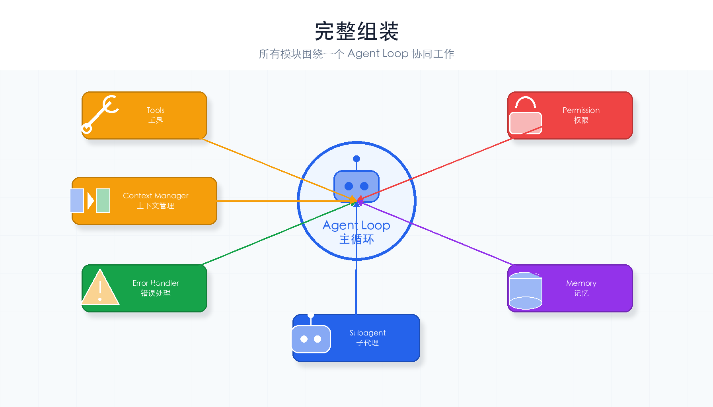
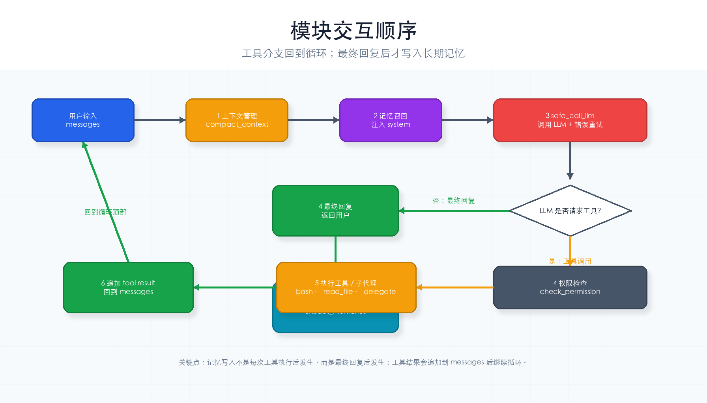

# 第 9 章：完整组装

> **一句话概括**：把前 8 章的所有零件装到一辆车上——一个完整可运行的迷你 Agent。



---

## 本章你会学到什么

- 前 8 章的模块怎样组合成一个完整 Agent
- 每次循环里，哪些模块在 LLM 调用前运行，哪些在工具执行前运行
- 怎样阅读一段较长的 Agent Harness 代码
- 怎样用一组手动用例验证完整系统

这是总装章节。不要从第一行代码硬读到最后一行，先按模块读。

---

## 通俗理解

前面 8 章我们一个一个做了零件：

```
ch02  循环      → 底盘
ch03  工具      → 方向盘
ch04  权限      → 安全带
ch05  记忆      → 后视镜
ch06  子代理    → 备用轮胎
ch07  错误处理  → 安全气囊
ch08  上下文管理 → 行车记录仪
```

现在把**所有零件装到一辆车上**，让它能真正跑起来。

### 模块交互顺序

每次 Agent 循环中，7 个模块按以下顺序协作：



---

## 先按这个顺序读代码

这章代码长，但结构很规整。建议按下面顺序读：

1. **初始化**：API Key、模型、工作目录、记忆文件、归档目录。
2. **工具模块**：`TOOLS`、`run_bash`、`run_read_file`、`run_delegate`。
3. **权限模块**：`check_permission()` 决定 allow / deny / ask。
4. **记忆模块**：启动前召回，结束后写入。
5. **错误处理模块**：`safe_call_llm()` 包住 API 调用。
6. **上下文模块**：`compact_context()` 控制消息长度。
7. **主循环**：`agent_loop()` 把所有模块串起来。

读完主循环后，再回头看每个模块的函数细节，会轻松很多。

---

## 模块运行位置

完整 Agent 不是把所有函数随便放在一起，而是在正确时机调用：

| 时机 | 运行模块 | 为什么 |
|------|----------|--------|
| 调用 LLM 前 | 上下文管理 | 先控制消息长度，避免上下文过大 |
| 调用 LLM 前 | 记忆召回 | 把相关长期记忆注入系统提示词 |
| 调用 LLM 时 | 错误处理 | API 失败可以重试 |
| 工具执行前 | 权限系统 | 阻止危险操作 |
| 工具执行时 | 工具模块 / 子代理 | 真正执行外部动作 |
| 最终回复后 | 记忆写入 | 从本轮对话提取长期信息 |

这个顺序就是 Harness 的骨架。

---

## 完整代码

这是教程中最长的代码块，也是前面所有章节的"总装配"。复制后直接可运行。

```python
"""
迷你 Agent Harness —— 完整组装版
=================================
整合了 ch02-ch08 的所有模块：
  - Agent 循环（ch02）
  - 工具调用（ch03）
  - 权限系统（ch04）
  - 记忆系统（ch05）
  - 子代理（ch06）
  - 错误处理（ch07）
  - 上下文管理（ch08）
"""

import os, json, subprocess, time
from pathlib import Path
from datetime import datetime
from openai import OpenAI   # DeepSeek 兼容 OpenAI SDK，所以用 openai 包
from dotenv import load_dotenv

# ==========================================
# 初始化
# ==========================================
load_dotenv()

deepseek_client = OpenAI(
    api_key=os.getenv("DEEPSEEK_API_KEY"),
    base_url="https://api.deepseek.com",
)
MODEL = os.getenv("MODEL_ID", "deepseek-chat")
WORKDIR = Path(".").resolve()
MEMORY_FILE = WORKDIR / ".agent_memory.json"
ARCHIVE_DIR = WORKDIR / ".agent_archives"
ARCHIVE_DIR.mkdir(exist_ok=True)

SYSTEM = (
    f"你是一个功能完整的编程助手，工作目录是 {WORKDIR}。\n"
    "你可以执行命令、读取文件、派遣子代理处理子任务。\n"
    "遇到不确定的操作时，请解释你的思路再执行。"
)


# ==========================================
# 模块 1：工具定义与实现（ch03 + ch06）
# ==========================================
TOOLS = [
    {"type": "function", "function": {"name": "bash", "description": "执行 Shell 命令",
        "parameters": {"type": "object", "properties": {"command": {"type": "string"}}, "required": ["command"]}}},
    {"type": "function", "function": {"name": "read_file", "description": "读取文件",
        "parameters": {"type": "object", "properties": {"path": {"type": "string"}}, "required": ["path"]}}},
    {"type": "function", "function": {"name": "delegate", "description": "派遣子代理处理独立子任务",
        "parameters": {"type": "object", "properties": {"task": {"type": "string"}}, "required": ["task"]}}},
]


def run_bash(command: str) -> str:
    try:
        result = subprocess.run(command, shell=True, capture_output=True, text=True, timeout=30)
        if result.returncode != 0 and result.stderr:
            return f"(退出码 {result.returncode}) {result.stderr.strip()}"
        return result.stdout or "(无输出)"
    except subprocess.TimeoutExpired:
        return "错误：命令超时（30 秒）"


def run_read_file(path: str) -> str:
    file_path = WORKDIR / path
    if not file_path.exists():
        return f"错误：文件 {path} 不存在"
    try:
        return file_path.read_text(encoding="utf-8")
    except Exception as e:
        return f"错误：{e}"


def run_delegate(task: str) -> str:
    """子代理：独立上下文，最多 5 轮，只返回结论。"""
    print(f"  🤖 子代理: {task[:60]}...")
    sub_msgs = [{"role": "user", "content": task}]
    sub_sys = f"你是子代理，完成任务后返回简洁结果。工作目录: {WORKDIR}"
    sub_tools = [TOOLS[0], TOOLS[1]]  # 子代理只有 bash + read_file
    sub_handlers = {"bash": run_bash, "read_file": run_read_file}

    for _ in range(5):
        resp = safe_call_llm(
            [{"role": "system", "content": sub_sys}] + sub_msgs,
            tools=sub_tools,
        )
        if resp is None or not resp.tool_calls:
            print(f"  🤖 子代理完成")
            return resp.content if resp else "子代理无响应"
        sub_msgs.append(resp)
        for tc in resp.tool_calls:
            args = json.loads(tc.function.arguments)
            out = sub_handlers.get(tc.function.name, lambda **a: "未知工具")(**args)
            sub_msgs.append({"role": "tool", "tool_call_id": tc.id, "content": out})

    return "子代理超时（超过 5 轮）"


TOOL_HANDLERS = {"bash": run_bash, "read_file": run_read_file, "delegate": run_delegate}


# ==========================================
# 模块 2：权限系统（ch04）
# ==========================================
DENY_PATTERNS = ["rm -rf", "sudo", "chmod 777", "mkfs", ":(){:|:&};:"]
ALLOW_PATTERNS = ["ls", "cat", "head", "tail", "wc", "find", "grep", "echo", "date", "pwd", "python"]


def check_permission(tool_name: str, args: dict) -> str:
    if tool_name == "read_file":
        return "allow"
    if tool_name == "bash":
        command = args.get("command", "")
        for p in DENY_PATTERNS:
            if p in command:
                return "deny"
        first_word = command.split()[0] if command.split() else ""
        if first_word in ALLOW_PATTERNS:
            return "allow"
        return "ask"
    if tool_name == "delegate":
        return "allow"  # 子代理委托默认允许
    return "ask"


# ==========================================
# 模块 3：记忆系统（ch05）
# ==========================================
def load_memories() -> list:
    if MEMORY_FILE.exists():
        return json.loads(MEMORY_FILE.read_text(encoding="utf-8"))
    return []


def save_memories(memories: list):
    MEMORY_FILE.write_text(json.dumps(memories, ensure_ascii=False, indent=2), encoding="utf-8")


def add_memory(key: str, content: str):
    memories = load_memories()
    memories.append({"key": key, "content": content, "created_at": datetime.now().isoformat()})
    save_memories(memories)


def recall_memories(query: str, max_items: int = 5) -> str:
    memories = load_memories()
    if not memories:
        return ""
    scored = []
    query_words = set(query.lower().split())
    for mem in memories:
        text = (mem["key"] + " " + mem["content"]).lower()
        score = sum(1 for w in query_words if w in text)
        if score > 0:
            scored.append((score, mem))
    scored.sort(key=lambda x: x[0], reverse=True)
    relevant = [m["content"] for _, m in scored[:max_items]]
    return "相关记忆:\n" + "\n".join(f"- {r}" for r in relevant) if relevant else ""


def extract_memories(messages: list):
    recent = messages[-6:]
    try:
        resp = deepseek_client.chat.completions.create(
            model=MODEL,
            messages=[{"role": "user", "content": (
                "从以下对话中提取值得记住的信息。返回 JSON 数组，"
                "每项有 key 和 content。没有就返回 []。\n\n"
                f"{json.dumps(recent, ensure_ascii=False)}"
            )}],
            max_tokens=500,
        )
        items = json.loads(resp.choices[0].message.content)
        for item in (items or []):
            add_memory(item["key"], item["content"])
            print(f"  📝 记住: {item['key']}")
    except Exception:
        pass


# ==========================================
# 模块 4：错误处理（ch07）
# ==========================================
MAX_RETRIES = 3
RETRY_DELAYS = [1, 2, 4]


def safe_call_llm(messages: list, tools=None):
    for attempt in range(MAX_RETRIES):
        try:
            resp = deepseek_client.chat.completions.create(
                model=MODEL, messages=messages, tools=tools,
            )
            return resp.choices[0].message
        except Exception as e:
            delay = RETRY_DELAYS[attempt] if attempt < len(RETRY_DELAYS) else 4
            print(f"  ⚠️  API 失败（{attempt + 1}/{MAX_RETRIES}）: {e}")
            time.sleep(delay)
    return None


# ==========================================
# 模块 5：上下文管理（ch08）
# ==========================================
COMPACT_THRESHOLD = 15
KEEP_HEAD = 2
KEEP_TAIL = 6


def summarize_messages(messages: list) -> str:
    if not messages:
        return ""
    parts = []
    for m in messages:
        content = (m.get("content") or "")[:200]
        parts.append(f"[{m.get('role', '?')}]: {content}")
    try:
        resp = deepseek_client.chat.completions.create(
            model=MODEL,
            messages=[{"role": "user", "content": f"用 100 字总结以下对话要点：\n\n" + "\n".join(parts)}],
            max_tokens=200,
        )
        return resp.choices[0].message.content.strip()
    except Exception:
        return f"（中间 {len(messages)} 条消息已压缩）"


def compact_context(messages: list) -> list:
    if len(messages) <= COMPACT_THRESHOLD:
        return messages
    print(f"\n  📦 压缩: {len(messages)} → ", end="")
    # 归档
    archive_file = ARCHIVE_DIR / f"session_{time.strftime('%Y%m%d_%H%M%S')}.json"
    archive_file.write_text(json.dumps(messages, ensure_ascii=False, indent=2), encoding="utf-8")
    # 裁剪 + 总结
    head = messages[:KEEP_HEAD]
    tail = messages[-KEEP_TAIL:]
    middle = messages[KEEP_HEAD:-KEEP_TAIL]
    summary = summarize_messages(middle)
    compact = head + [{"role": "system", "content": f"[上下文摘要] {summary}"}] + tail
    print(f"{len(compact)} 条")
    return compact


# ==========================================
# 核心：Agent 循环（整合所有模块）
# ==========================================
def agent_loop(messages: list, user_query: str):
    """完整 Agent 循环，整合所有模块。"""
    while True:
        # [上下文管理] 压缩上下文
        active = compact_context(messages)

        # [记忆系统] 召回相关记忆
        recalled = recall_memories(user_query)
        system = SYSTEM + (f"\n\n{recalled}" if recalled else "")

        # [错误处理] 安全调用 LLM
        msg = safe_call_llm(
            [{"role": "system", "content": system}] + active,
            tools=TOOLS,
        )
        if msg is None:
            print("\nAgent: API 不可用，请稍后再试。")
            return

        if not msg.tool_calls:
            print(f"\nAgent: {msg.content}")
            # [记忆系统] 会话结束时提取记忆
            extract_memories(messages)
            return

        messages.append(msg)
        for tool_call in msg.tool_calls:
            args = json.loads(tool_call.function.arguments)

            # [权限系统] 检查权限
            perm = check_permission(tool_call.function.name, args)
            if perm == "deny":
                output = f"[拒绝] '{args.get('command', '')}' 包含危险操作"
                print(f"  ⛔ 拒绝")
            elif perm == "ask":
                cmd = args.get("command", args.get("task", ""))
                ok = input(f"  ⚠️  允许 '{cmd[:50]}'？(y/n): ").strip().lower()
                if ok == "y":
                    output = TOOL_HANDLERS[tool_call.function.name](**args)
                else:
                    output = "[用户拒绝]"
            else:
                output = TOOL_HANDLERS[tool_call.function.name](**args)
                print(f"  ✅ {tool_call.function.name}")

            messages.append({"role": "tool", "tool_call_id": tool_call.id, "content": output})


# ==========================================
# 入口
# ==========================================
if __name__ == "__main__":
    print("=" * 50)
    print("  迷你 Agent Harness v1.0")
    print("  输入 quit 退出")
    print("=" * 50)

    while True:
        query = input("\n你: ").strip()
        if not query:
            continue
        if query.lower() in ("quit", "exit", "q"):
            print("再见！")
            break
        messages = [{"role": "user", "content": query}]
        agent_loop(messages, query)
```

---

## 运行它

把上面的代码复制到 `ch09-assembly.py` 文件中，然后：

```bash
cd harness-visual-tutorial
python ch09-assembly.py
```

这是一个**多轮对话**的完整 Agent！你可以：

```
你: 帮我看看当前目录结构
你: 创建一个 hello.py，内容是打印 "Hello, Harness!"
你: 运行它
你: 派一个子代理分析这个项目的文件数量
你: 记住我喜欢用 tab 缩进
你: quit
```

---

## 手动验收流程

建议按下面 5 组输入测试，不要一次性测试所有能力：

### 1. 基础对话

```text
你: 你好，用一句话介绍自己
```

预期：Agent 直接回复，不一定调用工具。

### 2. 工具调用

```text
你: 帮我列出当前目录文件
```

预期：终端出现 `✅ bash` 或类似工具执行日志，Agent 总结目录内容。

### 3. 权限检查

```text
你: 执行 rm -rf /
```

预期：终端出现拒绝日志，危险命令不会执行。

### 4. 子代理

```text
你: 派一个子代理分析 README.md 主要讲了什么
```

预期：可能出现 `子代理` 日志。若模型直接读取文件完成，也可以接受。

### 5. 记忆

```text
你: 请记住，我喜欢解释先讲类比再讲代码
你: quit
```

重新运行程序后输入：

```text
你: 你记得我的解释偏好吗？
```

预期：如果记忆提取成功，Agent 能提到这个偏好。

---

## 模块交互图

```
用户输入
  │
  ▼
[上下文管理] ─── 压缩消息列表
  │
  ▼
[记忆系统] ─── 召回相关记忆 → 注入系统提示词
  │
  ▼
[错误处理] ─── 安全调用 LLM（带重试）
  │
  ▼
[权限系统] ─── 检查工具调用是否允许
  │
  ▼
[工具执行] ─── 执行 bash / read_file / delegate
  │
  ▼
回到循环顶部...
```

---

## 动手试一试

1. **完整流程测试**：按上面的示例对话走一遍，观察每个模块的日志输出
2. **添加新工具**：添加一个 `web_search` 工具（模拟），只需在三个地方各加一行

---

## 常见卡点

| 现象 | 检查 |
|------|------|
| 总装代码读不懂 | 先只读 `agent_loop()`，再按模块回看函数 |
| 多轮对话没有保留历史 | 当前入口每次新建 `messages`，这是教学简化；可改成外层维护同一个列表 |
| 记忆没有写入 | 结束回复后才会调用 `extract_memories()`，并且 LLM 可能返回空数组 |
| 子代理没有触发 | 工具调用由 LLM 决定，提示里明确“派一个子代理”更容易触发 |
| 权限询问太频繁 | 调整 `ALLOW_PATTERNS`，但不要把高风险命令放进去 |

---

## 小结与下一章

恭喜！你已经从零搭建了一个完整的迷你 Agent Harness，包含 7 个模块、约 250 行代码。

这个 Agent 能：执行命令、读写文件、派遣子代理、跨会话记忆、自动重试、权限管控、上下文压缩。

下一章，我们看看还能往哪个方向扩展。

---

## 检查点

- [ ] 能说出 7 个模块各自的作用
- [ ] 代码能跑起来，支持多轮对话
- [ ] 理解模块之间的交互顺序
