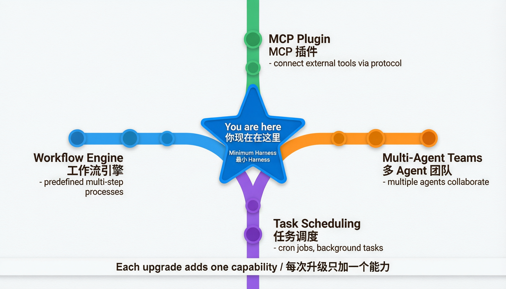
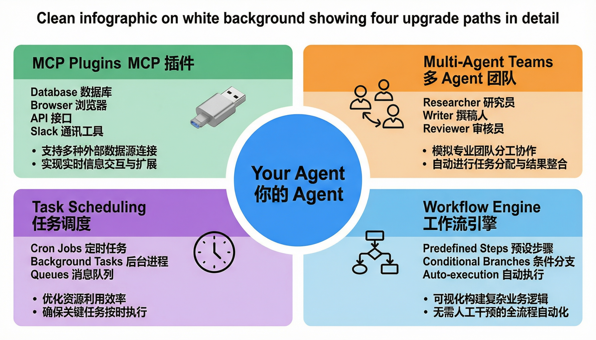

# 第 10 章：后续方向

> **一句话概括**：你已经造了一辆能跑的车。现在看看四条升级路线，每次只加一个能力。



---

## 通俗理解

你从一个"功能机"（能打电话）升级到了"智能机"（能装 App）。现在有四条升级路线可以走：

```
你现在在这里：最小 Harness ✅
    │
    ├── 路线 1: MCP 插件     → 连接外部工具（数据库、API、浏览器...）
    ├── 路线 2: 多 Agent 团队 → 多个 Agent 协作完成复杂任务
    ├── 路线 3: 任务调度     → 定时任务、后台任务、任务队列
    └── 路线 4: 工作流引擎   → 预定义多步骤流程，自动执行
```

### 四条路线全景图

每条路线都能独立深入，也可以组合使用：



---

## 路线 1：MCP 插件

**解决什么问题**：现在 Agent 只能执行本地命令。如果要连接数据库、调用第三方 API、操作浏览器呢？

**MCP（Model Context Protocol）** 是一个标准化的工具协议——让 Agent 能"插 USB 线"连接外部工具。

### 核心思路

```
现在的工具（本地）：
  bash → subprocess.run()
  read_file → Path.read_text()

MCP 工具（远程）：
  database_query → MCP Server → PostgreSQL
  web_browse → MCP Server → Chromium
  slack_send → MCP Server → Slack API
```

### 学习路径

1. 了解 MCP 协议规范：https://modelcontextprotocol.io
2. 学习如何搭建 MCP Server（Python / TypeScript）
3. 在 Agent 循环中集成 MCP 客户端

---

## 路线 2：多 Agent 团队

**解决什么问题**：ch06 的子代理是"一对一委托"。如果要让多个 Agent **同时工作、互相协作**呢？

### 核心思路

```
模式 1：层级式
  Lead Agent → 子 Agent A, B, C（ch06 已实现）

模式 2：平等协作
  Agent A ←→ Agent B ←→ Agent C（通过共享消息板通信）

模式 3：流水线
  Agent A（调研）→ Agent B（写作）→ Agent C（审核）
```

### 学习路径

1. 研究 CrewAI、AutoGen 等多 Agent 框架
2. 了解 Agent 间的通信协议
3. 实现一个简单的"流水线"模式（调研 → 写作 → 审核）

---

## 路线 3：任务调度

**解决什么问题**：现在 Agent 是你说一句它做一句。能不能让它**定时执行**、**后台运行**、**排队处理**？

### 核心思路

```
定时任务：每天 9:00 检查项目状态
后台任务：耗时长的代码分析放到后台
任务队列：多个请求排队执行，避免冲突
```

### 学习路径

1. 了解 cron / APScheduler 等调度工具
2. 实现一个简单的定时检查任务
3. 添加任务队列（先进先出）

---

## 路线 4：工作流引擎

**解决什么问题**：有些任务是固定流程（代码审查 = 读代码 → 分析 → 写报告）。能不能**预定义流程**，让 Agent 自动走完全程？

### 核心思路

```yaml
# 代码审查工作流
steps:
  - name: 读代码
    tool: read_file
    args: {path: "src/main.py"}
  - name: 分析问题
    action: llm_call
    prompt: "分析以下代码的问题：{prev_output}"
  - name: 写报告
    action: write_file
    args: {path: "review.md", content: "{prev_output}"}
```

### 学习路径

1. 了解 LangGraph、Prefect 等工作流框架
2. 实现一个 YAML 驱动的简单工作流
3. 添加条件分支（如果上一步失败就走备用路径）

---

## 教程总结

恭喜你完成了全部 10 章！回顾一下你的学习旅程：

| 章 | 你做了什么 | 新增能力 |
|----|-----------|---------|
| 01 | 理解了 Harness 是什么 | 建立了全局认知 |
| 02 | 做了最小 Agent 循环 | Agent 能说话 |
| 03 | 加了工具调用 | Agent 能做事 |
| 04 | 加了权限系统 | Agent 有边界 |
| 05 | 加了记忆系统 | Agent 能记住 |
| 06 | 加了子代理 | Agent 能分身 |
| 07 | 加了错误处理 | Agent 不怕错 |
| 08 | 加了上下文管理 | Agent 能整理 |
| 09 | 组装了完整系统 | Agent 能跑起来 |
| 10 | 了解了扩展方向 | 知道下一步往哪走 |

---

## 核心金句

> **Harness 的价值不是让 Agent 变聪明，而是让 Agent 的工作变得可观察、可评估、可复现。**

> **每次升级只加一个能力。** 这是最好的学习方式——简单的事情做好了，复杂的事情自然就简单了。

---

## 推荐阅读

| 资源 | 说明 |
|------|------|
| [learn-claude-code-zh](../learn-claude-code-zh/) | 更深入的 Claude Code 源码解析 |
| [harness-tutorial](../harness-tutorial/) | 偏理论的 Harness 教程（考试类比版） |
| [hello-agents-chapters](../hello-agents-chapters/) | 18 章 Agent 系统课程 |
| [MCP 官方文档](https://modelcontextprotocol.io) | MCP 协议规范 |
| [LangGraph](https://langchain-ai.github.io/langgraph/) | 有状态的多步 Agent 框架 |

---

## 最后的检查点

- [ ] 能说出 4 条扩展路线各自解决什么问题
- [ ] 知道下一步想深入哪个方向
- [ ] 能从零向别人解释一个完整的 Agent Harness 是怎么搭建的
