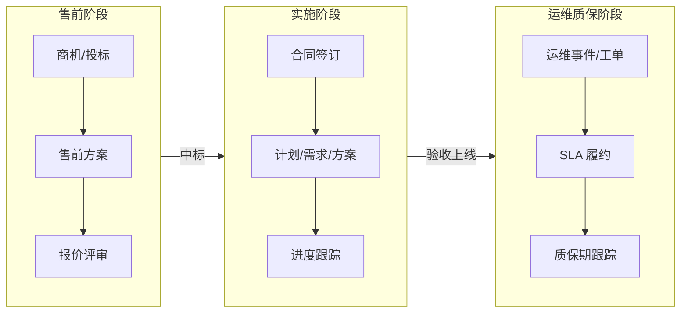
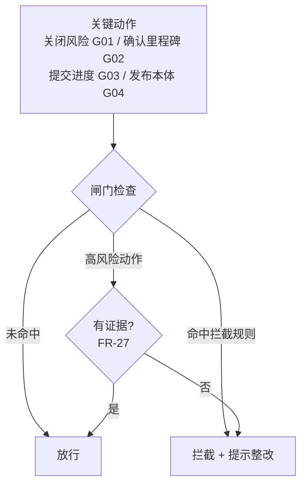
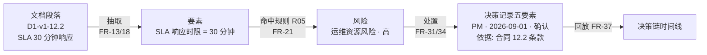
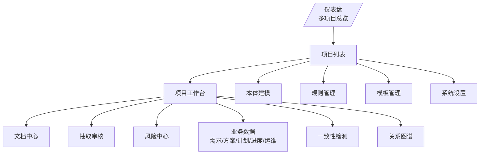
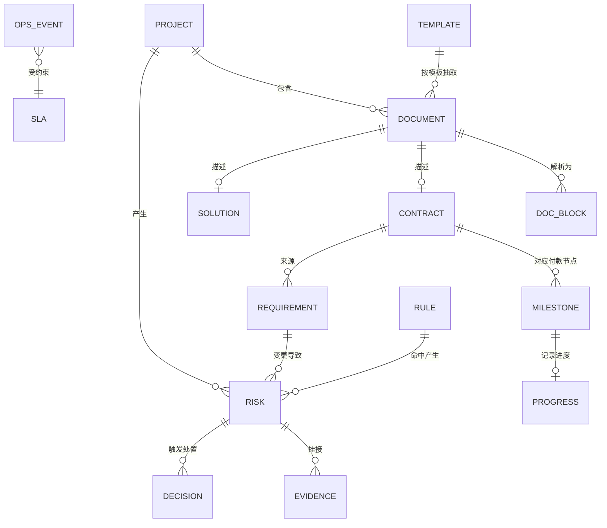
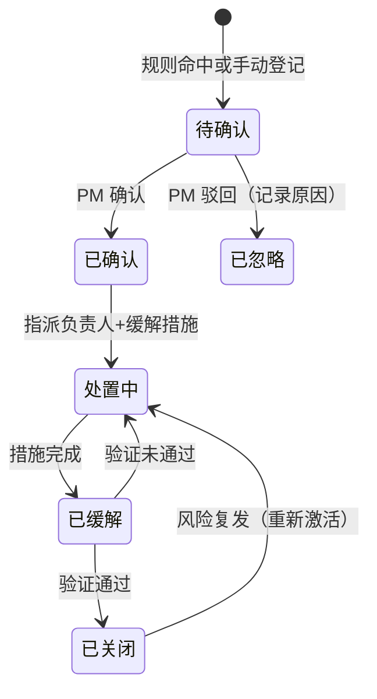
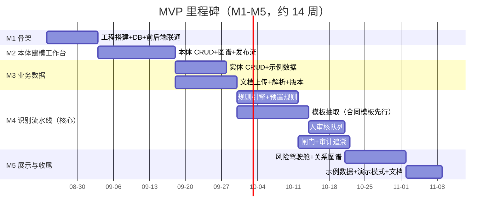

# 本体驱动的项目实施全链路风险管控工具 —— 需求规格说明书 v1.0（MVP）

> 版本：v1.0（需求评审稿）
> 日期：2026-08-25
> 状态：待评审
> 变更记录：v1.0 初版 2026-08-25；评审修订：等级双轨说明（7.1）、MCP/登录优先级统一为 P1（12 章）、补 Sla/Warranty/audit_logs 数据定义（6 章）、US-FR 映射（3.2）、NFR-02 量化（10 章）、示例数据与证据编号说明（9 章）
> 关联文档：[设计方案 v1.0](../项目风险管控工具设计方案-v1.0.md)（技术方案与组件设计）、[设计方案 v0.4](../项目风险管控工具设计方案-v0.4.md)（业务目标与本体模型）、[软件开发合同](../软件开发合同.md)（示例数据来源）
> 读者：项目经理（业务方）、开发人员、测试人员

---

## 1. 需求概述

### 1.1 产品定位

面向 **售前 → 实施 → 运维质保** 全链路的本体驱动风险管控工具（Web 应用）。根据 **合同内容 / 项目范围 / 功能清单 / 产品原型 / 技术方案** 五类输入文档，自动识别项目风险，形成可追溯的风险台账与决策链。

### 1.2 核心用户

| 角色 | 职责 | MVP 支持 |
|---|---|---|
| 项目经理（PM） | 单项目精细管理（上传文档 → 审核抽取 → 处置风险）+ 多项目风险总览 | ✅ 唯一角色，单用户演示模式 |

### 1.3 MVP 成功标准

1. 上传《软件开发合同》→ 自动解析 → 要素抽取 → 规则推理 → **命中 4 条预置规则、生成 4 个风险**（含证据段落引用）
2. 每个风险的"决策链"可回放：**文档段落 → 要素 → 规则 → 风险 → 处置记录**
3. 内置示例数据（真实合同结构），演示模式开箱即用，打开即看懂项目风险态势
4. 全部数据本地存储（SQLite 单文件），单命令启动

### 1.4 MVP 范围与非范围

**范围内（P0，必须交付）：**

| 模块 | 内容 |
|---|---|
| 项目管理 | 项目列表、项目工作台（多项目隔离） |
| 本体建模工作台 | 类/关系/属性浏览与 CRUD、图谱可视化、变更发布流（草案→审核→发布→回滚） |
| 文档中心 | 五类文档上传、解析（PDF/Word/Excel）、带编号文本块、版本管理 |
| 抽取审核 | 要素候选审核队列（确认/驳回/修改）、驳回原因记录 |
| 模板抽取引擎 | 五类文档抽取模板（合同模板先行）、ontogpt 集成、LLM 默认关闭（规则式抽取兜底） |
| 规则引擎 | 10 条预置规则（DSL）、规则运行、L1-L4 推理 |
| 控制平面闸门 | 4 条闸门规则（关闭风险/确认里程碑/提交进度/发布本体） |
| 风险中心 | 风险台账、风险处置全流程（状态机）、风险量化（等级/概率/影响） |
| 审计追溯 | 决策记录五要素、风险生命周期回放 |
| 仪表盘 | 单项目风险态势 + 多项目总览统计卡 |
| 一致性检测 | 跨源对账（合同 vs 计划 vs 进度）、就绪度评分（MVP 简化版） |
| 示例数据 | 基于《软件开发合同》的完整示例数据集 + 预期识别结果 |

**范围外（P1/P2 或明确后置）：**

| 内容 | 处理 |
|---|---|
| MCP 接口层（C8） | P1（预留编号 FR-48），MVP 不做（先 REST） |
| 用户登录 / 多角色权限 | P1，MVP 单用户演示模式，仅预留 users 表与 project_id 隔离 |
| CQ（能力问题）辅助建模 | P1，LLM 辅助生成本体草案 |
| 模板共进化自动提示 | P1，MVP 仅记录驳回原因，人工看 |
| Excel/CSV 批量导入 | P1 |
| Postgres / Redis / 容器化生产部署 | P2，MVP 单机运行即可 |

---

## 2. 术语与约定

| 术语 | 含义 |
|---|---|
| 五类文档 | 合同、项目范围、功能清单、产品原型、技术方案 |
| 本体 | 领域知识模型：15 个核心类 + 16 条关系 + 18 个属性 + 4 个支撑类（Template/Rule/Decision/Evidence） |
| 要素 | 从文档中抽取的结构化信息（如"付款节点=需求签字后付 15%"） |
| 文本块 | 文档解析后的带编号段落（`文档ID-版本-段落号`），是引用溯源的最小单位 |
| 决策链 | 段落 → 要素 → 规则 → 风险 → 处置 的完整追溯链 |
| 闸门 | 改变系统状态的关键动作执行前的规则检查 |
| P0/P1/P2 | 合同 4.2 优先级定义：P0 必须交付 / P1 应当交付 / P2 尽力交付 |

---

## 3. 总体流程（需求视角）

### 3.1 端到端用户流程

### 3.2 核心用户故事

| 编号 | 作为… | 我想要… | 以便… | 对应功能 |
|---|---|---|---|---|
| US-01 | 项目经理 | 上传合同 PDF 后自动解析出结构化要素 | 不用手工录入合同关键信息 | FR-09~13 |
| US-02 | 项目经理 | 对抽取出的要素逐条审核确认 | 保证识别结果的准确性 | FR-14/19 |
| US-03 | 项目经理 | 系统自动提示合同/计划/进度中的风险 | 风险前置暴露、及时处置 | FR-21/25 |
| US-04 | 项目经理 | 每个风险能回溯到原文段落和触发规则 | 决策有据可查、汇报有说服力 | FR-25/30/37 |
| US-05 | 项目经理 | 关闭高风险前系统强制我填写缓解措施 | 避免"有台账无处置" | FR-26/34 |
| US-06 | 项目经理 | 回放某个风险从产生到关闭的全过程 | 复盘改进、应对甲方审计 | FR-36/37 |
| US-07 | 项目经理 | 一屏看到所有项目的风险态势 | 多项目总览、资源调配 | FR-43 |
| US-08 | 项目经理 | 修改本体模型（如新增"外包风险"类） | 知识模型随业务演进 | FR-04~07 |

---

## 4. 功能需求

### 4.1 项目管理

| 编号 | 功能 | 描述 | 优先级 |
|---|---|---|---|
| FR-01 | 项目列表 | 展示全部项目（名称/客户/周期/状态/风险数），支持新建/编辑/删除 | P0 |
| FR-02 | 项目工作台 | 单项目视角：文档/要素/风险/进度等数据总览，切换进入各模块 | P0 |
| FR-03 | 项目隔离 | 所有业务数据带 `project_id`，按当前项目过滤展示，跨项目数据不可见 | P0 |

### 4.2 本体建模工作台

| 编号 | 功能 | 描述 | 优先级 |
|---|---|---|---|
| FR-04 | 本体浏览 | 图谱可视化（@xyflow/react）展示 15+4 类、16 关系，点击查看类详情（属性/关系） | P0 |
| FR-05 | 类管理 | 本体类增删改查（名称/描述/属性列表/关系列表） | P0 |
| FR-06 | 关系与属性管理 | 对象属性（关系）、数据属性（字段）的增删改查 | P0 |
| FR-07 | 变更发布流 | 修改走"草案 → 审核 → 发布"，发布生成版本快照，可回滚到历史版本 | P0 |
| FR-08 | 模板联动提示 | 类/属性变更时，提示"相关抽取模板可能需同步更新"（不自动改） | P1 |

### 4.3 文档中心与加工流水线

| 编号 | 功能 | 描述 | 优先级 |
|---|---|---|---|
| FR-09 | 文档上传 | 支持 PDF / Word（docx）/ Excel（xlsx）上传，单文件 ≤ 50MB | P0 |
| FR-10 | 文档解析 | PDF/Word 按段落、Excel 按单元格/行生成带编号文本块（`文档ID-版本-段落号`），可查看原文 | P0 |
| FR-11 | 版本管理 | 同文档重复上传生成新版本，历史版本可查看/对比 | P0 |
| FR-12 | 文本块展示 | 按文档类型展示解析结果，段落编号可折叠/展开 | P0 |
| FR-13 | 抽取触发 | 对已解析文档手动触发抽取（调模板引擎） | P0 |
| FR-14 | 审核队列 | 要素候选逐条审核：确认 / 驳回（必填原因）/ 修改后确认；驳回原因入库 | P0 |

### 4.4 模板抽取引擎

| 编号 | 功能 | 描述 | 优先级 |
|---|---|---|---|
| FR-15 | 模板定义 | 每种文档类型一个抽取模板（字段 + 锚定本体类/属性），内置合同模板 | P0 |
| FR-16 | 模板管理 | 模板列表查看、新增、编辑（MVP 以 JSON/表单形式编辑） | P0 |
| FR-17 | 规则式抽取 | LLM 未配置时规则式抽取兜底：确定性字段（编号/金额/比例/日期/条款号）正则抽取；语义字段（交付范围/验收条款等）关键词近似匹配，低置信度留空，由审核队列人工补充 | P0 |
| FR-18 | LLM 抽取 | 配置 API Key 后启用 ontogpt 抽取，产出要素候选 + 置信度 | P1 |
| FR-19 | 抽取结果展示 | 候选要素列表：字段名/抽取值/置信度/来源段落，可跳转原文 | P0 |

### 4.5 规则引擎

| 编号 | 功能 | 描述 | 优先级 |
|---|---|---|---|
| FR-20 | 预置规则 | 内置 10 条预置识别规则（见 7.1），随安装提供 | P0 |
| FR-21 | 规则运行 | 对已确认要素集运行规则引擎，产出风险信号（未生效） | P0 |
| FR-22 | 规则管理 | 规则列表（名称/类型/等级/启用状态/命中次数） | P1 |
| FR-23 | 规则编辑 | 用规则 DSL 新增/编辑规则，语法校验 | P1 |
| FR-24 | 规则开关 | 单条规则启用/停用 | P0 |
| FR-25 | 命中详情 | 每条风险显示"命中规则 + 触发字段值 + 证据段落" | P0 |

### 4.6 控制平面闸门

| 编号 | 功能 | 描述 | 优先级 |
|---|---|---|---|
| FR-26 | 闸门拦截 | 关键动作先过闸门检查，命中拦截规则则阻止并提示原因（见 7.2） | P0 |
| FR-27 | 证据审查 | 高风险信号入台账前必须有证据（文档段落 + 命中规则），无证据拦截；处置确认时再补决策人（FR-36） | P0 |
| FR-28 | 闸门豁免 | 拦截后可申请豁免（记录豁免人与理由），不自动放行 | P1 |

**闸门检查流程**（FR-26/27）：

### 4.7 风险中心与处置

| 编号 | 功能 | 描述 | 优先级 |
|---|---|---|---|
| FR-29 | 风险台账 | 列表展示：类型/等级/概率/影响/状态/触发来源，支持筛选排序 | P0 |
| FR-30 | 风险详情 | 风险详情页：描述、证据段落（可跳原文）、命中规则、处置记录时间线 | P0 |
| FR-31 | 风险状态机 | 状态流转：待确认 → 已确认 → 处置中 → 已缓解 → 已关闭；待确认 → 已忽略（见 7.3） | P0 |
| FR-32 | 风险登记 | 手动登记风险（不走识别流水线，走闸门） | P0 |
| FR-33 | 风险量化 | 等级 = f(概率 × 影响)，红(高)/黄(中)/绿(低) 三级展示 | P0 |
| FR-34 | 缓解管理 | 风险指派负责人、填写缓解措施、跟踪措施状态 | P0 |
| FR-35 | 风险关联 | 风险可关联到里程碑/需求/进度/运维事件（本体关系） | P1 |

### 4.8 审计追溯

| 编号 | 功能 | 描述 | 优先级 |
|---|---|---|---|
| FR-36 | 决策记录 | 风险每次状态变化写决策记录五要素：决策人 + 时间 + 依据证据 + 决策内容 + 结果 | P0 |
| FR-37 | 决策链回放 | 风险页提供"回放"：段落 → 要素 → 规则 → 风险 → 处置，时间线展示 | P0 |
| FR-38 | 操作留痕 | 本体发布、模板修改、规则启停等关键操作的系统审计日志（谁/何时/做了什么）；与 FR-36 业务决策记录相区分 | P0 |

**决策链示意图**（FR-37 回放的内容）：

### 4.9 一致性检测（MVP 简化）

| 编号 | 功能 | 描述 | 优先级 |
|---|---|---|---|
| FR-39 | 跨源对账 | 合同付款节点 vs 计划里程碑 vs 实际进度 两两比对，不一致标红 | P1 |
| FR-40 | 就绪度评分 | 里程碑就绪度 = 需求确认率×40% + 方案评审率×30% + 风险处置率×30%，低于 70 亮黄灯 | P1 |
| FR-41 | 编号门禁 | 方案文档必须 `@implements 需求编号` 挂接，无挂接亮红灯（MVP 仅提示不拦截） | P1 |

### 4.10 仪表盘与总览

| 编号 | 功能 | 描述 | 优先级 |
|---|---|---|---|
| FR-42 | 单项目仪表盘 | 风险统计卡（总数/高/中/低/未处置）、风险趋势、近期待办（审核队列数/拦截数） | P0 |
| FR-43 | 多项目总览 | 全部项目风险态势一屏展示（风险数/高等级数/处置率），点击进入项目 | P0 |
| FR-44 | 演示模式 | 一键加载示例数据，无登录直接进入，可重置回初始状态 | P0 |

### 4.11 系统设置

| 编号 | 功能 | 描述 | 优先级 |
|---|---|---|---|
| FR-45 | LLM 配置 | 配置 API Key / Base URL / 模型（OpenAI 兼容 / Ollama），默认关闭 | P1 |
| FR-46 | 本体版本 | 查看/回滚已发布的本体版本快照（与 FR-07 发布流同一机制） | P0 |

### 4.12 关系图谱

| 编号 | 功能 | 描述 | 优先级 |
|---|---|---|---|
| FR-47 | 关系图谱 | 项目全链路知识图谱（风险-里程碑-需求-文档关系，@xyflow/react），点击节点跳转详情 | P0 |

### 4.13 MCP 接口层（预留）

| 编号 | 功能 | 描述 | 优先级 |
|---|---|---|---|
| FR-48 | MCP 接口层 | 本体能力 MCP 化（query_ontology / get_risk_feed / create_risk / check_rule），MVP 先做 REST | P1（预留） |

### 4.14 业务数据管理

| 编号 | 功能 | 描述 | 优先级 |
|---|---|---|---|
| FR-49 | 需求管理 | 需求 CRUD（编号/优先级/状态/来源/变更次数/确认状态），变更次数手动累计 | P0 |
| FR-50 | 方案管理 | 方案 CRUD（产品/技术方案、技术栈、评审状态、未决项），支持 `@implements 需求编号` 挂接 | P0 |
| FR-51 | 里程碑计划 | 里程碑/任务 CRUD（名称/计划起止/负责人），绑定项目 | P0 |
| FR-52 | 进度管理 | 里程碑实际进度录入（实际起止/进度百分比/延期天数/阻塞标记） | P0 |
| FR-53 | 运维事件 | 运维工单 CRUD（工单编号/问题描述/SLA 状态/响应与解决时长） | P1 |
| FR-54 | SLA 管理 | SLA 配置（响应时限/解决时限/违约条款），供 R05 与运维事件引用 | P1 |

> 对应 v0.4"③ 业务数据管理"（页面 /contract /plan /progress /requirement /solution /ops）；v1.0 聚合为项目工作台内子页，录入方式为手工表单（Excel 导入 P1）。

---

## 5. 页面与导航

| 路由 | 页面 | 对应功能 |
|---|---|---|
| `/` | 仪表盘（多项目总览 + 演示模式入口） | FR-43/44 |
| `/projects` | 项目列表 | FR-01 |
| `/projects/:id` | 项目工作台（数据总览 + 需求/方案/计划/进度/运维录入） | FR-02/03/42, 49~54 |
| `/projects/:id/documents` | 文档中心（上传/解析/文本块/版本） | FR-09~13 |
| `/projects/:id/audit` | 抽取审核队列 | FR-14/19 |
| `/projects/:id/risks` | 风险中心（台账/详情/处置/回放） | FR-29~38 |
| `/projects/:id/consistency` | 一致性检测（对账/就绪度） | FR-39~41 |
| `/projects/:id/graph` | 关系图谱 | FR-47 |
| `/ontology` | 本体建模（图谱/类/关系/属性/发布流） | FR-04~08 |
| `/rules` | 规则管理 | FR-20~25 |
| `/templates` | 模板管理 | FR-15/16 |
| `/settings` | 系统设置（LLM/本体版本） | FR-45/46 |

---

## 6. 数据需求

### 6.1 核心数据字典（字段级，MVP）

| 实体 | 字段 | 类型 | 必填 | 来源 |
|---|---|---|---|---|
| Project | id / project_id | text | ✅ | 手动 |
| | name / customer / period / status | text | ✅ | 手动 |
| Document | doc_id / version / doc_type（五类） | text | ✅ | 系统生成 |
| | text_blocks（带编号段落） | json | ✅ | 解析（FR-10） |
| Contract | scope_text（交付范围） | text | ✅ | 抽取/手动 |
| | payment_milestones（付款节点：名称/比例/触发条件） | json | ✅ | 抽取（合同模板） |
| | has_acceptance_clause（有无验收条款） | bool | ✅ | 抽取 |
| | excluded_items（范围外事项） | list | — | 抽取 |
| Requirement | req_no（编号，如 REQ-001） | text | ✅ | 手动/抽取 |
| | priority（P0/P1/P2） | enum | ✅ | 手动/抽取 |
| | change_count（变更次数） | int | ✅ | 手动累计 |
| | is_confirmed（确认状态） | bool | ✅ | 手动 |
| Solution | tech_stack / is_reviewed / has_unresolved_items | text/bool | ✅ | 手动/抽取 |
| FeatureList | feature_count / has_priority / features_text | number/bool/text | ✅ | 抽取/手动 |
| Prototype | prototype_url / is_reviewed / prototype_desc | text/bool | ✅ | 手动/抽取 |
| Progress | progress_percent / delay_days / is_blocked | number/bool | ✅ | 手动 |
| Risk | risk_type / level（高/中/低）/ probability / impact / status | enum/number | ✅ | 识别/手动 |
| | mitigation（缓解措施）/ owner（负责人） | text | 高等级关闭前必填 | 手动（闸门强制） |
| Template | template_type（五类）/ fields（字段定义）/ ontology_bindings | text/json | ✅ | 预置/手动 |
| Rule | rule_dsl / enabled / hit_count / rule_type | text/bool/int | ✅ | 预置/手动 |
| Decision | actor / timestamp / action / evidence_ref / result | text/datetime | ✅ | 系统自动记录 |
| Evidence | doc_ref（文档ID-版本-段落号）/ text_snippet | text | ✅ | 系统自动挂接 |
| Milestone | name / plan_date / actual_date / delay_days | text/date | ✅ | 手动（示例数据来自合同第七条） |
| OpsEvent | ticket_no / sla_status / response_hours / resolution_hours | text/number | ✅ | 手动 |
| Sla | response_time（分钟）/ resolution_time（分钟）/ breach_clause | number/text | ✅ | 手动/抽取 |
| Warranty | period / coverage | text | ✅ | 手动/抽取 |

> 完整本体模型（15 类/16 关系/18 属性 + 4 支撑类）见 [设计方案 v1.0 第 6 章](../项目风险管控工具设计方案-v1.0.md)；本表是 MVP 落库的最小字段集。

### 6.2 MVP 数据库表清单

| 表 | 用途 |
|---|---|
| projects | 项目（project_id 隔离根） |
| documents / doc_blocks | 文档 + 带编号文本块 |
| contracts / requirements / solutions / feature_lists / prototypes / progresses / milestones / ops_events / sla | 业务实体 |
| risks / evidences | 风险台账 + 证据 |
| audit_logs | 系统操作审计日志（FR-38） |
| templates | 抽取模板 |
| rules | 规则 DSL |
| decisions | 审计决策记录 |
| ontology_versions | 本体版本快照（发布流） |

> MVP 简化：Sla 独立表；Warranty（质保期）暂存于 contracts 表（JSON 字段），不建独立表（无规则引用）。

**核心表关系（ER 图）**：

---

## 7. 业务规则清单

### 7.1 预置识别规则（10 条，MVP 随安装提供）

| # | 规则名 | 触发条件（DSL） | 生成风险 | 等级 |
|---|---|---|---|---|
| R01 | 验收标准缺失 | `contract.has_acceptance_clause == false` | 验收风险 | 高 |
| R02 | 范围描述模糊 | `contract.scope_text` 含"尽力/酌情/视情况/尽可能" | 范围模糊风险 | 中 |
| R03 | 付款依赖外部签字 | `payment_node.dependency == "需求确认签字"` | 里程碑依赖风险 | 中 |
| R04 | 变更管理压力大 | `contract.excluded_items.count >= 5` | 变更管理风险 | 低 |
| R05 | SLA 响应资源不足 | `sla.response_time <= 120`（分钟；推导逻辑：承诺响应时限越短 → 运维资源压力越大） | 运维资源风险 | 高 |
| R06 | 需求蔓延 | `requirement.change_count > 3 and requirement.is_confirmed == false` | 范围蔓延风险 | 高 |
| R07 | 功能清单过大 | `feature_count > 50 and has_priority == false` | 交付质量风险 | 中 |
| R08 | 方案未评审 | `solution.is_reviewed == false` | 实施延期风险 | 中 |
| R09 | 里程碑延期 | `milestone.delay_days > 7` | 里程碑延期风险 | 高 |
| R10 | 联动升级 | 同一风险影响 ≥ 2 个里程碑（依赖“风险-里程碑”关联数据） | 原风险等级上调一级 | — |

> **等级说明**：规则预设等级 = **初始等级**（识别结果入台账时的默认展示值）；项目经理可调整概率/影响，调整后按 7.4 矩阵**实时重算**等级，**PM 不改动时以初始等级展示**；R10 联动升级在矩阵重算后生效（再上调一级）。示例数据预期结果（9.2）按初始等级对照验收。
>
> **R10 依赖说明**：“风险-里程碑”关联数据在 MVP 中仅来自种子数据预置或自动识别上下文（手动关联界面为 P1，FR-35）；9.1 示例数据不预置多里程碑关联，**R10 不参与 9.2 示例验收**，无关联数据时默认不触发。

> 注：v0.4 另有 2 条候选规则——"技术栈含新技术 → 技术不成熟风险"（并入 R08 的检查范围）与"SLA 状态即将违约 → SLA 违约风险"（与 R05 同主题、触发更晚），均作为 P1 规则扩展，不进 MVP 预置。

### 7.2 闸门规则（4 条）

| # | 关键动作 | 拦截条件 | 提示 |
|---|---|---|---|
| G01 | 关闭风险 | 等级=高 且 缓解措施为空 | "先填写缓解措施" |
| G02 | 确认里程碑完成 | 存在未处置（状态 ∈ 待确认/已确认/处置中）的高等级风险影响该里程碑 | "先处置影响风险" |
| G03 | 提交进度 | 实际进度 < 计划 且 未登记延期风险 | "先登记延期风险" |
| G04 | 发布本体 | 存在未审核的本体草案变更 | "先完成草案审核" |

### 7.3 风险状态机

### 7.4 风险量化规则

- 概率与影响均取 高/中/低 三档（自动识别默认 中，人工可调）
- 默认映射矩阵（Q01 确认项，可配置）：

| 概率 \ 影响 | 低 | 中 | 高 |
|---|---|---|---|
| 高 | 黄 | 红 | 红 |
| 中 | 黄 | 黄 | 红 |
| 低 | 绿 | 黄 | 黄 |

---

## 8. 抽取模板需求

| 模板 | 字段（锚定本体） | 抽取来源 | 优先级 |
|---|---|---|---|
| 合同模板 ContractExtractor | 合同编号、甲方、乙方、交付范围（→Contract.scope_text）、付款节点（→Contract.payment_milestones：名称/比例/触发条件）、验收条款（→Contract.has_acceptance_clause）、SLA 响应时限（→Sla.response_time）、质保期（→Warranty.period）、范围外事项（→Contract.excluded_items） | 规则式（关键词/正则）兜底，LLM 增强可选 | P0 |
| 项目范围模板 ScopeExtractor | 范围描述、边界、优先级定义、验收标准 | 同上 | P1 |
| 功能清单模板 FeatureExtractor | 模块、功能点、优先级、接口依赖 | 同上 | P1 |
| 产品原型模板 PrototypeExtractor | 页面、交互说明、评审状态（→prototype.is_reviewed） | 同上 | P1 |
| 技术方案模板 SolutionExtractor | 技术栈（→Solution.tech_stack）、架构、评审状态（→Solution.is_reviewed）、未决项 | 同上 | P1 |

> 模板字段必须锚定本体类/属性（grounding），否则抽取结果无法关联。MVP 至少完整实现合同模板（P0），其余四类模板 P1。

---

## 9. 示例数据需求

基于《软件开发合同》构造，随 MVP 内置（演示模式一键加载）。

### 9.1 数据集清单

| 数据 | 内容（来自合同） |
|---|---|
| 项目 | 1 个："摸鱼智慧供应链管理平台"项目（客户：银河系摸鱼科技有限公司，120 万元，6 个月） |
| 合同 | HT-2026-DEV-0823：5 期付款（20%/15%/30%/25%/10%）、范围外事项 5 项、SLA 30 分钟响应、质保 12 个月 |
| 里程碑计划 | MS1-MS8（合同第七条，8 个里程碑） |
| 进度 | MS1 已完成、MS2 进行中（已延期 2 天）、其余未开始（无里程碑延期 > 7 天，确保不触发 R09） |
| 需求 | 5 条（含 REQ-001~005，部分未确认） |
| 技术方案 | 1 份（已评审，含“新技术栈 Elasticsearch 8”——该字段为 P1 规则“技术不成熟”预留的演示数据，MVP 不触发风险） |
| 运维事件 | 2 条（SLA 状态：正常） |

> 说明：MVP 示例数据聚焦"合同 + 技术方案"两类文档（合同模板为 P0）；其余三类文档（项目范围/功能清单/产品原型）的解析与抽取演示随模板 P1 落地，M1-M4 演示不受影响。

### 9.2 预期识别结果（验收对照基准）

> 证据编号对应：合同按"条款"分段解析，条款号即文本块段落号（如 12.2 → `D1-v1-12.2`），与 FR-10 的引用编号体系一致。

| # | 风险 | 触发规则 | 证据（合同原文） | 等级 |
|---|---|---|---|---|
| 1 | P2 功能承诺模糊 | R02（含"尽力交付"） | 4.2 注："P2 为尽力交付" | 中 |
| 2 | 里程碑付款依赖外部确认 | R03 | 3.2："付款以《需求规格说明书》签字为前提" | 中 |
| 3 | SLA 响应资源不足 | R05（30 分钟内响应） | 12.2："S1 级 30 分钟内响应" | 高 |
| 4 | 变更管理压力大 | R04（范围外 5 项） | 4.3："范围外事项 5 项 + 8.2 变更流程" | 低 |

---

## 10. 非功能需求

| 编号 | 类别 | 需求 |
|---|---|---|
| NFR-01 | 部署 | 单机可运行：一条命令启动前后端；数据存 SQLite 单文件 |
| NFR-02 | 性能 | 在基准数据集规模（1 项目 / 50 文本块 / 200 要素 / 100 风险，用于性能验证，区别于 9.1 示例数据）下，核心页面响应 ≤ 2s；10 条规则 × 100 要素推理 < 1s |
| NFR-03 | 兼容 | Chrome 90+ / Edge 90+ / Firefox 90+ / Safari 15+ |
| NFR-04 | 安全 | 演示模式无外部网络依赖（LLM 默认关闭）；启用 LLM 抽取时文档内容发送至所配置的模型服务（Ollama 本地部署可避免外传） |
| NFR-05 | 合规 | 引入依赖全部宽松许可证（Apache/MIT/BSD），无 AGPL/GPL；交付附开源组件清单（合同第九条 15 项） |
| NFR-06 | 数据 | LLM 不落库原始对话；本体版本快照可回滚 |
| NFR-07 | 可维护 | 种子数据可重置；规则 DSL 与模板 JSON 导出/导入为 P1 |
| NFR-08 | 演示 | 演示模式一键加载示例数据、一键重置，无需配置即可跑通全流程 |

---

## 11. 验收标准

### 11.1 MVP 总验收

| # | 验收项 | 通过标准 |
|---|---|---|
| A01 | 端到端识别 | 上传《软件开发合同.pdf》→ 审核确认要素 → 运行规则 → 命中 R02/R03/R05/R04 → 生成 4 个风险（等级与 9.2 表一致） |
| A02 | 证据挂接 | 每个风险可点击证据段落跳回合同原文 |
| A03 | 决策链回放 | 任一风险可回放：段落 → 要素 → 规则 → 风险 → 处置 |
| A04 | 闸门拦截 | 尝试关闭高等级无缓解措施的风险 → 被拦截并提示 |
| A05 | 本体发布流 | 新增一个类 → 审核 → 发布 → 回滚，全过程成功 |
| A06 | 多项目总览 | 创建第 2 个项目，总览页正确统计两个项目风险数 |
| A07 | 演示模式 | 一键加载示例数据，加载后无需任何配置即可完成“上传→解析→抽取→推理→台账”全流程演示 |
| A08 | 合规检查 | 依赖清单（11.2 方案）全部宽松许可证 |

### 11.2 里程碑验收（对照设计方案 v1.0 9.1）

| 里程碑 | 验收标志 |
|---|---|
| M1 | 一个文档能完成"上传→解析"全链路（前后端联通） |
| M2 | 改一个类 → 审核 → 发布 → 回滚 |
| M3 | 合同 PDF 解析出带编号文本块 |
| M4 | 合同示例命中 4 条预置规则且决策链可回放 |
| M5 | 多项目总览页一次加载即呈现全部项目风险统计（风险数/高等级数/处置率），无需额外点击或滚动 |

**MVP 里程碑甘特图**（P0 范围，约 14 周）：

---

## 12. 需求优先级汇总

| 优先级 | 范围 | 对应功能 |
|---|---|---|
| **P0（最小闭环）** | 项目管理、本体浏览+发布流、文档上传解析、合同模板+规则式抽取、审核队列、10 条预置规则、闸门、风险台账+状态机+决策链、业务数据录入（需求/方案/计划/进度）、单项目仪表盘、多项目总览、关系图谱、示例数据+演示模式 | FR-01~07, 09~17, 19~21, 24~27, 29~34, 36~38, 42~44, 46~47, 49~52 |
| **P1** | 其余四类模板、LLM 抽取、规则编辑、对账/就绪度/编号门禁、CQ 辅助、共进化提示、Excel 导入、LLM 配置、闸门豁免、风险关联、运维事件/SLA 管理、用户登录与多角色、MCP 接口层（C8） | FR-08, 18, 22~23, 28, 35, 39~41, 45, 53~54, FR-48（预留） |
| **P2** | Postgres/Redis 生产部署 | — |

---

## 13. 开放问题（待评审确认）

| # | 问题 | 建议 | 影响 |
|---|---|---|---|
| Q01 | 风险等级映射表：概率×影响 → 红/黄/绿 的具体分档规则？ | 默认 3×3 矩阵已写入 7.4，评审确认即可 | FR-33 |
| Q02 | 需求/进度的录入方式：MVP 纯手工表单，还是支持 Excel 导入？ | MVP 手工表单 + 示例数据预置；Excel 导入 P1 | FR-03/FR-40 |
| Q03 | 多项目隔离的"当前项目"如何切换？（MVP 无登录） | 顶部项目选择器（全局状态），URL 携带 project_id | FR-03 |
| Q04 | 模板共进化：MVP 是否需要"驳回原因 → 模板建议"提示？ | MVP 仅记录驳回原因，人工看；提示功能 P1 | FR-14 |
| Q05 | 五类文档是否都要完整模板？ | 合同模板 P0 必做，其余四类 P1 | 第 8 章 |
| Q06 | 演示模式的示例数据是否需要可编辑？（改示例数据后一键重置） | 示例数据可编辑、可重置 | FR-44 |
| Q07 | 规则 DSL 语法细节（操作符、类型、组合）何时定稿？ | 详细设计阶段定稿（10 条预置规则先行） | FR-20~23 |
| Q08 | 就绪度公式的权重是否可配置？ | MVP 硬编码 40/30/30，P1 可配置 | FR-40 |
