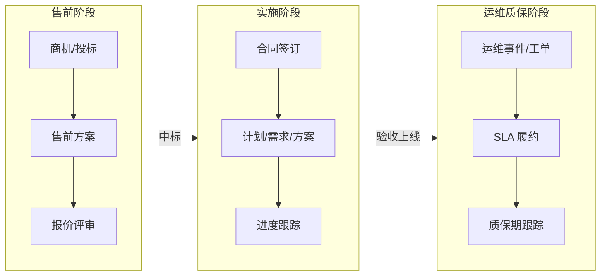
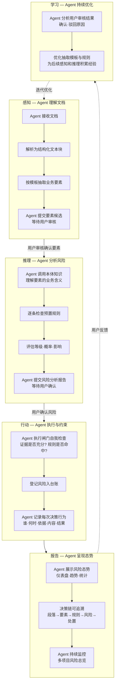
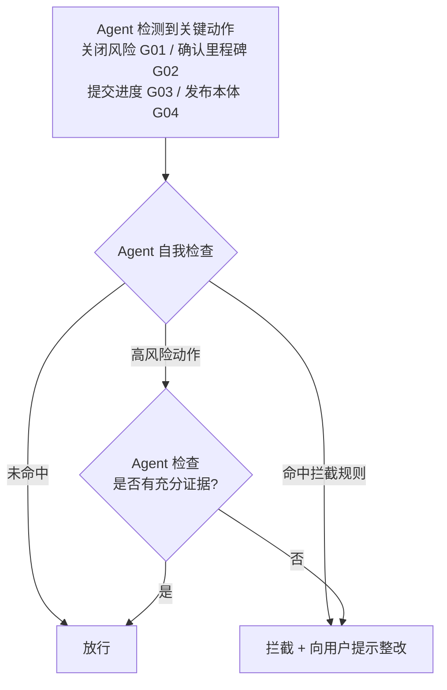
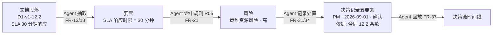
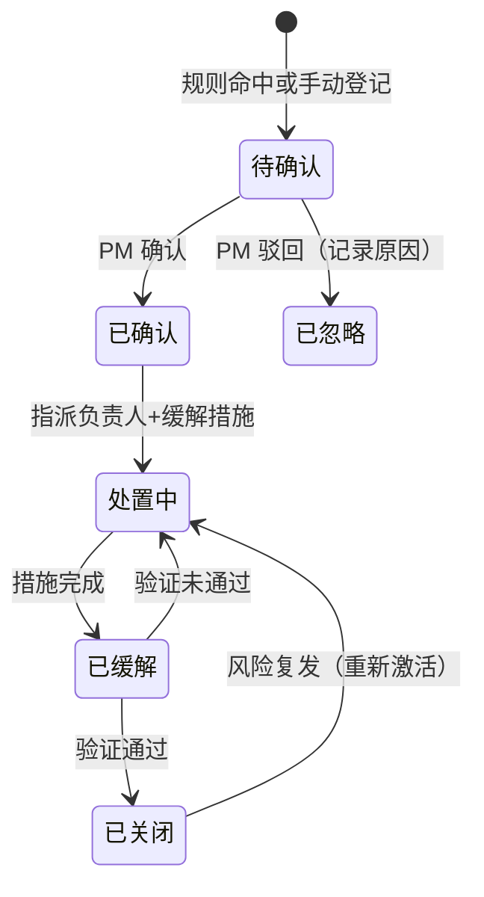

# 项目风险管控 Agent —— 需求规格说明书 v1.1（Agent 视角）

> 版本：v1.1（Agent 视角重组稿）
> 日期：2026-08-25
> 状态：待评审
> 变更记录：v1.1 从"功能系统"视角重组为"Agent 认知架构"视角——按感知/推理/行动/学习/报告/协作组织能力需求，保留全部 FR 编号与规则
> 版本关系：v1.1 基于 v1.0 需求内容重组，无需求增减，仅重新组织和表述
> 读者：项目经理（业务方）、开发人员、测试人员

---

## 1. Agent 概述

### 1.1 Agent 定位

这是一个**项目风险管控 Agent**——它利用本体知识理解项目业务（合同/里程碑/需求/进度），主动感知文档内容，推理识别潜在风险，在关键动作前自我约束（闸门），并向用户提交可追溯的分析报告。用户与 Agent 的关系不是"操作者 vs 系统"，而是**协作者关系**：

> **用户**告诉 Agent 项目信息 → **Agent**自主分析后提交报告 → **用户**确认/修正/补充 → **Agent**从反馈中持续优化

Agent 覆盖**售前 → 实施 → 运维质保**全链路：



Agent 可以接收五类文档输入：**合同内容 / 项目范围 / 功能清单 / 产品原型 / 技术方案**。

### 1.2 使用方

| 角色 | 与 Agent 的关系 | MVP 支持 |
|---|---|---|
| 项目经理（PM） | 向 Agent 提供项目资料，审核 Agent 的分析结果，与 Agent 协作处置风险，引导 Agent 持续优化 | ✅ 单用户演示模式 |

### 1.3 Agent 能力全景

Agent 的能力按认知架构分为五个维度：

| 能力维度 | 一句话描述 | 对应原功能 |
|---|---|---|
| **知识基座** | Agent 拥有领域知识模型（本体），能理解"合同""里程碑""风险"是什么关系 | 本体建模工作台 |
| **感知** | Agent 读取文档，理解内容，抽取结构化要素 | 文档解析、要素抽取 |
| **推理** | Agent 基于业务知识和规则，判断哪些要素隐含风险 | 规则引擎、风险量化 |
| **行动** | Agent 执行风险登记、关键动作前提检查（闸门）、决策记录与回溯 | 闸门、风险处置、审计追溯 |
| **学习** | Agent 从用户的审核反馈中优化自身的抽取和推理 | 审核队列、共进化 |
| **报告** | Agent 向用户呈现风险态势分析、知识图谱和追溯链 | 仪表盘、关系图谱、决策链 |
| **协作** | 用户介入确认/修正/补充 Agent 的判断 | 人工审核队列、手动登记、闸门豁免 |

### 1.4 MVP 范围（Agent 的 MVP 能力边界）

上传《软件开发合同》→ Agent 自动完成以下完整链路：

```
Agent 感知文档 → 抽取结构化要素 → 提交用户审核
→ Agent 推理识别风险 → 输出风险报告 → 用户处置
→ Agent 记录决策链 → 持续呈现态势
```

**MVP 成功标准：**
1. 上传《软件开发合同》→ Agent 自动解析并抽取 → 命中 4 条预置规则、生成 4 个风险（含证据段落引用）
2. 每个风险的"决策链"可回放：**文档段落 → 要素 → 规则 → 风险 → 处置记录**
3. 内置示例数据（真实合同结构），演示模式开箱即用，打开即看懂项目风险态势
4. Agent 的知识基座（本体）可以浏览和修改

**范围内（P0，必须交付）：**

| 能力 | 内容 |
|---|---|
| 项目基础 | 项目列表、项目工作台、多项目隔离 |
| 知识基座 | 本体类/关系/属性 CRUD、图谱可视化、变更发布流（草案→审核→发布→回滚） |
| 感知——文档处理 | 五类文档上传、解析（PDF/Word/Excel）、带编号文本块、版本管理 |
| 感知——要素抽取 | 合同模板抽取（规则式抽取兜底）、要素候选审核队列 |
| 推理——规则识别 | 10 条预置规则（含对应的领域推理逻辑）、规则运行 |
| 行动——闸门 | 4 条闸门规则（关闭风险/确认里程碑/提交进度/发布本体） |
| 行动——风险处置 | 风险台账、状态机流转、量化（概率×影响）、缓解管理、决策记录、决策链回放 |
| 报告——态势展示 | 单项目仪表盘、多项目总览统计卡、关系图谱 |
| 协作——用户介入 | 审核要素候选、手动登记风险、人工处置 |
| Agent 学习 | 驳回原因记录（为后续优化积累数据） |
| 运行支撑 | 示例数据、演示模式 |

### 1.5 非范围（后续增强）

| 能力 | 处理 |
|---|---|
| Agent 对外服务能力（MCP 接口） | P1（预留编号 FR-48），MVP 内部运行 |
| 用户登录 / 多角色 | P1，MVP 单用户模式 |
| Agent 自动提建议（CQ 辅助建模） | P1 |
| Agent 自动优化模板（共进化提示） | P1，MVP 仅记录数据 |
| 批量数据导入 | P1 |
| 生产级部署（Postgres / Redis / 容器化） | P2，MVP 单机运行 |

---

## 2. 术语与约定

| 术语 | 含义 |
|---|---|
| 五类文档 | 合同、项目范围、功能清单、产品原型、技术方案 |
| 本体 | Agent 的领域知识模型：15 个核心类 + 16 条关系 + 18 个属性 + 4 个支撑类 |
| 要素 | Agent 从文档中抽取的结构化信息（如"付款节点 = 需求签字后付 15%"） |
| 文本块 | Agent 将文档解析为带编号段落（`文档ID-版本-段落号`），是引用溯源的最小单位 |
| 决策链 | 段落 → 要素 → 规则 → 风险 → 处置 的完整追溯链 |
| 闸门 | Agent 在执行关键动作前的自我检查——"允许执行吗？" |
| P0/P1/P2 | 合同 4.2 优先级定义：P0 必须交付 / P1 应当交付 / P2 尽力交付 |

---

## 3. Agent 工作流程

### 3.1 Agent 总体交互流程

Agent 与用户的协作分五个阶段，每个大节点内部包含 Agent 自主完成的子流程：



### 3.2 用户与 Agent 的协作场景

| 编号 | 作为… | 我想要 Agent 做什么 | 以便… | 涉及能力 |
|---|---|---|---|---|
| US-01 | PM | 上传合同 PDF 后 Agent 自动解析出结构化要素 | 不用手工录入合同关键信息 | 感知 |
| US-02 | PM | 对 Agent 抽取的要素逐条审核确认 | 保证 Agent 识别结果的准确性 | 感知/学习 |
| US-03 | PM | Agent 自动提示合同/计划/进度中的风险 | 风险前置暴露、及时处置 | 推理 |
| US-04 | PM | 每个风险能回溯到原文段落和触发规则 | 决策有据可查、汇报有说服力 | 行动/报告 |
| US-05 | PM | Agent 在关闭高风险前强制我填写缓解措施 | 避免"有台账无处置" | 行动（闸门） |
| US-06 | PM | 回放某个风险从产生到关闭的全过程 | 复盘改进、应对甲方审计 | 报告 |
| US-07 | PM | 一屏看到全部项目的风险态势 | 多项目总览、资源调配 | 报告 |
| US-08 | PM | 修改 Agent 的知识模型（如新增"外包风险"类） | 知识模型随业务演进 | 知识基座 |

---

## 4. Agent 能力需求

### 4.1 知识基座 — 本体管理

Agent 需要一套领域知识模型（本体）来理解业务的**概念**和**关系**。这是 Agent 的"大脑"——没有它，Agent 无法理解"合同"和"里程碑"之间有什么关联，也无法推理"付款依赖外部签字"为什么是风险。

| 编号 | 能力 | 描述 | 优先级 |
|---|---|---|---|
| FR-04 | 本体浏览 | 图谱可视化展示 15+4 类、16 关系，点击查看类详情（属性/关系） | P0 |
| FR-05 | 类管理 | 本体类增删改查（名称/描述/属性列表/关系列表） | P0 |
| FR-06 | 关系与属性管理 | 对象属性（关系）、数据属性（字段）的增删改查 | P0 |
| FR-07 | 变更发布流 | 修改走"草案 → 审核 → 发布"，发布生成版本快照，可回滚到历史版本 | P0 |
| FR-08 | 模板联动提示 | 类/属性变更时，Agent 提示"相关抽取模板可能需同步更新"（不自动改） | P1 |

### 4.2 感知能力 — 文档理解

Agent 读取五类项目文档，理解其内容并抽取结构化要素。这是 Agent 的"眼睛"——它从自然语言中提取出本体可理解的业务信息。

| 编号 | 能力 | 描述 | 优先级 |
|---|---|---|---|
| FR-09 | 文档接收 | 支持 PDF / Word（docx）/ Excel（xlsx）上传，单文件 ≤ 50MB | P0 |
| FR-10 | 文档解析 | PDF/Word 按段落、Excel 按单元格/行生成带编号文本块（`文档ID-版本-段落号`），可查看原文 | P0 |
| FR-11 | 版本管理 | 同文档重复上传生成新版本，历史版本可查看/对比 | P0 |
| FR-12 | 文本块展示 | 按文档类型展示解析结果，段落编号可折叠/展开 | P0 |
| FR-13 | 抽取触发 | 对已解析文档手动触发抽取（调用模板引擎） | P0 |
| FR-14 | 要素审核 | 要素候选逐条审核：确认 / 驳回（必填原因）/ 修改后确认；驳回原因入库供后续学习 | P0 |
| FR-15 | 模板定义（感知模板） | 每种文档类型一个抽取模板（字段 + 锚定本体类/属性），内置合同模板 | P0 |
| FR-16 | 模板管理 | 模板列表查看、新增、编辑 | P0 |
| FR-17 | 规则式抽取（兜底） | LLM 不可用时规则式抽取：确定性字段正则抽取；语义字段关键词近似匹配，低置信度留空由人工补充 | P0 |
| FR-18 | LLM 增强抽取 | 配置 API Key 后启用 LLM 辅助抽取，产出要素候选 + 置信度 | P1 |
| FR-45 | LLM 配置 | 配置 API Key / Base URL / 模型（OpenAI 兼容 / Ollama），默认关闭；LLM 抽取的前置条件 | P1 |
| FR-19 | 抽取结果展示 | 候选要素列表：字段名/抽取值/置信度/来源段落，可跳转原文 | P0 |

### 4.3 推理能力 — 风险识别

Agent 基于本体知识和预置规则进行推理，判断哪些要素隐含项目风险。这是 Agent 的"大脑"——它回答"这些业务信息中，哪些可能导致项目出问题？"

| 编号 | 能力 | 描述 | 优先级 |
|---|---|---|---|
| FR-20 | 预置规则 | Agent 内置 10 条预置识别规则（见第 7 章），随安装提供 | P0 |
| FR-21 | 规则运行 | 对已确认要素集运行规则引擎，产出风险信号（待用户确认） | P0 |
| FR-22 | 规则管理 | Agent 的规则列表（名称/类型/等级/启用状态/命中次数） | P1 |
| FR-23 | 规则编辑 | 用规则 DSL 新增/编辑规则，语法校验 | P1 |
| FR-24 | 规则开关 | 单条规则启用/停用 | P0 |
| FR-25 | 命中详情 | 每条风险显示"命中规则 + 触发字段值 + 证据段落"——Agent 解释"为什么认为这是风险" | P0 |

**Agent 的风险评估逻辑**（等级 = f(概率 × 影响））：

- 概率与影响均取 高/中/低 三档（自动识别默认 中，用户可调）
- 默认映射矩阵：

| 概率 \ 影响 | 低 | 中 | 高 |
|---|---|---|---|
| 高 | 黄 | 红 | 红 |
| 中 | 黄 | 黄 | 红 |
| 低 | 绿 | 黄 | 黄 |

### 4.4 行动约束 — 闸门机制

Agent 在执行关键动作前进行自我检查——"这个动作在当前条件下是否允许执行？"这是 Agent 的"刹车"机制，确保不产生无证据、无措施的风险操作。

| 编号 | 能力 | 描述 | 优先级 |
|---|---|---|---|
| FR-26 | 闸门拦截 | 关键动作先过闸门检查，命中拦截规则则阻止并提示原因（见 7.2 闸门规则） | P0 |
| FR-27 | 证据审查 | 高风险信号入台账前必须有证据（文档段落 + 命中规则），无证据拦截；处置确认时再补决策人 | P0 |
| FR-28 | 闸门豁免 | 拦截后可申请豁免（记录豁免人与理由），不自动放行——用户可裁决是否覆盖 Agent 的判断 | P1 |

**闸门检查流程**（Agent 的自我约束）：



### 4.5 行动执行 — 风险处置与回溯

Agent 执行风险管理的具体行动，并记录完整的决策链，使每步都可追溯、可审计。

| 编号 | 能力 | 描述 | 优先级 |
|---|---|---|---|
| FR-29 | 风险台账 | 列表展示：类型/等级/概率/影响/状态/触发来源，支持筛选排序 | P0 |
| FR-30 | 风险详情 | 风险详情页：描述、证据段落（可跳原文）、命中规则、处置记录时间线 | P0 |
| FR-31 | 风险状态机 | 状态流转：待确认 → 已确认 → 处置中 → 已缓解 → 已关闭；待确认 → 已忽略（见 7.3） | P0 |
| FR-32 | 风险登记 | 手动登记风险（不走 Agent 识别流水线，但走闸门检查） | P0 |
| FR-33 | 风险量化 | 等级 = f(概率 × 影响)，红(高)/黄(中)/绿(低) 三级展示 | P0 |
| FR-34 | 缓解管理 | 风险指派负责人、填写缓解措施、跟踪措施状态 | P0 |
| FR-35 | 风险关联 | 风险可关联到里程碑/需求/进度/运维事件（本体关系） | P1 |
| FR-36 | 决策记录 | Agent 在风险每次状态变化时自动记录五要素：决策人 + 时间 + 依据证据 + 决策内容 + 结果 | P0 |
| FR-37 | 决策链回放 | 风险页提供"回放"：段落 → 要素 → 规则 → 风险 → 处置，时间线展示 | P0 |
| FR-38 | 操作留痕 | Agent 的关键操作（本体发布/模板修改/规则启停）的系统审计日志 | P0 |

**决策链示意图**（Agent 的回溯逻辑）：



### 4.6 学习能力 — 从反馈优化

Agent 分析用户的审核和处置行为，逐步提升感知和推理的准确性。这是 Agent 的"学习"能力——它不仅仅是执行，还会从互动中持续进步。

| 编号 | 能力 | 描述 | 优先级 |
|---|---|---|---|
| FR-14 | 要素审核（学习数据积累） | 驳回原因入库，Agent 可利用该数据优化抽取精度 | P0 |
| FR-39 | 跨源对账 | Agent 比对合同付款节点 vs 计划里程碑 vs 实际进度，不一致标红提醒用户 | P1 |
| FR-40 | 就绪度评分 | Agent 计算里程碑就绪度 = 需求确认率×40% + 方案评审率×30% + 风险处置率×30%，低于 70 亮黄灯 | P1 |
| FR-41 | 编号门禁 | 方案文档必须 `@implements 需求编号` 挂接，无挂接 Agent 亮红灯提示 | P1 |

### 4.7 报告能力 — 输出与呈现

Agent 向用户呈现风险态势分析、知识图谱和决策追溯链。这是 Agent 的"表达"能力——它把分析结果转化为用户一目了然的可视化报告。

| 编号 | 能力 | 描述 | 优先级 |
|---|---|---|---|
| FR-42 | 单项目仪表盘 | Agent 展示风险统计卡（总数/高/中/低/未处置）、风险趋势、近期待办（审核队列数/拦截数） | P0 |
| FR-43 | 多项目总览 | Agent 展示全部项目的风险态势一屏（风险数/高等级数/处置率），点击进入项目 | P0 |
| FR-44 | 演示模式 | 一键加载示例数据，无登录直接进入，可重置回初始状态——让用户立即体验 Agent 的全链路能力 | P0 |
| FR-46 | 本体版本 | 查看/回滚已发布的本体版本快照 | P0 |
| FR-47 | 关系图谱 | 项目全链路知识图谱（风险-里程碑-需求-文档关系），点击节点跳转详情 | P0 |
| FR-48 | MCP 接口层（预留） | Agent 的核心能力对外暴露为 MCP 工具（query_ontology / get_risk_feed / create_risk / check_rule），供其他 Agent 调用 | P1（预留） |

### 4.8 协作能力 — 人工介入

用户与 Agent 协同工作：用户补充 Agent 无法获取的信息、确认或修正 Agent 的判断、裁决 Agent 的闸门拦截。

| 编号 | 能力 | 描述 | 优先级 |
|---|---|---|---|
| FR-01 | 项目列表 | 展示全部项目，支持新建/编辑/删除——Agent 的工作空间 | P0 |
| FR-02 | 项目工作台 | 单项目视角：文档/要素/风险/进度等数据总览，切换进入各模块 | P0 |
| FR-03 | 项目隔离 | 所有业务数据带 `project_id`，Agent 按当前项目过滤展示，跨项目数据不可见 | P0 |
| FR-32 | 风险登记 | 用户手动登记风险（不走 Agent 识别流水线，但走闸门） | P0 |
| FR-34 | 缓解管理 | 用户指派负责人、填写缓解措施 | P0 |
| FR-28 | 闸门豁免 | 用户裁决是否覆盖 Agent 的拦截判断 | P1 |

### 4.9 基础能力 — 业务数据管理

Agent 需要访问项目的基础业务数据（需求/方案/计划/进度/运维事件），这些数据是 Agent 推理的上下文。

| 编号 | 能力 | 描述 | 优先级 |
|---|---|---|---|
| FR-49 | 需求管理 | 需求 CRUD（编号/优先级/状态/来源/变更次数/确认状态） | P0 |
| FR-50 | 方案管理 | 方案 CRUD（产品/技术方案、技术栈、评审状态、未决项），支持 `@implements 需求编号` 挂接 | P0 |
| FR-51 | 里程碑计划 | 里程碑/任务 CRUD（名称/计划起止/负责人），绑定项目 | P0 |
| FR-52 | 进度管理 | 里程碑实际进度录入（实际起止/进度百分比/延期天数/阻塞标记） | P0 |
| FR-53 | 运维事件 | 运维工单 CRUD（工单编号/问题描述/SLA 状态/响应与解决时长） | P1 |
| FR-54 | SLA 管理 | SLA 配置（响应时限/解决时限/违约条款），供 R05 推理引用 | P1 |

---

## 5. Agent 交互界面

Agent 通过以下"对话窗口"与用户交互。每个页面是 Agent 与用户在某项协作上的界面：

| 路由 | 页面 | 对应能力 |
|---|---|---|
| `/` | 仪表盘（多项目总览 + 演示模式入口） | 报告 |
| `/projects` | 项目列表——Agent 的工作空间管理 | 协作 |
| `/projects/:id` | 项目工作台——用户更新业务数据，Agent 读取上下文 | 协作/基础 |
| `/projects/:id/documents` | 文档中心——用户给 Agent 资料，Agent 解析抽取 | 感知 |
| `/projects/:id/audit` | 要素审核——用户确认/修正 Agent 的感知结果 | 感知/学习 |
| `/projects/:id/risks` | 风险中心——Agent 的分析报告 + 用户处置 | 推理/行动/报告 |
| `/projects/:id/consistency` | 一致性检测——Agent 自动对账 | 推理/报告 |
| `/projects/:id/graph` | 关系图谱——Agent 的知识可视化 | 报告/知识基座 |
| `/ontology` | 本体建模——用户调整 Agent 的知识模型 | 知识基座 |
| `/rules` | 规则管理——用户查看/调整 Agent 的推理规则 | 推理 |
| `/templates` | 模板管理——用户查看/调整 Agent 的感知模板 | 感知 |
| `/settings` | 系统设置 | 基础 |

---

## 6. Agent 的知识领域模型

Agent 理解的领域知识——这些实体和关系构成了 Agent 理解项目业务的语言。以下列出 Agent 必须掌握的核心概念：

| 实体 | Agent 理解的内容 |
|---|---|
| Project | 项目基本信息（名称/客户/周期/状态） |
| Document | 五类文档，包含带编号段落（文本块) |
| Contract | 交付范围、付款节点（名称/比例/触发条件）、验收条款、范围外事项 |
| Requirement | 需求（编号/优先级/状态/变更次数/确认状态) |
| Solution | 技术方案（技术栈/评审状态/未决项) |
| FeatureList | 功能清单（功能数/优先级/功能描述) |
| Prototype | 产品原型（链接/评审状态) |
| Milestone | 里程碑（名称/计划/实际/延期) |
| Progress | 进度（百分比/延期天数/阻塞标记) |
| OpsEvent | 运维事件（工单/SLA 状态/响应时长/解决时长) |
| Sla | SLA 配置（响应时限/解决时限/违约条款) |
| Risk | 风险（类型/等级/概率/影响/状态/缓解措施/负责人) |
| Evidence | 证据（来源文档段落 + 文本片段) |
| Decision | 决策记录（决策人/时间/依据/内容/结果) |
| Template | 抽取模板（文档类型/字段定义/本体绑定) |
| Rule | 规则 DSL（逻辑/启用状态/命中次数) |

---

## 7. Agent 的推理规则

### 7.1 预置识别规则（10 条，随 Agent 安装提供）

Agent 内置以下 10 条规则，用于合同要素中识别风险信号：

| # | 规则名 | Agent 的检查逻辑 | 生成风险 | 初始等级 |
|---|---|---|---|---|
| R01 | 验收标准缺失 | 检查合同是否有验收条款（`contract.has_acceptance_clause == false`） | 验收风险 | 高 |
| R02 | 范围描述模糊 | 检查合同范围描述是否含"尽力/酌情/视情况/尽可能"等模糊用词 | 范围模糊风险 | 中 |
| R03 | 付款依赖外部签字 | 检查付款节点是否依赖外部确认（如"需求确认签字"） | 里程碑依赖风险 | 中 |
| R04 | 变更管理压力大 | 检查范围外事项数量 ≥ 5 项 | 变更管理风险 | 低 |
| R05 | SLA 响应资源不足 | 检查响应时限 ≤ 120 分钟（推导：承诺越短 → 运维压力越大） | 运维资源风险 | 高 |
| R06 | 需求蔓延 | 检查需求变更次数 > 3 且未确认 | 范围蔓延风险 | 高 |
| R07 | 功能清单过大 | 检查功能数 > 50 且无优先级排序 | 交付质量风险 | 中 |
| R08 | 方案未评审 | 检查技术方案是否已评审 | 实施延期风险 | 中 |
| R09 | 里程碑延期 | 检查里程碑延期天数 > 7 天 | 里程碑延期风险 | 高 |
| R10 | 联动升级 | 同一风险影响 ≥ 2 个里程碑时，等级上调一级 | 原风险上调 | — |

> **等级说明**：规则预设等级 = **初始等级**（Agent 输出时的默认展示值）；用户可调整概率/影响，调整后按 4.3 矩阵**实时重算**等级，**用户不改动时以初始等级展示**；R10 联动升级在矩阵重算后生效。
>
> **R10 依赖说明**："风险-里程碑"关联数据在 MVP 中仅来自种子数据预置或自动识别上下文（手动关联界面为 P1，FR-35）；示例数据不预置多里程碑关联，**R10 不参与示例验收**，无关联数据时默认不触发。

### 7.2 闸门规则（4 条）

Agent 在执行关键动作前自我检查：

| # | 关键动作 | Agent 的拦截条件 | 向用户的提示 |
|---|---|---|---|
| G01 | 关闭风险 | 等级=高 且 缓解措施为空 | "先填写缓解措施" |
| G02 | 确认里程碑完成 | 存在未处置的高等级风险影响该里程碑 | "先处置影响风险" |
| G03 | 提交进度 | 实际进度 < 计划 且 未登记延期风险 | "先登记延期风险" |
| G04 | 发布本体 | 存在未审核的本体草案变更 | "先完成草案审核" |

### 7.3 风险状态机

Agent 管理风险的生命周期流转：



---

## 8. Agent 的抽取模板

Agent 使用抽取模板将文档内容映射为本体可理解的要素。模板字段必须锚定本体类/属性（grounding），否则 Agent 无法关联推理。

| 模板 | Agent 要抽取的字段（锚定本体） | 抽取来源 | 优先级 |
|---|---|---|---|
| 合同模板 ContractExtractor | 合同编号、甲方、乙方、交付范围（→Contract.scope_text）、付款节点（→Contract.payment_milestones）、验收条款（→Contract.has_acceptance_clause）、SLA 响应时限（→Sla.response_time）、质保期（→Warranty.period）、范围外事项（→Contract.excluded_items） | 规则式（关键词/正则）兜底，LLM 增强可选 | P0 |
| 项目范围模板 ScopeExtractor | 范围描述、边界、优先级定义、验收标准 | 同上 | P1 |
| 功能清单模板 FeatureExtractor | 模块、功能点、优先级、接口依赖 | 同上 | P1 |
| 产品原型模板 PrototypeExtractor | 页面、交互说明、评审状态 | 同上 | P1 |
| 技术方案模板 SolutionExtractor | 技术栈、架构、评审状态、未决项 | 同上 | P1 |

---

## 9. Agent 运行示例

### 9.1 示例数据集

基于《软件开发合同》构造，随 Agent 内置。演示模式下 Agent 直接加载该数据集并展示分析结果：

| 数据 | 内容 |
|---|---|
| 项目 | 1 个："摸鱼智慧供应链管理平台"项目 |
| 合同 | HT-2026-DEV-0823：5 期付款、范围外事项 5 项、SLA 30 分钟响应、质保 12 个月 |
| 里程碑计划 | MS1-MS8（合同第七条） |
| 进度 | MS1 已完成、MS2 进行中（延期 2 天，未触发 R09） |
| 需求 | 5 条（含未确认项，供 R06 检查） |
| 技术方案 | 1 份（已评审，含"新技术栈 Elasticsearch 8"，供扩展规则预留） |
| 运维事件 | 2 条（SLA 状态：正常） |

### 9.2 预期识别结果（验收对照基准）

Agent 对示例合同执行完整感知→推理后，应输出以下 4 个风险：

| # | Agent 识别的风险 | 触发规则 | 证据（原文） | 初始等级 |
|---|---|---|---|---|
| 1 | P2 功能承诺模糊 | R02（含"尽力交付"） | 4.2 注："P2 为尽力交付" | 中 |
| 2 | 里程碑付款依赖外部确认 | R03 | 3.2："付款以《需求规格说明书》签字为前提" | 中 |
| 3 | SLA 响应资源不足 | R05（30 分钟内响应） | 12.2："S1 级 30 分钟内响应" | 高 |
| 4 | 变更管理压力大 | R04（范围外 5 项） | 4.3："范围外事项 5 项 + 8.2 变更流程" | 低 |

---

## 10. Agent 的非功能性要求

| 编号 | 类别 | 需求 |
|---|---|---|
| NFR-01 | 部署 | 单机可运行：一条命令启动 Agent 前后端；数据本地存储 |
| NFR-02 | 性能 | 在基准数据集规模（1 项目 / 50 文本块 / 200 要素 / 100 风险）下，核心页面响应 ≤ 2s；10 条规则 × 100 要素推理 < 1s |
| NFR-03 | 兼容 | Chrome 90+ / Edge 90+ / Firefox 90+ / Safari 15+ |
| NFR-04 | 安全 | 演示模式无外部网络依赖（LLM 默认关闭）；启用 LLM 抽取时文档内容发送至所配置的模型服务 |
| NFR-05 | 合规 | 引入依赖全部宽松许可证（Apache/MIT/BSD），无 AGPL/GPL；交付附开源组件清单 |
| NFR-06 | 数据 | LLM 不落库原始对话；本体版本快照可回滚 |
| NFR-07 | 可维护 | 种子数据可重置；规则 DSL 与模板 JSON 导出/导入为 P1 |
| NFR-08 | 演示 | 演示模式一键加载示例数据、一键重置，无需配置即可跑通全流程 |

---

## 11. 验收标准

### 11.1 MVP 总验收

| # | 验收项 | 通过标准 |
|---|---|---|
| A01 | 端到端识别 | 上传《软件开发合同》→ Agent 解析 → 审核确认要素 → 推理 → 命中 R02/R03/R05/R04 → 生成 4 个风险 |
| A02 | 证据挂接 | 每个风险可点击证据段落跳回合同原文 |
| A03 | 决策链回放 | 任一风险可回放：段落 → 要素 → 规则 → 风险 → 处置 |
| A04 | 闸门拦截 | 尝试关闭高等级无缓解措施的风险 → 被 Agent 拦截并提示 |
| A05 | 本体发布流 | 新增一个类 → 审核 → 发布 → 回滚，全过程成功 |
| A06 | 多项目总览 | 创建第 2 个项目，总览页正确统计两个项目风险数 |
| A07 | 演示模式 | 一键加载示例数据，加载后无需任何配置即可完成全流程演示 |
| A08 | 合规检查 | 依赖清单全部宽松许可证 |

### 11.2 里程碑验收

| 里程碑 | 验收标志 |
|---|---|
| M1 | Agent 能接收文档并完成"上传→解析"（前后端联通） |
| M2 | 用户修改 Agent 的知识模型（改一个类）→ 审核 → 发布 → 回滚 |
| M3 | Agent 能解析合同 PDF 并生成带编号文本块 |
| M4 | Agent 对合同示例命中 4 条预置规则且决策链可回放 |
| M5 | Agent 的多项目总览页一次加载即呈现全部项目风险统计 |

---

## 12. 能力优先级

| 优先级 | 范围 | 对应功能 |
|---|---|---|
| **P0（最小闭环）** | 项目管理、本体浏览+发布流、文档上传解析、合同模板+规则式抽取、审核队列、10 条预置规则、闸门、风险台账+状态机+决策链、业务数据录入、单项目仪表盘、多项目总览、关系图谱、示例数据+演示模式 | FR-01~07, 09~17, 19~21, 24~27, 29~34, 36~38, 42~44, 46~47, 49~52 |
| **P1** | 其余四类模板、LLM 抽取、规则编辑、对账/就绪度/编号门禁、CQ 辅助、共进化提示、Excel 导入、LLM 配置、闸门豁免、风险关联、运维事件/SLA 管理、用户登录与多角色、MCP 接口层 | FR-08, 18, 22~23, 28, 35, 39~41, 45, 53~54, FR-48（预留） |
| **P2** | 生产级部署 | — |

---

## 13. 开放问题（待评审确认）

| # | 问题 | 建议 | 影响 |
|---|---|---|---|
| Q01 | 风险等级映射表概率×影响 → 红/黄/绿的具体分档规则？ | 默认 3×3 矩阵已写入 4.3，评审确认即可 | FR-33 |
| Q02 | 需求/进度的录入方式：MVP 纯手工表单，还是支持 Excel 导入？ | MVP 手工表单 + 示例数据预置；Excel 导入 P1 | FR-03/FR-40 |
| Q03 | 多项目隔离的"当前项目"如何切换？（MVP 无登录） | 顶部项目选择器（全局状态），URL 携带 project_id | FR-03 |
| Q04 | 模板共进化：MVP 是否需要"驳回原因 → 模板建议"提示？ | MVP 仅记录驳回原因，人工看；提示功能 P1 | FR-14 |
| Q05 | 五类文档是否都要完整模板？ | 合同模板 P0 必做，其余四类 P1 | 第 8 章 |
| Q06 | 演示模式的示例数据是否需要可编辑？ | 示例数据可编辑、可重置 | FR-44 |
| Q07 | 规则 DSL 语法细节（操作符、类型、组合）何时定稿？ | 详细设计阶段定稿（10 条预置规则先行） | FR-20~23 |
| Q08 | 就绪度公式的权重是否可配置？ | MVP 硬编码 40/30/30，P1 可配置 | FR-40 |