# 项目风险管控 Agent —— 技术架构方案 v1.1

> 版本：v1.1（Agent 认知架构视角）
> 日期：2026-08-25
> 基于：[需求规格说明书 v1.1](./01.需求文档/项目风险管控工具-需求规格说明书-v1.1.md)（Agent 视角需求）
> 继承：[设计方案 v1.0](./项目风险管控工具设计方案-v1.0.md)（技术选型与组件设计）
> 读者：架构师、开发人员

---

## 1. 架构总览

### 1.1 Agent 认知架构全景

将需求文档 v1.1 的五阶段 Agent 能力（感知 → 推理 → 行动 → 报告 → 学习）映射为技术架构的四层一基座：

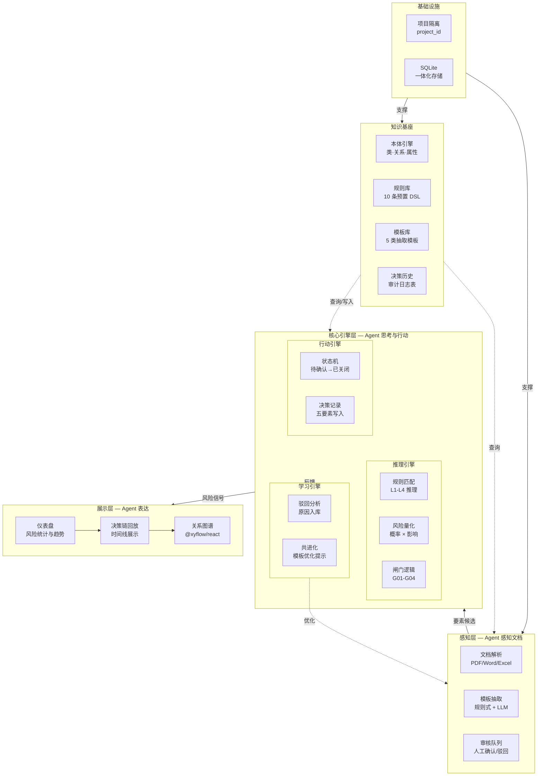

### 1.2 技术栈全景

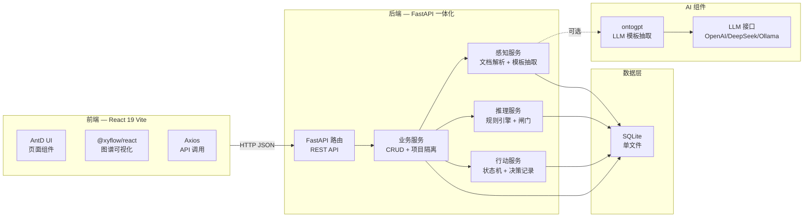

### 1.3 组件与能力的映射

| Agent 能力（v1.1 需求） | 技术组件 | 技术选型 |
|---|---|---|
| 知识基座 — 本体管理 | 本体引擎 + 图谱可视化 | FastAPI + SQLite JSON + @xyflow/react |
| 感知 — 文档理解 | 文档解析 + 模板抽取 + 审核 | pdfplumber/python-docx/openpyxl + ontogpt |
| 推理 — 风险识别 | 规则引擎 + 风险量化 | semantica Rete 参考实现（Python） |
| 行动 — 闸门 + 风险处置 | 闸门服务 + 状态机 + 决策链 | FastAPI 业务层 |
| 学习 — 共进化 | 驳回分析 + 模板优化提示 | FastAPI + SQLite 分析 |
| 报告 — 态势呈现 | 仪表盘 + 图谱 + 决策链 | React + AntD + @xyflow/react |

---

## 2. 感知层（Perception Layer）

### 2.1 文档解析流水线

Agent 获取输入的第一步：将五类文档（PDF/Word/Excel）解析为结构化文本块。

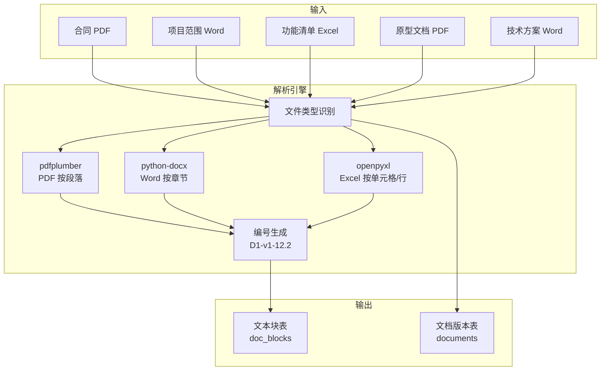

**关键设计**：文本块编号格式 `文档ID-版本-段落号`（如 `D1-v1-12.2`），与 v1.1 需求 FR-10 的证据编号体系一致。

### 2.2 模板抽取引擎

Agent 的核心感知能力：按模板将文本块中的自然语言映射为本体要素。

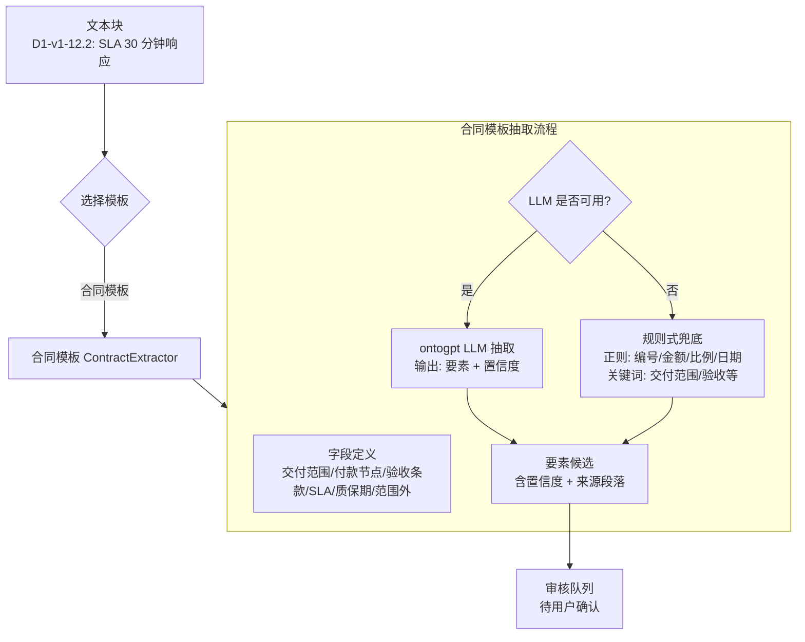

**抽取引擎的内部结构**：

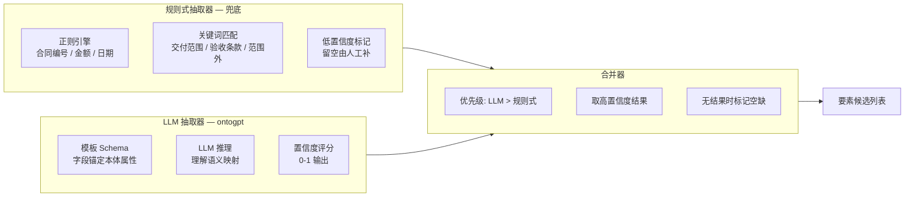

### 2.3 审核队列

Agent 提交要素候选后，用户审核确认的交互流程：

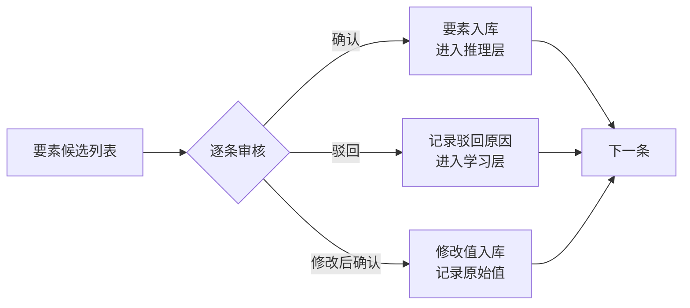

---

## 3. 知识层（Knowledge Layer）

### 3.1 本体引擎

Agent 的知识基座：存储和查询本体模型（15 核心类 + 16 关系 + 18 属性 + 4 支撑类）。

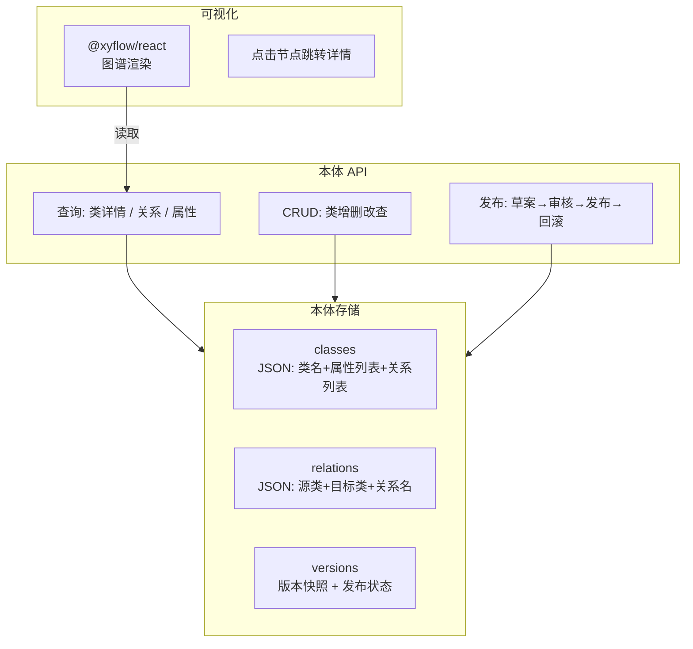

**本体变更发布流**的数据状态演变：

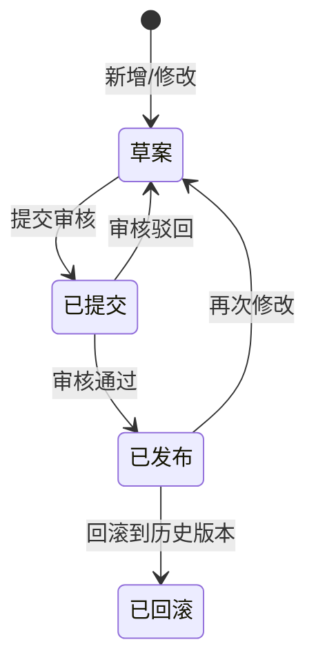

### 3.2 规则库

10 条预置规则以 DSL 形式存储，支持启停控制：

```
规则存储格式（SQLite rules 表）：
{
  "id": "R05",
  "name": "SLA 响应资源不足",
  "dsl": "sla.response_time <= 120",
  "type": "threshold",
  "risk_type": "运维资源风险",
  "default_level": "高",
  "enabled": true,
  "hit_count": 3
}
```

---

## 4. 推理层（Reasoning Layer）

### 4.1 L1-L4 推理架构

Agent 从要素到风险的推理分四个层次，逐层递进：

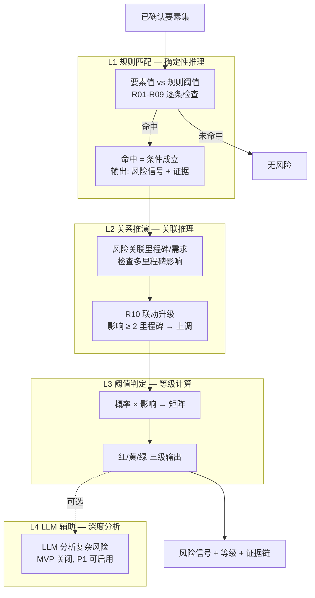

### 4.2 规则匹配流程（以 R05 为例）

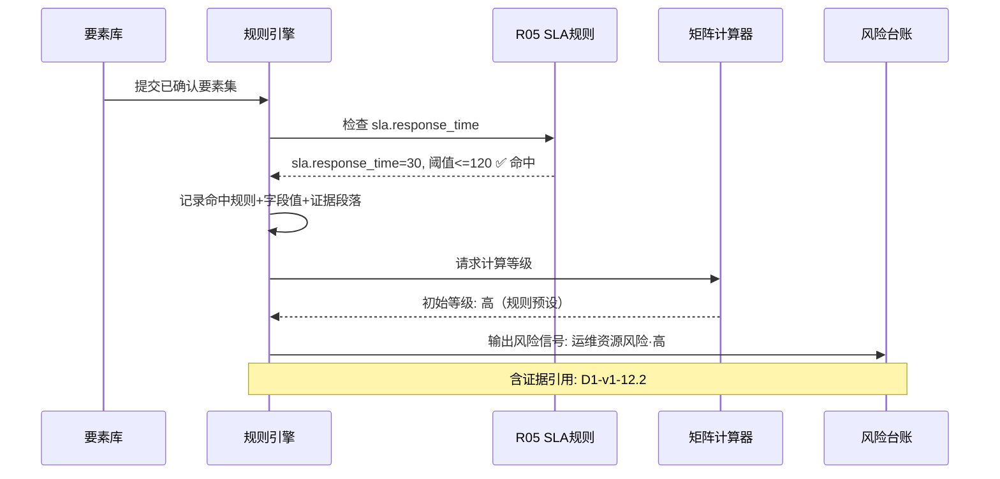

### 4.3 闸门逻辑执行

闸门是 Agent 的自我约束机制，在关键动作前拦截检查：

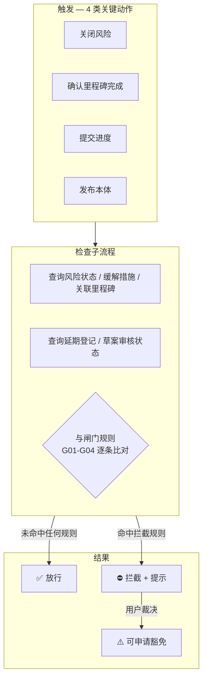

---

## 5. 行动层（Action Layer）

### 5.1 风险状态机实现

Agent 管理风险的全生命周期，每次状态变更自动记录决策五要素：

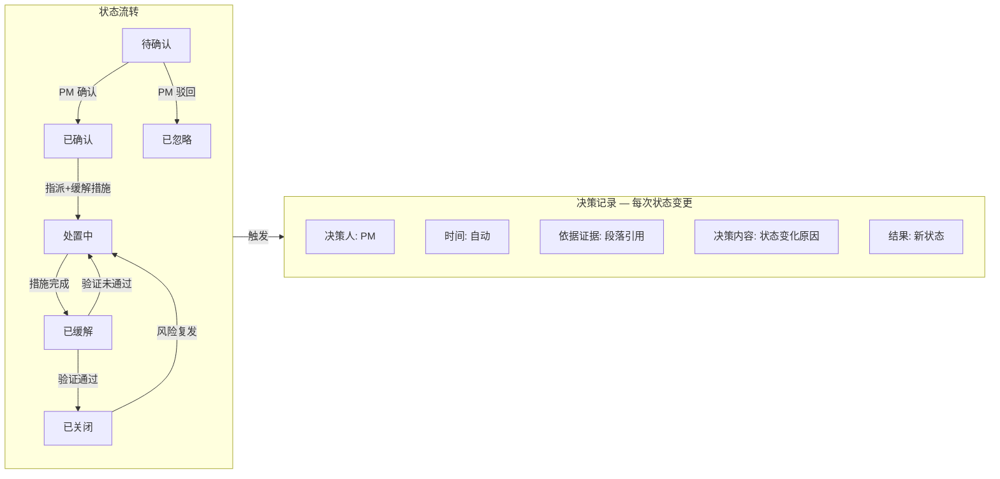

### 5.2 决策链数据流

Agent 记录完整的追溯链：文档段落 → 要素 → 规则 → 风险 → 处置：

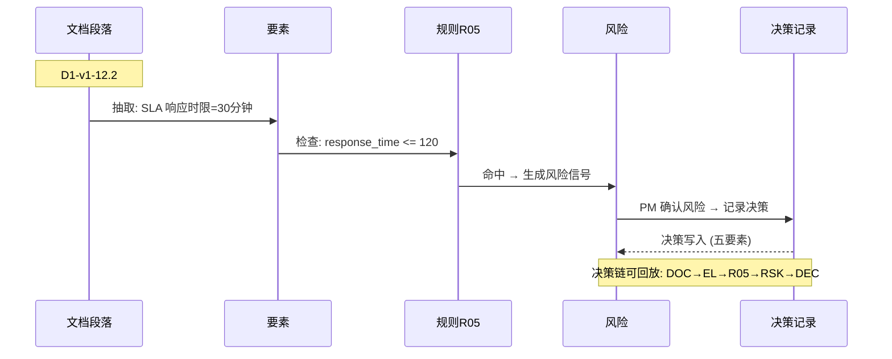

**决策记录表结构**：

```
字段        类型        说明
───        ────        ───
id          text        UUID
risk_id     text        关联风险
actor       text        决策人
timestamp   datetime    决策时间
evidence_ref text       证据段落ID
action      text        决策内容 (确认/指派/关闭等)
result      text        结果状态
```

### 5.3 MCP 接口层（预留架构）

Agent 的核心能力对外暴露为 MCP 工具，供其他 Agent 调用。MVP 先以 REST 接口实现，后续包装为标准 MCP Server：

| MCP 工具名 | 功能 | REST 路径（MVP） |
|---|---|---|
| `query_ontology` | 查询本体类/关系/属性 | `GET /api/v1/ontology/classes` |
| `get_risk_feed` | 获取某项目风险清单 | `GET /api/v1/projects/{id}/risks` |
| `create_risk` | 登记风险 | `POST /api/v1/projects/{id}/risks` |
| `check_rule` | 检查某要素是否命中规则 | `POST /api/v1/rules/check` |

---

## 6. 学习层（Learning Layer）

### 6.1 共进化闭环

Agent 从用户的审核反馈中持续优化感知和推理能力：

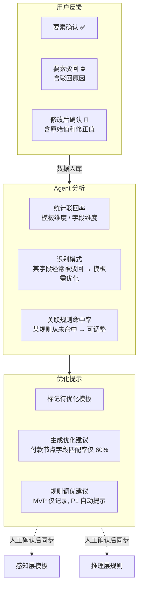

**共进化数据流**：

| 数据 | 来源 | 用途 |
|---|---|---|
| 驳回原因 | 审核队列（FR-14） | 模板字段精度分析 |
| 原始值 vs 修正值 | 修改后确认 | 模板抽取误差分析 |
| 规则命中统计 | 规则引擎 | 规则有效性评估 |
| 审核耗时 | 审核队列 | 感知效率评估 |

---

## 7. 展示层（Presentation Layer）

### 7.1 前端组件架构

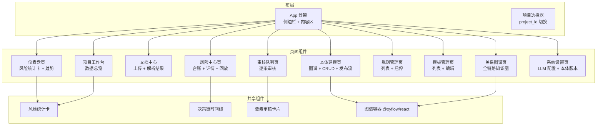

### 7.2 仪表盘数据流

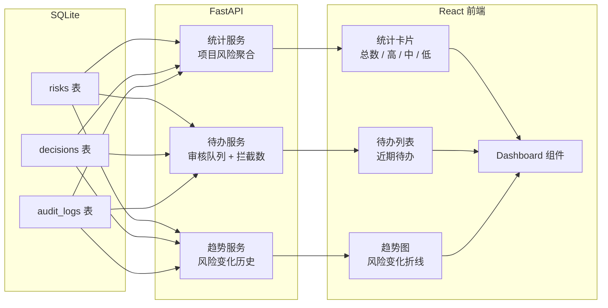

---

## 8. 基础设施

### 8.1 数据隔离模型

所有业务数据携带 `project_id`，按当前项目过滤：

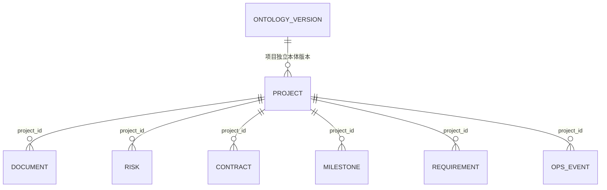

### 8.2 数据库表结构

| 表 | 用途 | 关键字段 |
|---|---|---|
| `projects` | 项目根 | id, name, customer, period, status |
| `documents` | 文档 | doc_id, project_id, version, doc_type |
| `doc_blocks` | 文本块 | block_id, doc_id, paragraph_no, content |
| `contracts` | 合同 | id, project_id, scope_text, payment_milestones, excluded_items |
| `requirements` | 需求 | id, project_id, req_no, priority, is_confirmed |
| `milestones` | 里程碑 | id, project_id, name, plan_date, delay_days |
| `progresses` | 进度 | id, milestone_id, progress_pct, is_blocked |
| `risks` | 风险 | id, project_id, risk_type, level, probability, impact, status |
| `evidences` | 证据 | id, risk_id, doc_ref, text_snippet |
| `decisions` | 决策记录 | id, risk_id, actor, timestamp, evidence_ref, action, result |
| `templates` | 抽取模板 | id, template_type, fields_def, ontology_bindings |
| `rules` | 规则 | id, name, rule_dsl, enabled, hit_count |
| `ontology_versions` | 本体版本 | id, project_id, snapshot, status |
| `audit_logs` | 操作审计 | id, actor, action, target, timestamp |

### 8.3 部署架构

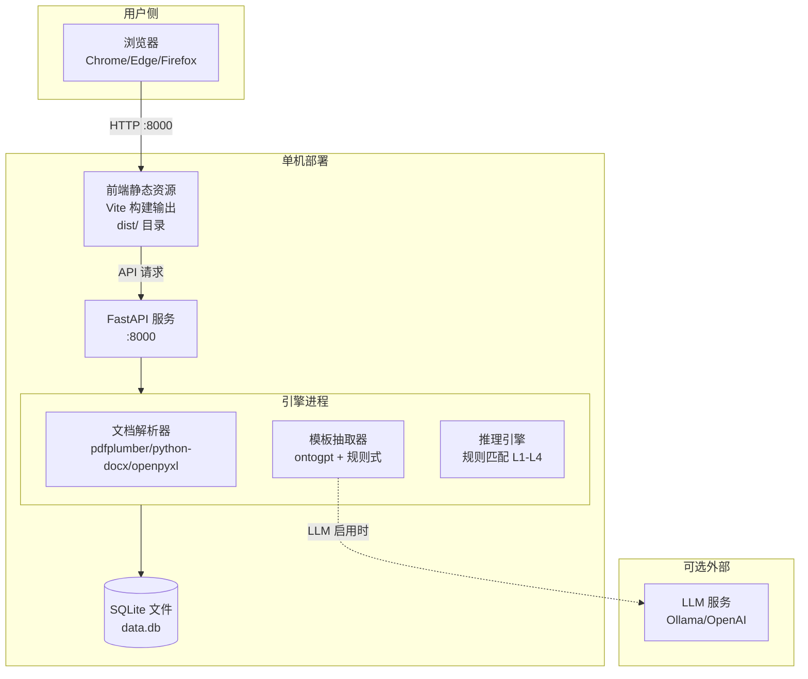

**启动方式**（单命令）：

```bash
# 前端构建 + 后端启动一体
cd backend && uvicorn main:app --host 0.0.0.0 --port 8000 --reload
# 前端通过 FastAPI 挂载静态文件, 无需独立启动
```

---

## 9. 核心流水线端到端时序

以《软件开发合同》示例数据的完整流程，展示各层协作：

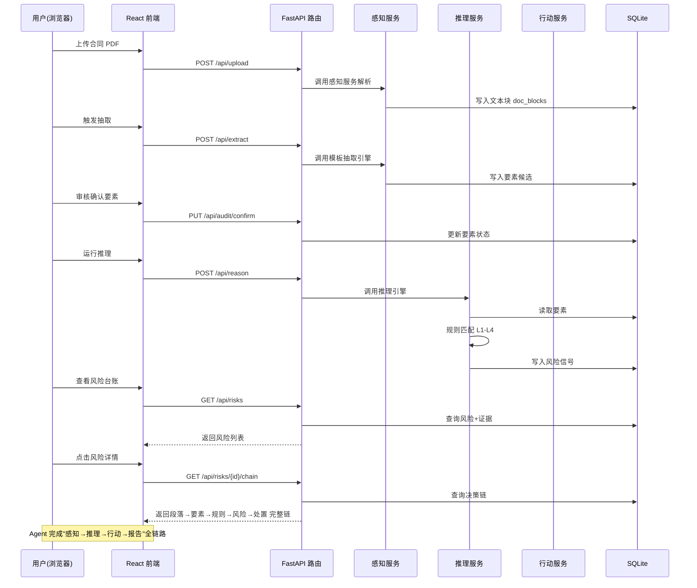

---

## 附录：关键技术决策

| 决策 | 方案 | 理由 |
|---|---|---|
| 前端框架 | React 19 + Vite + AntD | 10 个参考项目中 6 个用 React 生态，图谱库 @xyflow/react 也在 React 侧 |
| 后端框架 | Python FastAPI | 9/10 参考项目用 Python：ontogpt/ontocast/semantica 等成熟组件全在 Python 生态 |
| 数据存储 | SQLite 单文件 | MVP 单机模式，避免 Postgres/Redis 运维开销（P2 升级） |
| LLM 集成 | ontogpt（直接 import） | 同进程调用免服务间网络开销，LLM 默认关闭不影响核心流程 |
| 文档解析 | pdfplumber + python-docx + openpyxl | Python 生态成熟库，合同/Word/Excel 全覆盖 |
| 规则推理 | semantica Rete 参考实现 | 10 条预置规则轻量化，无需引入复杂规则引擎 |
| 图谱可视化 | @xyflow/react | 参考项目 jonex/trustgraph/semantica 同款，交互体验好 |
| 架构模式 | 后端一体化（非微服务） | 单一写入者避免锁冲突，MVP 阶段不需要横向扩展 |