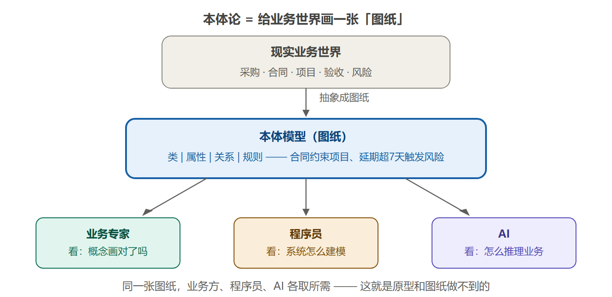
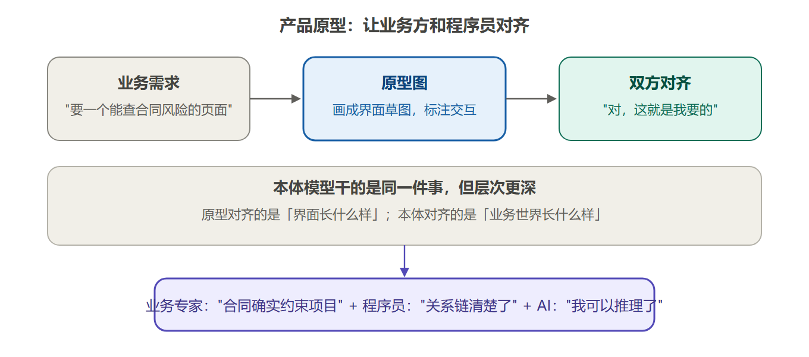
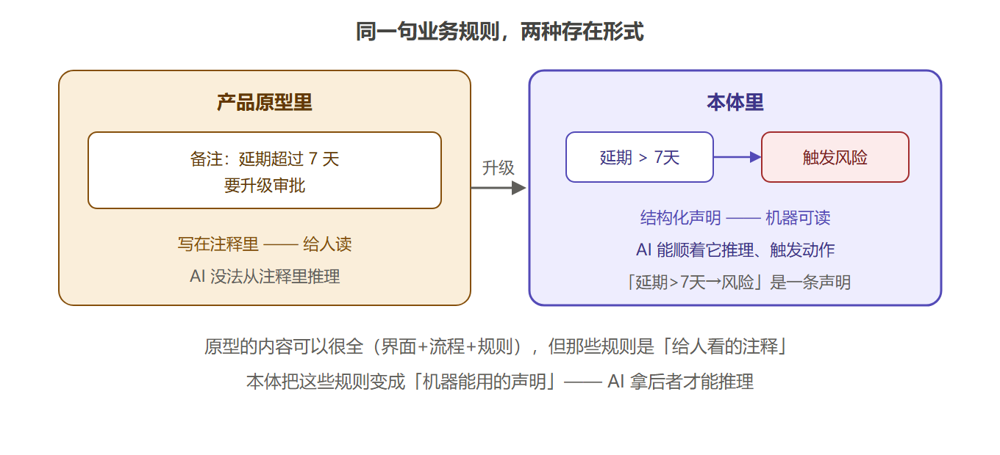
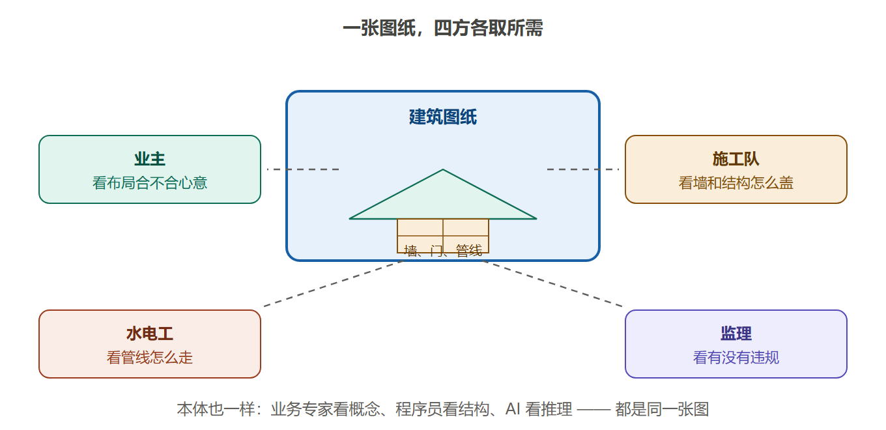
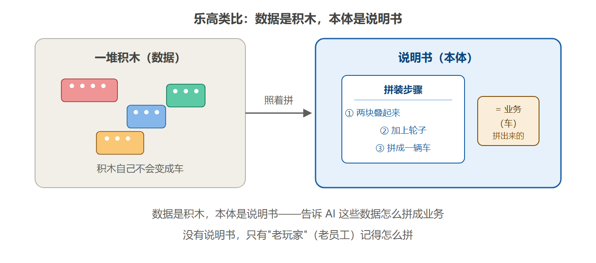
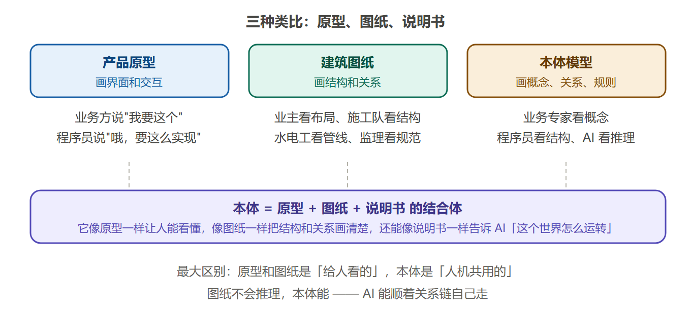
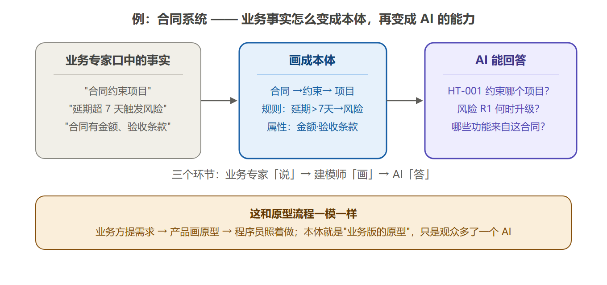
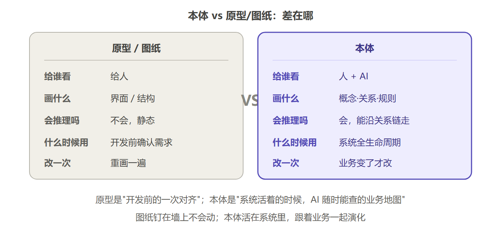
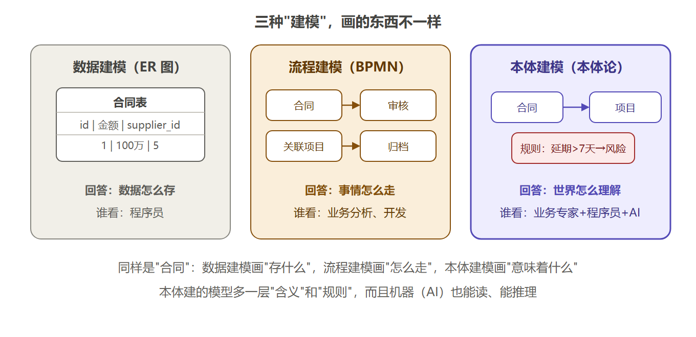

# 01.5 本体论像什么？—— 三种最直观的类比（补充阅读）

> 这一篇是"为什么需要本体论"和"本体论到底是个啥"的补充理解材料。
> 如果你觉得"本体论"这个词太抽象，用下面这三种类比想，就能抓住它。

## 这一篇怎么读

1. **先看**「一句话先定位」—— 30 秒抓住本体论的比喻；
2. **再看**「三个类比」—— 选一个你觉得最顺的记住（原型 / 图纸 / 说明书）；
3. **最后看**「辨析」—— 搞清本体和原型、图纸、其他建模的边界。

## 一句话先定位

**本体论 = 给公司业务画一张"图纸"，让 AI（和人）都能看懂、能对齐、能照着干活。**

它不是什么玄学，它就是工程里的一个普通动作：**把脑子里的业务理解，画成一张所有人都能看的图。**

**图 1：本体论 = 业务世界的图纸** —— 现实业务抽象成本体模型，业务专家、程序员、AI 看的是同一张图

---

## 三个类比，从熟到生

### 类比一：本体 ≈ 产品原型

做软件时，产品经理会画一版**原型**：把"业务方要什么"画成看得见的界面草图，给业务方和程序员一起看——

- 业务方看完说："对，这就是我要的功能。"
- 程序员看完说："哦，原来要这么实现。"

**注意：好的原型其实不止界面**——它还包含交互流程、字段定义、业务规则注释、异常分支，内容一点不少。

**那本体比原型强在哪？强在"这些内容对谁可用"。**

**图 2：产品原型类比** —— 原型内容很全（界面+流程+规则），但"停留在给人看的层面"

**图 3：同一句规则，两种存在形式** —— 原型里的规则是"给人看的注释"，本体里的规则是"机器能用的声明"，AI 拿后者才能推理

更贴的类比：**原型 ≈ 效果图/图纸（给人看）；本体 ≈ BIM 建筑信息模型**——不只是图，而是把结构、材料、管线、规则都结构化存进模型，软件能直接计算、模拟。

### 类比二：本体 ≈ 建筑图纸

盖楼之前一定要有**图纸**。一张图纸，参与建设的各方各取所需：

- **业主**看：布局合不合心意
- **施工队**看：墙和结构怎么盖
- **水电工**看：管线怎么走
- **监理**看：有没有违规

**图 4：建筑图纸类比** —— 一张图纸，四方各取所需；本体也是一样

本体就是这样一张"业务图纸"：

- **业务专家**看：概念画对了吗（"合同确实约束项目"）
- **程序员**看：系统该怎么建模
- **AI** 看：业务怎么推理

**关键区别：图纸是给人看的，本体是"人机共用"的——AI 也会"读图"。**

### 类比三：本体 ≈ 乐高说明书（顺便一提）

乐高积木本身只是一堆塑料块，但**说明书**告诉你怎么把它们拼成一辆车。

本体不是数据本身（积木），而是**"数据怎么拼成业务"的知识**（说明书）。有了说明书，谁都能拼；没有说明书，只有老玩家记得。

**图 5：乐高说明书类比** —— 数据是积木，本体是"怎么拼成业务"的说明书

把三个类比放一起看：

**图 6：三种类比并列** —— 原型让人看懂界面，图纸让人看懂结构，本体让人和 AI 都看懂业务

---

## 举几个真实例子

### 例子 1：合同系统（最典型）

| 环节 | 发生什么 |
|---|---|
| 业务专家说 | "合同约束项目""延期超 7 天触发风险""合同有金额、验收条款" |
| 建模师画成本体 | 合同 →约束→ 项目；规则：延期>7天→风险；属性：金额·验收条款 |
| AI 能回答了 | HT-001 约束哪个项目？风险 R1 何时升级？哪些功能来自这份合同？ |

（这里说的"建模师"，就是**懂业务又懂技术的人**——业务专家口述、建模师画成本体，现在 AI 辅助建模也越来越常见。）

**图 7：合同系统实例** —— 业务事实 → 本体 → AI 能回答，和"需求 → 原型 → 程序员"一模一样

### 例子 2：供应商评估

- **业务事实**："这个供应商连续三次延期交付，评分低于 60，自动进入风险名单。"
- **本体**：供应商 →提供→ 合同；合同 →产生→ 交付记录；规则：延期次数≥3 且评分<60 → 风险名单
- **AI 能答**："这个供应商为什么不能继续合作？"（顺着关系链聚合交付记录 + 延期 + 投诉 + 替代方案）

### 例子 3：请假审批

- **业务事实**："请假超过 3 天要经理审批，超过 7 天要总监审批。"
- **本体**：员工 →提交→ 请假单；规则：时长>3天→经理审批，>7天→总监审批
- **AI 能答**："我请 5 天假，该找谁批？"（不用猜，规则写在图纸上）

### 例子 4：医院分诊

- **业务事实**："发热 + 呼吸困难 → 优先急诊；普通感冒 → 普通门诊。"
- **本体**：患者 →出现→ 症状；规则：症状组合 → 分诊级别
- **AI 能答**："这个症状组合该挂哪个科？"（按规则推理，而不是搜网页）

---

## 但本体和原型/图纸有个关键区别

| | 原型 / 图纸 | 本体 |
|---|---|---|
| **给谁看** | 人 | 人 + AI |
| **画什么** | 界面 / 结构 | 概念 · 关系 · 规则 |
| **会推理吗** | 不会，静态的 | 会，能沿关系链自己走 |
| **什么时候用** | 开发前确认需求 | 系统全生命周期 |
| **改一次** | 重画一遍 | 业务变了才改 |

**图 8：本体 vs 原型/图纸** —— 图纸钉在墙上不会动，本体活在系统里，跟着业务一起演化

---

## 补充澄清：本体论是"建模"，但建的是哪种模型？

接上一节：本体不仅和原型、图纸不同，和**别的建模**也不一样。有人说："本体论不就是给业务建模吗？"——**对，但要分清楚"建模"有三种，画的东西不一样**：

| 建模类型 | 画什么 | 回答的问题 | 谁在看 |
|---|---|---|---|
| **数据建模**（ER 图） | 表、字段、外键 | 数据怎么存 | 程序员 |
| **流程建模**（BPMN/流程图） | 步骤、分支、状态迁移 | 事情怎么走 | 业务分析、开发 |
| **本体建模**（本体论） | 概念、关系、规则 | 业务世界怎么理解 | 业务专家 + 程序员 + AI |

**图 9：三种"建模"画的东西不一样** —— 同样是"合同"：数据建模画"存什么"，流程建模画"怎么走"，本体建模画"意味着什么"

同样是"合同"：

- **数据建模**画的是：`合同表（id, 金额, supplier_id）`——存什么
- **流程建模**画的是：合同 → 审核 → 关联项目 → 归档——怎么走
- **本体建模**画的是：合同**约束**项目、合同有金额/验收条款、延期超 7 天**触发**风险——**它意味着什么**

一句话收尾：数据建模回答"系统里有什么"，流程建模回答"事情怎么做"，本体建模回答"这个世界是什么、它们之间什么关系、什么情况下会怎样"——**三者不是谁替代谁，而是同一个业务的三张图**（数据视角、流程视角、语义视角），本体这张图多了一层"含义"和"规则"，而且机器（AI）也能读、能推理。

## 一句话总结

> **本体论 = 业务世界的"图纸"：让参与这件事的所有人（业务专家、程序员）和所有机器（AI），站在同一张图前，各取所需。**
>
> 原型是"开发前的一次对齐"，本体是"系统活着的时候，AI 随时能查的业务地图"。

回到最开始的问法：你公司系统里的"供应商"，在电脑里到底是什么？—— 有了本体这张图纸，数据库里的 id、业务系统的编号、合同 PDF 里的名字，才能被拼回同一个"供应商"。
