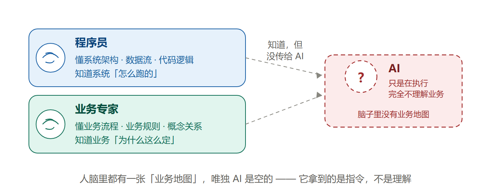
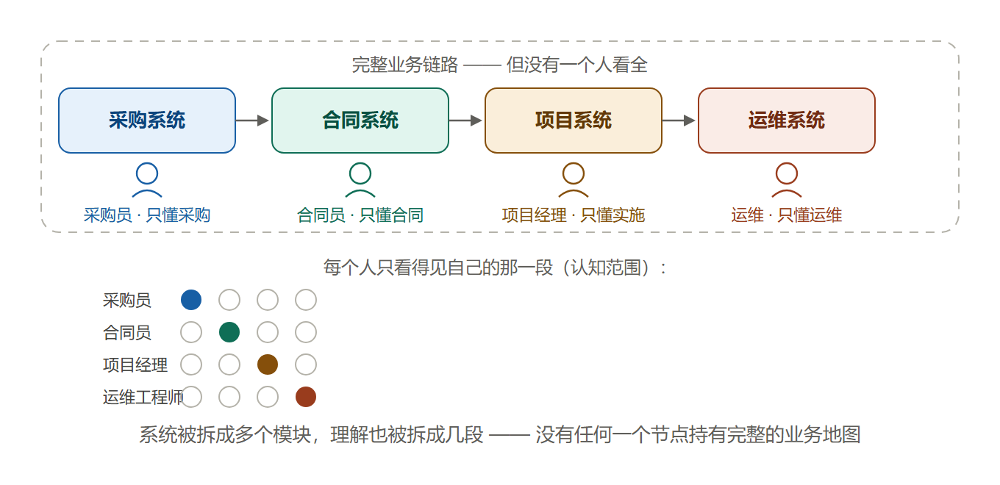
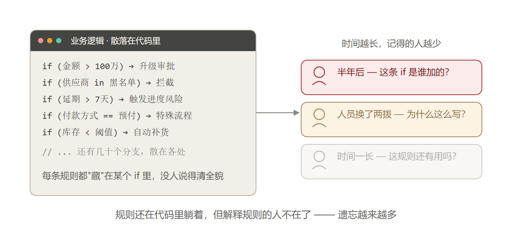
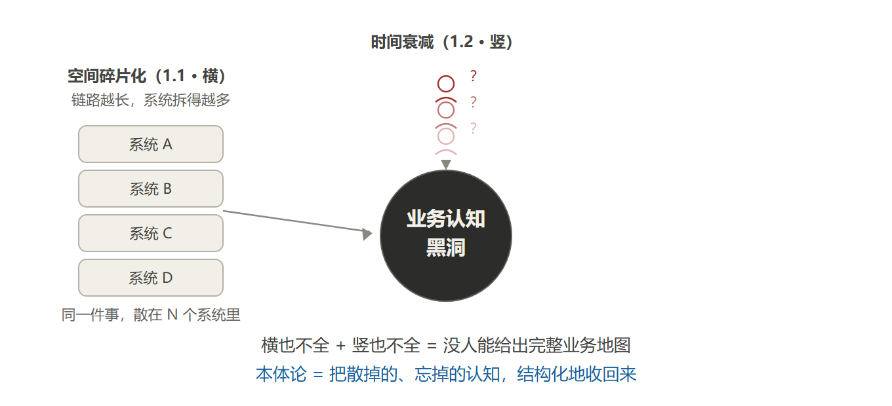

# 01. 为什么需要本体论

## 先看一个扎心的问题

> 你公司里那个"最能干"的 AI，能干到哪一步？
>
> 发现采购成本异常 → 自动调一份新的供应商清单 → 跟历史合同比一下价格 → 发现超标了 → 自动升级给主管批。
>
> 这一整条链，你的 AI 能不能自己跑通？
>
> 跑不通的话，缺的东西大概率就是这个——**本体论**。

## 一句话说清：本体论是干嘛的

**把藏在人脑子里的业务关系，变成机器能看懂、能推理、能执行的结构。**

打个比方：

- **传统系统在"存数据"**：数据库里有一行 `name=张三`，系统不知道他是谁、属于哪个部门、会干什么。
- **本体论系统在"理解数据"**：张三不再是一行数据，他是一个 `Person`——他知道自己属于哪个组织、有什么技能、可以触发什么动作、分数超过多少要执行什么。

这一字之差（存 vs 理解），后面所有东西都变了。

## 为什么现在 AI 特别需要它

大家可能发现，AI 项目做着做着就散架了：

```
你加个规则 → 代码里加个 if
运营要改状态 → 代码里又加个 if
半年后 → 规则全散在代码里，没人说得清系统到底有哪些规则
```

再加上一堆组件（关系型数据库、向量库、图数据库、检索引擎、缓存、工作流引擎、Agent 框架……十几个），最核心的问题不是组件多，而是——

**没人知道这个系统理解的世界长什么样。**

程序员脑子里有、业务专家脑子里有，唯独 **AI 完全没有**。它只是在执行，它不懂。

下面这张图，把这个问题说得更直白：



**图一：谁懂业务世界？** —— 人脑里都有一张"业务地图"，唯独 AI 是空的

一句话：**人懂，AI 不懂。人没把"懂的东西"结构化地给到 AI，AI 就只能瞎猜。**

### 链路越长，理解越碎

再往深了想一层。一个业务链路如果比较长——比如从采购到合同到实施到运维——它大概率会被拆成多个系统、多个模块，涉及多个业务团队和技术团队。

对应到任何一个具体的人，不管是业务人员还是技术人员，脑子里的业务理解**都是不全面的**：



**图二：长链路，碎片化理解** —— 链路拆成多个系统，理解也拆成几段，每个人只看得见自己那一段

系统被拆成多个模块，理解也跟着被拆碎了。每个系统、每个模块都只管自己那一段，没有任何一个节点持有完整的业务地图。

而且这个"不全"是**双重**的：不只是**内容不全**（只懂自己环节），还包括**衔接不明**——系统之间的大量隐性约定（字段含义、消息格式、谁触发谁）没人说得清。就算把采购环节讲得再全，也拼不出完整地图。

### 代码里的规则，慢慢被遗忘

还有一层：大量业务逻辑其实都写在代码里——分支判断、消息事件、状态流转，全散在 if/else 和各种回调中间。

时间一长，或者人员更替，遗忘就会越来越多。半年前谁加的规则？为什么这么写？还有没有用？没人说得清。



**图三：代码里的规则，慢慢被遗忘** —— 规则还在代码里躺着，但解释规则的人不在了

而且遗忘的不只是"规则本身"，更是"**规则背后的原因**"：规则还躺在代码里（能查到），原因只在人脑子里（人走了就没了），原因比规则丢得更快。

### 横竖两个维度，都在流失

把 1.1 和 1.2 放到一起看，其实是**两个不同维度**的认知流失：

- **1.1 是"空间"维度的碎片化（横着看）**：链路越长，系统拆得越多，理解散在不同人脑子里，谁都不全；
- **1.2 是"时间"维度的衰减（竖着看）**：逻辑藏在代码分支和消息里，时间一长、人员一换，记得的人越来越少。



**图四：认知黑洞** —— 横也不全 + 竖也不全 = 没人能给出完整业务地图

这三件事叠在一起——**AI 不懂、人懂得不全、懂的部分还在流失**——系统的"业务认知"就是一个不断缩水的黑洞。本体论要干的，就是把黑洞填上。

## 没有本体论的 AI，差在哪

很多人以为 AI 不行是模型不够聪明。真不是。

同样是判断"这个供应商值不值得继续合作"，同一个大模型：
- 在数据中台上跑：**四天**
- 换到本体架构上跑：**两个小时**

差 20 倍，但用的**是同一个模型**。

差在哪？差在**关系链**。数据中台里，供应商合同、交付风险各自躺在不同的表里，没有一根绳子把它们串起来。本体架构里有那根绳子——这就是本体论真正干的事。

它不是建一个更大的数据仓库，它是**把藏在专家脑子里的业务认知，变成系统自己能理解、能推理、能执行的结构**。

## 用合同系统举个例子（大白话版）

你上传一份合同 docx：

| 没有本体论 | 有本体论 |
|---|---|
| 它只是一堆文字，最多能被"搜到" | 系统按"合同"这个模板来认它：金额是多少、编号是什么、有没有验收条款 |
| 你想问"这份合同约束哪个项目？"——答不上来 | 系统知道 合同→约束→项目 这条关系，直接回答 |
| 后续"哪些功能来自这份合同"——无从查起 | 顺着关系链一路查：合同→功能清单→需求→风险 |

有本体 = 系统手里有张"业务地图"；没本体 = 系统在"大海捞针"。

## 那到底啥是"本体"？最土的解释

**本体就是"给业务世界画的一张概念地图"，外加一堆规则。**

拆开就是四样东西：

| 名词 | 白话 | 用合同系统举例 |
|---|---|---|
| **类** | 有哪些"东西"的类型 | 合同、项目、风险、功能清单 |
| **属性** | 每个东西有哪些字段 | 合同有金额、编号、验收条款 |
| **关系** | 东西和东西之间怎么连 | 合同→约束→项目；项目→包含→里程碑 |
| **规则** | 什么情况会怎样 | 延期超过 7 天 → 触发进度风险 |

（你之前做过的 Ontology 系统里，`message.keyword`、`appName` 那些排查，本质就是这张地图没画对。）

## 本体论到底帮了 Agent 哪几个忙

1. **AI 终于"懂业务"了**：拿到的不是一堆文本碎片，而是"实体在哪、关系是什么、规则是什么"的结构化世界。配上图谱和 Agent，多跳推理能力是质变。
2. **AI 不再瞎编**：关系是明确写死的，不是模型猜的——"合同约束项目"不会编成"合同约束供应商"。
3. **AI 有"记忆"了**：大模型天生没状态（聊完就忘），本体给 AI 提供了"外部大脑"：实体、关系、规则、状态、权限、事件都存它那，Agent 不会聊着聊着就错乱。
4. **系统反而变简单了**：规则不用散在满代码里，行为不用满调度器找——都收进本体，复杂度被重新组织了。

## 一句话总结

- **RAG** 解决"相关内容在哪"（翻手册）
- **本体论** 解决"这个世界是怎么运转的"（懂业务）
- **Agent** 解决"怎么把事办成"（干活）

未来的 AI 系统大概率都是：**LLM 负责说话，本体负责懂世界，Agent 负责行动**。

## 动手试试

分别判断下面这些问题，靠"找相似文本"就能答，还是必须"懂概念关系"：

1. "登录失败怎么处理？"（翻文档就能答 → 靠搜索）
2. "登录失败会影响哪些模块？"（要懂 问题→影响→功能 的关系 → 靠本体）
3. "谁有权限修改登录策略？"（要懂 角色→权限→动作 → 靠本体）
4. "给我找一篇登录失败排查文档。"（翻文档 → 靠搜索）

想明白这四题的区别，你就懂为什么 Agent 需要本体论了。
