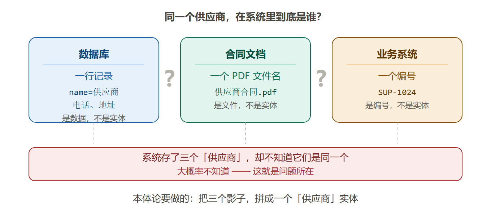
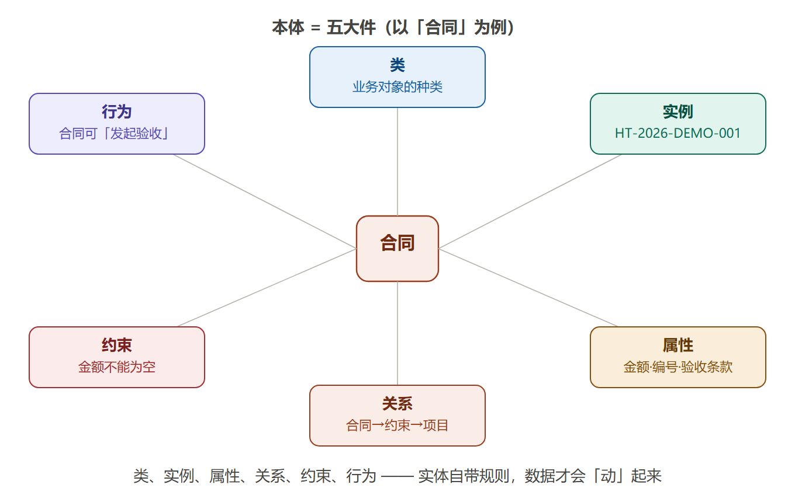
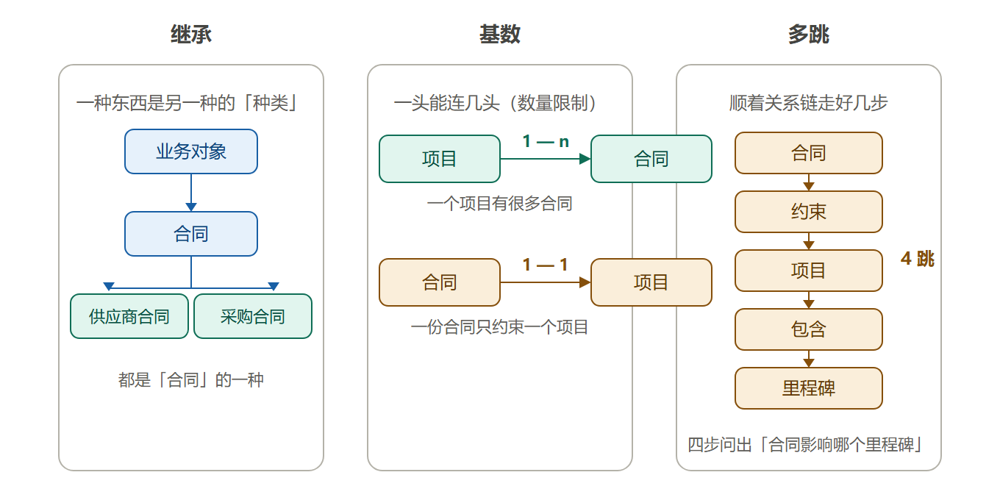
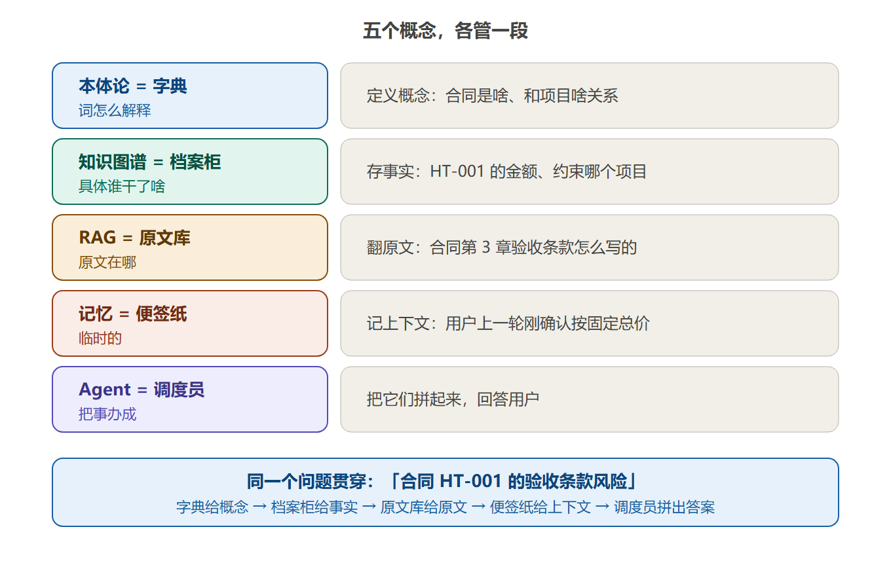
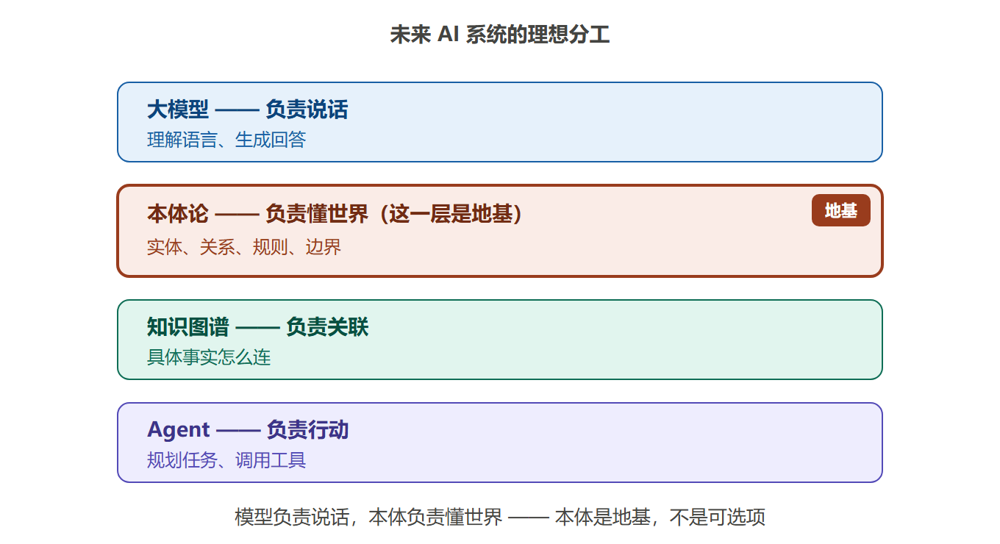
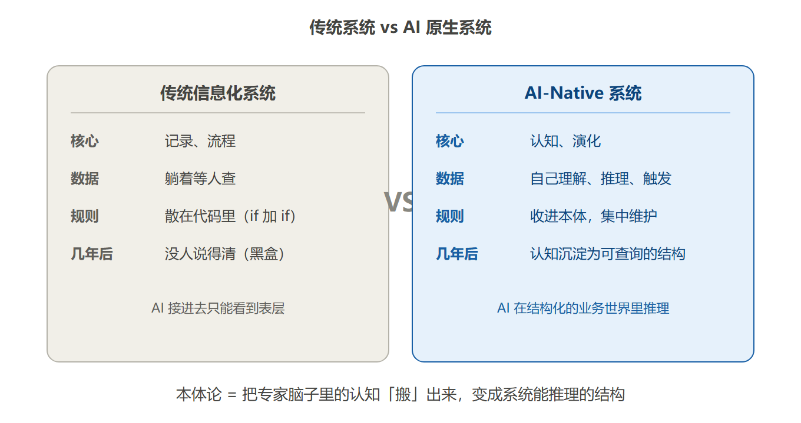
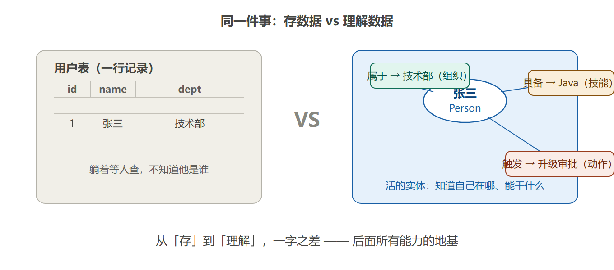

# 02. 本体论到底是个啥

## 先看一个扎心的问题

> 很多人一听"本体论"就觉得是哲学课，马上想跑。
>
> 但换个问法：**你公司系统里的"供应商"，在电脑里到底是什么？**
>
> - 数据库里：一行记录（名称、电话、地址）
> - 合同里：一个 PDF 文件名
> - 业务系统里：一个编号
>
> 这三个是同一个"供应商"吗？系统知道吗？
>
> 大概率不知道。这就是问题所在——**系统存了一堆"数据"，却不知道这些数据是谁、和谁有关系、能干什么。** 本体论就是来解决这个的。



**图① 供应商的三个影子** —— 同一个供应商，系统里存了三个影子，却不知道它们是同一个

## 一句话说清

**本体论 = 给业务世界画一张"概念地图"，再加上一套"游戏规则"。**

这张地图上有：

- **有哪些东西**（类）：合同、项目、供应商、风险……
- **每样东西长什么样**（属性）：合同有金额、编号、验收条款
- **东西和东西怎么连**（关系）：合同→约束→项目；供应商→提供→合同
- **什么情况会怎样**（规则）：延期超 7 天 → 触发风险

就这么简单。听着玄乎，拆开就是这四样（再加一个"行为"）。

## 本体就是"五大件"

| 名词 | 白话 | 用合同系统举例 |
|---|---|---|
| **类** | 有哪些"东西"的类型 | 合同、项目、风险、功能清单 |
| **实例** | 某个具体的东西 | 合同 HT-2026-DEMO-001 |
| **属性** | 每样东西有哪些字段 | 合同有金额、编号、验收条款 |
| **关系** | 东西和东西怎么连 | 合同→约束→项目；项目→包含→里程碑 |
| **约束** | 什么是不允许的 | 合同金额不能为空；验收条款必须明确 |
| **行为** | 每样东西能干什么事 | 合同可以"发起验收"；风险可以"升级审批" |

> **特别提"行为"**：很多人只想到类和关系，忘了行为。但"供应商评分超过 80 自动升级审批"这种动作，也是本体的一部分——**实体自带规则，数据才会"动"起来**。这是本体论和普通数据建模最大的区别之一。



**图② 五大件一图看懂** —— 以"合同"为中心，类、实例、属性、关系、约束、行为六个方向

### 关系没那么简单：继承、基数、多跳

五大件里的"关系"看着简单（一条线），实际有三层讲究：

| 讲究 | 白话 | 例子 |
|---|---|---|
| **继承** | 一个东西是另一个东西的"种类" | 合同是"业务对象"的一种；供应商合同、采购合同都是"合同" |
| **基数** | 一头能连几头 | 一个项目可以**有很多**合同（1-n）；一份合同只能约束**一个**项目（1-1） |
| **多跳** | 顺着关系链走好几步 | 合同→约束→项目→包含→里程碑，四步问出"合同影响哪个里程碑" |

> 别被"继承""基数"吓到——**说白了就是"种类关系"和"数量限制"**。多跳才是本体最值钱的地方：普通数据库要 JOIN 好几张表才能问的事，本体沿关系链一步一蹦就能答。这也是后面"多跳推理"的地基。



**图③ 关系的三层讲究** —— 继承（种类的树）、基数（一头连几头）、多跳（顺着链走四步）

## 那它和知识图谱、RAG、记忆、Agent 有啥区别？

很多人把这五个词混成一锅粥。一句话版本：

| 概念 | 白话 | 生活类比 |
|---|---|---|
| **本体论** | 定义"世界上有哪些概念、怎么定义" | **字典**（词怎么解释） |
| **知识图谱** | 存"具体事实" | **档案柜**（具体谁干了啥） |
| **RAG** | 从文档里翻原文 | **原文库**（原文在哪） |
| **记忆** | 记住"刚才聊了什么" | **便签纸**（临时的） |
| **Agent** | 干活的 | **调度员**（把事办成） |

**同一个问题贯穿**："合同 HT-001 的验收条款风险"——

- 字典（本体）告诉你：合同是啥、验收条款是啥、和项目啥关系
- 档案柜（图谱）告诉你：HT-001 这份合同的具体金额、约束哪个项目
- 原文库（RAG）告诉你：合同第 3 章原文怎么写的
- 便签纸（记忆）告诉你：用户上一轮刚确认了按固定总价
- 调度员（Agent）把它们拼起来回答你

**它们不替代彼此，各管一段。** 而且未来 AI 系统的理想分工是：



**图④ 五个概念，各管一段** —— 同一个问题贯穿：字典给概念、档案柜给事实、原文库给原文、便签纸给上下文、调度员拼答案

```
大模型   负责说话（理解语言、生成回答）
本体论   负责懂世界（实体、关系、规则、边界）← 这一层是"地基"
知识图谱 负责关联（具体事实怎么连）
Agent   负责行动（规划任务、调用工具）
```



**图⑤ 未来 AI 系统的理想分工** —— 本体论是"地基"那一层

## 本体论和数据中台有啥区别？（一个常见误区）

| | 数据中台 | 本体架构 |
|---|---|---|
| 干的事 | 把数据**集中**起来 | 让系统**明白**数据代表什么 |
| 能回答 | "这个供应商的合同在哪张表？" | "这个供应商为什么风险高？" |
| 本质 | 更大的数据仓库 | 把业务认知变成系统能推理的结构 |

有个真实案例：某企业把数据中台升级成本体架构，同一套大模型做"供应商合作价值评估"——原来 4 天，现在 2 小时。模型没换，换的是：模型不再在海量碎片里检索猜测，而是在结构化的业务世界里直接推理。

## 传统系统 vs "AI 原生"系统（本质差异）

| | 传统信息化系统 | AI-Native 系统 |
|---|---|---|
| 核心 | **记录、流程** | **认知、演化** |
| 数据 | 躺着等人查 | 系统自己理解、推理、触发 |
| 规则 | 散在代码里（加一个 if 又一个 if） | 收进本体，集中维护 |
| 几年后 | 没人说得清系统逻辑（黑盒） | 业务认知沉淀为可查询的结构 |

> 一个残酷的现实：很多系统迭代几年后，字段叠字段、流程加流程、临时例外一堆——**连当初的开发都说不清全部规则**。AI 接进去只能看到表层，看不懂特殊审批、隐性风险。本体论就是把专家脑子里的认知"搬"出来，变成系统能推理的结构。



**图⑦ 传统系统 vs AI 原生系统** —— 一个在"记录"，一个在"认知"

## 一句话总结

**本体论不是哲学，是"把业务认知结构化"的工程方法。**

- 传统系统：**存数据**（张三是一行记录）
- 本体系统：**理解数据**（张三是一个 Person，知道自己在哪个组织、能干什么、什么时候该干什么）

从"存"到"理解"，这一字之差，就是后面所有能力（AI 懂业务、多跳推理、系统演化）的地基。



**图⑥ 存数据 vs 理解数据** —— 左边张三是一行记录，右边张三是一个"活的" Person

## 动手试试

看看你手里的系统，能不能回答这 3 个问题：

1. "合同 A 的验收条款缺失，会影响哪个项目的哪个里程碑？"（要懂 合同→约束→项目→包含→里程碑）
2. "这个供应商为什么不能继续合作？"（要聚合 交付记录+延期+投诉+替代方案）
3. "风险升级后，谁有权限审批？"（要懂 风险→触发→审批→角色）

如果都答不上来，说明你的系统还停留在"存数据"——本体论要补的，就是这块。
