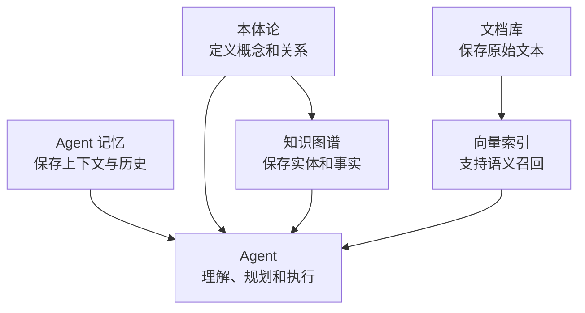
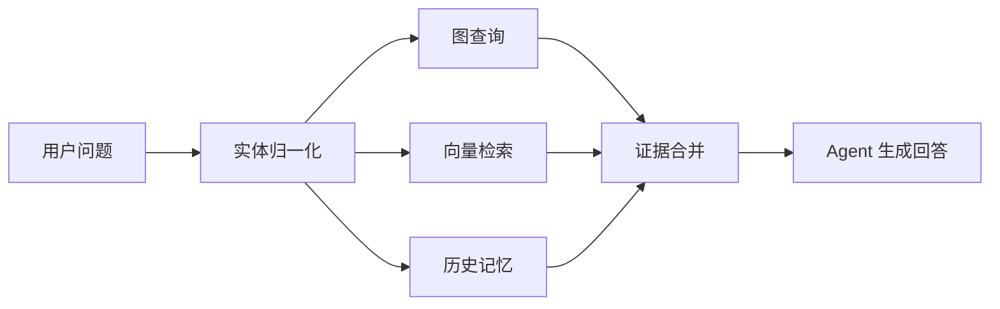

# 02. 本体论、知识图谱、RAG 和记忆

## 本章目标

- 区分本体论、知识图谱、RAG、数据库和 Agent 记忆。
- 理解这些组件为什么需要组合使用。
- 能根据问题类型选择合适的数据来源。

## 五个概念



### 本体论

本体论定义领域中的概念和语义关系：

```text
Product 是一种产品
Module 是一种模块
Product belongsTo Module
Issue affects Feature
Role canPerform Action
```

它描述“应该如何理解”，不保存所有业务事实。

### 知识图谱

知识图谱保存具体事实：

```text
product-A belongsTo module-B
issue-D affects feature-C
solution-E resolves issue-D
```

### RAG

RAG 从文档中召回相关片段，用于补充操作说明、背景解释和原始证据。

### Agent 记忆

记忆保存对后续交互有用的信息，例如：

- 当前任务正在处理哪个产品。
- 用户已经确认了哪些条件。
- 上一轮工具调用返回了什么。

## 数据来源选择

| 问题 | 首选来源 | 原因 |
|---|---|---|
| 产品属于哪个模块 | 知识图谱 | 需要精确关系 |
| 操作步骤是什么 | 文档 RAG | 需要原文细节 |
| 用户刚才确认了什么 | Agent 记忆 | 属于会话上下文 |
| 当前用户能否执行操作 | 权限系统 + 本体关系 | 需要角色和动作约束 |
| 哪个工具能处理问题 | 本体论 + 工具注册表 | 需要能力匹配 |

## 混合检索链路



## 练习

为“产品 A 的登录失败问题有哪些解决方案”设计三类数据：

1. 本体论中的类和关系。
2. 知识图谱中的具体事实。
3. 文档库中的证据片段。

## 本章小结

- 本体论定义语义。
- 知识图谱保存事实。
- RAG 提供文本证据。
- 记忆保存会话和任务上下文。
- Agent 负责组合这些能力完成目标。

