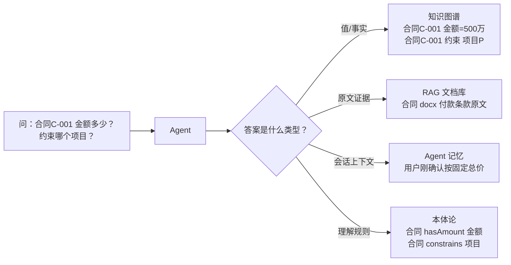
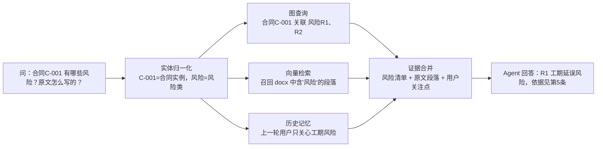

# 02. 本体论、知识图谱、RAG 和记忆

## 一分钟看懂本章

> **一句话**：本体论是"字典"、知识图谱是"档案柜"、RAG 是"原文库"、记忆是"便签纸"——它们分工不同、各存各的，Agent 根据问题类型决定先查哪个。



> 读图要点：图表达"一个问题分给四个仓库查"。从提问出发，Agent 先判断答案类型再选来源：值去图谱查、原文去 RAG 查、上一轮的话去记忆查、理解规则靠本体论。

## 本章目标

- 区分本体论、知识图谱、RAG、数据库和 Agent 记忆。
- 理解这些组件为什么需要组合使用。
- 能根据问题类型选择合适的数据来源。

## 五个概念

```mermaid
flowchart TB
    O[本体论（字典）<br/>合同 hasAmount 金额<br/>合同 constrains 项目]
    K[知识图谱（档案柜）<br/>合同C-001 金额=500万<br/>合同C-001 约束 项目P]
    D[文档库（原文库）<br/>合同 docx 原文段落]
    V[向量索引（检索器）<br/>按语义召回含"风险"的段落]
    M[Agent 记忆（便签纸）<br/>本轮用户确认了固定总价]
    A[Agent（调度员）<br/>理解、规划和执行]
    O --> K
    D --> V
    M --> A
    O --> A
    K --> A
    V --> A
```

> 读图要点：这张图讲"五层分工"。读法：每个方块都带一个真实例子——本体论只给定义，知识图谱存具体事实，文档库存原文，向量索引负责搜，记忆存临时会话，Agent 是唯一能组合它们的调度员。

### 本体论

本体论定义领域中的概念和语义关系：

```text
Contract 是一种合同
Project 是一种项目
Contract constrains Project
Risk affects Contract
Role canPerform Action
```

它描述“应该如何理解”，不保存所有业务事实。

### 知识图谱

知识图谱保存具体事实：

```text
contract-C001 constrains project-P
risk-R1 affects contract-C001
contract-C001 hasAmount 5000000
```

### RAG

RAG 从文档中召回相关片段，用于补充操作说明、背景解释和原始证据。

### Agent 记忆

记忆保存对后续交互有用的信息，例如：

- 当前任务正在处理哪个产品。
- 用户已经确认了哪些条件。
- 上一轮工具调用返回了什么。

## 真实例子：一份合同 docx 的旅程

给「项目合同系统」上传一份《智慧园区建设合同》docx，五个概念各干各的：

1. **本体论**（字典）先出模板：合同类有 金额/编号/验收条款 数据属性，有 合同→约束→项目、合同→包含→功能清单 关系。
2. **知识图谱**（档案柜）存下识别出的实例：合同C-001 金额=500万、合同C-001 约束 项目P、关联 风险R1（工期）。
3. **RAG**（原文库）把 docx 原文切段存进文档库和向量索引——答"付款条款第几条写的"这类问题时，从原文召回并引用。
4. **Agent 记忆**（便签纸）记住对话状态：用户刚说"先看风险"，下一轮回答就优先讲风险。
5. **Agent**（调度员）组合它们：从图谱拿风险清单，从原文拿风险条款，再按记忆里的偏好，给出带证据的回答。

一句话：**同一份合同，字典管定义、档案柜管事实、原文库管证据、便签纸管对话、调度员管拼装。**

## 数据来源选择

| 问题 | 首选来源 | 原因 |
|---|---|---|
| 产品属于哪个模块 | 知识图谱 | 需要精确关系 |
| 操作步骤是什么 | 文档 RAG | 需要原文细节 |
| 用户刚才确认了什么 | Agent 记忆 | 属于会话上下文 |
| 当前用户能否执行操作 | 权限系统 + 本体关系 | 需要角色和动作约束 |
| 哪个工具能处理问题 | 本体论 + 工具注册表 | 需要能力匹配 |

## 混合检索链路



> 读图要点：这张图演示"一条真实问题怎么三路并行再合并"。读法：先看实体归一化把自然语言翻译成机器能查的项，再看三个数据源各自返回什么，最后看证据合并如何把三者拼成带依据的回答。

## 练习

为“产品 A 的登录失败问题有哪些解决方案”设计三类数据：

1. 本体论中的类和关系。
2. 知识图谱中的具体事实。
3. 文档库中的证据片段。

## 本章小结

- 本体论定义语义。
- 知识图谱保存事实。
- RAG 提供文本证据。
- 记忆保存会话和任务上下文。
- Agent 负责组合这些能力完成目标。

