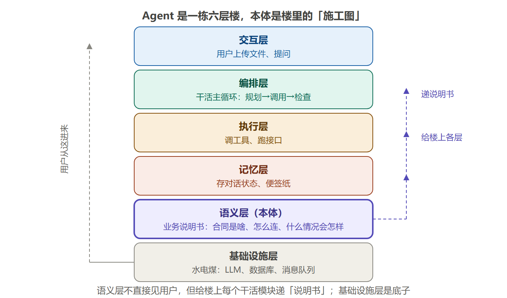
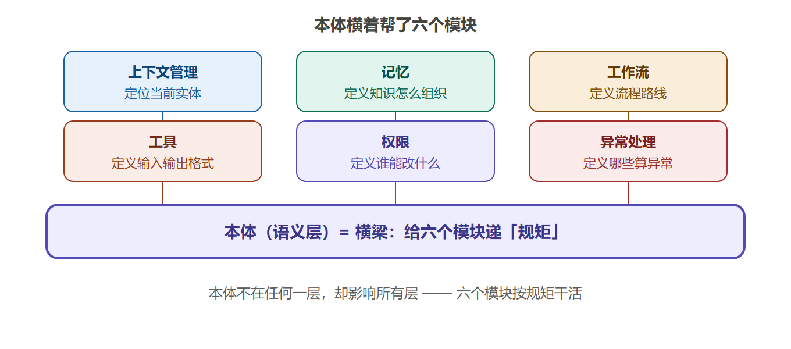
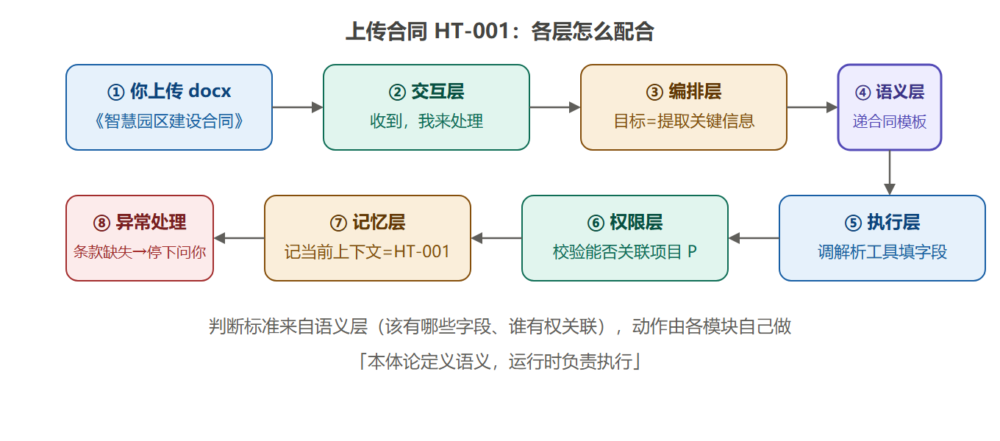
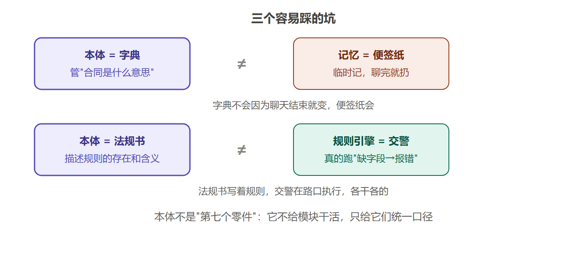
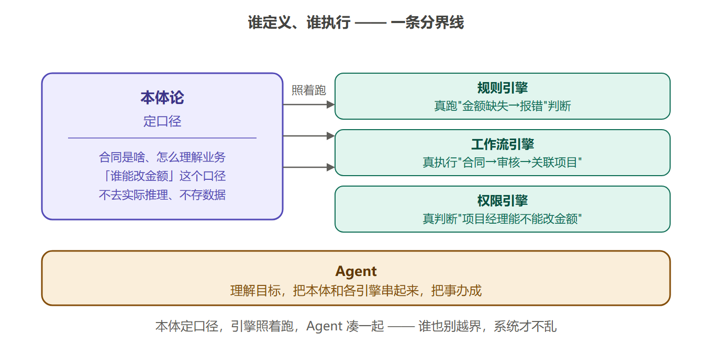

# 03. 本体在 AI 系统里站在哪

## 先看一个扎心的问题

> 你的 AI 为啥老在关键时刻掉链子？
>
> 你问它："合同 HT-001 约束的是哪个项目？" 它翻箱倒柜半天，答得驴唇不对马嘴。
>
> 你又问："这份合同的风险 R1 什么时候要升级给项目经理？" 它一脸懵。
>
> 最气人的是——**数据它都有**，工具它也会用，可就是答不对。
>
> 为啥？因为它不知道这些零件（记忆、工具、权限、工作流）**该听谁的、按什么规矩干活**。缺的那个"发号施令的规矩"，就是本体论的位置。

## 一句话说清

**本体论不是 Agent 的第七个零件，而是所有零件共同遵守的"业务说明书"——它只负责告诉你"世界怎么理解"，真正干活的还是上下文、记忆、工作流、工具、权限、异常处理这些模块。**

说白了：本体论是**裁判和标准**，不是**运动员**。球是各模块踢的，但"规则"由本体来定。

## Agent 是一栋楼，本体是楼里的"施工图"

一个 Agent 系统拆开看，就像一栋六层的楼：



**图1 Agent 是一栋六层楼，本体是楼里的"施工图"** —— 语义层不直接见用户，虚线向右给编排/执行/记忆层递"说明书"

> 读图要点：这是 Agent 的"楼层图"。用户从交互层进来，编排层负责调度，执行层干活，记忆层存状态；语义层不直接见用户，但给楼上每个干活模块递"说明书"；基础设施层是水电煤，管大模型、数据库这些底子。

每层是干嘛的？用大白话翻译一下：

| 楼层 | 大白话 | 用合同系统举例 |
|---|---|---|
| **交互层** | 用户和 AI 说话的地方 | 你上传合同 HT-001 的 docx，或者打字问"这合同约束哪个项目" |
| **编排层** | 说白了就是 Agent 干活的主循环：规划→调用→检查→再来一轮 | 它安排"先读合同→再查项目→发现风险→决定要不要问项目经理" |
| **执行层** | 真正动手调工具、跑接口的地方 | 调 docx 解析工具、调图谱查询 API |
| **记忆层** | 存"刚才聊到哪了"的便签纸 | 记住"当前正在处理合同 HT-001""用户已确认按固定总价" |
| **语义层** | 业务说明书：定义这个世界有哪些东西、怎么连、什么情况会怎样 | 规定合同有金额/功能清单/风险这些字段；规定合同→约束→项目这条关系 |
| **基础设施层** | 水电煤：大模型、数据库、消息队列这些底子 | LLM 负责理解人话，图数据库负责存关系 |

注意这栋楼里的分工：**语义层只出说明书，不亲自干活**。真正读文件、查数据、发消息的，都是上面那些层自己动手。

## 本体横着帮了六个模块

语义层不纵向占一层楼，它更像一根**横梁**，横穿每一层，给六个模块递规矩。还是拿合同系统说：

| 模块 | 本体给它定什么规矩 | 没这规矩会怎样 |
|---|---|---|
| **上下文管理**（说白了：系统现在在聊哪件事） | 定位当前实体 = 合同 HT-001，相关关系是"约束哪个项目" | 系统不知道你现在问的是合同还是风险，答非所问 |
| **记忆** | 定义知识怎么组织，比如"风险 R1 挂在合同 HT-001 下面" | 记住的东西塞不进结构，聊两句就乱了 |
| **工作流** | 定义"合同→审核→关联项目"这条路线和每一步的前提 | 流程顺序全靠临时写，改一次散一次 |
| **工具** | 定义"金额提取工具"的输入必须是合同类，输出是金额 | 工具拿到乱七八糟的输入，结果全是垃圾 |
| **权限** | 定义"谁才能改合同金额"——比如只有项目经理可以 | 谁都能动关键字段，出事没人背锅 |
| **异常处理** | 定义"合同金额字段缺失"算哪种错、该走什么补救 | 系统不知道哪些情况算异常，要么装死要么瞎报错 |

一句话记住：**本体负责定"规矩"，六个模块负责按规矩"干活"。** 每层真正跑起来的那点体力活，还得靠各层自己的引擎。



**图2 本体横着帮了六个模块** —— 本体不在任何一层，却像横梁一样给六个模块递规矩

## 真实例子：上传合同 HT-001 时，各层怎么配合

把整栋楼串起来跑一遍。你在项目合同系统里上传《智慧园区建设合同》docx：

```text
你上传 docx
→ 交互层：收到文件，告诉你"收到，我来处理"
→ 编排层：判断目标 = 提取这份合同的关键信息
→ 语义层：递来合同模板——金额、功能清单、风险字段，
         以及"合同→约束→项目"这条关系
→ 执行层：调 docx 解析工具，按模板把合同 HT-001 的
         金额、编号、验收条款一条条填出来
→ 权限层：校验你有没有权限把 HT-001 关联到项目 P
→ 记忆层：记下"当前上下文 = 合同 HT-001"
→ 异常处理：验收条款缺失 → 编排层停下，回头问你
         "这条款漏了，补一下？"
```



**图3 上传合同 HT-001 时各层怎么配合** —— 判断标准来自语义层，实际动作由各模块自己做

每一步的**判断标准**都来自语义层——比如"合同该有哪些字段""谁有权关联项目"。但**实际动作**（读文件、存记忆、发提问）都是各模块自己完成的。这就是素材里那句："本体论定义语义，运行时负责执行。"

## 三个容易踩的坑：本体≠记忆≠规则引擎

好多人学到这开始混：

- **本体不是记忆。** 记忆是"便签纸"，临时记下"用户刚才确认了固定总价"；本体是"字典"，管着"合同这个词是什么意思、和项目啥关系"。字典不会因为你聊完天就变，便签纸聊完就扔。
- **本体不是规则引擎。** 规则引擎（比如你们那套 R1-R8）负责真正**跑**那些"如果金额缺失就报错""延期超 7 天就升级"的判断；本体只负责**描述**这些规则的存在和含义，不亲自执行。打比方：规则引擎是"交警在路口指挥"，本体是"交通法规那本书"。
- **本体不是"第七个零件"。** 有人以为加了本体就是多装一个模块。不是。它是给现有六个模块**统一口径**，让它们别再各说各话。

一句话区分：**本体说"应该怎么做"，引擎负责"真去做"，记忆负责"记住做过的"。** 三层各管一段，谁也替不了谁。



**图4 三个容易踩的坑** —— 本体=字典≠便签纸，本体=法规书≠交警，本体不是第七个零件

## 边界一句话：谁定义、谁执行

把上面的坑整理成一张"分界线"表，一眼看清各自的地盘：

| 组件 | 它负责的事 | 它不管的事 |
|---|---|---|
| **本体论** | 定义语义：合同是啥、怎么理解业务 | 不去实际推理、不去存数据 |
| **规则引擎（R1-R8 那套）** | 真去跑"金额缺失→报错"这类判断 | 不去定义规则的含义 |
| **工作流引擎** | 真去执行"合同→审核→关联项目"的状态迁移 | 不去定义这条路线合不合理 |
| **权限引擎** | 真去判断"项目经理能不能改金额" | 不去定义"谁能改"这个口径 |
| **Agent** | 理解目标、把各模块串起来干活 | 不重新发明"业务地图" |

一句话记住：**本体负责"定口径"，所有引擎负责"照着跑"，Agent 负责"把大家凑一起把事办成"。** 谁也别越界，系统才不乱。



**图5 谁定义、谁执行** —— 本体定口径，引擎照着跑，Agent 把大家凑一起

## 动手试试

对着上面那张"六模块规矩表"，把下面这些能力归归类（选：上下文管理 / 记忆 / 工作流 / 工具 / 权限 / 异常处理）：

1. "判断合同 A 属于合同类实体，还是项目类实体。" → 这靠哪个模块？
2. "保存用户上一轮确认的验收条款。" → 这靠哪个模块？
3. "判断当前用户能不能执行'发起验收'操作。" → 这靠哪个模块？
4. "金额字段缺失，先暂停流程、向用户澄清。" → 这靠哪个模块？

想明白这四题，你就知道本体论在 AI 系统里到底"站在哪"了。

## 一句话总结

**本体论站在所有模块身后当"业务说明书"：它不干活、不记东西、不跑规则，但它定的规矩，让上下文、记忆、工作流、工具、权限、异常处理这些干活的人不再各说各话。**
