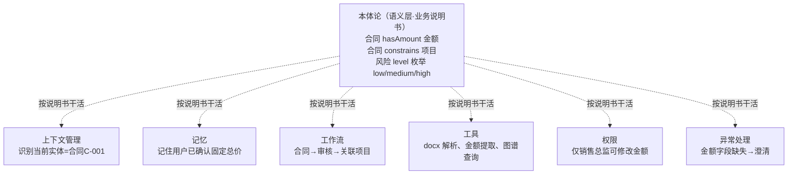
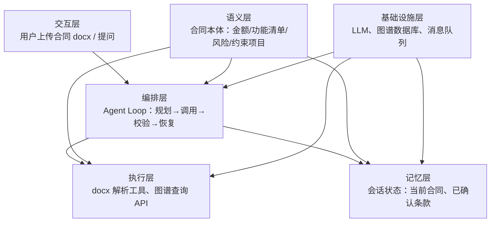
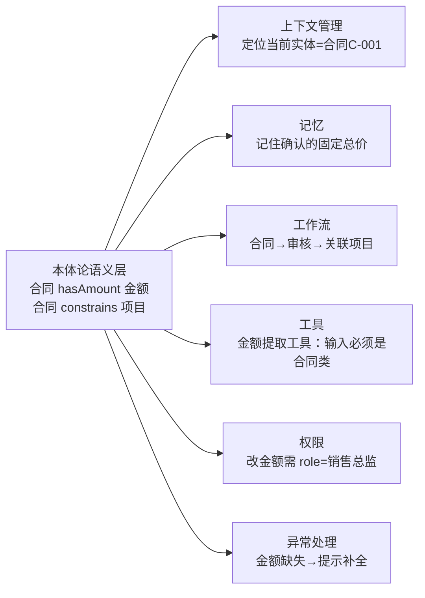

# 03. 本体论在 Agent 架构中的位置

## 一分钟看懂本章

> **一句话**：本体论不是 Agent 的第七个零件，而是所有零件共同遵守的"业务说明书"——它只定义怎么理解业务（合同→约束→项目），真正干活的还是上下文、记忆、工作流、工具、权限、异常处理这些模块。



> 读图要点：图表达"本体论居中给标准、六个模块各自执行"。读法：虚线表示"遵循本体论的定义"，每个模块括号里是它在一份合同流程中的真实动作——看清楚谁负责定义、谁负责干活。

## 本章目标

- 了解 Agent 的主要组成部分。
- 理解本体论如何横向影响上下文、记忆、工作流、工具、权限和异常处理。
- 区分“语义定义”和“运行时执行”。

## Agent 的分层架构



> 读图要点：这张图是 Agent 的"楼层图"。读法：数据从交互层进入，编排层调度，执行层干活，记忆层存状态；语义层不直接接待用户，但为楼上所有模块提供"怎么理解业务"的定义；基础设施层提供水电。

## 真实例子：上传合同 docx 时各层怎么配合

在「项目合同系统」上传《智慧园区建设合同》docx，看本体论如何影响每一步：

```text
用户上传 docx
→ 交互层：收到文件
→ 编排层：判断目标 = 提取合同信息
→ 语义层：给出合同模板（金额/功能清单/风险字段、合同→约束→项目 关系）
→ 执行层：调用 docx 解析工具，按模板填出合同实例
→ 权限层：校验该用户是否有权把合同关联到项目 P
→ 记忆层：记住"当前上下文 = 合同C-001"
→ 异常处理：金额字段缺失 → 编排层暂停，向用户澄清
```

每一步的"判断标准"都来自语义层，但"实际动作"是各模块自己完成的——这就是"本体论定义语义，运行时负责执行"。

## 本体论与六类 Agent 能力



> 读图要点：图表达"一个本体定义辐射六个模块"。读法：从左侧本体出发，沿箭头看它给每个模块定义了哪条具体规则——比如给工具定义"输入必须是合同类"，给权限定义"谁才能改金额"。

### 上下文管理

本体论可以帮助系统判断：

- 当前问题涉及哪些实体。
- 哪些关系是相关的。
- 哪些历史信息应该保留。
- 哪些字段属于工具调用必需参数。

### 记忆

本体论定义知识的组织方式，但不等于记忆存储。记忆系统仍然负责保存状态、历史消息和用户偏好。

### 工作流

本体论可以表达任务、状态、角色和前置条件；工作流引擎负责真正执行节点和状态迁移。

### 工具

本体论可以描述工具能力、输入实体类型、输出类型和调用前置条件；工具运行时负责实际执行。

### 权限

本体论可以表达角色、资源和动作关系；权限引擎负责最终授权或拒绝。

### 异常处理

本体约束可以发现类型不匹配、关系冲突、缺少必需条件等语义错误；运行时仍需要负责超时、网络错误和重试。

## 边界原则

```text
本体论：定义语义
规则引擎：执行推理或校验规则
工作流引擎：执行状态迁移
权限引擎：执行授权判断
Agent：理解目标并协调各组件
```

## 练习

把下面的能力分别归类：

1. 判断“产品 A”属于哪种实体。
2. 保存用户上一轮确认的模块。
3. 判断当前用户能否执行发布操作。
4. 调用发布工具。
5. 从审批节点恢复执行。

## 本章小结

本体论不是“第七种工具”，而是 Agent 共享的领域语义协议。它影响多个模块，但不替代这些模块的运行时职责。

