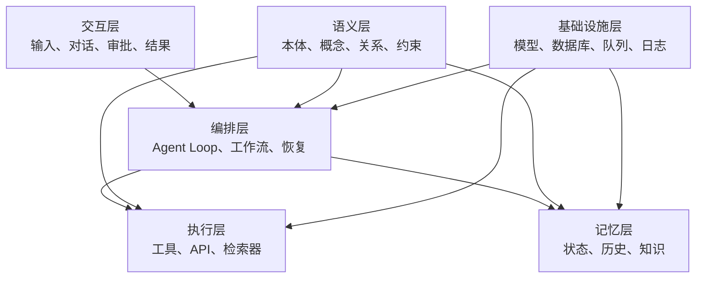
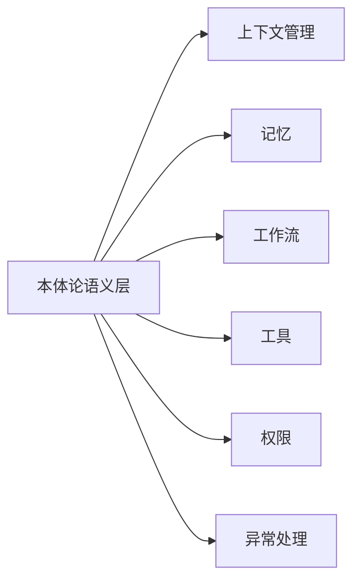

# 03. 本体论在 Agent 架构中的位置

## 本章目标

- 了解 Agent 的主要组成部分。
- 理解本体论如何横向影响上下文、记忆、工作流、工具、权限和异常处理。
- 区分“语义定义”和“运行时执行”。

## Agent 的分层架构



## 本体论与六类 Agent 能力



### 上下文管理

本体论可以帮助系统判断：

- 当前问题涉及哪些实体。
- 哪些关系是相关的。
- 哪些历史信息应该保留。
- 哪些字段属于工具调用必需参数。

### 记忆

本体论定义知识的组织方式，但不等于记忆存储。记忆系统仍然负责保存状态、历史消息和用户偏好。

### 工作流

本体论可以表达任务、状态、角色和前置条件；工作流引擎负责真正执行节点和状态迁移。

### 工具

本体论可以描述工具能力、输入实体类型、输出类型和调用前置条件；工具运行时负责实际执行。

### 权限

本体论可以表达角色、资源和动作关系；权限引擎负责最终授权或拒绝。

### 异常处理

本体约束可以发现类型不匹配、关系冲突、缺少必需条件等语义错误；运行时仍需要负责超时、网络错误和重试。

## 边界原则

```text
本体论：定义语义
规则引擎：执行推理或校验规则
工作流引擎：执行状态迁移
权限引擎：执行授权判断
Agent：理解目标并协调各组件
```

## 练习

把下面的能力分别归类：

1. 判断“产品 A”属于哪种实体。
2. 保存用户上一轮确认的模块。
3. 判断当前用户能否执行发布操作。
4. 调用发布工具。
5. 从审批节点恢复执行。

## 本章小结

本体论不是“第七种工具”，而是 Agent 共享的领域语义协议。它影响多个模块，但不替代这些模块的运行时职责。

