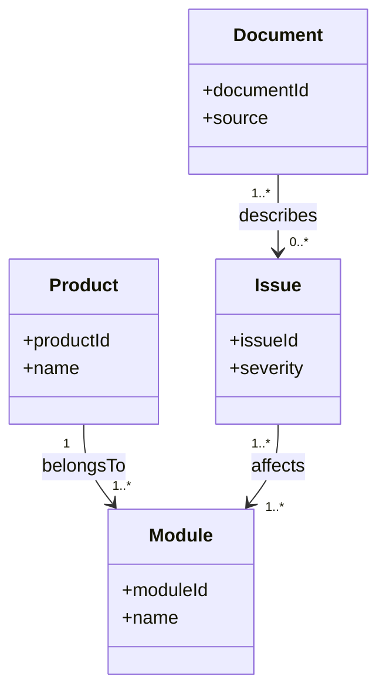
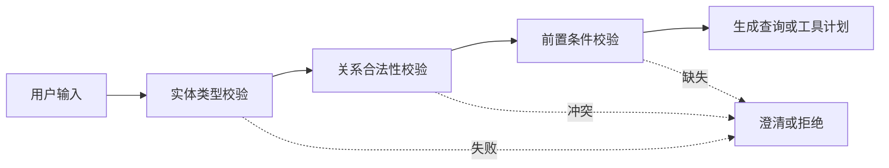

# 04. 类、实例、属性、关系和约束

## 本章目标

- 区分类、实例、数据属性和对象属性。
- 能画出企业知识助手的最小领域模型。
- 理解约束如何帮助 Agent 做校验和规划。

## 四个基本元素



### 类 Class

类描述一组具有共同特征的对象，例如 `Product`、`Module` 和 `Issue`。

### 实例 Individual

实例是具体对象：

```text
Product(product-A)
Module(module-B)
Issue(issue-D)
```

### 数据属性 Data Property

数据属性指向字符串、数字、时间或布尔值：

```text
product-A hasName "产品 A"
issue-D hasSeverity "high"
```

### 对象属性 Object Property

对象属性连接两个实体：

```text
product-A belongsTo module-B
issue-D affects module-B
```

## 约束如何帮助 Agent



例如，诊断工具要求输入一个 `Issue`，但用户只提供了一个 `Product`。Agent 不应直接调用工具，而应先澄清具体问题。

## 最小领域模型

```text
Product
  └── belongsTo -> Module

Module
  ├── contains -> Feature
  └── affectedBy <- Issue

Issue
  ├── resolvedBy -> Solution
  └── describedBy -> Document
```

## 设计约束

建议至少记录以下约束：

| 约束 | 示例 | 作用 |
|---|---|---|
| 类型约束 | `belongsTo` 的目标必须是 `Module` | 防止关系接错对象 |
| 基数约束 | 一个产品至少属于一个模块 | 发现缺失数据 |
| 枚举约束 | `severity` 只能是 low/medium/high | 校验输入值 |
| 前置条件 | 发布操作必须有审核结果 | 防止越权执行 |
| 来源约束 | 事实必须关联文档或系统来源 | 支持证据追溯 |

## 练习

为“高风险发布操作”设计：

1. 一个 `Action` 类。
2. 一个 `Role` 类。
3. `Role canPerform Action` 关系。
4. `Action requiresApproval` 属性。
5. Agent 调用前的三个校验条件。

## 本章小结

- 类描述概念，实例描述具体对象。
- 数据属性保存值，对象属性连接实体。
- 约束让 Agent 的查询、工具和工作流更可控。

