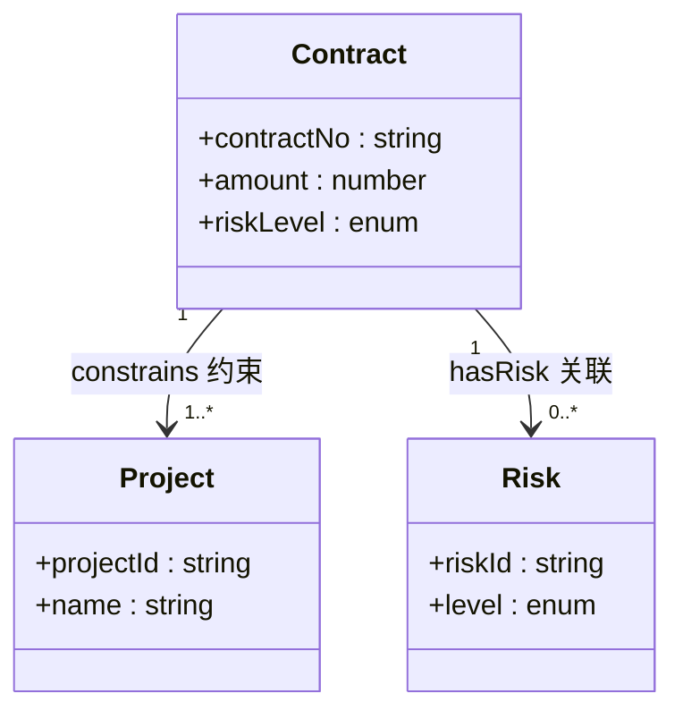
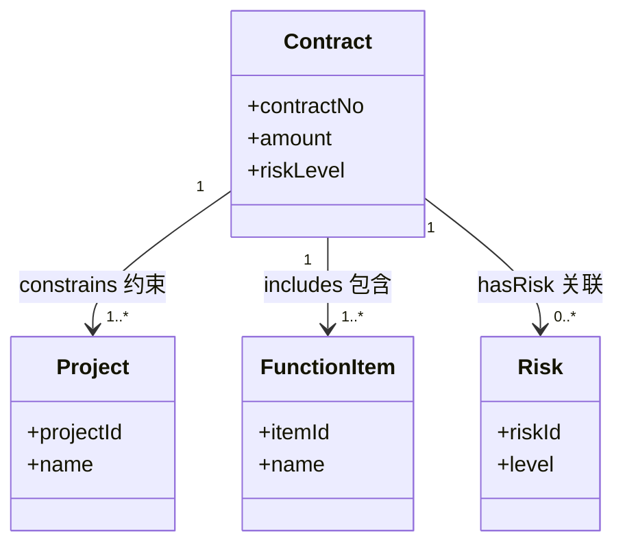
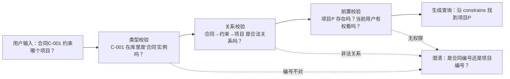

# 04. 类、实例、属性、关系和约束

## 一分钟看懂本章

> **一句话**：类=填空模板（合同），实例=填好的一张表（合同C-001），数据属性=表里的格子（金额=500万），对象属性=表与表之间的连线（合同→约束→项目），约束=填表规则（金额必须>0）。Agent 先对模板、再查关系、最后按规则校验，才能放心操作。



> 读图要点：图表达"模板长什么样、线怎么连"。读法：矩形是类（模板），类里的字段是数据属性（格子），箭头是对象属性（关系），数字是基数——"一份合同至少约束一个项目"就是规则的一种。

## 本章目标

- 区分类、实例、数据属性和对象属性。
- 能画出企业知识助手的最小领域模型。
- 理解约束如何帮助 Agent 做校验和规划。

## 四个基本元素



> 读图要点：这张图就是「项目合同系统」的最小领域模型。读法：先看矩形=类（模板），再看类里的字段=数据属性，最后看箭头=对象属性，箭头上方数字表示数量规则（一份合同可关联多个风险）。

### 类 Class

类描述一组具有共同特征的对象，例如 `Contract`（合同）、`Project`（项目）和 `Risk`（风险）。

### 实例 Individual

实例是具体对象：

```text
Contract(contract-C001)
Project(project-P)
Risk(risk-R1)
```

### 数据属性 Data Property

数据属性指向字符串、数字、时间或布尔值：

```text
contract-C001 hasAmount "5000000"
risk-R1 hasLevel "high"
```

### 对象属性 Object Property

对象属性连接两个实体：

```text
contract-C001 constrains project-P
contract-C001 hasRisk risk-R1
```

## 约束如何帮助 Agent



> 读图要点：这张图演示"约束怎么拦住错误"。读法：问题依次过三道检查，任何一道不过就进下面的澄清分支，三道全过才生成查询——Agent 宁可多问一句，也不拿错数据去执行。

例如，金额提取工具要求输入一个 `Contract` 实例，但用户只提供了一个项目名称。Agent 不应直接调用工具，而应先澄清具体合同。

**真实例子（项目合同系统）**：上传《智慧园区建设合同》docx 后：

1. **本体模板**定义 Contract 类：数据属性 `contractNo`/`amount`/`riskLevel`，对象属性 `constrains`（→Project）、`includes`（→FunctionItem）、`hasRisk`（→Risk）。
2. **识别实例**：合同C-001、金额 500 万、关联风险 R1（工期）。
3. **约束校验**：金额 500 万通过类型校验；`riskLevel` 枚举校验；基数约束"一份合同至少约束一个项目"发现项目还是空的 → Agent 主动询问"这份合同挂在哪个项目下？"。
4. 用户回答"项目P" → 建立 `contract-C001 constrains project-P`，写入知识图谱。

这就是约束的价值：它让 Agent 在"数据不完整、输入不合法"时及时停下来问，而不是硬着头皮往下做。

## 最小领域模型

```text
Contract（合同）
  ├── constrains -> Project（约束哪个项目）
  ├── includes -> FunctionItem（包含哪些功能）
  └── hasRisk -> Risk（有哪些风险）

Project（项目）
  └── hasContract <- Contract（项目下的合同）

Risk（风险）
  └── describedBy <- Document（风险对应合同哪段原文）
```

> 读图要点：这张文字图是可背诵的"模型清单"。读法：按"主语 + 关系 + 宾语"读，例如"合同 constrains 项目"；反箭头表示关系可以倒着问——"项目P 下有哪些合同"就是反着查 constrains。

## 设计约束

建议至少记录以下约束：

| 约束 | 示例 | 作用 |
|---|---|---|
| 类型约束 | `constrains` 的目标必须是 `Project` | 防止关系接错对象 |
| 基数约束 | 一份合同至少约束一个项目 | 发现缺失数据 |
| 枚举约束 | `riskLevel` 只能是 low/medium/high | 校验输入值 |
| 前置条件 | 关联项目前必须有合同审核结果 | 防止越权执行 |
| 来源约束 | 合同金额必须关联 docx 原文出处 | 支持证据追溯 |

## 练习

为“高风险发布操作”设计：

1. 一个 `Action` 类。
2. 一个 `Role` 类。
3. `Role canPerform Action` 关系。
4. `Action requiresApproval` 属性。
5. Agent 调用前的三个校验条件。

## 本章小结

- 类描述概念，实例描述具体对象。
- 数据属性保存值，对象属性连接实体。
- 约束让 Agent 的查询、工具和工作流更可控。

