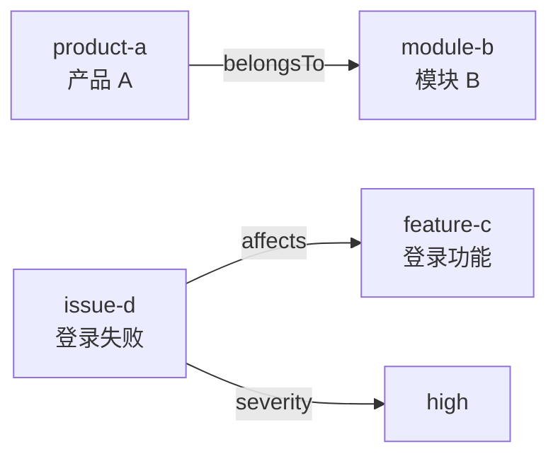
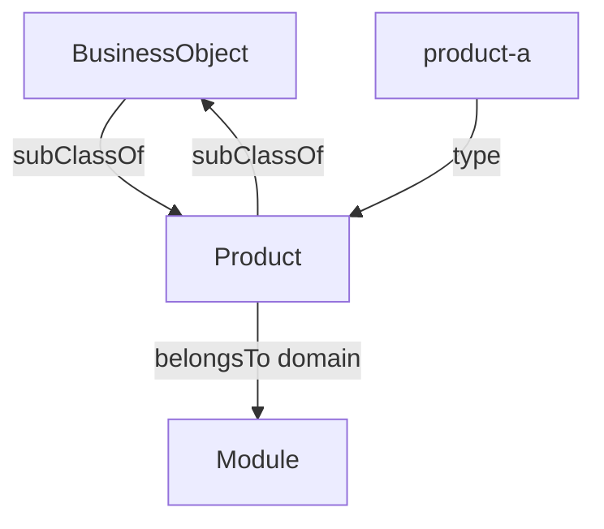
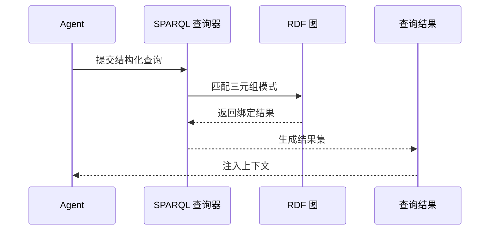

# 05. RDF、RDFS、OWL 和 SPARQL 基础

## 本章目标

- 理解 RDF 三元组。
- 区分 RDFS 和 OWL 的作用。
- 能使用 SPARQL 查询实体和关系。

## RDF：用三元组描述事实

RDF 的基本形式是：

```text
主语 subject -> 谓语 predicate -> 宾语 object
```

企业知识助手中的事实可以写成：

```text
product-a -> belongsTo -> module-b
issue-d   -> affects   -> feature-c
issue-d   -> severity  -> "high"
```



RDF 不要求所有数据都放在一张表里，它通过实体和关系组成图。

## RDFS：给 RDF 增加类型层级

RDFS 可以表达：

- `Product` 是一个类。
- `product-a` 是 `Product` 的实例。
- `Product` 是 `BusinessObject` 的子类。
- `belongsTo` 的主语通常是 `Product`，宾语通常是 `Module`。



## OWL：表达更丰富的语义约束

OWL 可以表达：

- 类等价或互斥。
- 属性的反向关系。
- 属性是否传递、对称或函数化。
- 某个类必须有特定关系。
- 某个关系的目标类型和基数。

OWL 是语义表达语言，不等于 Agent 的工作流。它告诉系统“哪些结构成立”，运行时仍需要查询器、推理器或校验器执行这些语义。

## SPARQL：查询 RDF 图

最小查询：

```sparql
PREFIX ex: <http://example.com/enterprise#>

SELECT ?product ?module
WHERE {
  ?product a ex:Product .
  ?product ex:belongsTo ?module .
}
```

查询链路：



## Agent 使用时的边界

```text
LLM：把自然语言转成候选实体、关系和查询意图
本体：限制候选实体和关系是否合法
SPARQL：执行结构化查询
Agent：解释结果、补充文档证据或继续调用工具
```

## 练习

1. 把“问题 D 影响功能 C”写成 RDF 三元组。
2. 为 `affects` 关系指定 domain 和 range。
3. 写一个查询，找出所有影响模块 B 的问题。

## 本章小结

- RDF 表达事实。
- RDFS 表达基本类型层级。
- OWL 表达更丰富的语义和约束。
- SPARQL 查询 RDF 图。

