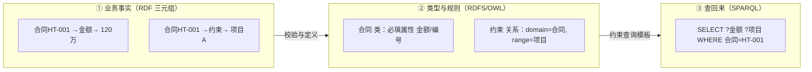
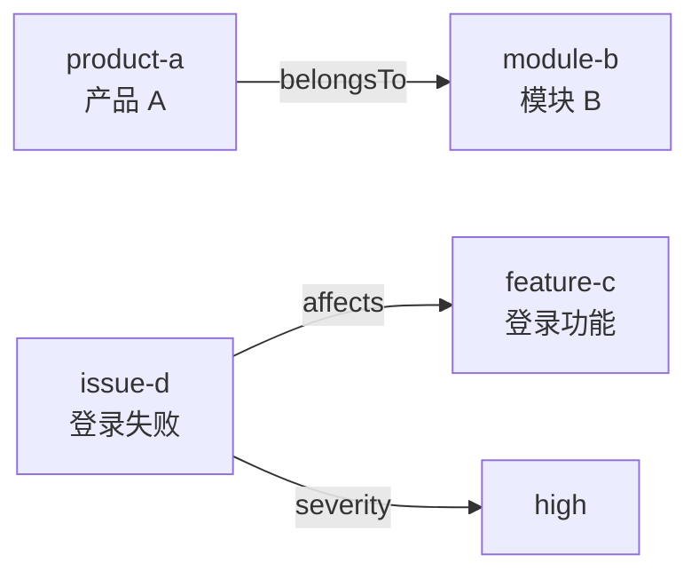
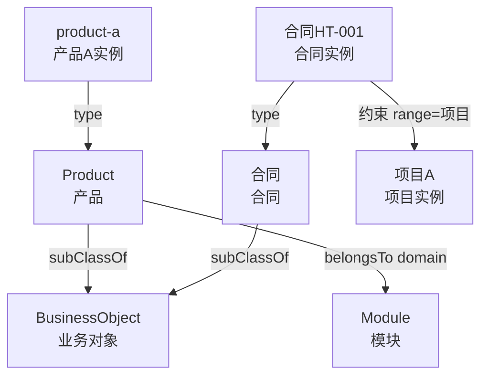
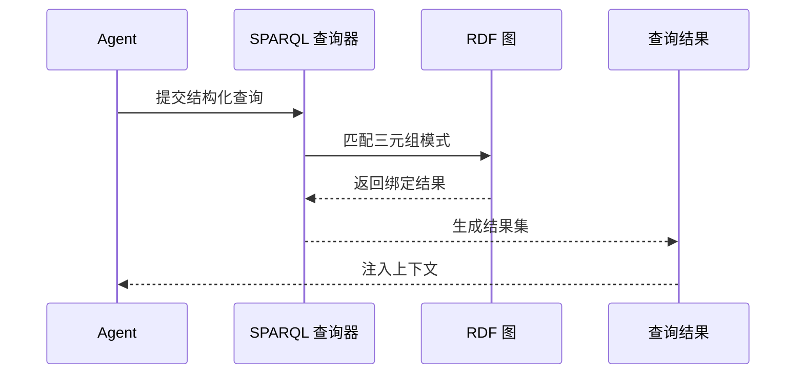

# 05. RDF、RDFS、OWL 和 SPARQL 基础

## 一分钟看懂本章

> **一句话**：RDF 把业务事实写成"主语─谓语─宾语"的一句话（合同HT-001 ─金额→ 120万）；RDFS/OWL 给这些词定类型和规则（合同必须有金额、约束只能连到项目）；SPARQL 按模板把话再查回来。



**读图要点**：先看业务事实层——每个箭头就是一条三元组；再看语义层——它规定了"哪些话合法"（比如金额不能连到项目）；最后看查询层——SPARQL 只查合法结构，所以结果才可靠。

## 真实例子：把合同系统说成 RDF

以「项目合同系统」贯穿全章。下面的 Turtle 代码可直接运行：

```turtle
@prefix ex: <http://example.com/enterprise#> .

ex:合同-HT-001 a ex:合同 ;
    ex:金额 "120万" ;
    ex:约束 ex:项目-A ;
    ex:验收条款 "上线后30天内验收" .
ex:项目-A a ex:项目 ;
    ex:延期风险 ex:里程碑M2延期 .
```

```bash
# 在 code/01_rdf_owl/ 下运行（已装 rdflib）
python minimal_rdf.py   # 输出：产品 A 属于 模块 B
```

## 本章目标

- 理解 RDF 三元组。
- 区分 RDFS 和 OWL 的作用。
- 能使用 SPARQL 查询实体和关系。

## RDF：用三元组描述事实

RDF 的基本形式是：

```text
主语 subject -> 谓语 predicate -> 宾语 object
```

企业知识助手中的事实可以写成：

```text
product-a -> belongsTo -> module-b
issue-d   -> affects   -> feature-c
issue-d   -> severity  -> "high"
```



**读图要点**：每一条带箭头的线就是一个三元组，宾语既可以是另一个实体（如模块 B），也可以是一个字面量值（如 high）；把多条线连起来，就形成了一张可多跳查询的图。

换成合同系统，三句话的宾语类型各不相同：

```text
合同HT-001 ─金额→ "120万"          # 宾语是字面量（数据属性）
合同HT-001 ─约束→ 项目A             # 宾语是另一个实体（对象关系）
项目A ─延期风险→ "里程碑M2延期"     # 主语换成了项目A，依然合法
```

RDF 不要求所有数据都放在一张表里，它通过实体和关系组成图。

## RDFS：给 RDF 增加类型层级

RDFS 可以表达：

- `Product` 是一个类。
- `product-a` 是 `Product` 的实例。
- `Product` 是 `BusinessObject` 的子类。
- `belongsTo` 的主语通常是 `Product`，宾语通常是 `Module`。



**读图要点**：竖向箭头表示"是…的子类"（产品、合同都是业务对象的子类）；`type` 表示"某实例属于某类"；domain/range 表示关系的两头必须是什么类——例如 `约束` 的主语必须是合同、宾语必须是项目，否则这条三元组就"不合法"。

## OWL：表达更丰富的语义约束

OWL 可以表达：

- 类等价或互斥。
- 属性的反向关系。
- 属性是否传递、对称或函数化。
- 某个类必须有特定关系。
- 某个关系的目标类型和基数。

用合同系统举例，一段 OWL 片段（Turtle 语法）就能表达"合同必须有约束对象、且约束的目标必须是项目"：

```turtle
@prefix owl: <http://www.w3.org/2002/07/owl#> .
@prefix rdfs: <http://www.w3.org/2000/01/rdf-schema#> .
@prefix ex: <http://example.com/enterprise#> .

ex:合同 a owl:Class ;
    rdfs:subClassOf [ a owl:Restriction ;
        owl:onProperty ex:约束 ;
        owl:someValuesFrom ex:项目 ] .
```

**读图要点**：OWL 不是"画个框"，它把约束写成机器可校验的公式——上例意思是"凡是合同，都必须存在至少一条 `约束` 关系，且指向某个项目"。这正是 OWL 比 RDFS 强的地方：RDFS 只声明 `约束` 连到什么类，OWL 能强制"必须有"。

OWL 是语义表达语言，不等于 Agent 的工作流。它告诉系统"哪些结构成立"，运行时仍需要查询器、推理器或校验器执行这些语义。

## SPARQL：查询 RDF 图

最小查询：

```sparql
PREFIX ex: <http://example.com/enterprise#>

SELECT ?product ?module
WHERE {
  ?product a ex:Product .
  ?product ex:belongsTo ?module .
}
```

把合同例子换成查询就是：

```sparql
PREFIX ex: <http://example.com/enterprise#>

# 问：合同HT-001 约束了哪个项目？金额多少？
SELECT ?项目 ?金额
WHERE {
  ex:合同-HT-001 ex:约束 ?项目 .
  ex:合同-HT-001 ex:金额 ?金额 .
}
```

**查询套路**：`WHERE` 里每行就是一个"三元组模板"，变量 `?项目`、`?金额` 会匹配图上任意值；模板和图上哪条三元组对得上，结果就带上谁。上面代码对应 `code/01_rdf_owl/minimal_rdf.py` 里的可运行查询，输出类似 `产品 A 属于 模块 B`。

查询链路：



**读图要点**：整条链路由 Agent 发起、SPARQL 执行、结果回填上下文。注意本体约束（如 `ex:约束` 的 range=项目）在**生成查询时**就要用来过滤，而不是等查询返回后再判断。

## Agent 使用时的边界

```text
LLM：把自然语言转成候选实体、关系和查询意图
本体：限制候选实体和关系是否合法
SPARQL：执行结构化查询
Agent：解释结果、补充文档证据或继续调用工具
```

在合同系统里这条边界就是：LLM 识别出"查 HT-001 的约束对象" → 本体确认 `约束` 合法且 range=项目 → SPARQL 执行 → Agent 补一句文档证据"合同原件第 3 页"。

## 练习

1. 把“问题 D 影响功能 C”写成 RDF 三元组。
2. 为 `affects` 关系指定 domain 和 range。
3. 写一个查询，找出所有影响模块 B 的问题。

## 本章小结

- RDF 表达事实。
- RDFS 表达基本类型层级。
- OWL 表达更丰富的语义和约束。
- SPARQL 查询 RDF 图。

