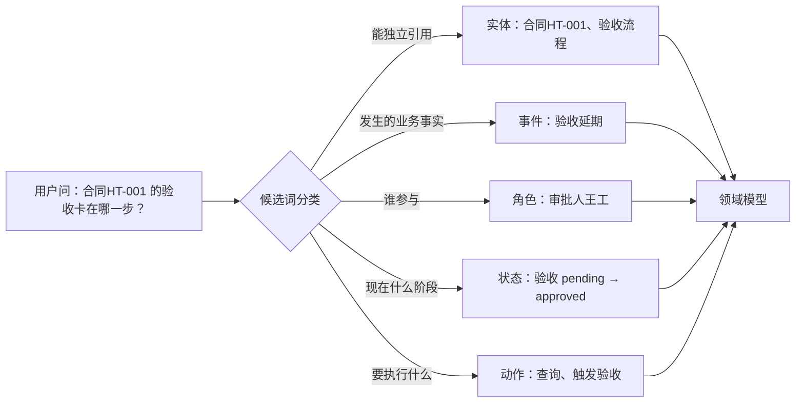
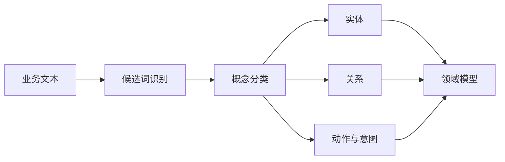
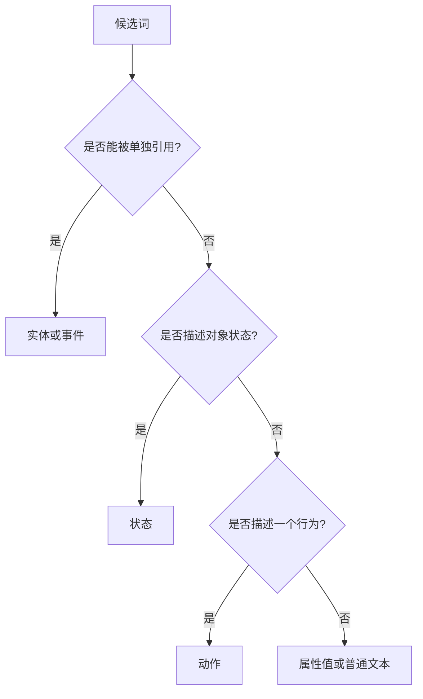
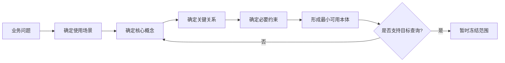

# 06. 从业务问题抽取本体概念

## 一分钟看懂本章

> **一句话**：从一句业务话里抽出的词要分五类（实体/事件/角色/状态/动作）——谁建成"类"、谁建成"关系"，不看词本身，而看你要回答的查询需不需要它。



**读图要点**：同一个词在句中位置不同、职责就不同——"验收"既是名词（实体）也可能是动作；分类的目的是决定它在本体里是"类"、"属性"还是"关系"，而不是贴标签。

## 真实例子：从合同文档抽概念

以「项目合同系统」为例，输入一段合同描述：

```text
"合同HT-001 约定 120 万金额、约束项目A；审批人王工批准后，系统才能触发验收流程；
若验收延期超过 7 天，状态变为 risk（风险）。"
```

抽取结果：

| 候选词 | 五类分类 | 在本体中的角色 |
|---|---|---|
| 合同HT-001、项目A | 实体 | 类 + 实例 |
| 验收延期 | 事件 | 关系 or 类（取决于是否需要独立查询） |
| 审批人王工 | 角色 | 角色类 |
| 验收 pending / approved / risk | 状态 | 枚举属性值 |
| 批准、触发验收 | 动作 | 动作类（供权限/工具用） |

**关键判断**：`验收延期` 到底建成类还是建成关系？如果将来要查"哪些合同延期过、延期了几次"，它就是类；如果只是给合同挂个布尔字段，它就只是属性。**查询决定建模深度**。

## 本章目标

- 从用户问题、业务文档和数据表中提取候选概念。
- 区分实体、事件、角色、状态和动作。
- 控制本体范围，避免一开始过度建模。

## 从问题中找概念

用户问题：

```text
“产品 A 的登录失败问题有哪些解决方案？”
```

可以抽取：

```text
实体：产品 A、登录失败、解决方案
关系：产品关联问题、问题由方案解决
意图：查询解决方案
```



**读图要点**：文本先进"候选词识别"，再按职责分流到实体/关系/动作，最后汇入领域模型。注意**同一个词可能同时出现在多条分支**（如"验收"既是实体也可能是动作），分流只是初步分工，最终归属在建模时定。

## 五类候选概念

| 类型 | 说明 | 示例 |
|---|---|---|
| 实体 | 可以独立识别和引用的对象 | 产品、模块、文档 |
| 事件 | 发生过或正在发生的业务事实 | 登录失败、发布、审批 |
| 角色 | 谁参与或负责某件事 | 普通用户、审核人、管理员 |
| 状态 | 对象或任务当前处于什么阶段 | pending、running、approved |
| 动作 | Agent 或用户想要执行的行为 | 查询、诊断、发布 |

用合同系统各举一例，体会边界：

```text
实体：合同HT-001、项目A、排障手册.doc
事件：验收延期、里程碑M2延期
角色：审批人王工、合同管理员
状态：验收 pending → approved → risk
动作：触发验收、驳回、查询风险
```

## 概念边界决策树



**读图要点**：从"候选词"出发一路回答三个问题——能否单独引用 → 是否描述状态 → 是否描述行为。以合同系统为例：`合同HT-001` 能单独引用 → 实体；`risk` 不能单独引用但描述状态 → 状态；`触发验收` 描述行为 → 动作；`"120万"` 什么都不是 → 属性值。

## 从数据表反推概念

数据表：

```text
issue(id, title, severity, product_id, solution_id)
```

可以初步映射为：

```text
Issue：类
id、title、severity：数据属性
product_id：对象关系 affectsProduct
solution_id：对象关系 resolvedBy
```

但不能机械地把每个字段都变成类。是否建成类，要看它是否需要独立关系、约束、查询或生命周期。

合同系统的表同样可以反推：

```text
contract(id, amount, acceptance_clause, project_id)
```

```text
contract        → 类：合同
amount、acceptance_clause → 数据属性：金额、验收条款
project_id      → 对象关系：约束（range=项目）
```

其中 `amount` 是数字所以建成属性；但 `acceptance_clause` 若未来要支持"按验收条款检索合同"，就值得单独拆成 `验收条款` 类而不是一段长文本。

## 控制建模范围



**读图要点**：这是一个"收敛回路"——从业务问题出发，逐步收紧到核心概念、关键关系、必要约束，形成最小可用本体；如果它回答不了目标查询（如"查所有金额大于 100 万的合同"），就回退到概念层补类或属性，直到查询成立再冻结范围。

## 练习

从下面的问题抽取概念：

```text
“审核人批准报告后，系统才能调用发布工具。”
```

至少识别：角色、文档、动作、状态、前置条件和权限关系。

## 本章小结

- 本体建模从业务问题开始，而不是从工具 API 开始。
- 先确定场景和查询，再决定哪些词需要成为类或关系。
- 最小可用本体比一次性覆盖所有领域更容易验证。

