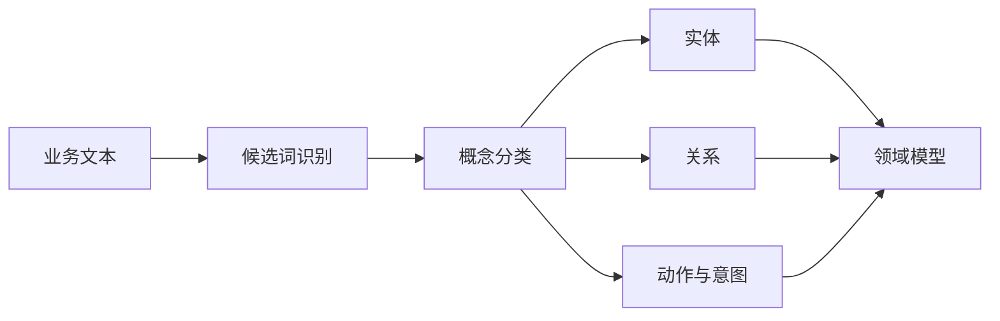
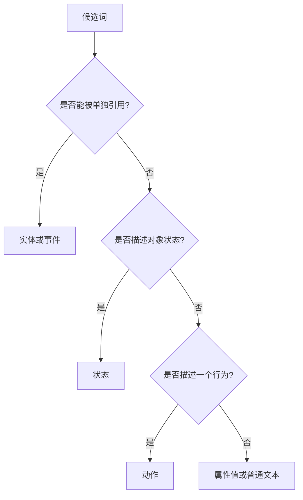
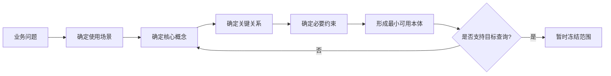

# 06. 从业务问题抽取本体概念

## 本章目标

- 从用户问题、业务文档和数据表中提取候选概念。
- 区分实体、事件、角色、状态和动作。
- 控制本体范围，避免一开始过度建模。

## 从问题中找概念

用户问题：

```text
“产品 A 的登录失败问题有哪些解决方案？”
```

可以抽取：

```text
实体：产品 A、登录失败、解决方案
关系：产品关联问题、问题由方案解决
意图：查询解决方案
```



## 五类候选概念

| 类型 | 说明 | 示例 |
|---|---|---|
| 实体 | 可以独立识别和引用的对象 | 产品、模块、文档 |
| 事件 | 发生过或正在发生的业务事实 | 登录失败、发布、审批 |
| 角色 | 谁参与或负责某件事 | 普通用户、审核人、管理员 |
| 状态 | 对象或任务当前处于什么阶段 | pending、running、approved |
| 动作 | Agent 或用户想要执行的行为 | 查询、诊断、发布 |

## 概念边界决策树



## 从数据表反推概念

数据表：

```text
issue(id, title, severity, product_id, solution_id)
```

可以初步映射为：

```text
Issue：类
id、title、severity：数据属性
product_id：对象关系 affectsProduct
solution_id：对象关系 resolvedBy
```

但不能机械地把每个字段都变成类。是否建成类，要看它是否需要独立关系、约束、查询或生命周期。

## 控制建模范围



## 练习

从下面的问题抽取概念：

```text
“审核人批准报告后，系统才能调用发布工具。”
```

至少识别：角色、文档、动作、状态、前置条件和权限关系。

## 本章小结

- 本体建模从业务问题开始，而不是从工具 API 开始。
- 先确定场景和查询，再决定哪些词需要成为类或关系。
- 最小可用本体比一次性覆盖所有领域更容易验证。

