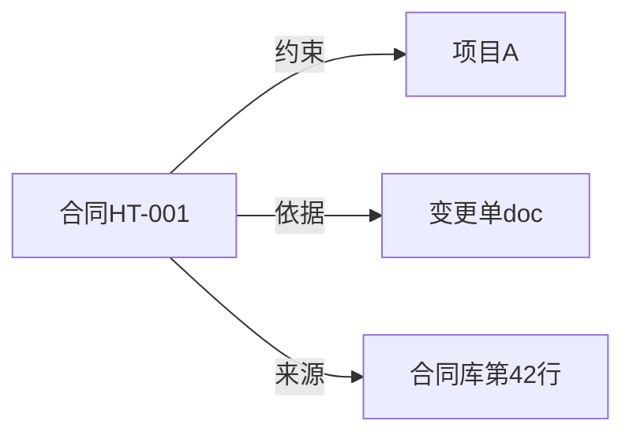

# 05. 把数据装进知识图谱

## 先看一个扎心的问题

> 前几章你辛辛苦苦把"合同、项目、风险"这些概念、关系画成了本体，业务地图是有了。
>
> 可现在真正的问题来了：业务系统里那一堆 JSON、CSV、数据库记录，**怎么才能变成图上一个个具体的点？**
>
> 难道要靠人把几千条合同、几万个里程碑一条条敲进图谱里吗？敲进去之后，系统又凭什么相信这条数据是真的、是哪来的、什么时候来的？

## 一句话说清

**把业务系统里的原始记录，翻译成本体认得的"主语-谓语-宾语"三元组，再给每条贴好"来源、时间、置信度"的标签，存进知识图谱——这就是"把数据装进图谱"。**

打个比方：

- **本体**是档案柜的"摆放规则"：哪个格子放合同、哪个格子放项目、谁和谁之间允许连线。
- **数据导入**是"整理归档"：把一摞原始单据翻译成标准档案，塞进正确格子，每张档案上盖好来源章和时间章。
- 没有盖来源章的档案，等于没人知道它从哪来——出问题的时候，你连"这条事实靠不靠谱"都说不清。

## 数据怎么变成三元组：这就是"数据映射"

本体定义的是"抽象概念"，图谱存的是"具体事实"。从原始记录到三元组的这一步，叫**数据映射**——说白了，就是把每个字段翻译成图谱认得的东西。

拿合同系统举例，业务系统推来一条 JSON：

```json
{
  "id": "HT-001",
  "title": "网关升级合同",
  "amount": 120,
  "project_id": "PRJ-A",
  "source": "contract-db",
  "observed_at": "2026-08-01T10:00:00Z"
}
```

翻译成三元组（写入图谱）：

```text
HT-001 类型 合同                  # 它是哪类东西
HT-001 金额 120                   # 数据属性
HT-001 约束 PRJ-A                 # 对象关系：约束的是项目
HT-001 来源 contract-db           # 出处
HT-001 观察时间 2026-08-01T10:00:00Z
```

映射规则就这么几条，写一次能批量套用：

| 原始字段 | 翻译成 | 说明 |
|---|---|---|
| `id` | 实体 ID | 这个点叫什么名字 |
| `title`、`amount` | 数据属性 | 这个点长什么样 |
| `project_id` | 对象关系 | 这个点和别的点怎么连 |
| `source`、`observed_at` | 审计元数据 | 这条事实从哪来、什么时候来的 |

注意看：`类型`、`金额`、`约束` 是业务本体里的东西；而 `来源`、`观察时间` 不属于业务本体，属于**审计元数据**，两者分开存。这样系统既知道"合同约束了项目"，又知道"这条记录是合同库在 8 月 1 号推来的"。

## 每条事实都要贴标签：实体 ID、来源、时间、置信度

同一个业务对象可能同时出现在好几个系统里（合同库有 HT-001，OA 也有）。所以每条实体入库前，至少要带齐这些标签：

```text
entity_id          实体 ID        = HT-001
entity_type        实体类型      = 合同
source_system      来源系统      = contract-db
source_record_id   源记录号      = row-2026-00042
observed_at        观察时间      = 2026-08-01T10:00:00Z
confidence         置信度        = 0.98
ontology_version   本体版本      = v1.2
```

**置信度是什么？** 说白了就是"这条事实有多可信"。

- 金额是数据库里直接读出来的，给 0.98，几乎可信；
- 验收条款是 LLM 从合同 docx 里"猜"出来的，可能只有 0.7。
- Agent 回答时看到低置信度，会把话说成"这条待核实"，而不是当成板上钉钉的结论。

## 文档事实和结构化事实，怎么勾连

图谱里存的是结构化事实（机器直接可查），可现实中很多依据是文档（合同原文、变更单、排障手册）。两者得勾连起来，不然 Agent 只给结论、给不出证据。



**读图要点**：中间那条"约束"是业务结论，下面两条"依据""来源"是支撑证据。结论和证据一起给，才叫可追溯——Agent 回答"HT-001 约束了项目 A"时，能顺手甩出变更单和数据库行号让你核对。

## 增量更新：不是把表清空重导

数据不是灌一次就完事，业务系统会不断推新记录、改旧记录。增量更新的套路是固定的三件事，顺序不能乱：

1. **先校验**：新数据先过一遍合法性检查，脏数据直接拒绝，别让它进图。
2. **再写图**：校验过了才写入或更新事实。
3. **最后留日志**：记下谁、何时、从什么值改到什么值。

比如合同金额从 120 万改成 150 万，变更日志里要能查到这次改动。**没有日志的增量更新，一旦出错，只能把整个图谱清空重导一遍**——那就惨了。

## 真实例子：一份合同记录如何入库

还是 HT-001，走完整流程：业务系统推送 → 数据映射翻译成三元组 → 校验器用本体约束检查（金额必须是数字、`约束` 只能连项目类）→ 通过 → 写入图谱 → 挂上来源和时间标签。

```text
HT-001 类型 合同
HT-001 金额 120
HT-001 约束 PRJ-A
HT-001 来源 contract-db
HT-001 观察时间 2026-08-01T10:00:00Z
```

如果某一步校验不过，比如 `金额` 传进来是负数，校验器会记下错误并拒绝写入，绝不静默吞掉。**任何一步失败，都不该静默写入。**

## 动手试试

打开你手头的一条业务记录（JSON、CSV 或数据库某行都行），试着：

1. 把每条字段翻译成三元组，标出哪些是数据属性、哪些是对象关系。
2. 为每条事实补上 `来源` 和 `观察时间`，没有现成字段就猜一个合理的。
3. 想想这条记录如果每天更新一次，你打算怎么留变更日志。

## 一句话总结

**数据装进图谱 = 翻译成三元组 + 贴好来源时间置信度标签 + 结论和证据一起存 + 增量更新必须留日志。** 装数据这一步做扎实了，下一章"怎么查、怎么推"才有地基。
