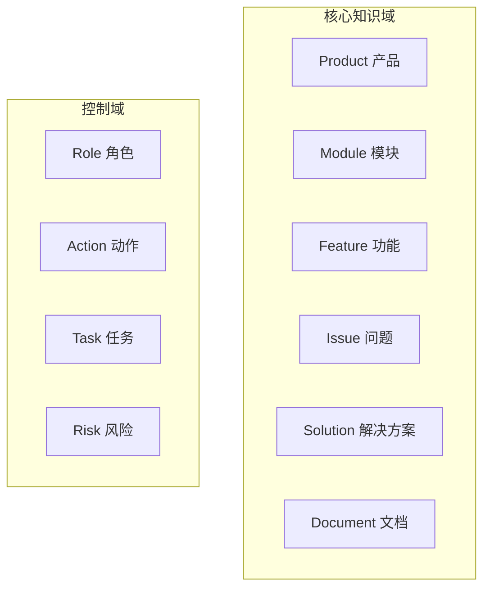
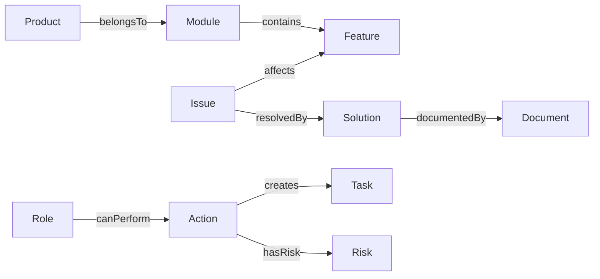
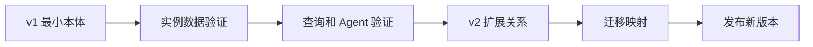

# 07. 设计企业知识助手本体

## 本章目标

- 建立企业知识助手的最小领域模型。
- 设计核心类、关系和约束。
- 为后续 SPARQL、工具调用和权限判断准备语义基础。

## 建模范围

本阶段只覆盖知识问答和高风险操作审核，不建模组织、人事、财务等无关领域。



## 核心关系



## 查询路径优先

本体不是概念清单，必须支持真实查询路径：

```text
Product -> belongsTo -> Module
Module -> contains -> Feature
Issue -> affects -> Feature
Issue -> resolvedBy -> Solution
Solution -> documentedBy -> Document
```

这条路径支持：

```text
产品 -> 模块 -> 功能 -> 问题 -> 解决方案 -> 文档证据
```

## 约束设计

| 对象 | 约束 |
|---|---|
| `Product` | 至少属于一个 `Module` |
| `Issue` | 必须有严重程度和来源 |
| `Solution` | 至少关联一个 `Document` 或业务系统记录 |
| `Action` | 必须声明输入类型、输出类型和风险等级 |
| `Task` | 高风险动作完成前必须有审核结果 |

## 版本策略



先冻结核心类和关系，再根据真实查询增加扩展，不要因为某一条文档中的特殊词汇就立即新增类。

## 练习

为“高风险发布”补充：

1. `Action` 的输入类型。
2. `Risk` 的等级属性。
3. `Role canPerform Action` 的授权关系。
4. `Task requiresApproval` 的状态约束。

## 本章小结

- 领域本体要围绕真实查询和动作设计。
- 关系路径比类的数量更重要。
- 版本演进要有验证和迁移边界。

