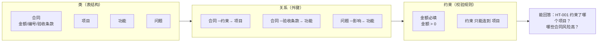
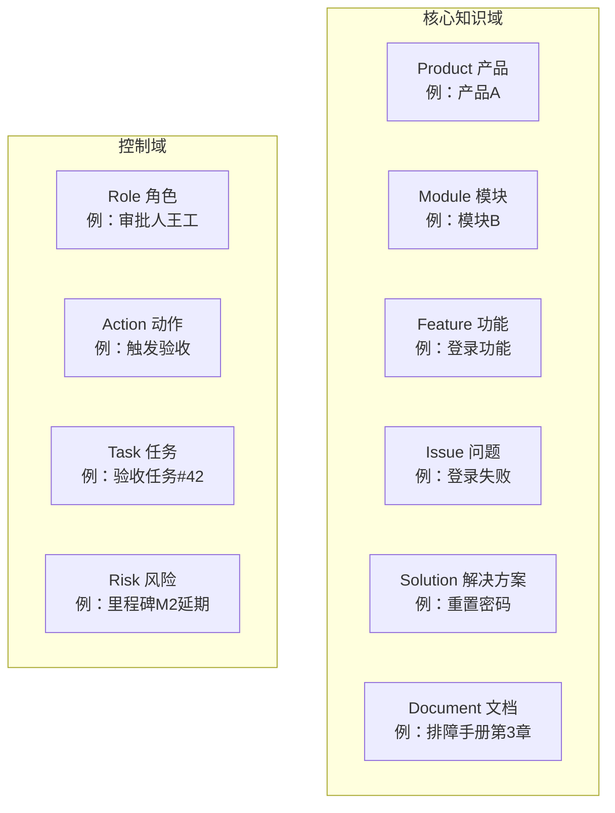
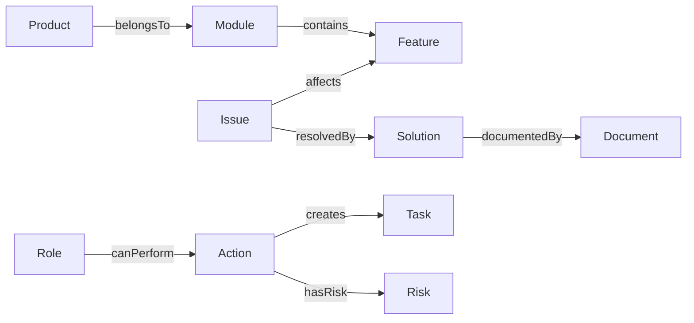
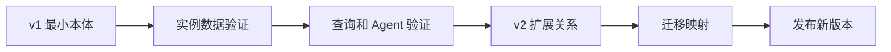

# 07. 设计企业知识助手本体

## 一分钟看懂本章

> **一句话**：设计本体不是把所有名词都建成类，而是先把"要查什么、要拦什么"定下来，再让类、关系、约束刚好够用——就像给合同系统先定"表结构 + 外键 + 校验规则"。



**读图要点**：三类工件层层递进——先有类，类之间有关系，关系有约束，最后所有设计都服务于真实查询；没有查询支撑的关系（如"合同的颜色"）就是过度建模。

## 真实例子：合同系统的最小本体

以「项目合同系统」贯穿本章。最小可用本体只需三个类、四条关系、三个约束，对应 Turtle 片段（可对照 `code/03_ontology_modeling/enterprise.ttl`）：

```turtle
@prefix ex: <http://example.com/enterprise#> .

ex:合同 a rdfs:Class .
ex:项目 a rdfs:Class .
ex:功能 a rdfs:Class .

ex:约束 a rdf:Property ;
    rdfs:domain ex:合同 ;
    rdfs:range ex:项目 .       # 约束：合同 → 项目

ex:金额 a rdf:Property ;
    rdfs:domain ex:合同 .      # 金额：合同的数据属性
```

**设计原则**：`金额` 建成"数据属性"因为没人需要"金额的金额"；`约束` 建成"对象关系"因为 Agent 要沿它做多跳查询（合同→项目→风险）。判定标准永远是查询路径。

## 本章目标

- 建立企业知识助手的最小领域模型。
- 设计核心类、关系和约束。
- 为后续 SPARQL、工具调用和权限判断准备语义基础。

## 建模范围

本阶段只覆盖知识问答和高风险操作审核，不建模组织、人事、财务等无关领域。



**读图要点**：左半"核心知识域"回答知识问答（产品/模块/功能/问题/方案/文档），右半"控制域"回答操作审核（角色/动作/任务/风险）——本阶段明确**不建模**组织、人事、财务，把边界画清楚才能防止概念膨胀。

## 核心关系



**读图要点**：核心关系只有八条，但每一条都是查询路径的"承重墙"。对照合同系统：`合同 ─约束→ 项目`、`项目 ─延期→ 里程碑`、`风险 ─来源→ 合同`——关系宁可少而有用，不可多而无人查。

## 查询路径优先

本体不是概念清单，必须支持真实查询路径：

```text
Product -> belongsTo -> Module
Module -> contains -> Feature
Issue -> affects -> Feature
Issue -> resolvedBy -> Solution
Solution -> documentedBy -> Document
```

这条路径支持：

```text
产品 -> 模块 -> 功能 -> 问题 -> 解决方案 -> 文档证据
```

合同系统的对应路径：

```text
合同HT-001 -> 约束 -> 项目A -> 包含 -> 功能C -> 影响 -> 验收延期 -> 解决 -> 顺延里程碑 -> 依据 -> 合同变更单.doc
```

这条五跳路径就是一段 SPARQL 的原型：

```sparql
PREFIX ex: <http://example.com/enterprise#>

SELECT ?功能 ?方案 ?文档
WHERE {
  ex:合同-HT-001 ex:约束 ?项目 .
  ?项目 ex:包含 ?功能 .
  ?问题 ex:影响 ?功能 .
  ?问题 ex:解决 ?方案 .
  ?方案 ex:依据 ?文档 .
}
```

**设计自检**：画完本体后，把高频问题逐条翻译成路径走一遍；走不通的地方就是要补关系或改类的地方。

## 约束设计

| 对象 | 约束 |
|---|---|
| `Product` | 至少属于一个 `Module` |
| `Issue` | 必须有严重程度和来源 |
| `Solution` | 至少关联一个 `Document` 或业务系统记录 |
| `Action` | 必须声明输入类型、输出类型和风险等级 |
| `Task` | 高风险动作完成前必须有审核结果 |

## 版本策略



**读图要点**：版本演进是"验证驱动"的——v1 冻结最小本体 → 用真实实例数据验证 → 用真实查询和 Agent 行为验证 → 确认缺什么才升 v2。合同系统第一版只建合同/项目/风险三类，跑通"哪些合同高风险"后再补 `变更单` 类，而不是一开始就把所有表都建成类。

先冻结核心类和关系，再根据真实查询增加扩展，不要因为某一条文档中的特殊词汇就立即新增类。

## 练习

为“高风险发布”补充：

1. `Action` 的输入类型。
2. `Risk` 的等级属性。
3. `Role canPerform Action` 的授权关系。
4. `Task requiresApproval` 的状态约束。

## 本章小结

- 领域本体要围绕真实查询和动作设计。
- 关系路径比类的数量更重要。
- 版本演进要有验证和迁移边界。

