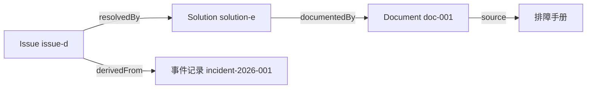
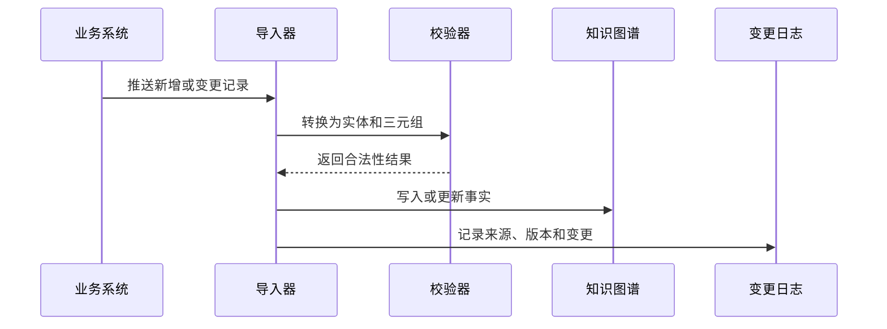

# 08. 创建实例数据和知识图谱

## 本章目标

- 把本体类和关系填充为具体实例。
- 记录实体来源、时间和置信度。
- 理解结构化事实与文档证据的关联。

## 从业务记录生成实例

输入数据：

```json
{
  "id": "issue-d",
  "title": "登录失败",
  "severity": "high",
  "product_id": "product-a",
  "solution_id": "solution-e",
  "source": "incident-2026-001"
}
```

输出事实：

```text
issue-d rdf:type Issue
issue-d title "登录失败"
issue-d severity "high"
issue-d affectsProduct product-a
issue-d resolvedBy solution-e
issue-d derivedFrom incident-2026-001
```


## 实体 ID 和来源

同一个业务对象可能来自多个系统，因此实体数据至少要考虑：

```text
entity_id
entity_type
source_system
source_record_id
observed_at
confidence
ontology_version
```

## 事实和证据



Agent 回答时，既可以返回图上的关系，也可以返回支撑关系的文档和事件来源。

## 增量更新



## 练习

为产品 A、模块 B、问题 D 和方案 E 写出至少 10 条三元组，并为每条事实补充来源字段。

## 本章小结

- 实例数据是本体类的具体填充。
- 事实必须可追溯到来源。
- 增量更新需要校验、版本和变更日志。

