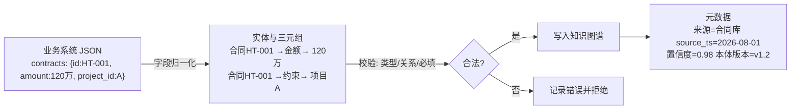
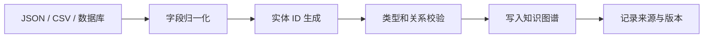
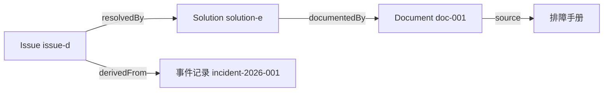
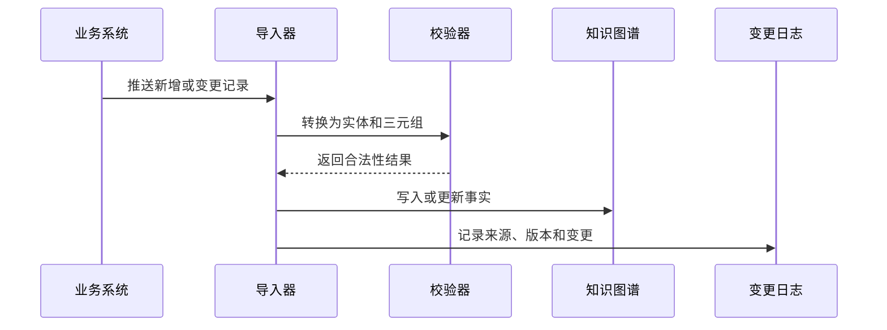

# 08. 创建实例数据和知识图谱

## 一分钟看懂本章

> **一句话**：知识图谱就是"往本体这张表结构里灌数据"——把合同系统的 JSON/数据库记录变成一条条带来源、带时间戳的三元组，以后 Agent 回答"HT-001 约束哪个项目"时，能给出事实还能指出出处。



**读图要点**：左边是原始记录，中间是把字段翻译成"主语─谓语─宾语"的三元组，右边是写入前的校验和写入后必须挂上的元数据——没有来源和时间的"事实"在生产环境等于没有依据。

## 真实例子：一份合同记录如何入库

「项目合同系统」里有一条合同记录，JSON 如下（对照原练习的 `issue-d` 结构）：

```json
{
  "id": "HT-001",
  "title": "网关升级合同",
  "amount": 120,
  "project_id": "PRJ-A",
  "source": "contract-db",
  "observed_at": "2026-08-01T10:00:00Z"
}
```

转换成三元组（写入知识图谱）：

```text
HT-001 rdf:type 合同
HT-001 金额 "120"          # 数据属性
HT-001 约束 PRJ-A          # 对象关系
HT-001 来源 "contract-db"  # 出处
HT-001 观察时间 "2026-08-01T10:00:00Z"
```

**要点**：`rdf:type` 决定它挂到本体的哪个类（合同），后续校验器就能用 `金额必填`、`约束 只能连项目` 这些本体约束来检查它；而 `来源/观察时间` 不属于业务本体，属于"审计元数据"，两者分开存。

## 本章目标

- 把本体类和关系填充为具体实例。
- 记录实体来源、时间和置信度。
- 理解结构化事实与文档证据的关联。

## 从业务记录生成实例

输入数据：

```json
{
  "id": "issue-d",
  "title": "登录失败",
  "severity": "high",
  "product_id": "product-a",
  "solution_id": "solution-e",
  "source": "incident-2026-001"
}
```

输出事实：

```text
issue-d rdf:type Issue
issue-d title "登录失败"
issue-d severity "high"
issue-d affectsProduct product-a
issue-d resolvedBy solution-e
issue-d derivedFrom incident-2026-001
```



**读图要点**：从输入到入库共五步，前两步是"翻译"（字段→实体 ID），第三步是"把关"（用本体约束校验，如 `金额` 必须是数字、`约束` 必须连到项目类），最后两步是"留痕"（记录来源与版本），任何一步失败都不应静默写入。

## 实体 ID 和来源

同一个业务对象可能来自多个系统，因此实体数据至少要考虑：

```text
entity_id
entity_type
source_system
source_record_id
observed_at
confidence
ontology_version
```

以合同系统为例，元数据补全后长这样：

```json
{
  "entity_id": "HT-001",
  "entity_type": "合同",
  "source_system": "contract-db",
  "source_record_id": "row-2026-00042",
  "observed_at": "2026-08-01T10:00:00Z",
  "confidence": 0.98,
  "ontology_version": "v1.2"
}
```

**为什么需要置信度**：`amount=120` 来自数据库，置信度可给 0.98；如果是 LLM 从合同 docx 里抽取的 `验收条款`，置信度可能只有 0.7——Agent 回答时会把低置信度的事实标注为"待核实"，而不是当成定论。

## 事实和证据



**读图要点**：这张图把"结论事实"（问题→方案）和"支撑证据"（方案→文档、问题→事件记录）分开画：`resolvedBy` 是业务结论，`documentedBy`、`derivedFrom` 是证据链。合同系统的等价结构是 `合同HT-001 → 依据 → 变更单.doc`、`合同HT-001 → 来源 → contract-db 第42行`——Agent 回答时结论和证据一起给，才可追溯。

Agent 回答时，既可以返回图上的关系，也可以返回支撑关系的文档和事件来源。

## 增量更新



**读图要点**：增量更新的关键在"可重放"——每次推送都必须先校验（避免脏数据写入）、后写图、最后写日志；如果合同金额从 120 万改成 150 万，变更日志里应能查到"谁、何时、从什么值改到什么值"。没有日志的增量更新，出错时只能全量重导。

## 练习

为产品 A、模块 B、问题 D 和方案 E 写出至少 10 条三元组，并为每条事实补充来源字段。

## 本章小结

- 实例数据是本体类的具体填充。
- 事实必须可追溯到来源。
- 增量更新需要校验、版本和变更日志。

