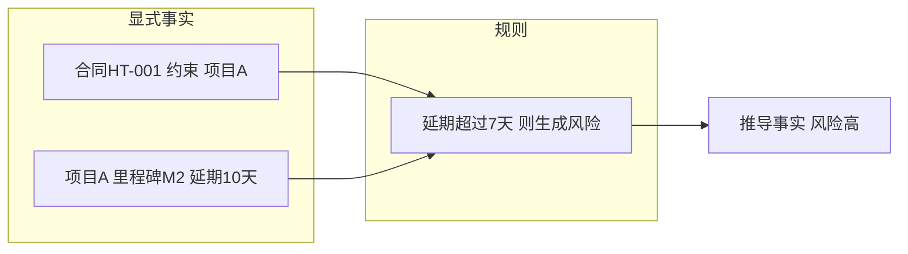
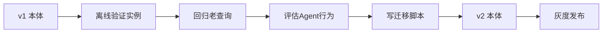

# 06. 怎么查、怎么推

## 先看一个扎心的问题

> 地图画好了（本体），数据也灌进去了（图谱）。
> 老板问：**"HT-001 约束了哪个项目？这项目现在有哪些风险？"** 查项目你行；可"风险"这种结论，要人一条条核对延期天数、自己脑补？那系统跟 Excel 有什么区别？

## 一句话说清

**查，是用"模板"在图里捞数据（SPARQL）；推，是让系统按规则自己算出新事实（自动推导）；改，是动本体结构时得带着数据和 Agent 一起验收（版本演进）。**

打个比方：**查询** = 查地图上的路，路画好了照着走；**自动推导** = 系统自己算出来的答案，没人手填；**校验** = 地图上的"禁止通行"标记，违规事实进不来。

## 怎么查：SPARQL 就是填空题模板

SPARQL 不难，核心一句话：**给图谱出一道"填空题"**。写死的是条件，`?变量` 是留的空，图上哪条边对得上，答案就填谁。

先看图里已有的数据：

```text
合同HT-001 →约束→ 项目A
项目A →包含→ 功能C
问题(验收延期) →影响→ 功能C
问题(验收延期) →解决→ 方案(顺延里程碑)
```

问"HT-001 约束了哪个项目"——最简单的**单跳查询**，一行模板：

```sparql
PREFIX ex: <http://example.com/enterprise#>

SELECT ?项目
WHERE {
  ex:合同-HT-001 ex:约束 ?项目 .
}
```

再问"HT-001 约束的项目有哪些风险、怎么解决"，就是**多跳查询**——模板一行接一行，像接力跑，上一个模板的宾语变成下一个模板的主语：

```sparql
PREFIX ex: <http://example.com/enterprise#>

SELECT ?问题 ?方案
WHERE {
  ex:合同-HT-001 ex:约束 ?项目 .
  ?项目 ex:包含 ?功能 .
  ?问题 ex:影响 ?功能 .
  ?问题 ex:解决 ?方案 .
}
```

结果一条：`验收延期 → 顺延里程碑`。**模板行数 = 查询跳数**，跳数越多，问得越深。

## 聚合查询：不光能查，还能数数

多跳查"有哪些"，聚合查"有多少"。老板问"每个项目底下挂了多少风险"，用 `COUNT` 数：

```sparql
PREFIX ex: <http://example.com/enterprise#>

SELECT ?项目 (COUNT(?风险) AS ?风险数)
WHERE {
  ?合同 ex:约束 ?项目 .
  ?项目 ex:风险 ?风险 .
}
GROUP BY ?项目
```

## 查询失败和空结果：空结果不等于"没有"

一张空表别急着下结论——**空结果不等于没有**，先分清两种情况：

| 情况 | 什么意思 | 怎么处理 |
|---|---|---|
| **歧义** | 用户说的"合同"可能指好几份，模板没对准 | 反问澄清："你指的是 HT-001 还是 HT-002？" |
| **真空** | 确实没查到，比如 ID 写错、真没风险 | 返回"未找到"，退到文档检索兜底 |

"查 HT-001 的风险"没结果，可能是 ID 写错（歧义），也可能是真没风险（真空），两条路处理完全不同。**生产环境还要叠加权限过滤**：用户查不了的数据，图里有也不给。

## 怎么推：显式事实 + 规则 = 推导事实

图谱里存的是**显式事实**（业务系统直接推来的），但很多答案是**算出来的**——这叫推理。

| | 显式事实 | 推导事实 |
|---|---|---|
| 哪来的 | 业务系统直接写入 | 规则算出来的 |
| 例子 | 合同HT-001 约束 项目A | 合同HT-001 关联 风险:里程碑M2延期 |
| 标注 | 来源 = 合同库 | 来源 = 规则推导 |

规则推理分三类：

1. **类型推理**：`Product` 是 `BusinessObject` 的子类，`product_a` 自动被推出"也是业务对象"。顺着类层级自己推。
2. **关系传递**：`产品A属于模块B` + `模块B包含功能C` → 推出 `产品A有可用功能C`。两段拼一段。
3. **规则推导**：最常用，写一条"如果…就…"规则，让系统自己干活。

合同系统的规则推导长这样（可读的 DSL 形式，SPARQL 和 OWL-RL 能表达等价逻辑）：

```text
IF 合同 ?c 约束 ?p
   AND ?p 里程碑 ?m
   AND ?m 延期天数 ?d
   AND ?d > 7
THEN 生成 风险(类型=里程碑延期, 等级=高, 来源合同=?c)
```

库里有两条显式事实，一匹配就自动算出新事实：

```text
风险#R-88 类型 "里程碑M2延期"
风险#R-88 等级 "高"
风险#R-88 来源合同 "合同HT-001"
```



**读图要点**：左边"事实库"，中间"规则库"，右边"算出来的新事实"。三者分开维护，规则一改，推导结果自动更新，比在代码里写死 `if amount>100: print("风险")` 可维护、可审计。

## 校验：把坏数据挡在门外

| 能力 | 关注点 | 例子 |
|---|---|---|
| **推理** | 根据已有事实推出**新**事实 | 合同延期10天 → 推出风险高 |
| **校验** | 判断数据**是否违反约束** | 金额 = -5 写入 → 拦截 |
| **权限** | 当前主体能否执行动作 | 审批人王工能否触发验收 |
| **规划** | 决定下一步做什么 | 先查风险，再决定是否建议顺延 |

校验是"三道闸门"，任何一道没过就拒绝写入并留错，绝不静默丢弃：

1. **类型校验**：金额必须是数字，"abc" 直接毙。
2. **关系和基数校验**：`约束` 只能连项目类；合同必须至少约束一个项目。
3. **来源和版本校验**：数据从哪来、按哪个本体版本解释，说不清的不收。

生产里的坏数据就这四种长相：

| 坏情况 | 例子 | 怎么处理 |
|---|---|---|
| **冲突** | 金额一会儿 120 一会儿 150 | 保留来源可信度高的，报警 |
| **缺失** | 合同没有约束对象 | 校验拦截，拒绝入库 |
| **循环** | A 约束 B、B 又约束 A | 检测并提示，看是否合法 |
| **非法关系** | `约束` 连到了供应商 | 类型校验直接拒绝 |

## 改：本体版本演进，不能直接动手改

本体不是定死的，业务变了就得改。但**别直接改线上语义再观察结果**——那等于换地图时把上路的人都扔在半路。建议走一套"发布流水线"：



**读图要点**：每次改本体，依次过"验证实例 → 回归老查询 → 评估 Agent 行为 → 写迁移脚本 → 灰度发布"。合同系统把 `约束` 改成 `管辖` 时，必须同步迁移旧数据、改查询模板、更新 Agent 提示词，缺一不可。

检查清单（以"约束"改名"管辖"为例）：

```text
把关系 约束 改名为 管辖：
  [ ] 迁移旧数据：HT-001 约束 项目A  →  HT-001 管辖 项目A
  [ ] 更新查询模板：ex:约束 → ex:管辖
  [ ] 回归查询："查 HT-001 的约束对象" 必须仍返回 项目A
  [ ] Agent 提示词里把"约束"替换为"管辖"
  [ ] 评估集：加入"新关系是否答得对"的用例
```

要盯的变化点就五样：类/关系是否改名、查询模板是否还有效、工具参数类型是否变化、旧事实要不要迁移、Agent 提示词和评估集要不要更新。

## 真实例子：从查到推走一遍

老板问"HT-001 约束的项目，有没有风险？"——系统三步走：

1. **查**：模板捞出 `合同HT-001 →约束→ 项目A`（单跳）。
2. **推**：规则匹配到"项目A 里程碑M2 延期10天，延期 > 7 天"，自动算出风险高。
3. **答**：Agent 合成回答——"HT-001 约束项目A，高风险：里程碑M2延期，建议顺延里程碑"，附上证据来源。

## 动手试试

1. 用单跳模板查"HT-001 约束了哪个项目"，再用多跳模板查风险怎么解决，对比模板行数。
2. 给合同系统设计一条规则：合同金额超 500 万 → 自动生成"大额合同"标记。

## 一句话总结

**查是填空题模板，推是"显式事实 + 规则 = 新事实"，校验是把坏数据挡在门外，改本体结构时必须带上数据、查询、Agent 一起验收。** 到这一步，图谱不只是"能查"，还会"自己长出新知识"。
