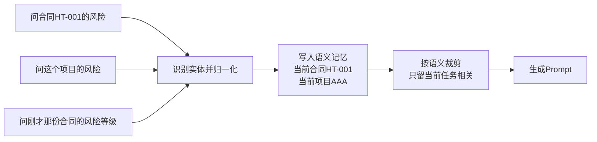
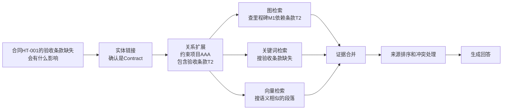

# 07. 让 AI 记住、搜得准

## 先看一个扎心的问题

> 为什么 AI 聊着聊着就忘了前面说啥？

你试过就知道。上一轮你问："合同 HT-001 有哪些风险？"它答得头头是道。下一轮你问："这个项目还有别的风险吗？"它立刻懵了："哪个项目？"再问一句："刚才那份合同的风险等级能改吗？"它可能直接说："您指的是哪份合同呢？"

气不气人。但真不怪它——**大模型天生没记性**。它跟金鱼差不多：你每次提问，对它来说都像第一次见面。它能把你前后两句话串起来，靠的完全是你自己把背景在每句话里写全。

## 一句话说清

**AI 的记性靠本体来补：把聊过的业务对象沉淀成结构化记忆（"这个项目"→项目AAA、"刚才那份合同"→HT-001），把事实关系存进知识图谱，再按语义裁剪后喂给模型——而不是把聊天记录全塞进 Prompt。** 记住的事不够时，本体还能帮它"搜得准"：先锁定实体、再沿关系扩路，把图谱事实和文档证据拼起来回答。

## 1. 大模型天生"没记性"，本体来当"外部大脑"

说白了，LLM 是**无状态**的——每次调用结束，它脑子里就清空了。它只是"会说话"，不是"记得事"。想让 AI 持续干活，就得把"记忆"放到模型外面。

拿生活里的东西打比方：

| 概念 | 白话 | 生活类比 |
|---|---|---|
| **本体** | 定义世界有哪些概念、概念怎么连 | 字典 + 地图 |
| **知识图谱** | 存"谁和谁有什么关系"的具体事实 | 档案柜 |
| **记忆** | 记住"刚才聊了什么" | 便签纸 |
| **RAG** | 去文档里翻原文 | 翻原文库 |

本体当"外部大脑"，意思是：实体、关系、规则、状态、权限都存在本体系里，Agent 每次要用了再去取。模型还是那个模型，但不再"裸奔"。

## 2. 记忆也分好几种，别混在一锅粥里

很多人把"记忆"当成一个桶，啥都往里扔。其实至少分四层：

| 数据 | 生命周期 | 典型内容 | 能不能直接塞进 Prompt |
|---|---|---|---|
| **短期上下文** | 当前这一两轮 | 用户刚问的"合同HT-001有哪些风险" | 裁剪后放入 |
| **任务状态** | 一个任务从头到尾 | 做到第3步了、风险R1还在等确认 | 放结构化摘要 |
| **长期记忆（语义记忆）** | 跨任务一直有效 | 当前项目=项目AAA、当前合同=HT-001 | 按需召回 |
| **知识图谱事实** | 领域长期知识 | 合同HT-001 约束 项目AAA | 按查询结果召回 |

关键区别一句话：**任务状态是"干到哪了"，知识图谱事实是"世界本来就这样"**。比如"风险R1已经确认了"是任务状态，"合同HT-001约束项目AAA"是长期事实——前者任务结束就翻篇，后者得一直留着。原始消息（完整聊天记录）呢？只在出问题时查审计用，平时别全塞给模型。

## 3. 真实例子：合同系统里的多轮对话，靠"归一化"撑住

还是开头那个场景，项目经理和助手连续聊：

```text
用户：合同 HT-001 有哪些风险？
助手：查到 3 条，其中 R1 是里程碑延期风险，需要项目经理确认。
用户：这个项目还有别的风险吗？      <- "这个项目"指哪个？
用户：刚才那份合同的风险等级能改吗？ <- "刚才那份合同"又是哪份？
```

没有本体时，模型只能靠猜。有本体后，Agent 每轮都把话里的实体**归一化**——把各种叫法归到同一个对象上："这个项目"→项目AAA，"刚才那份合同"→合同HT-001。归一化之后写进记忆，模型下一轮就"想起"了：

```python
def extract_and_link(message, memory):
    candidates = entity_linker.candidates(message)
    # 例：{"这个项目": 候选(项目), "HT-001": 候选(合同)}
    confirmed = ontology.validate(candidates)
    # 只有通过本体类型校验的，才允许升级为记忆
    memory.upsert(confirmed)
    # current_project=项目AAA, current_contract=HT-001
    return memory.filter(scope="current_task")
    # 只取当前任务真正需要的记忆
```

这里有个硬规矩：**没通过本体校验的候选，只能放临时上下文，不许写进长期记忆**。模型认出的实体只是"候选"，要经过"候选→已确认→已拒绝"这一步，才配升级成事实。



**读图要点**：三句话都没把"合同/项目"写全，但本体把"刚才那份合同"归一化成 HT-001、"这个项目"归一化成项目AAA，写进记忆后，下一轮 AI 就接得上了。

## 4. 上下文要"按语义裁剪"，不是全塞进 Prompt

有人觉得：记忆有了，那把历史消息全塞给模型不就行了？不行，三个坑等着你：

1. **无关消息占地方**：聊了半小时费用咨询，现在要确认风险，前面的闲聊全塞进去纯属浪费窗口。
2. **同一个东西多个叫法**：一会儿"HT-001"一会儿"那份合同"，模型没法稳定判断是不是同一个。
3. **旧状态覆盖新状态**：早先"风险R1待确认"，后来已经确认了，旧的塞进去反而误导。

本体给的答案是**按语义裁剪**：先按当前任务目标过滤（闲聊直接丢掉），再按本体关系过滤（只留 Contract、Risk、Milestone 相关），最后检查新鲜度。10 轮对话压成一段摘要：

```text
当前任务：确认合同 HT-001 的风险
已确认实体：合同HT-001、项目AAA、里程碑M1
相关事实：合同HT-001 约束 项目AAA；项目AAA 包含 里程碑M1；风险R1 影响 里程碑M1
待确认：风险R1 是否标记为已确认
```

模型拿到的是这张"精炼便签"，而不是一本聊天流水账。

## 5. 光记住还不够，还得"搜得准"

记忆解决"前文说了啥"，但用户还会问新问题，比如："合同 HT-001 的验收条款缺失会有什么影响？"这种问题靠普通搜索（向量 RAG）容易翻车：

- 向量检索擅长找"表达相似"的文本，但不保证找到的是**同一个实体**（HT-001 和 HT-010 只差一位）。
- 它不认**业务关系**——"验收条款影响里程碑"这种多跳关系，可能被切碎散落在不同文档里。
- 它也不知道**用户有没有权限**看命中结果。

所以本体增强 RAG 的思路是：**不替换向量检索，而是先用本体定语义范围，再让几种检索互相补位。**

## 6. 真实例子：查"验收条款缺失的影响"，四步走

项目经理问："合同 HT-001 的验收条款缺失会有什么影响？"走四步：

```text
第1步 实体链接：把"合同HT-001"确认成 Contract 实例，而不是当普通文本去搜
第2步 关系扩展：合同HT-001 约束 项目AAA；合同HT-001 包含 验收条款T2，状态=缺失
第3步 多路召回：图谱事实（里程碑M1依赖条款T2）+ 文档（合同第3章原文）
第4步 证据合并："验收条款T2缺失，影响项目AAA的里程碑M1验收，见合同第3章"
```

对应到代码，核心函数长这样：

```python
def hybrid_retrieve(question, ontology):
    entities = entity_linker.link(question)
    # [("contract_ht001", "Contract", 0.97)]  <- 实体+类型+置信度
    scope = ontology.expand(entities, max_hops=2)
    # 沿白名单关系扩展：约束、包含、依赖，最多2跳
    graph_hits = sparql(scope.to_query())       # 图谱事实
    doc_hits = vector_search(question, filter=scope.types())  # 文档片段
    return merge_evidence(graph_hits, doc_hits) # 先过滤权限，再合并
```

注意两个原则：**扩展要有边界**（最多 2-3 跳，只走本体里声明可检索的关系）；**实体不确定就先澄清**（是 HT-001 还是 HT-010？别为了"命中图谱"瞎猜）。



**读图要点**：先锁定实体、再沿关系扩展出检索范围，然后三路并行（图/关键词/向量），最后合并、排序、处理冲突。本体只负责前半段"定范围"，不负责生成最终答案。

## 7. 三路检索，各有分工

| 检索分支 | 擅长 | 短板 | 本体帮什么 |
|---|---|---|---|
| **图检索** | 类型、关系、多跳事实（HT-001 约束 项目AAA） | 文本细节覆盖少 | 限定路径和结果类型 |
| **关键词检索** | 精确名称、条款编号（"条款T2"） | 同义表达抓不到 | 提供别名、术语、字段 |
| **向量检索** | 语义相似的段落（"验收没写清"） | 关系和权限不稳定 | 生成实体范围和过滤条件 |

一句话：**图谱给关系，文档给细节，向量给表达覆盖**。三路结果合到一起，谁也别想一家独大。

## 8. 证据合并：来源要分清，冲突不许悄悄改

合并不是简单拼一起，两个规矩：

1. **来源类型要保留**——图谱事实和模型猜测不能混成一种证据。每条证据记录自己的类型、来源和置信度：

```json
[
  {
    "kind": "graph_fact",
    "content": "合同HT-001 约束 项目AAA；里程碑M1 依赖 验收条款T2",
    "source_id": "kg:fact-001",
    "confidence": 1.0
  },
  {
    "kind": "document_chunk",
    "content": "本合同验收以第三章节约定为准，未满足则延期。",
    "source_id": "doc:contract-ht001#chunk-3",
    "confidence": 0.87
  }
]
```

2. **先过滤权限，再排序合并**——向量索引命中"项目BBB的合同"，不代表项目经理有权看。排序时图谱事实优先于模型猜测；如果图谱说"里程碑M1依赖T2"而文档说"不依赖"，就**保留冲突标记**，让模型明说，而不是悄悄挑一个。

## 动手试试

拿你的合同系统自己走一遍：

1. 把一段 10 轮对话拆成短期上下文、任务状态、长期记忆、图谱事实四类，哪些该进 Prompt、哪些只该按需召回？
2. "这个模块能执行发布吗？"——这句话里的"这个模块"怎么归一化？识别出多个候选时，你选择猜还是澄清？
3. 设计一次检索："合同A的验收条款缺失会影响哪个项目的哪个里程碑？"——按四步走，每一步用到哪个检索分支？

## 一句话总结

**LLM 负责说话，本体负责让 AI 记得住（结构化记忆 + 语义裁剪）也搜得准（实体链接 + 关系扩展 + 多路证据合并）。** 记住：不是把历史全塞给模型，而是把业务对象沉淀成记忆、把检索范围用本体圈出来——这才是有记性、有方向的 AI。
