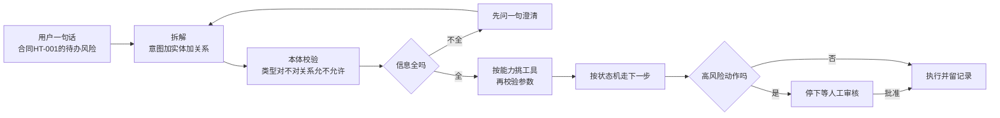

# 08. 让 AI 会规划、挑工具、走流程

## 先看一个扎心的问题

> 你让新来的 AI 员工去办事，它知道怎么办吗？
>
> "帮我查一下合同 HT-001 的待办风险"——它该调哪个工具？查完风险，下一步是直接确认，还是先停下来等人批？要是它全靠猜，那你永远不敢把真活交给它。
>
> 这一章就解决三件事：**听懂话、挑对工具、走对流程**。

## 一句话说清

**AI 干活之前，先把"你的一句话"拆成"意图＋实体＋关系"的可校验计划；再按工具的能力描述挑工具、查参数；最后按状态机决定下一步走哪。** 说白了就是三个字：**拆、选、走**。

打个比方：AI 是个会办事的新员工，本体就是**岗位说明书＋流程图**。新员工不知道"待办风险"啥意思，查说明书；不知道查完下一步干嘛，看流程图。本体就是那张"说明书＋流程图"。



**读图要点**：整条线是"拆→校验→挑工具→走流程"。两个关键分岔口：信息不全先澄清而不是硬跑；碰到高风险动作必须停下等人批，批了才执行。

## 第 1 步：拆——把一句话变成执行计划

### 意图、实体、关系，一个都不能少

用户说："合同 HT-001 目前有哪些待办风险？"新员工不能把这句话直接甩给数据库。得先拆成几样东西：

| 拆出的东西 | 白话 | 例子 |
|---|---|---|
| 意图 | 用户想干啥 | 查风险列表，也就是 list_risks |
| 实体 | 说的是哪几个具体东西 | 合同 HT-001，是个 Contract |
| 关系 | 东西之间怎么连 | 合同→有风险→风险 |
| 约束 | 附加的过滤条件 | 只要"待办"状态的风险 |

拆完得到一张"语义请求单"：

```json
{
  "intent": "list_risks",
  "subject": {"id": "contract_ht001", "type": "Contract"},
  "constraints": {"status": "待办"}
}
```

### 计划不是提示词，是一串有类型的步骤

查询计划应该是**结构化的步骤表**，每一步都写清楚"输入什么类型、输出什么类型、失败了怎么办"，而不是一段让模型自由发挥的话：

| 步骤 | 输入 | 输出 | 走的关系 | 查不到怎么办 |
|---|---|---|---|---|
| 1 确认合同 | 合同HT-001 | Contract | 按编号查 | 问用户：是 HT-001 还是 HT-010 |
| 2 查风险 | Contract | Risk | hasRisk | 去文档里搜 |

有了这张步骤表，AI 每一步都能被检查、被记录、被重试。

### 执行前先过一遍"体检"

计划生成后不能直接跑，要过一遍校验清单：

| 校验项 | 白话 | 例子 |
|---|---|---|
| 实体类型 | 这个输入真的是那个类型吗 | HT-001 真的是 Contract 吗 |
| 关系方向 | 关系走对了吗 | 合同→hasRisk→风险 |
| 关系白名单 | 这个关系允许 AI 用吗 | 不能随便用任意关系乱查 |
| 权限范围 | 结果在用户能看的范围内吗 | 跨租户的合同不能查 |
| 成本限制 | 会不会查爆了 | 最多跳 3 跳、100 条结果 |

**信息不全就先问，别硬跑。** 比如"合同有 HT-001 和 HT-010 两个候选"，这时候的正确动作是问一句"你说的是哪个？"，而不是赌一个乱查。说白了：**澄清不是故障，是正常流程**。

## 第 2 步：选——挑工具不是看名字猜

### 工具也有一份"说明书"

AI 挑工具不能靠"名字像不像"。每个工具都该有一份机器能读的能力说明：

```json
{
  "tool_id": "generate_contract",
  "capability": "生成合同补充协议",
  "input": {
    "contract_id": {"type": "Contract", "required": true},
    "amount": {"type": "Number", "required": true},
    "note": {"type": "String", "required": false}
  },
  "output": {"type": "ContractDocument"},
  "preconditions": ["合同 HT-001 已经在系统里解析过"],
  "required_roles": ["合同专员"],
  "risk_level": "medium",
  "idempotent": true
}
```

这份说明里有几样关键东西：

- **能力**：这工具是干嘛的——"生成补充协议"
- **输入类型和必填**：contract_id 必须是 Contract 且必填，amount 必须是数字且必填，note 可选
- **前置条件**：执行前必须先满足什么——合同得先解析过
- **所需角色**：谁有资格调——合同专员
- **风险等级**：这活儿多危险——medium
- **幂等性**：重复调用会不会出事——true 表示重复调用也没事

### 按实体类型和关系匹配工具

匹配逻辑是"**你的实体是什么类型，就找能处理这个类型的工具**"。用户说"根据合同 HT-001 生成一份补充协议"：

1. 先识别实体：合同 HT-001，类型是 Contract
2. 再找工具：能力是生成补充协议，且输入要求 Contract → 锁定 generate_contract
3. 校验参数：HT-001 在库里吗？amount 填了吗？是数字吗？
4. 判断风险：medium 直接执行；如果要求"直接生效"，升级成 high → 必须项目经理审核

### 参数校验是多层漏斗

| 校验层 | 白话 | 例子 |
|---|---|---|
| 字段类型 | 填对类型了吗 | amount 是数字，不能填"随便写" |
| 必填项 | 该填的填了吗 | 缺 amount 就返回"缺少金额字段" |
| 实体存在 | 这个东西真的存在吗 | HT-001 是库里的合同，不是乱编的 |
| 本体前置条件 | 前提满足了吗 | 合同必须先解析过 |
| 角色与风险 | 你有资格吗、够不够危险 | 普通用户不能确认风险 |

注意：**审核通过只代表当前这一下被批准**，不代表后面所有动作都自动授权。AI 不能因为"刚批过一次"就一路绿灯。

### 工具结果不能乱写进知识库

工具跑完了，结果往哪放也有讲究：

| 工具结果 | 默认处理 | 原因 |
|---|---|---|
| 查询结果 | 写进执行记录和证据 | 结果可能随时间变化 |
| 协议草稿 | 写进当前任务记忆 | 属于这个任务的产物 |
| 用户确认的事实 | 进候选事实队列 | 还要查来源、查冲突 |
| 配置变更结果 | 写审计和业务系统 | 不能只写知识图谱 |
| 模型总结的话 | 不直接写为事实 | 可能有幻觉 |

## 第 3 步：走——按流程走，不自由乱跑

### 任务、角色、状态，本体里都定义好

"确认合同 HT-001 的风险 R1"不是 AI 想怎么走就怎么走，得按本体定义的状态机走：

| 状态 | 白话 | 谁能到下一个 |
|---|---|---|
| created | 任务刚创建 | — |
| planned | 计划通过校验 | — |
| running | 正在执行 | — |
| waiting_for_approval | 挂起等项目经理审核 | 只能被批准或驳回 |
| completed | 完成 | — |
| rejected | 驳回 | — |

每个状态都有**允许的下一步**。比如"等待审核"只能被项目经理"批准"或"驳回"，AI 自己不能把审核状态改成"通过"——**不能自己批准自己的动作**。

### 前置条件和后置条件

"自动修复登录失败"这类任务，执行前必须满足前置条件，执行后要检查后置条件：

| 条件 | 白话 |
|---|---|
| 前置条件 | 实体已确认、诊断有结果、当前人有权限、高风险已批准 |
| 执行动作 | 调用配置变更工具，先用 dry_run 演练一遍 |
| 后置条件 | 业务系统返回结果、任务记录留了输入输出、知识图谱只写验证过的 |

### 下一步走哪，Agent 说了不算

Agent 不是自由发挥，而是**从本体允许的下一步里挑**。先查本体的允许迁移：这个任务类型能到哪几个状态？前置条件满足了几个？高风险动作强制先走审核。说白了：**模型只负责提候选，本体的规则负责圈定选择范围**。

### 出错了也能接着走

干活中途崩了怎么办？靠"存档点"恢复：

- 每个节点跑完就把状态存下来：已确认的实体、已完成步骤、重试次数、待审核的动作
- 恢复时**从存档接着走**，不是从头重新生成一遍计划
- 有副作用的步骤必须带幂等键、记完成记录，防止恢复时重复执行

这样就算工具超时三次、或者等了一晚上审核，恢复回来也不会把同一个风险确认两遍。

### 边界：哪些能自主，哪些不能

**适合 Agent 自己决定的**：在允许的步骤里选顺序（先查风险列表，再决定要不要确认）、选低风险工具、发现歧义时先问一句。

**不能交给 Agent 的**：授予权限或绕过权限、高风险配置变更（比如让合同"直接生效"）、修改审核状态、不可逆的数据删除。这些必须走固定工作流、策略引擎或人工审核。

## 一个完整例子：从一句话到干完活

用户说："查一下合同 HT-001 的待办风险，能确认的确认掉。"

1. **拆**：意图有两个——list_risks（查风险）和 confirm_risk（确认风险）
2. **选**：按 Contract 类型匹配到查风险工具，校验参数通过
3. **走**：查完风险 → 想确认风险 R1 → 发现确认风险是高风险动作、需要项目经理角色
4. **停**：挂起，等项目经理审核；批了才执行，没批就结束
5. **记**：每一步都有记录，中途崩了也能从存档恢复，不会把风险确认两遍

注意：**第一个查询成功，不代表第二个动作可以自动执行**。两个意图是两回事，要分开校验。

## 动手试试

1. 把"模块 B 的登录问题有哪些高风险解决方案"拆成意图＋实体＋关系，写成一份 JSON 语义请求单。
2. 给"发布解决方案文档"这个工具写一份能力说明：输入、输出、前置条件、所需角色、风险等级。
3. 设计一个任务的状态机：从"已创建"到"已完成"，中间至少包含一个"等待审核"状态，标出每个状态的允许下一步。

## 一句话总结

**AI 干活 = 拆（听懂）→ 选（挑工具）→ 走（走流程），每一步都靠本体这张"说明书和流程图"，宁可多问一句，也不能乱跑。**
