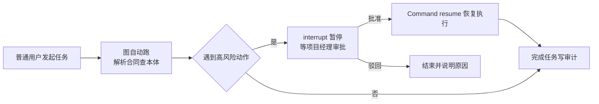

# 09. 管住 AI：权限、安全、人工审核

## 先看一个扎心的问题

> 你的 AI 员工如果突然"自作主张"，把合同风险直接确认了、把线上配置改了，你怕不怕？
>
> 更麻烦的是：它出了错，你能分清是"参数给错了"、"没权限"还是"工具崩了"吗？用户在多轮对话里说"那个风险"，它知道指哪个吗？它赖账的时候，你找谁对质？
>
> 这一章就讲怎么**管住 AI**：谁能干什么、高风险动作谁签字、出错怎么办、多轮对话怎么不串线。

## 一句话说清

**权限就是门禁卡，高风险动作必须领导签字，出错按类型处理，全程留审计。** 说白了：AI 可以勤快，但不能越权、不能闯祸、不能赖账。

打个比方：权限就像公司的**门禁卡**——谁有卡、能进哪个门、什么时候进，都由系统说了算，AI 不能自己配卡；**HITL**（人在环里，也就是"人工审核"）就像**高风险操作必须领导签字**——AI 可以把事做到九十九步，最后一步得有人盖章，章不盖，活不停。

## 第 1 部分：权限就是门禁卡

### 四样东西凑齐才放行

一次动作的权限判断，要看四样：

| 要素 | 白话 | 例子 |
|---|---|---|
| 主体 | 谁要干 | 普通用户 / 项目经理 |
| 角色 | 这个人被任命成什么 | 普通员工 / 项目经理 project_manager |
| 资源 | 对哪个东西干 | 合同 HT-001 的风险 R1 |
| 动作 | 要干什么 | 查看风险 / 确认风险 |

"项目经理能确认风险"这种关系，就是本体里定义好的：**project_manager ─能确认→ 风险**。定义关系是本体的事，判断"这个人现在能不能干"是策略层的事，最后拦门是执行层的事——三层分开，谁也别混在一个 Prompt 里。

### 谁判断、谁拦门

| 角色 | 白话 | 例子 |
|---|---|---|
| PDP 策略决策点 | 做决定的人 | 根据角色、风险等级判断：放行 / 拒绝 / 要审核 |
| PEP 策略执行点 | 拦门的人 | 在工具入口强制拦截，模型说什么都不算数 |

普通用户说"帮我确认风险 R1"→ 判断：缺项目经理角色 → **拒绝**，原因写清楚"缺角色"。
项目经理说"我来确认风险 R1"→ 判断：角色够，但这是高风险动作 → **要审核**，等审核人批了才执行。

### 高风险动作要能认出来

| 判断层 | 白话 | 不过会怎样 |
|---|---|---|
| 主体和资源类型有效吗 | 真是个人、真是风险吗 | 拒绝：类型无效 |
| 有需要的角色吗 | 是项目经理吗 | 拒绝：缺角色 |
| 前置条件满足吗 | 风险解析过了吗 | 阻断：前置条件缺失 |
| 需要人工审核吗 | 风险等级是不是 high | 挂起等审核，或被驳回 |

拒绝原因不能全返回一句"无权限"，要**分类返回**：类型无效、缺角色、缺前置条件、人驳回。前端展示、Agent 澄清、审计分析各用各的。

## 第 2 部分：出错不可怕，分类处理

### 先分清是哪种错

| 异常类别 | 白话例子 | 默认处理 |
|---|---|---|
| 类型错误 | 输入的实体根本不是合同 | 不重试，让用户修正 |
| 事实冲突 | 两个来源说风险等级不一样 | 标记冲突，降低结论可信度 |
| 权限拒绝 | 普通用户想确认风险 | 拒绝并记审计 |
| 需要审核 | 高风险动作 | 建审核单，任务挂起 |
| 工具超时 | 合同 API 半天不回应 | 有限重试，超限就降级 |
| 工具失败 | 工具返回"合同已归档" | 看错误码决定重试还是人工接管 |
| 证据不足 | 材料不够确认风险 | 澄清、拒答、或说明不确定 |

### 怎么恢复，取决于错的类型

| 情况 | 处理 |
|---|---|
| 类型错、权限拒绝 | 直接拒绝，重试没用 |
| 工具超时 | 指数退避重试几次，超过上限降级为草稿或人工接管 |
| 需要审核 | 挂起，等人批准或驳回，批了从断点继续 |
| 证据不足 | 澄清或拒答，别用重试掩盖知识缺口 |

### 审计：让 AI 赖不了账

关键动作都要记一条流水：

```json
{
  "event_type": "tool_call_denied",
  "user_id": "user-001",
  "task_id": "task-001",
  "thread_id": "thread-001",
  "tool_id": "confirm_risk",
  "resource_id": "contract_ht001#risk_r1",
  "decision": "requires_approval",
  "reason_code": "high_risk_action",
  "created_at": "2026-08-23T10:05:00+08:00"
}
```

这条流水要能回答：**谁、在哪个任务里、对哪个资源、想干什么、基于什么规则、结果如何**。

### 几条安全底线

1. AI 不能自己提升角色或改权限（普通用户不能把自己"变成"项目经理）
2. 模型的输出不能绕过校验层
3. 审核人批的是"确认风险 R1"这一个具体动作，不是整个任务的无限授权
4. 高风险动作默认先 dry_run 演练，正式执行必须显式授权
5. 失败降级不能泄露原本无权看的证据（降级回答不能暴露别的项目的合同内容）

## 第 3 部分：多轮对话靠 ID 管起来

### "那个风险"指哪个？

用户第二轮说"把这个风险确认了吧"——"这个风险"指啥？靠第一轮拆出来的实体和关系：合同 HT-001、风险 R1，都存在同一个任务的状态里。**每轮新输入都复用同一份状态，不需要手工拼接上下文。**

### 四类 ID 各管一摊

| ID | 白话 | 生命周期 |
|---|---|---|
| user_id | 当前是谁 | 账号寿命 |
| task_id | 一个完整的业务目标 | 创建到完成 |
| thread_id | 一条状态链，图的记忆 | 通常跟着任务走 |
| turn_id / run_id | 某一次输入或恢复 | 单次执行 |

推荐关系：**一个 task_id 对应一个主 thread_id，下面挂多个 turn_id / run_id**。用户连发三条消息、审核人批一次，都是同一个 task_id、同一个 thread_id，只是每次新增一个 turn 或 run。别每轮都开新线程——那会切断状态恢复，审核恢复也彻底失效。

### 并发和幂等

- 同一个 thread_id 不能同时被多个请求写，后端要排队串行
- 审核人重复点提交？用幂等键去重，一次审批只生效一次
- 恢复执行必须用原任务的 thread_id
- 有副作用的工具要记执行记录，防止恢复时重复执行

## 第 4 部分：人工审核（HITL）怎么落地

### LangGraph 是个啥（大白话版）

LangGraph 就是一张**流程图**，帮你把"解析合同→查本体→检索→评估风险→人工审核→执行"编排起来：

| 词 | 白话 |
|---|---|
| State | 大家共用的便签板，谁都能读写（task_id、合同、风险、审批结果都记上面） |
| Node | 每个节点干一件事：读便签板、干活、写回便签板 |
| Edge | 节点之间怎么走，谁走完轮到谁 |
| Checkpointer | 便签板的存档点，按 thread_id 存，随时能恢复 |

### interrupt：干到一半，停下来等人签字

碰到高风险动作（比如"采纳风险"），节点用一个 `interrupt()` 把任务**暂停**，把审核材料递出来：

```python
from langgraph.types import interrupt

def human_review(state):
    # interrupt 之前的代码必须无副作用：恢复时这个节点会从头重跑
    feedback = interrupt({
        "task_id": state["task_id"],      # task-contract-ht001
        "action": "accept_risk",          # 采纳风险
        "question": "合同 HT-001 金额超预算，是否批准采纳这个 P0 风险？",
    })
    return {"approval": feedback}         # {"decision": "approved", ...}
```

### 领导批完，用 Command 恢复

审核人批了之后，后端把他的反馈包成恢复指令，**必须用同一个 thread_id**：

```python
from langgraph.types import Command

graph.invoke(
    Command(resume={"decision": "approved", "comment": "同意采纳"}),
    {"configurable": {"thread_id": "thread-contract-ht001"}},
)
```

恢复后，`interrupt()` 那句会直接返回审核人的反馈，图从断点继续往下跑，而不是从头再来一遍。

### 恢复的几条规矩

1. `interrupt()` 之前不要发邮件、扣费、写业务库——恢复时节点会重跑，重跑一次就发一次邮件？
2. 非要写，就带幂等键（比如 task_id 加 interrupt_id），保证只生效一次
3. `interrupt()` 不能被 try/except 吞掉
4. 审核通过后再真正执行高风险工具，并保存执行记录

### 异常路径也要画出来



**读图要点**：只有"人工审核"这个节点会暂停，其余节点自动跑完。批准了就从断点续跑，驳回了就结束并说明原因——两条路都是设计好的，不是撞出来的。

## 一个完整例子：合同风险审批

普通用户上传《供货合同 HT-001》→ 图自动解析，发现金额超预算 → 触发 P0 风险 → 走到人工审核节点，`interrupt()` 暂停，生成一张审核单：

- **普通用户**：只能发起任务、补充材料（比如"预算来源是项目 PX-2026"）——这只是新增一个 turn，task_id、thread_id 都不变
- **项目经理**：只看审核材料，批或驳回——批了就 `Command(resume=...)` 恢复，从断点继续执行"采纳风险"，写进知识图谱和审计
- **工具中途超时**：先重试，超上限就降级成草稿，绝不会偷偷把风险确认掉
- **全程一条状态链**：谁、在哪个任务、哪一轮、做了什么、结果如何，审计全有

## 动手试试

1. 为"发布解决方案文档"定义三类人的权限：普通用户、审核人、服务账号，各能干什么、不能干什么。
2. 说出多轮对话里哪几个 ID 保持不变、哪几个新增：用户连发三条消息，项目经理批一次。
3. 设计一个带 interrupt 的节点：把"采纳风险"工具调用放在 interrupt 之后，并说明为什么不能放前面。

## 一句话总结

**管住 AI 就四句话：门禁卡管权限、领导签字管高风险、分类处理管出错、审计留底管赖账；多轮对话靠 ID，人工审核靠 interrupt。**
