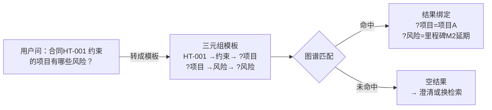
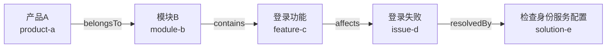
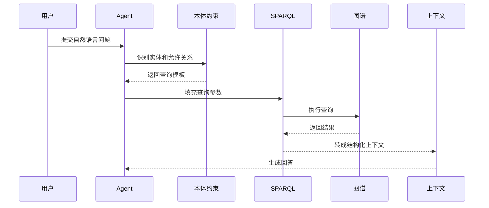
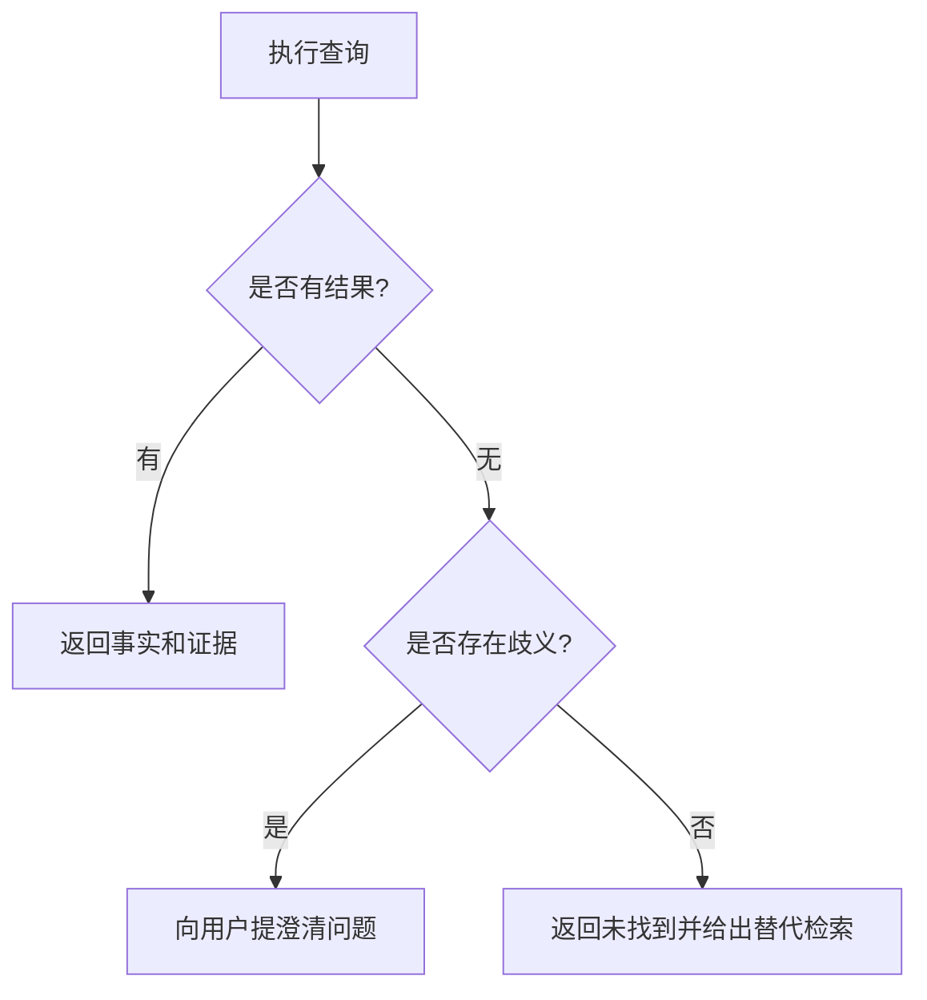

# 09. 使用 SPARQL 进行结构化查询

## 一分钟看懂本章

> **一句话**：SPARQL 就是"用三元组模板在图里捞数据"——把"合同HT-001 约束了哪个项目、有什么风险"翻译成带 `?变量` 的模板，图上哪条三元组对得上，答案就带上谁。



**读图要点**：查询就是"给图出一张填空题"——模板里写死的部分（HT-001、约束）是题目条件，`?变量` 是空要填；匹配到几条就返回几条，一条都没匹配上就进入空结果处理分支。

## 真实例子：查询合同系统的风险

数据已在图里（`code/02_sparql/query_graph.py` 可运行）：

```text
合同HT-001 →约束→ 项目A
项目A →包含→ 功能C
问题(验收延期) →影响→ 功能C
问题(验收延期) →解决→ 方案(顺延里程碑)
```

下面的查询问"项目A 的风险有哪些、怎么解决"，三步跳转正好对应多跳查询：

```sparql
PREFIX ex: <http://example.com/enterprise#>

SELECT ?问题 ?方案
WHERE {
  ex:合同-HT-001 ex:约束 ?项目 .
  ?项目 ex:包含 ?功能 .
  ?问题 ex:影响 ?功能 .
  ?问题 ex:解决 ?方案 .
}
```

预期结果：

```text
验收延期 -> 顺延里程碑
```

## 本章目标

- 编写单跳、多跳和过滤查询。
- 理解查询结果如何进入 Agent 上下文。
- 处理空结果、歧义和权限过滤。

## 单跳查询

查询所有产品属于哪个模块：

```sparql
PREFIX ex: <http://example.com/enterprise#>

SELECT ?product ?module
WHERE {
  ?product a ex:Product .
  ?product ex:belongsTo ?module .
}
```

**查询解读**：两行模板用同一个变量 `?product` 串起来——第一行限定"它必须是产品"，第二行限定"它必须属于某模块"。对应合同系统就是 `?合同 a ex:合同 . ?合同 ex:约束 ?项目 .`，模板行数 = 查询的跳数。

## 多跳查询

查询产品关联的问题和解决方案：

```sparql
PREFIX ex: <http://example.com/enterprise#>

SELECT ?product ?issue ?solution
WHERE {
  ?product ex:belongsTo ?module .
  ?module ex:contains ?feature .
  ?issue ex:affects ?feature .
  ?issue ex:resolvedBy ?solution .
}
```



**读图要点**：从产品到方案一共四跳，每一跳对应查询模板里的一行三元组；变量在跳与跳之间"接力"（上一个模板的宾语成为下一个模板的主语）。对照合同系统，就是 `合同 →约束→ 项目 →包含→ 功能 →影响→ 问题 →解决→ 方案` 的完整证据链。

## 过滤和权限

查询高风险问题：

```sparql
PREFIX ex: <http://example.com/enterprise#>

SELECT ?issue ?severity
WHERE {
  ?issue a ex:Issue .
  ?issue ex:severity ?severity .
  FILTER (?severity = "high")
}
```

合同系统的等价过滤："查金额大于 100 万的合同"：

```sparql
PREFIX ex: <http://example.com/enterprise#>

SELECT ?合同 ?金额
WHERE {
  ?合同 a ex:合同 .
  ?合同 ex:金额 ?金额 .
  FILTER (?金额 > 100)
}
```

**要点**：`FILTER` 是"行内裁剪"——先匹配模板再按条件筛掉不满足的行。生产查询不能只看知识关系，还要叠加当前用户的权限和数据范围。

## Agent 查询链路



**读图要点**：Agent 不直接写 SPARQL 乱查——中间隔着本体约束层（决定哪些实体和关系合法）和权限层（决定哪些数据可见）；合同系统里"查合同金额"合法、"查人事工资"这类请求在本体约束层就被挡掉了。

## 空结果和歧义



**读图要点**：空结果不等于"没有"，先判断是不是歧义（用户说的"合同"可能是多份）——歧义就反问澄清，不歧义才返回未找到并退到文档检索兜底。合同系统里"查 HT-001 风险"没结果时，可能是 ID 写错（歧义）也可能是确实没风险（空结果），两条路处理方式完全不同。

## 练习

1. 查询所有影响模块 B 的问题。
2. 查询严重程度为 high 且有文档证据的问题。
3. 为查询结果设计 Agent 上下文字段：实体、关系、来源和置信度。

## 本章小结

- SPARQL 适合精确表达结构化查询。
- 多跳查询可以回答“关系链”问题。
- Agent 生成查询时必须经过本体和权限约束。

