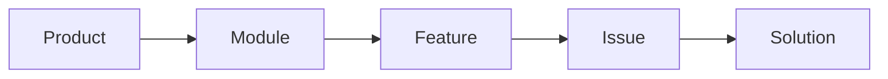
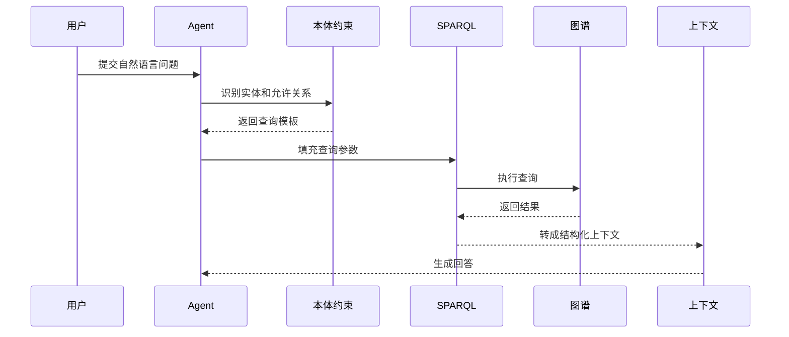
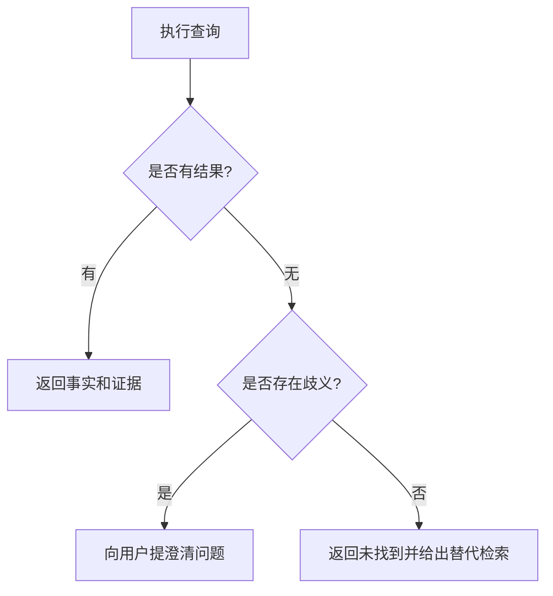

# 09. 使用 SPARQL 进行结构化查询

## 本章目标

- 编写单跳、多跳和过滤查询。
- 理解查询结果如何进入 Agent 上下文。
- 处理空结果、歧义和权限过滤。

## 单跳查询

查询所有产品属于哪个模块：

```sparql
PREFIX ex: <http://example.com/enterprise#>

SELECT ?product ?module
WHERE {
  ?product a ex:Product .
  ?product ex:belongsTo ?module .
}
```

## 多跳查询

查询产品关联的问题和解决方案：

```sparql
PREFIX ex: <http://example.com/enterprise#>

SELECT ?product ?issue ?solution
WHERE {
  ?product ex:belongsTo ?module .
  ?module ex:contains ?feature .
  ?issue ex:affects ?feature .
  ?issue ex:resolvedBy ?solution .
}
```



## 过滤和权限

查询高风险问题：

```sparql
PREFIX ex: <http://example.com/enterprise#>

SELECT ?issue ?severity
WHERE {
  ?issue a ex:Issue .
  ?issue ex:severity ?severity .
  FILTER (?severity = "high")
}
```

生产查询不能只看知识关系，还要叠加当前用户的权限和数据范围。

## Agent 查询链路



## 空结果和歧义



## 练习

1. 查询所有影响模块 B 的问题。
2. 查询严重程度为 high 且有文档证据的问题。
3. 为查询结果设计 Agent 上下文字段：实体、关系、来源和置信度。

## 本章小结

- SPARQL 适合精确表达结构化查询。
- 多跳查询可以回答“关系链”问题。
- Agent 生成查询时必须经过本体和权限约束。

