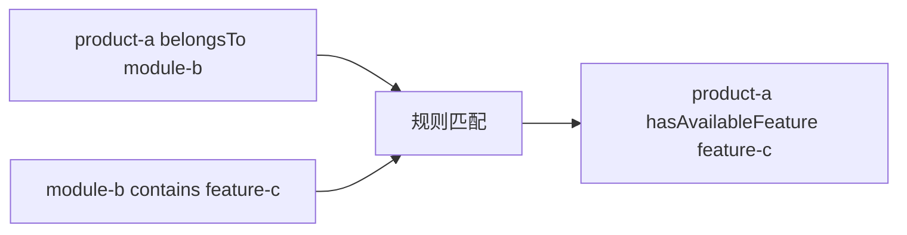
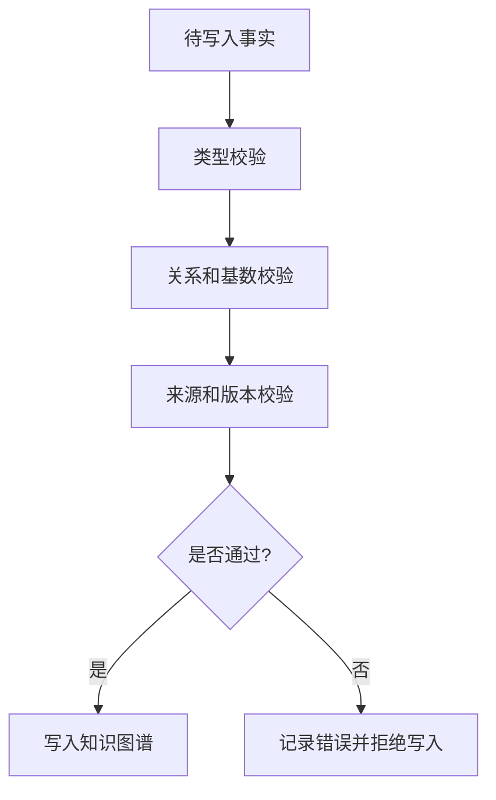

# 10. 规则推理、一致性校验和本体演进

## 本章目标

- 区分显式事实和推导事实。
- 理解规则推理与数据校验的区别。
- 设计本体版本演进和兼容策略。

## 显式事实和推导事实

显式事实：

```text
product-a belongsTo module-b
module-b contains feature-c
```

规则：

```text
如果 X belongsTo Y 且 Y contains Z，
那么 X hasAvailableFeature Z。
```

推导事实：

```text
product-a hasAvailableFeature feature-c
```



## 推理和校验不是一回事

| 能力 | 关注点 | 示例 |
|---|---|---|
| 推理 | 根据已有事实推出新事实 | 产品拥有模块中的功能 |
| 一致性校验 | 判断数据是否违反约束 | 产品缺少所属模块 |
| 权限判断 | 判断当前主体能否执行动作 | 审核人能否发布报告 |
| Agent 规划 | 决定下一步做什么 | 先查问题，再调用诊断工具 |

## 一致性校验流程



## 本体演进

不要直接修改线上语义后再观察结果。建议采用：


版本变化需要关注：

- 类和关系是否重命名。
- 查询模板是否仍然有效。
- 工具参数类型是否变化。
- 旧事实是否需要迁移。
- Agent 的提示词和评估集是否需要更新。

## 练习

设计两条规则：

1. 根据产品、模块和功能关系推导可用功能。
2. 根据动作风险和审核状态判断是否允许继续执行。

## 本章小结

- 推理产生新事实。
- 校验阻止非法事实进入系统。
- 本体演进必须同时验证数据、查询、Agent 和工具行为。

