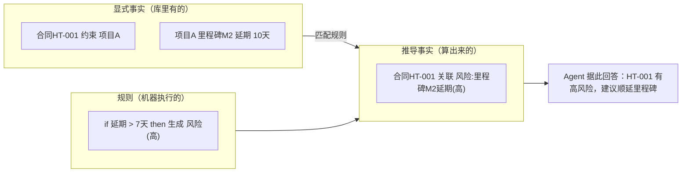
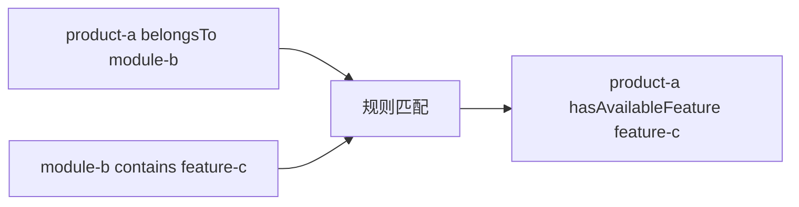
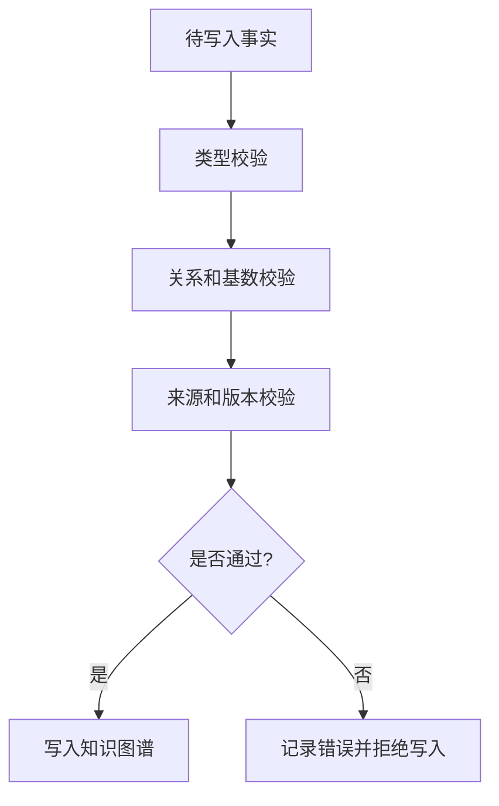
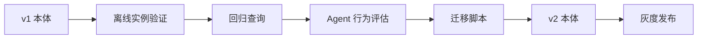

# 10. 规则推理、一致性校验和本体演进

## 一分钟看懂本章

> **一句话**：推理是"根据已有事实算出新事实"（合同延期>7天 → 自动标记风险），校验是"拦截非法事实入库"（金额负数直接拒绝），本体演进是"改结构也要带着数据和 Agent 一起验收"。



**读图要点**：左边是"事实库"，中间是"规则库"，右边是"算出来的新事实"——三者分开维护，规则一改，推导结果自动更新；这比在代码里写死 `if amount>100: print("风险")` 更可维护、可审计。

## 真实例子：合同延期推风险

以「项目合同系统」为例。库里有两条显式事实：

```text
合同HT-001 约束 项目A
项目A 里程碑M2 延期天数 10
```

写一条可执行规则（这里用可读的 DSL 形式，SPARQL/OWL-RL 能表达等价逻辑）：

```text
IF 合同 ?c 约束 ?p
   AND ?p 里程碑 ?m
   AND ?m 延期天数 ?d
   AND ?d > 7
THEN 生成 风险(类型=里程碑延期, 等级=高, 来源合同=?c)
```

推理后新增的推导事实：

```text
风险#R-88 类型 "里程碑M2延期"
风险#R-88 等级 "高"
风险#R-88 来源合同 "合同HT-001"
```

**对照代码**：`code/04_reasoning/reasoning_demo.py` 用 `owlrl` 演示 RDFS 推理——`Product` 是 `BusinessObject` 的子类，`product_a` 自动被推出"也是业务对象"。规则推理本质相同：显式事实 + 规则 = 新事实。

## 本章目标

- 区分显式事实和推导事实。
- 理解规则推理与数据校验的区别。
- 设计本体版本演进和兼容策略。

## 显式事实和推导事实

显式事实：

```text
product-a belongsTo module-b
module-b contains feature-c
```

规则：

```text
如果 X belongsTo Y 且 Y contains Z，
那么 X hasAvailableFeature Z。
```

推导事实：

```text
product-a hasAvailableFeature feature-c
```



**读图要点**：两条显式事实同时喂给规则匹配器，规则匹配成功就产出第三条推导事实——推导事实入库时会标注"由规则推导"而非"来自业务系统"，这样出问题能回查是哪条规则算错了。

## 推理和校验不是一回事

| 能力 | 关注点 | 示例 |
|---|---|---|
| 推理 | 根据已有事实推出新事实 | 产品拥有模块中的功能 |
| 一致性校验 | 判断数据是否违反约束 | 产品缺少所属模块 |
| 权限判断 | 判断当前主体能否执行动作 | 审核人能否发布报告 |
| Agent 规划 | 决定下一步做什么 | 先查问题，再调用诊断工具 |

合同系统的对照：

```text
推理：合同延期10天 → 推出 风险(高)
校验：金额=-5 写入 → 拦截（金额必须>0）
权限：审批人王工 → 能否 触发验收（角色校验）
规划：先查合同风险 → 再决定是否建议顺延里程碑
```

## 一致性校验流程



**读图要点**：校验是"三道闸门"——类型（金额必须是数字）、关系和基数（合同必须至少约束一个项目）、来源和版本（数据来自哪、按哪个本体版本解释）。任何一道没过都拒绝写入并留错，绝不静默丢弃。合同系统里"金额=-5"会在第一道闸门就被挡下。

## 本体演进

不要直接修改线上语义后再观察结果。建议采用：



**读图要点**：本体演进是一套"发布流水线"——离线验证实例 → 回归老查询 → 评估 Agent 行为 → 写迁移脚本 → 灰度发布。合同系统把 `约束` 改成 `管辖` 时，必须同步迁移旧数据、改查询模板、更新 Agent 提示词，缺一不可。

版本变化需要关注：

- 类和关系是否重命名。
- 查询模板是否仍然有效。
- 工具参数类型是否变化。
- 旧事实是否需要迁移。
- Agent 的提示词和评估集是否需要更新。

合同系统的检查清单示例：

```text
把关系 约束 改名为 管辖：
  [ ] 迁移旧数据：HT-001 约束 项目A  →  HT-001 管辖 项目A
  [ ] 更新查询模板：ex:约束 → ex:管辖
  [ ] 回归查询："查 HT-001 的约束对象" 必须仍返回 项目A
  [ ] Agent 提示词里把"约束"替换为"管辖"
  [ ] 评估集：加入"新关系是否答得对"的用例
```

## 练习

设计两条规则：

1. 根据产品、模块和功能关系推导可用功能。
2. 根据动作风险和审核状态判断是否允许继续执行。

## 本章小结

- 推理产生新事实。
- 校验阻止非法事实进入系统。
- 本体演进必须同时验证数据、查询、Agent 和工具行为。

