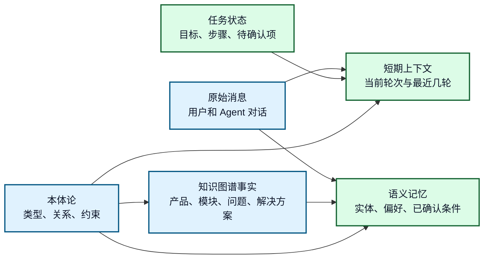
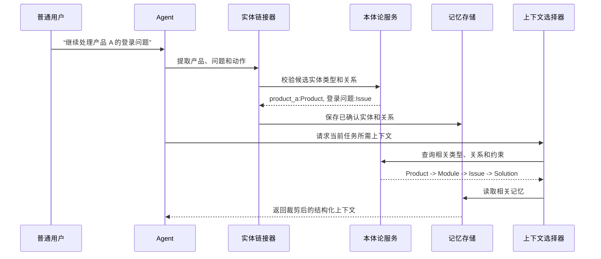
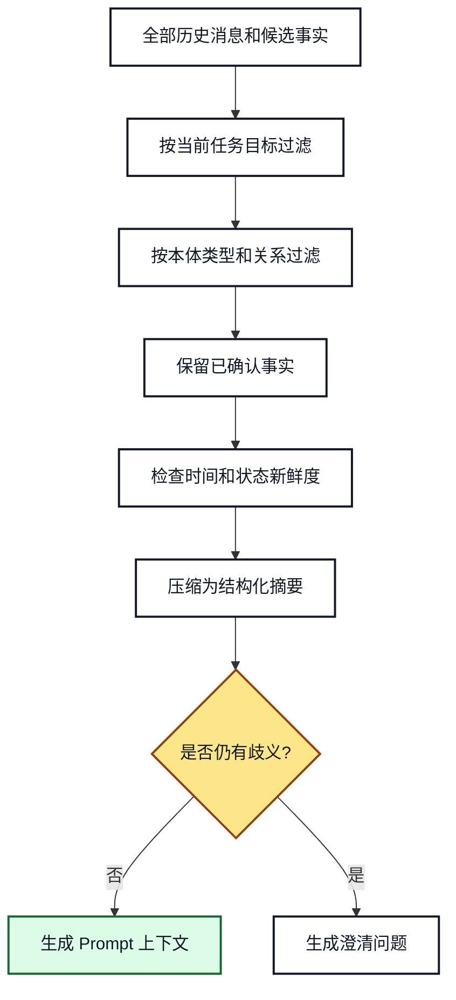

# 11. 本体论增强上下文管理和记忆

## 本章目标

- 区分对话上下文、任务状态、长期记忆和知识图谱事实。
- 使用本体类型、关系和约束筛选真正相关的上下文。
- 将用户消息中的实体和关系沉淀为可检索的记忆。
- 避免把全部历史消息直接拼接到 Prompt。

## 1. 为什么需要语义化上下文

上下文窗口不是记忆系统。把所有历史消息都放入 Prompt，会产生三个问题：

1. 无关消息占用上下文窗口。
2. 同一个对象出现多个名称，模型无法稳定判断是否为同一实体。
3. 历史中的旧状态可能覆盖当前状态。

本体论提供统一的概念和关系，使上下文可以按语义筛选，而不只是按时间截断。

## 2. 四种数据边界



**图 11-1：上下文、记忆、知识和本体论的边界**

阅读顺序是从原始消息和领域事实出发，经过本体论解释后，分别进入短期上下文和语义记忆。任务状态属于运行时状态，不应直接当作长期知识写入。

| 数据 | 生命周期 | 典型内容 | 是否直接放入 Prompt |
|---|---|---|---|
| 短期上下文 | 当前执行或最近几轮 | 最近问题、当前候选实体 | 经过裁剪后放入 |
| 任务状态 | 一个 `task_id` 生命周期 | 当前步骤、待审核动作、重试次数 | 放入结构化摘要 |
| 语义记忆 | 跨任务 | 用户偏好、已确认实体别名 | 按需召回 |
| 知识图谱事实 | 领域长期知识 | 产品属于模块、问题影响功能 | 按查询结果召回 |
| 原始消息 | 审计和回溯 | 完整对话文本 | 通常不全部放入 |

## 3. 从消息到语义记忆



**图 11-2：消息转化为语义记忆的时序**

实体链接和本体校验要先于记忆写入。未确认的候选实体可以放入临时上下文，但不能直接升级为长期事实。

推荐的记忆记录至少包含：

```json
{
  "subject": "product_a",
  "predicate": "ex:hasCurrentIssue",
  "object": "issue_login_failure",
  "subject_type": "Product",
  "object_type": "Issue",
  "status": "confirmed",
  "source": "conversation",
  "task_id": "task-001",
  "confidence": 0.96,
  "updated_at": "2026-08-23T10:00:00+08:00"
}
```

## 4. 语义化上下文裁剪



**图 11-3：上下文裁剪流程**

裁剪顺序先看任务目标，再看本体关系，最后看新鲜度和置信度。这样能保留“当前问题影响哪个功能”这类关键关系，同时丢弃不相关闲聊。

一个适合交给模型的上下文摘要可以是：

```text
当前任务：诊断产品 A 的登录失败
已确认实体：产品 A(Product)、模块 B(Module)、登录功能(Feature)
相关事实：产品 A 属于模块 B；模块 B 包含登录功能；登录失败影响登录功能
已知约束：诊断工具需要 product_id；高风险修复动作需要审核
待确认：是否允许执行配置变更
```

## 5. 企业知识助手中的记忆策略

| 记忆类型 | 示例 | 写入条件 | 失效方式 |
|---|---|---|---|
| 当前轮次 | 用户刚提到“这个问题” | 每轮产生 | 轮次结束或被覆盖 |
| 任务记忆 | 已选择产品 A、已完成实体确认 | 任务状态发生变化 | 任务完成或取消 |
| 用户偏好 | 用户偏好中文回答 | 用户明确表达或多次确认 | 用户修改 |
| 领域事实 | 产品 A 属于模块 B | 来源可信且通过校验 | 知识版本更新 |
| 审计记录 | 谁在何时批准了动作 | 每次关键事件 | 按合规策略归档 |

关键原则是：**事实写入知识层，任务状态写入任务存储，用户偏好写入用户记忆，原始消息写入审计层。**

## 6. 常见错误和排查

### 错误一：把本体论当作历史消息存储

本体论定义“什么概念和关系存在”，不负责保存每次对话。应将本体文件、实例事实和对话状态分开存储。

### 错误二：未经确认就写入长期记忆

模型的实体识别结果可能是候选结果。建议使用 `candidate -> confirmed -> rejected` 状态机。

### 错误三：只按最近消息裁剪

最近消息不一定最相关。当前任务需要的实体关系、权限状态和待审核动作，即使出现在较早消息中，也应该通过语义索引召回。

## 7. 练习和自查

1. 把一段 10 轮对话拆成短期上下文、任务状态、长期记忆和领域事实。
2. 为“这个模块可以执行发布吗？”设计实体链接和澄清策略。
3. 检查记忆记录是否包含类型、来源、置信度和更新时间。

## 本章小结

本体论让上下文管理从“按字符截断”升级为“按任务和语义裁剪”。它不替代记忆存储，而是为记忆写入、查询和冲突处理提供统一语义。

