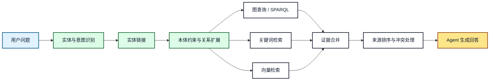
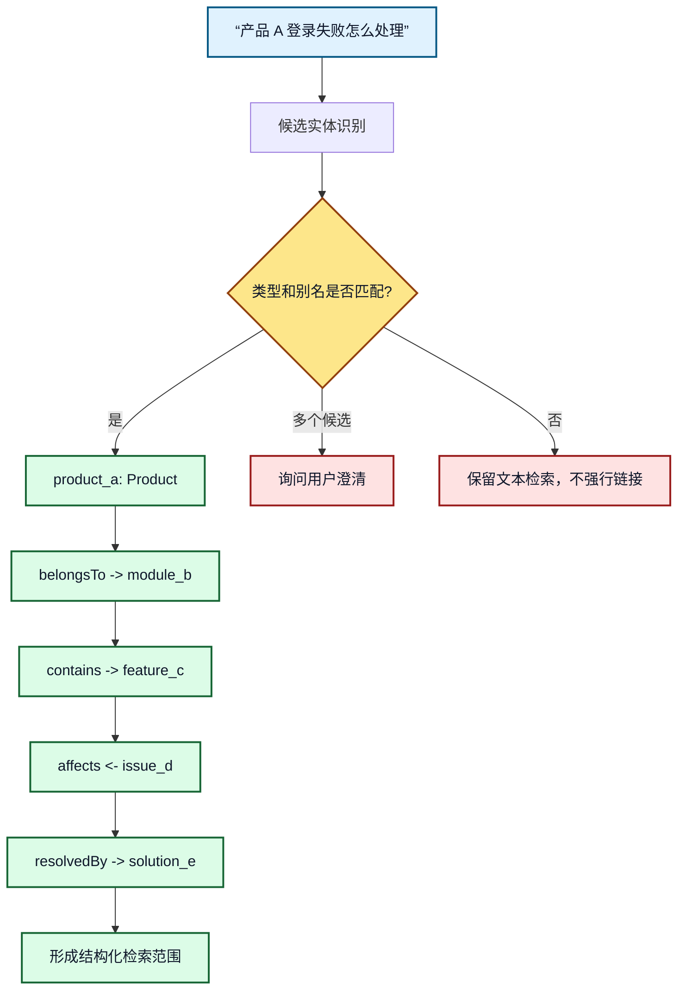
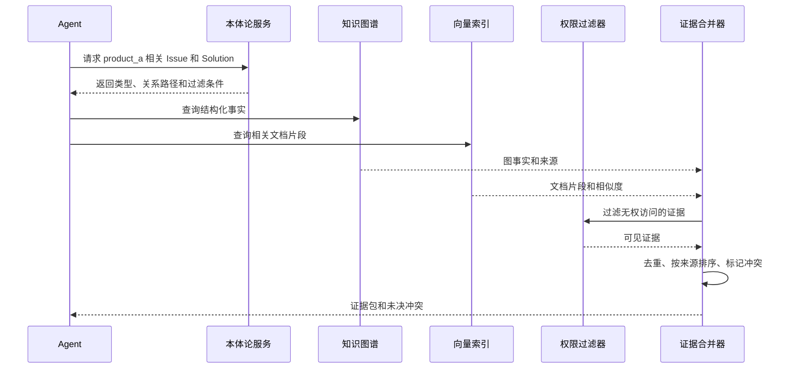

# 12. 本体论增强 RAG：实体识别、关系扩展和混合检索

## 本章目标

- 理解本体论如何补充向量检索的语义边界。
- 设计实体链接、关系扩展、图查询和文档召回的组合链路。
- 合并结构化事实与文档证据，并处理冲突和来源优先级。

## 1. 向量 RAG 的边界

向量检索适合找到“表达相似”的文本，但不一定能保证：

- 找到的是同一个实体，而不是名称相似的实体。
- 召回结果遵循业务关系，而不是只在文本上相似。
- 结果满足当前用户的角色、租户和数据权限。
- 多跳关系没有被切碎在不同文档中。

本体增强 RAG 的目标不是替换向量检索，而是先提供语义范围，再让多种检索方式互相补充。

## 2. 总体链路



**图 12-1：本体论增强 RAG 总体链路**

本体论主要参与实体链接和检索范围扩展。它不负责生成最终答案，最终答案仍需要基于证据和当前任务约束生成。

## 3. 实体链接和关系扩展



**图 12-2：实体扩展和多跳召回**

关系扩展必须有边界，例如最多扩展 2-3 跳，并且只允许本体中声明为可检索的关系。实体不确定时应澄清或降级到文本检索，不能为了“命中图谱”而猜测实体。

## 4. 三路检索的职责

| 检索分支 | 擅长内容 | 主要限制 | 本体论的帮助 |
|---|---|---|---|
| 图检索 | 类型、关系、多跳事实 | 覆盖的文本细节有限 | 限制路径和结果类型 |
| 关键词检索 | 精确名称、错误码、版本号 | 同义表达覆盖弱 | 提供别名、术语和字段 |
| 向量检索 | 语义相似的文档片段 | 关系和权限不稳定 | 生成实体范围和过滤条件 |

证据合并时建议保留来源类型，不要把图谱事实和模型猜测混成同一种证据：

```json
[
  {
    "kind": "graph_fact",
    "content": "产品 A 属于模块 B",
    "source_id": "kg:fact-001",
    "confidence": 1.0
  },
  {
    "kind": "document_chunk",
    "content": "登录失败时先检查身份服务配置。",
    "source_id": "doc:login-guide#chunk-4",
    "confidence": 0.87
  }
]
```

## 5. 证据合并和冲突处理



**图 12-3：证据合并时序**

权限过滤应发生在证据交给 Agent 之前。若图谱事实和文档内容冲突，合并器应保留冲突标记和来源，不应静默覆盖。

## 6. 最小检索策略

```text
1. 识别实体和意图。
2. 使用本体校验实体类型。
3. 沿允许的关系扩展候选实体。
4. 并行执行图、关键词和向量检索。
5. 先过滤权限，再合并和排序证据。
6. 证据不足时澄清、拒答或降级，不补写未验证事实。
```

## 7. 常见错误和排查

- **把所有邻居都召回**：导致噪声和上下文膨胀，应配置关系白名单和跳数上限。
- **实体链接没有置信度**：无法区分确认结果和候选结果，应记录候选、置信度和来源。
- **先生成再找证据**：容易出现“答案看似合理但无依据”，应先构造证据包。
- **忽略权限过滤**：向量索引命中不代表用户有权查看。

## 8. 练习和自查

1. 为“模块 B 中哪些问题影响登录功能”设计一条两跳图查询。
2. 设计图、关键词和向量三路检索的排序字段。
3. 构造一组相互冲突的图事实和文档证据，设计处理结果。

## 本章小结

本体论增强 RAG 的核心是“先确定语义范围，再组合多种检索”。图谱提供关系和约束，文档提供细节，向量提供表达覆盖，最终由证据合并器形成可审计的证据包。

