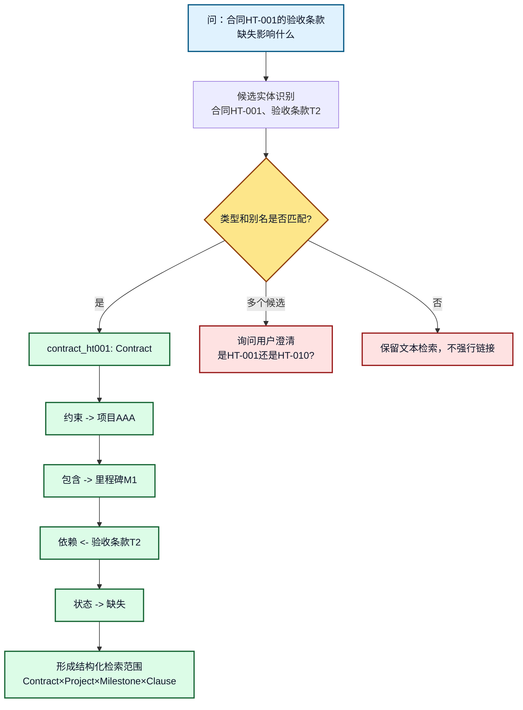
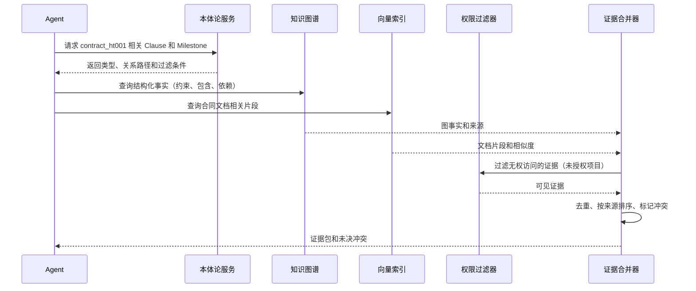

# 12. 本体论增强 RAG：实体识别、关系扩展和混合检索

## 一分钟看懂本章

> **一句话**：RAG 不能只"搜相似文本"——先识别"合同 HT-001"这个实体，再沿"约束→项目→里程碑"关系扩展，让图谱提供关系、文档提供细节，最后合并成带证据的回答。

```mermaid
flowchart LR
    Q[问：合同HT-001的验收条款缺失<br/>会有什么影响？] --> N[识别实体：合同HT-001]
    N --> L[实体链接：→ Contract 实例]
    L --> O[本体扩展<br/>Contract─约束→项目AAA<br/>Contract─含→验收条款T2]
    O --> G[图查询：<br/>约束的项目AAA、里程碑M1]
    O --> V[文档检索：<br/>搜"验收条款""缺失"]
    G --> M[证据合并]
    V --> M
    M --> A[回答：影响里程碑M1验收<br/>证据=合同第3章+图谱事实]
```

**读图要点**：回答里既有"里程碑M1被影响"（图谱事实），又有"见合同第3章"（文档证据）——这就是本体增强 RAG 的价值：先锁定实体、再沿关系扩展、最后把两类证据合并。

## 本章目标

- 理解本体论如何补充向量检索的语义边界。
- 设计实体链接、关系扩展、图查询和文档召回的组合链路。
- 合并结构化事实与文档证据，并处理冲突和来源优先级。

## 1. 向量 RAG 的边界

向量检索适合找到“表达相似”的文本，但不一定能保证：

- 找到的是同一个实体，而不是名称相似的实体。
- 召回结果遵循业务关系，而不是只在文本上相似。
- 结果满足当前用户的角色、租户和数据权限。
- 多跳关系没有被切碎在不同文档中。

本体增强 RAG 的目标不是替换向量检索，而是先提供语义范围，再让多种检索方式互相补充。

## 1.1 真实例子：查"验收条款缺失"的影响

项目经理提问："**合同 HT-001 的验收条款缺失会有什么影响？**" 四步走：

```text
第 1 步 实体链接：把"合同HT-001"链接到 Contract 实例，而不是当成普通文本去搜
第 2 步 关系扩展：Contract ─约束→ 项目AAA；Contract ─包含→ 验收条款T2（状态=缺失）
第 3 步 多路召回：图谱事实（里程碑M1依赖条款T2）+ 文档（合同第3章原文）
第 4 步 合并回答："验收条款T2缺失，影响项目AAA的里程碑M1验收，见合同第3章"
```

给检索规划器的一句话约束：

```text
你是合同系统的检索规划器。识别用户问题中的实体，并沿以下允许的关系扩展（最多 2 跳）：
  Contract ─约束→ Project；Contract ─包含→ Clause（条款）
  Project ─包含→ Milestone；Milestone ─依赖→ Clause
禁止猜测不存在的实体；实体不明确时先提问，不要强行链接。
```

对应函数签名：

```python
def hybrid_retrieve(question: str, ontology: Ontology) -> EvidencePack:
    entities = entity_linker.link(question)                    # [("contract_ht001", "Contract", 0.97)]
    scope = ontology.expand(entities, max_hops=2, allowed=["约束", "包含", "依赖"])
    graph_hits = sparql(scope.to_query())                      # 图谱事实
    doc_hits = vector_search(question, filter=scope.types())   # 文档片段
    return merge_evidence(graph_hits, doc_hits)                # 先过滤权限再合并
```

## 2. 总体链路

```mermaid
flowchart LR
    Q[问：合同HT-001的验收条款风险] --> N[实体与意图识别<br/>实体=合同HT-001]
    N --> L[实体链接<br/>HT-001 → Contract 实例]
    L --> O[本体约束与关系扩展<br/>Contract─约束→项目AAA]
    O --> G[图查询 / SPARQL<br/>查项目AAA的里程碑]
    O --> K[关键词检索<br/>查"验收条款缺失"]
    O --> V[向量检索<br/>查语义相似的条款段落]
    G --> M[证据合并]
    K --> M
    V --> M
    M --> R[来源排序与冲突处理<br/>图谱优先于模型猜测]
    R --> A[Agent 生成回答]

    classDef input fill:#E0F2FE,stroke:#075985,color:#0F172A,stroke-width:2px;
    classDef semantic fill:#DCFCE7,stroke:#166534,color:#0F172A,stroke-width:2px;
    classDef search fill:#FFFFFF,stroke:#111827,color:#0F172A,stroke-width:2px;
    classDef output fill:#FDE68A,stroke:#92400E,color:#0F172A,stroke-width:2px;
    class Q input;
    class N,L,O semantic;
    class G,K,V,M,R search;
    class A output;
```

**图 12-1：本体论增强 RAG 总体链路**

**读图要点**：顺着箭头看——"合同HT-001"先经过实体识别、实体链接，再由本体扩展出"约束→项目AAA"等关系，然后**三路并行**检索（图/关键词/向量），最后统一合并、排序、冲突处理。本体论只参与前半段（定语义范围），不负责生成最终答案。

## 3. 实体链接和关系扩展



**图 12-2：实体扩展和多跳召回**

**读图要点**：左侧先做类型校验——"合同HT-001"确认是 `Contract`；然后沿**白名单关系**依次走 约束→项目AAA、包含→里程碑M1、依赖←验收条款T2，最后得到带类型的检索范围。如果识别出两个合同候选（HT-001 和 HT-010），先澄清再扩展，**不能为了"命中图谱"而猜实体**。

关系扩展必须有边界，例如最多扩展 2-3 跳，并且只允许本体中声明为可检索的关系。实体不确定时应澄清或降级到文本检索。

## 4. 三路检索的职责

| 检索分支 | 擅长内容 | 主要限制 | 本体论的帮助 |
|---|---|---|---|
| 图检索 | 类型、关系、多跳事实（HT-001─约束→项目AAA） | 覆盖的文本细节有限 | 限制路径和结果类型 |
| 关键词检索 | 精确名称、条款编号、版本号（"条款T2"） | 同义表达覆盖弱 | 提供别名、术语和字段 |
| 向量检索 | 语义相似的文档片段（"验收没写清"） | 关系和权限不稳定 | 生成实体范围和过滤条件 |

证据合并时建议保留来源类型，不要把图谱事实和模型猜测混成同一种证据：

```json
[
  {
    "kind": "graph_fact",
    "content": "合同HT-001 约束 项目AAA；里程碑M1 依赖 验收条款T2",
    "source_id": "kg:fact-001",
    "confidence": 1.0
  },
  {
    "kind": "document_chunk",
    "content": "本合同验收以第三章节约定为准，未满足则延期。",
    "source_id": "doc:contract-ht001#chunk-3",
    "confidence": 0.87
  }
]
```

## 5. 证据合并和冲突处理



**图 12-3：证据合并时序**

**读图要点**：Agent 先问本体要"合同HT-001 相关的 Clause 和 Milestone"（这一步就限定了范围），图检索和向量检索并行，**结果必须先过权限过滤器**——向量索引命中"项目BBB的合同"并不代表项目经理有权看。若图谱说"里程碑M1依赖T2"而文档说"不依赖"，合并器保留冲突标记，不静默覆盖。

## 6. 最小检索策略

```text
1. 识别实体和意图。（问的是"合同HT-001"还是"合同模板"）
2. 使用本体校验实体类型。（HT-001 是 Contract 实例）
3. 沿允许的关系扩展候选实体。（约束→项目AAA，最多 2 跳）
4. 并行执行图、关键词和向量检索。（图谱给关系，文档给细节）
5. 先过滤权限，再合并和排序证据。（未授权文档不能进入证据包）
6. 证据不足时澄清、拒答或降级，不补写未验证事实。
```

## 7. 常见错误和排查

- **把所有邻居都召回**：导致噪声和上下文膨胀，应配置关系白名单和跳数上限。
- **实体链接没有置信度**：无法区分确认结果和候选结果，应记录候选、置信度和来源。
- **先生成再找证据**：容易出现“答案看似合理但无依据”，应先构造证据包。
- **忽略权限过滤**：向量索引命中不代表用户有权查看。

## 8. 练习和自查

1. 为“模块 B 中哪些问题影响登录功能”设计一条两跳图查询。
2. 设计图、关键词和向量三路检索的排序字段。
3. 构造一组相互冲突的图事实和文档证据，设计处理结果。

## 本章小结

本体论增强 RAG 的核心是“先确定语义范围，再组合多种检索”。图谱提供关系和约束，文档提供细节，向量提供表达覆盖，最终由证据合并器形成可审计的证据包。

