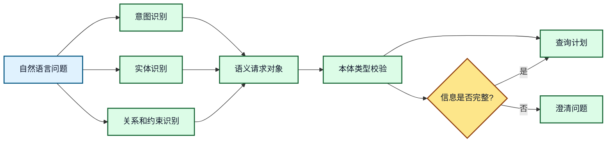
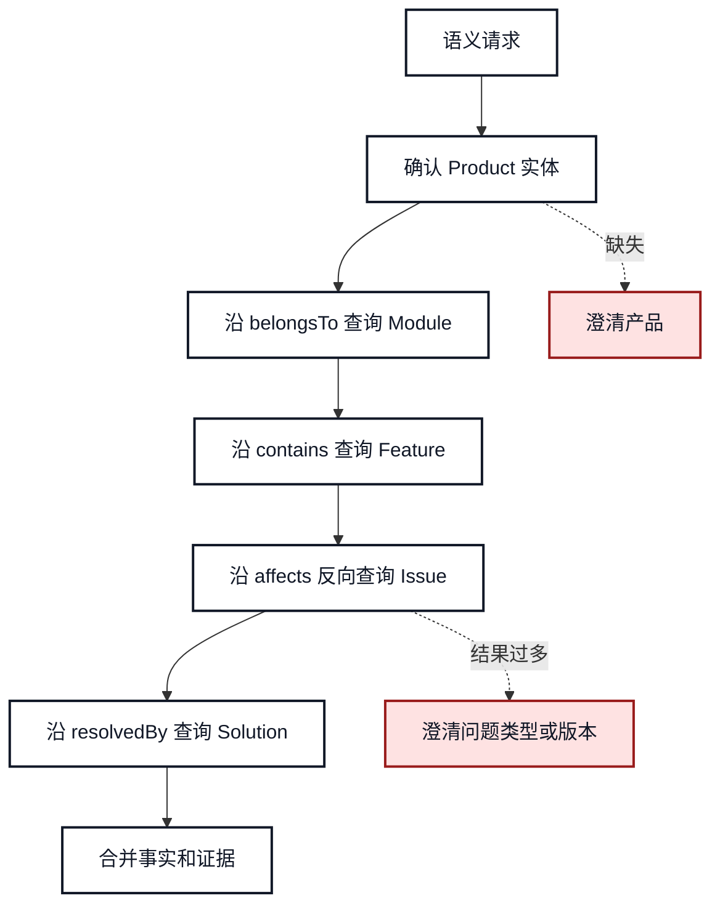
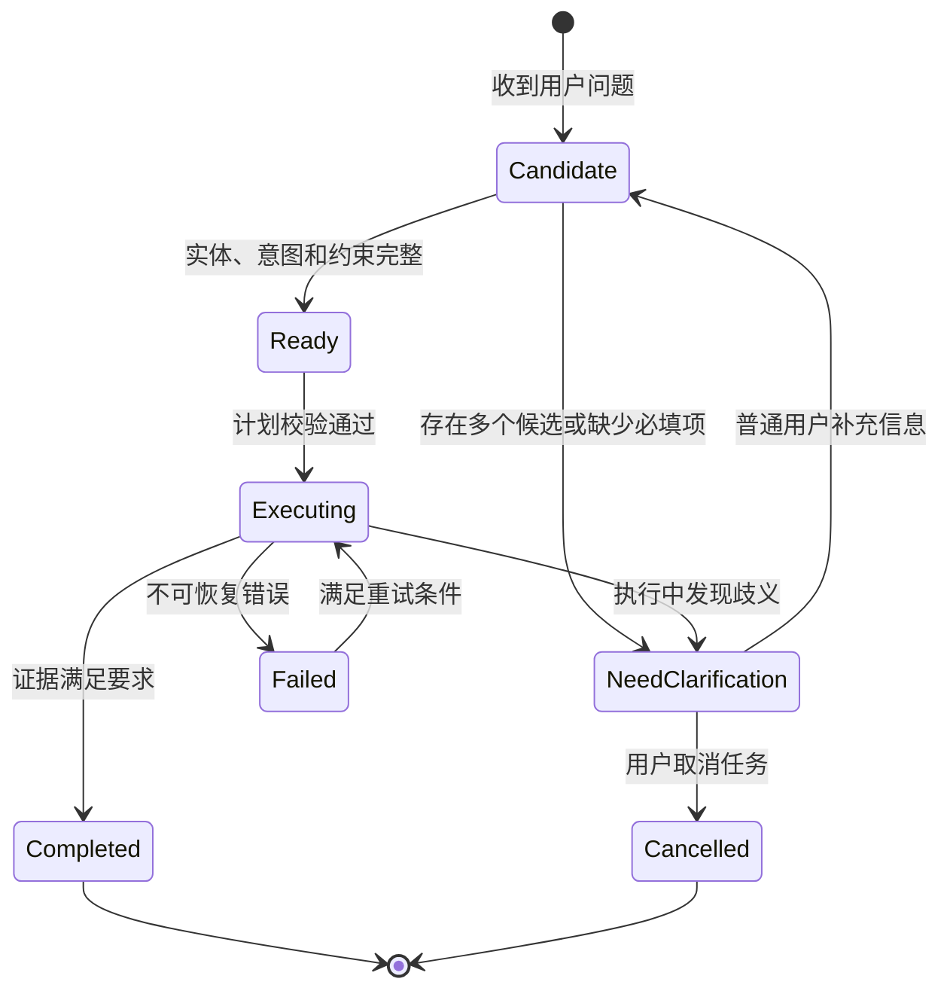

# 13. 本体论驱动的意图识别和查询规划

## 本章目标

- 将自然语言问题拆成意图、实体、关系和动作。
- 使用本体定义查询计划的输入输出类型。
- 在执行前发现类型错误、越权路径和缺少参数。
- 无法确定意图时生成最小澄清问题。

## 1. 从文本到结构化目标

Agent 不应直接把用户文本交给任意工具。中间至少要形成一个可校验的语义对象：

```json
{
  "intent": "diagnose_issue",
  "subject": {"id": "product_a", "type": "Product"},
  "target": {"id": "issue_login_failure", "type": "Issue"},
  "constraints": {"severity": "high", "need_evidence": true},
  "requested_action": "retrieve_solution"
}
```



**图 13-1：用户问题到语义请求对象**

意图识别、实体识别和关系识别可以由模型完成，但最终结果必须交给本体层校验。模型负责提出候选，规则和本体负责约束候选。

## 2. 查询计划不是自然语言提示词

查询计划应该是结构化步骤，每一步都有输入类型、输出类型和失败策略：

```json
{
  "plan_id": "plan-001",
  "steps": [
    {
      "id": "find_issue",
      "kind": "sparql",
      "input_type": "Product",
      "output_type": "Issue",
      "relation": "affects",
      "on_empty": "ask_clarification"
    },
    {
      "id": "find_solution",
      "kind": "graph_lookup",
      "input_type": "Issue",
      "output_type": "Solution",
      "relation": "resolvedBy",
      "on_empty": "document_search"
    }
  ]
}
```



**图 13-2：查询规划决策图**

每一个步骤都可以被单独记录、重试和观测。计划执行器不应该接受任意关系名或任意查询片段，而应该从允许的本体关系和查询模板中选择。

## 3. 计划校验清单

| 校验项 | 问题 | 示例 |
|---|---|---|
| 实体类型 | 输入是否属于步骤要求的类型 | `Product` 能否作为 `Issue` 查询输入 |
| 关系方向 | 查询方向是否正确 | `Issue -> resolvedBy -> Solution` |
| 关系白名单 | 关系是否允许被 Agent 使用 | 禁止任意 SPARQL 谓词 |
| 结果类型 | 下一步是否能消费上一步结果 | `Solution` 不能直接传给产品查询 |
| 权限范围 | 结果是否在当前用户可见范围 | 租户、部门、角色过滤 |
| 成本限制 | 跳数、结果数和执行时间是否受限 | 最多 3 跳、100 条结果 |

## 4. 澄清问题状态机



**图 13-3：澄清和查询执行状态机**

澄清不是异常，而是正常的任务状态。只有在无法继续且不存在合理补充路径时，才将任务标记为失败或取消。

## 5. 企业知识助手示例

用户输入：

```text
查一下登录失败的解决方案，并确认是否可以自动修复。
```

Agent 应拆出两个不同意图：

1. `retrieve_solution`：读取问题和解决方案。
2. `check_auto_remediation`：判断是否存在可执行的修复工具。

第二个意图可能触发权限和风险判断，不能因为第一个查询成功就自动执行修复。

## 6. 常见错误和排查

- **让模型直接生成完整 SPARQL 并执行**：应使用模板、参数绑定和关系白名单。
- **把查询为空当成系统故障**：可能是实体歧义、数据缺失或权限过滤后的空集。
- **一个问题只允许一个意图**：复合问题应拆成多个有依赖关系的子计划。
- **澄清问题过多**：优先询问最能减少计划分支的一个字段。

## 7. 练习和自查

1. 把“模块 B 的登录问题有哪些高风险解决方案”转换为语义请求对象。
2. 为查询计划增加 `timeout_ms`、`max_results` 和 `required_role`。
3. 设计一个实体有三个候选时的澄清问题。

## 本章小结

本体论让 Agent 的规划结果具备可验证的类型和关系边界。模型可以生成候选计划，但只有经过本体、权限和成本约束校验的计划才能进入执行阶段。

