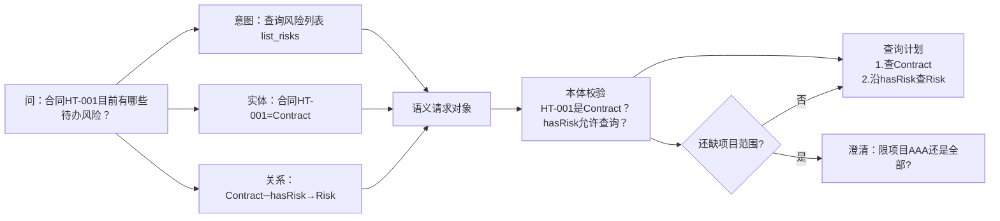
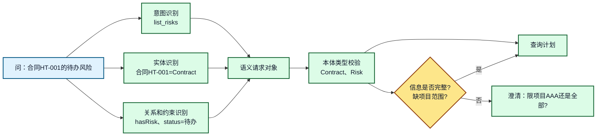
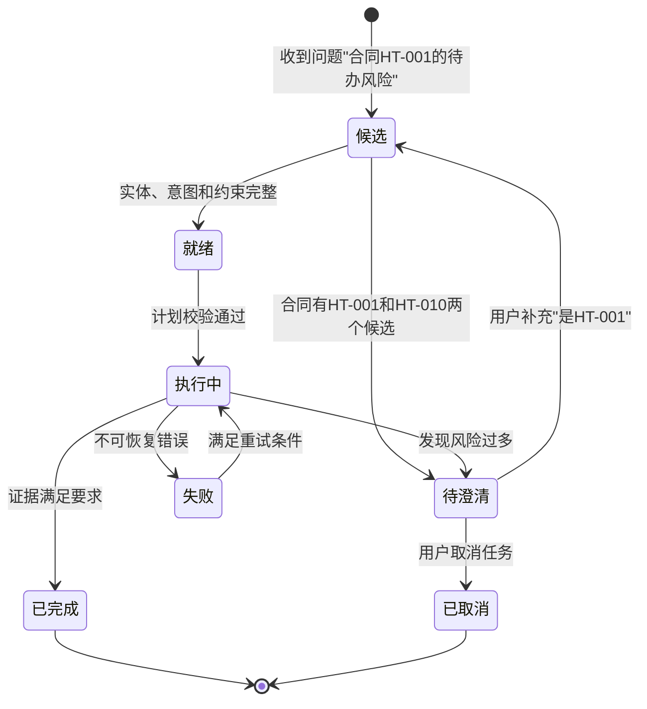

# 13. 本体论驱动的意图识别和查询规划

## 一分钟看懂本章

> **一句话**：把"查一下合同 HT-001 的待办风险"拆成 意图 + 实体 + 关系 + 约束 的可校验计划，执行前先检查类型、关系、权限，不确定就提问澄清——而不是让大模型直接写查询乱跑。



**读图要点**：模型负责"拆"，本体负责"校验"——实体类型对不对、关系允许不允许、信息全不全。信息不全时不是硬跑，而是先问一句澄清。

## 本章目标

- 将自然语言问题拆成意图、实体、关系和动作。
- 使用本体定义查询计划的输入输出类型。
- 在执行前发现类型错误、越权路径和缺少参数。
- 无法确定意图时生成最小澄清问题。

## 1. 从文本到结构化目标

Agent 不应直接把用户文本交给任意工具。中间至少要形成一个可校验的语义对象。

## 1.1 真实例子：把"查风险"变成一张可执行的计划表

用户输入："**合同 HT-001 目前有哪些待办风险？**"

```text
拆解：
  意图 intent      = list_risks
  主体 subject     = 合同HT-001（Contract）
  关系 relation    = hasRisk
  目标类型 target  = Risk
  约束 constraints = {"status": "待办"}

查询计划：
  step1: 查 Contract contract_ht001
  step2: 沿 hasRisk 查 Risk，过滤 status=待办
```

对应实现：

```python
def parse_plan(question: str, ontology: Ontology) -> QueryPlan:
    request = intent_parser.parse(question)             # intent=list_risks, entity=contract_ht001
    plan = planner.build(request, ontology)             # 从允许的模板中选择步骤
    errors = validator.check(plan, ontology)            # 类型 / 关系方向 / 权限 / 成本
    if errors:                                         # 比如缺"项目范围"
        return plan_with_clarification(errors)          # 先提问，不硬跑
    return plan
```

先看标准 JSON 形式的语义请求对象：

```json
{
  "intent": "list_risks",
  "subject": {"id": "contract_ht001", "type": "Contract"},
  "target": {"id": "risk_r1", "type": "Risk"},
  "constraints": {"status": "待办", "need_evidence": true},
  "requested_action": "retrieve_risks"
}
```



**图 13-1：用户问题到语义请求对象**

**读图要点**：模型把"合同HT-001的待办风险"拆成三路——意图（list_risks）、实体（合同HT-001=Contract）、关系约束（hasRisk、status=待办），汇成语义请求对象后**必须交给本体层校验**。模型负责提候选，本体和规则负责约束候选。

## 2. 查询计划不是自然语言提示词

查询计划应该是结构化步骤，每一步都有输入类型、输出类型和失败策略：

```json
{
  "plan_id": "plan-001",
  "steps": [
    {
      "id": "find_contract",
      "kind": "sparql",
      "input_type": "Contract",
      "output_type": "Contract",
      "relation": "byId",
      "on_empty": "ask_clarification"
    },
    {
      "id": "find_risks",
      "kind": "graph_lookup",
      "input_type": "Contract",
      "output_type": "Risk",
      "relation": "hasRisk",
      "on_empty": "document_search"
    }
  ]
}
```

```mermaid
flowchart TD
    S[语义请求<br/>list_risks(contract_ht001)] --> T1[确认 Contract 实体<br/>合同HT-001]
    T1 --> T2[沿 约束 查询 Project<br/>项目AAA]
    T2 --> T3[沿 包含 查询 Milestone<br/>里程碑M1]
    T3 --> T4[沿 hasRisk 查询 Risk<br/>风险R1/R2/R3]
    T4 --> T5[按 status=待办 过滤<br/>输出 Risk 列表]
    T5 --> E[合并事实和证据]
    T1 -.缺失.-> A[澄清：是HT-001还是HT-010?]
    T4 -.结果过多.-> B[澄清：风险类型或严重级别?]

    classDef plan fill:#FFFFFF,stroke:#111827,color:#111827,stroke-width:2px;
    classDef fallback fill:#FEE2E2,stroke:#991B1B,color:#111827,stroke-width:2px;
    class S,T1,T2,T3,T4,T5,E plan;
    class A,B fallback;
```

**图 13-2：查询规划决策图**

**读图要点**：计划是**一串有类型的步骤**——先确认合同HT-001，再沿 约束/包含/hasRisk 逐级下钻，最后按 status 过滤。每个步骤都可以单独记录、重试和观测。虚线是失败路径：实体缺失或结果过多时先澄清，而不是硬查。

## 3. 计划校验清单

| 校验项 | 问题 | 示例 |
|---|---|---|
| 实体类型 | 输入是否属于步骤要求的类型 | `Contract` 能否作为 `Risk` 查询输入 |
| 关系方向 | 查询方向是否正确 | `Contract -> hasRisk -> Risk` |
| 关系白名单 | 关系是否允许被 Agent 使用 | 禁止任意 SPARQL 谓词 |
| 结果类型 | 下一步是否能消费上一步结果 | `Risk` 不能直接传给合同查询 |
| 权限范围 | 结果是否在当前用户可见范围 | 租户、部门、角色过滤 |
| 成本限制 | 跳数、结果数和执行时间是否受限 | 最多 3 跳、100 条结果 |

## 4. 澄清问题状态机



**图 13-3：澄清和查询执行状态机**

**读图要点**：状态用业务语言命名（候选→待澄清→就绪→执行中），而不是 `step_1`。**澄清不是异常**——"合同有 HT-001 和 HT-010 两个候选"是正常任务状态；只有无法继续且不存在合理补充路径时，才标记为失败或取消。

## 5. 企业知识助手示例

用户输入：

```text
查一下合同 HT-001 的待办风险，并确认是否可以直接标记为已确认。
```

Agent 应拆出两个不同意图：

1. `list_risks`：读取合同的风险列表。
2. `confirm_risk`：将风险标记为已确认（触发权限和审核）。

第二个意图可能触发权限和风险判断，不能因为第一个查询成功就自动确认风险。

## 6. 常见错误和排查

- **让模型直接生成完整 SPARQL 并执行**：应使用模板、参数绑定和关系白名单。
- **把查询为空当成系统故障**：可能是实体歧义、数据缺失或权限过滤后的空集。
- **一个问题只允许一个意图**：复合问题应拆成多个有依赖关系的子计划。
- **澄清问题过多**：优先询问最能减少计划分支的一个字段。

## 7. 练习和自查

1. 把“模块 B 的登录问题有哪些高风险解决方案”转换为语义请求对象。
2. 为查询计划增加 `timeout_ms`、`max_results` 和 `required_role`。
3. 设计一个实体有三个候选时的澄清问题。

## 本章小结

本体论让 Agent 的规划结果具备可验证的类型和关系边界。模型可以生成候选计划，但只有经过本体、权限和成本约束校验的计划才能进入执行阶段。

