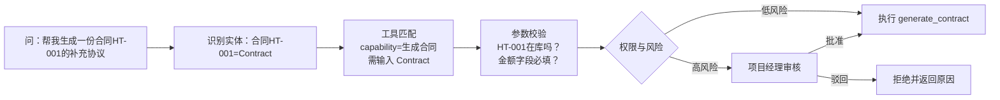
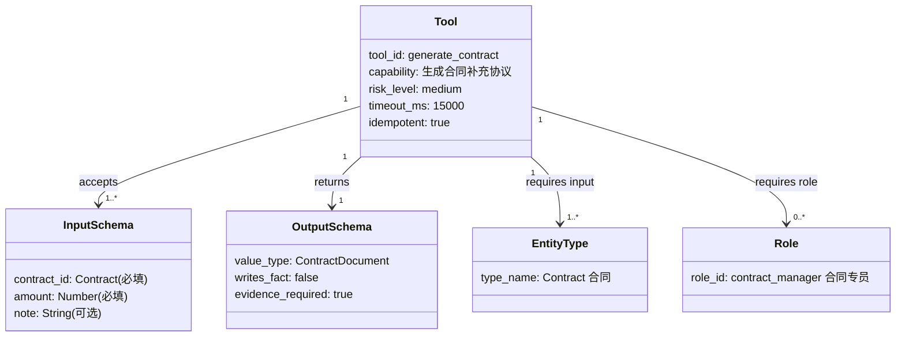
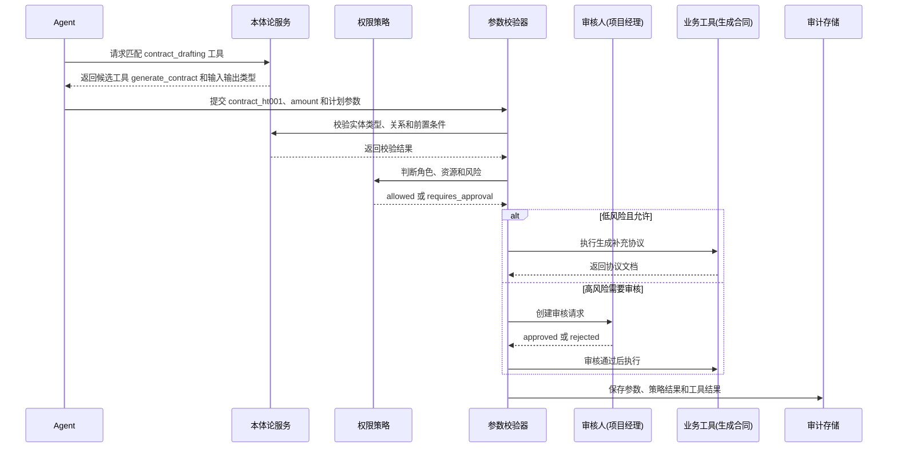

# 14. 本体论驱动工具选择、参数校验和结果约束

## 一分钟看懂本章

> **一句话**：Agent 选工具不是"看名字猜"——先识别实体是"合同"，再按能力匹配"生成合同"工具，执行前校验参数类型、权限、风险，高风险动作必须过审核。



**读图要点**：工具选择、参数校验、权限判断、执行是**四个独立步骤**——"匹配到工具"不等于"能执行"，"审核通过"也不等于"后续动作都自动授权"。

## 本章目标

- 用本体描述工具能力、输入类型、输出类型和前置条件。
- 根据用户目标和语义实体选择工具。
- 在工具执行前完成类型、必填项、权限和风险校验。
- 将工具结果转换为事实、证据或任务状态，而不是盲目写入知识图谱。

## 1. 工具也是领域对象

工具不只是一个 Python 函数。对 Agent 来说，一个可安全调用的工具至少需要描述：

```text
工具名称、能力、输入类型、输出类型、前置条件、所需角色、风险等级、幂等性和超时
```

## 1.1 真实例子：按"合同"实体匹配"生成合同"工具

用户要求："**根据合同 HT-001 生成一份补充协议**"

```text
Agent 的三步：
  1. 工具匹配：实体是 Contract → 候选工具 capability=contract_drafting（generate_contract）
  2. 参数校验：contract_id=HT-001（必须存在）、amount（必填数字）、note（可选）
  3. 权限风险：生成协议是 medium 风险；若要求"直接生效"则升级为 high → 项目经理审核
```

一个可执行的工具描述：

```json
{
  "tool_id": "generate_contract",
  "capability": "contract_drafting",
  "input": {
    "contract_id": {"type": "Contract", "required": true},
    "amount": {"type": "Number", "required": true},
    "note": {"type": "String", "required": false}
  },
  "output": {"type": "ContractDocument", "evidence_required": true},
  "preconditions": ["Contract 已在知识图谱中解析"],
  "required_roles": ["contract_manager"],
  "risk_level": "medium",
  "idempotent": true
}
```

对应的确定性校验器：

```python
def validate_call(tool: Tool, args: dict, user: User, ontology: Ontology) -> VResult:
    schema = tool.input_schema
    type_err = schema.check_types(args, ontology)      # contract_id 真的是 Contract 实例？
    perm = pdp.decide(user, tool.required_roles, tool.risk_level)  # allow / requires_approval
    if perm == "requires_approval":
        return VResult(need_approval=True, reason="medium_risk_action")
    return VResult(valid=True)
```



**图 14-1：工具能力本体的最小模型**

**读图要点**：把"generate_contract"当成本体里的一个对象——它接受什么输入（Contract 类型 + 必填字段）、返回什么（ContractDocument）、需要什么角色（合同专员）、风险多高（medium）。这些元数据用于"选择前"和"执行前"两个阶段：模型根据能力描述提候选，**最终调用必须经过确定性的校验器**。

## 2. 工具选择时序



**图 14-2：工具调用前后的安全边界**

**读图要点**：一条消息先过"本体校验"再过"权限策略"，两种结果分开走——低风险直接执行，高风险挂起等项目经理审批。**审核通过只代表当前动作被批准**，不代表后续动作都自动获得授权。

## 3. 参数校验流程

```mermaid
flowchart TD
    C[Agent 工具调用候选<br/>generate_contract(HT-001)] --> S[读取工具输入模式<br/>contract_id/amount/note]
    S --> T[校验字段类型和必填项<br/>amount 是数字?]
    T --> E[校验实体是否存在且类型匹配<br/>HT-001 是 Contract?]
    E --> P[校验本体关系和前置条件<br/>合同已解析?]
    P --> R[校验角色、资源和风险<br/>合同专员? 风险等级?]
    R --> Q{校验结果}
    Q -->|valid| X[执行生成合同工具]
    Q -->|need_approval| H[项目经理审核]
    Q -->|invalid| F[拒绝并返回可修复原因<br/>缺少amount字段]
    X --> O[校验输出类型和证据<br/>ContractDocument?]
    H --> O
    O --> W[写入任务状态或候选事实]

    classDef action fill:#FFFFFF,stroke:#111827,color:#111827,stroke-width:2px;
    classDef decision fill:#FDE68A,stroke:#92400E,color:#111827,stroke-width:2px;
    classDef success fill:#DCFCE7,stroke:#166534,color:#111827,stroke-width:2px;
    classDef failure fill:#FEE2E2,stroke:#991B1B,color:#111827,stroke-width:2px;
    class C,S,T,E,P,R,O,W action;
    class Q decision;
    class X,H success;
    class F failure;
```

**图 14-3：工具参数和输出约束**

**读图要点**：校验是**多层漏斗**——字段类型 → 实体是否存在 → 本体前置条件 → 角色与风险，最后一层决定放行/审核/拒绝。注意右下角：**输出也要校验**——工具返回的字符串不能自动变成领域事实，只有符合输出模式、带来源且通过写入策略的结果才进入知识层。

## 4. 工具描述示例

再举一个"确认风险"工具，它对应 16 章权限里的例子——**项目经理才能确认风险**：

```json
{
  "tool_id": "confirm_risk",
  "capability": "risk_confirm",
  "input": {
    "contract_id": {"type": "Contract", "required": true},
    "risk_id": {"type": "Risk", "required": true},
    "dry_run": {"type": "boolean", "required": true}
  },
  "output": {"type": "RiskConfirmation", "writes_fact": true, "evidence_required": true},
  "preconditions": ["Contract hasRisk Risk", "Project 属于当前用户租户"],
  "required_roles": ["project_manager"],
  "risk_level": "high",
  "idempotent": false
}
```

对比上一个小节的 `generate_contract`：注意 `required_roles=project_manager`、`risk_level=high`、`idempotent=false`——高风险、不可重复、只能由项目经理执行，所以它默认需要审核。

## 5. 结果回写策略

| 工具结果 | 默认处理 | 原因 |
|---|---|---|
| 查询结果 | 写入执行记录和证据 | 结果可能随时间变化 |
| 协议草稿 | 写入任务记忆 | 属于当前任务产物 |
| 用户明确确认的事实（风险R1已确认） | 进入候选事实队列 | 仍需来源和冲突校验 |
| 配置变更结果（协议生效） | 写入审计和业务系统 | 不能只写知识图谱 |
| 模型总结 | 不直接写为事实 | 可能包含推断或幻觉 |

## 6. 常见错误和排查

- **只校验 JSON 类型，不校验领域类型**：字符串 `product_a` 仍可能不是 `Product`。
- **让工具自己决定权限**：权限判断应在统一策略层完成，并保留审计记录。
- **把审核结果缓存成永久授权**：授权通常绑定主体、资源、动作和时间窗口。
- **工具执行成功就自动更新本体事实**：执行结果和领域事实需要不同的写入策略。

## 7. 练习和自查

1. 为“发布解决方案文档”描述输入、输出、角色和风险等级。
2. 设计一个 `dry_run` 参数，说明它如何降低高风险工具的默认风险。
3. 列出工具失败、输出类型错误和权限拒绝的不同处理方式。

## 本章小结

本体论让工具调用具备语义契约。Agent 负责选择候选工具，校验器负责确定能否调用，权限和审核负责控制高风险动作，执行结果则按类型和来源分别落库。

